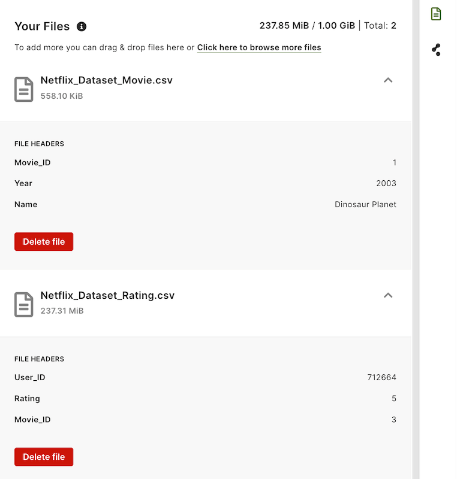

The Data Loader allows you to upload your data files in CSV format into
ArangoGraph and then use these data sources to design a graph using the
built-in graph designer.

## Upload your files

You can upload your CSV files in the following ways:

- Drag and drop your files in the designated area.
- Click the **Browse files** button and select the files you want to add.

You have the option to either upload several files collectively as a batch or
add them individually. Furthermore, you can supplement additional files later on.
After a file has been uploaded, you can expand it to preview both the header and
the first row of data within the file.

In case you upload CSV files without fields, they will not be available for
manipulation.

Once the files are uploaded, you can start [designing your graph](../data-loader/design-graph.md).

### File formatting limitations

Ensure that the files you upload are correctly formatted. Otherwise, errors may
occur, the upload may fail, or the data may not be correctly mapped.

The following restrictions and limitations apply:

- The only supported file format is CSV. If you submit an invalid file format,
  the upload of that specific file will be prevented.
- It is required that all CSV files have a header row. If you upload a file
  without a header, the first row of data is treated as the header. To avoid
  losing the first row of the data, make sure to include headers in your files.   
- The CSV file should have unique header names. It is not possible to have two
  columns with the same name within the same file.

For more details, see the [File validation](../data-loader/import.md#file-validation) section.

### Upload limits

Note that there is a cumulative file upload limit of 1GB. This means that the
combined size of all files you upload should not exceed 1GB. If the total size
of the uploaded files surpasses this limit, the upload may not be successful.

## Delete files

You can remove uploaded files by clicking the **Delete file** button in the
**Your files** panel. Please keep in mind that in order to delete a file,
you must first remove all graph associations associated with it.