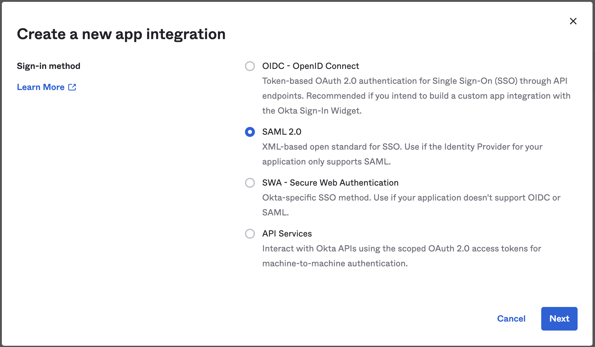
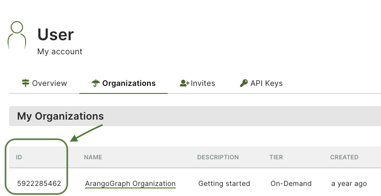
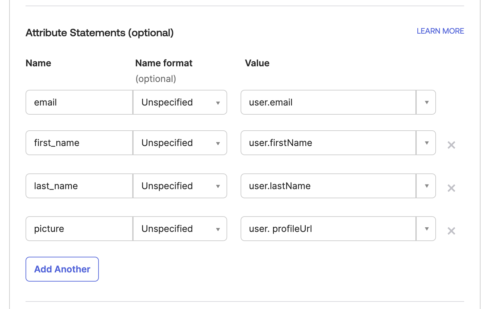


This feature is only available in ArangoGraph Enterprise.


ArangoGraph provides support to enable **Single Sign-On** (SSO) authentication
using **Security Assertion Markup language 2.0** (SAML 2.0).


To enable the Single Sign-On (SSO) feature, get in touch with the ArangoGraph
team via **Request Help**, available in the left sidebar menu of the
ArangoGraph Dashboard.


## About SAML 2.0

The Security Assertion Markup language 2.0 (SAML 2.0) is an open standard created
to provide cross-domain single sign-on (SSO). It allows you to authenticate in
multiple web applications by using a single set of login credentials.

SAML SSO works by transferring user authentication data from the identity
provider (IdP) to the service provider (SP) through an exchange of digitally
signed XML documents.

## Configure SAML 2.0 using Okta

You can enable SSO for your ArangoGraph organization using Okta as an Identity
Provider (IdP). For more information about Okta, please refer to the
[Okta Documentation](https://help.okta.com/en-us/Content/index.htm?cshid=csh-index).

### Create the SAML app integration in Okta

1. Sign in to your Okta account and select **Applications** from the left sidebar menu.
2. Click **Create App Integration**.
3. In the **Create a new app integration** dialog, select **SAML 2.0**.

   
4. In the **General Settings**, specify a name for your integration and click **Next**.

   
5. Configure the SAML settings:
   - For **Single sign-on URL**, use `https://auth.arangodb.com/login/callback?connection=ORG_ID`
   - For **Audience URI (SP Entity ID)**, use `urn:auth0:arangodb:ORG_ID`

   

6. Replace **ORG_ID** with your organization identifier from the 
   ArangoGraph Dashboard. To find your organization ID, go to the **User Toolbar**
   in the top right corner, which is accessible from every view of the Dashboard,
   and click **My organizations**.

   If, for example, your organization ID is 14587062, here are the values you
   would use when configuring the SAML settings:
   - `https://auth.arangodb.com/login/callback?connection=14587062`
   - `urn:auth0:arangodb:14587062`
   
   
7. In the **Attribute Statements** section, add custom attributes as seen in the image below:
   - email: `user.email`
   - given_name: `user.firstName`
   - family_name: `user.lastName`
   - email_verified: `true`
   - picture: `user.profileUrl`

   This step consists of a mapping between the ArangoGraph attribute names and
   Okta attribute names. The values of these attributes are automatically filled
   in based on the users list that is defined in Okta.

   
8. Click **Next**.
9. In the **Configure feedback** section, select **I'm an Okta customer adding an internal app**.
10. Click **Finish**. The SAML app integration is now created.

### SAML Setup

After creating the app integration, you must perform the SAML setup to finalize
the SSO configuration.

1. Go to the **SAML Signing Certificates** section, displayed under the **Sign On** tab.
2. Click **View SAML setup instructions**.

   
3. The setup instructions include the following items:
   - **Identity Provider Single Sign-On URL**
   - **Identity Provider Issuer**
   - **X.509 Certificate**
4. Copy the IdP settings, download the certificate using the
   **Download X.509 certificate** button, and share them with the ArangoGraph
   team via an ArangoGraph Support Ticket in order to complete the SSO
   configuration.


If you would like to enable SCIM provisioning in addition to the SSO SAML
configuration, please refer to the [SCIM](scim-provisioning.md) documentation.

