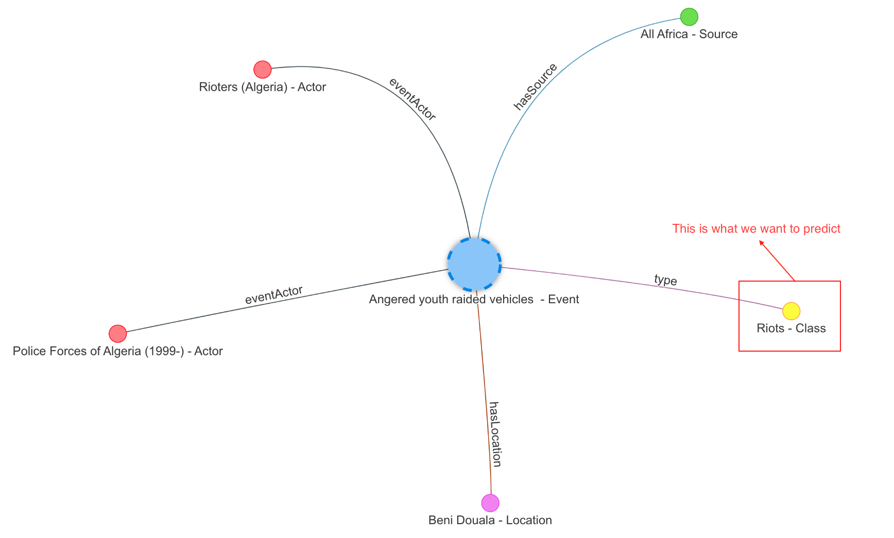
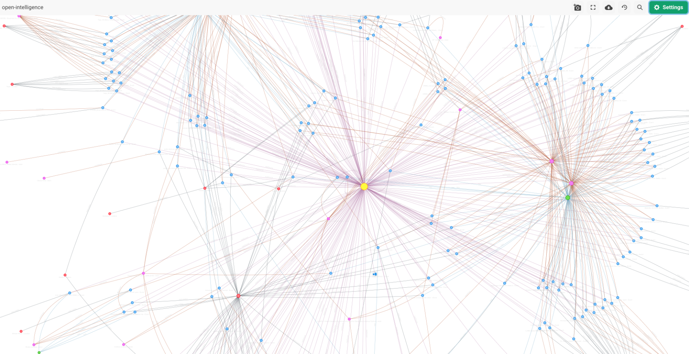

ArangoGraphML is a set of services that provide an easy-to-use and scalable
interface for graph machine learning. Since all of the orchestration and training
logic is managed by ArangoGraph, all that is typically required is a
specification outlining the data to be used to solve a task. If you are using
the self-managed solution, additional configurations are needed such as loading
the database.

The `arangoml` package allows for managing all of the necessary ArangoGraphML components, including:
- **Project Management**: Projects are at the top level, and all activities must
  link to a project.
- **Feature Generation**: Data must be featurized to work with Graph Neural Networks
  (GNNs), and the featurization package handles this.
- **Training**: Start training data with a simple description of the problem and
  the data used to solve it.
- **Predictions**: Once a trained model exists, it is time to persist it.
  The prediction service generates predictions and persists them to the source
  graph in a new collection or within the source document.


To enable the ArangoGraphML services in the ArangoGraph platform,
[get in touch](https://www.arangodb.com/contact/)
with the ArangoDB team. Regular notebooks in ArangoGraph don't include the
`arangoml` package.


ArangoGraphML's suite of services and packages is driven by what we call
**"specifications"**. These specifications are standard Python dictionaries and
describe the task being performed and the data being used. The ArangoGraphML
services work closely together, with one task providing inputs to another.

The following is a guide to show how to use the `arangoml` package in order to:

1. Manage projects
2. Featurize data
3. Submit Training Jobs
4. Evaluate Model Metrics
5. Generate Predictions

## Initialize ArangoML





**API Documentation: [arangoml.ArangoMLMagics.enable_arangoml](https://arangoml.github.io/arangoml/magics.html#arangoml.magic.ArangoMLMagics.enable_arangoml)**

The `arangoml` package comes pre-loaded with every ArangoGraphML notebook environment.
To start using it, simply import it, and enable it via a Jupyter Magic Command.

```py
arangoml = %enable_arangoml
```


ArangoGraphML comes with other ArangoDB Magic Commands! See the full list [here](https://arangoml.github.io/arangoml/magics.html).






**API Documentation: [arangoml.ArangoML](https://arangoml.github.io/arangoml/specification.html#arangoml.main.ArangoML)**

The `ArangoML` class is the main entry point for the `arangoml` package.
It requires the following parameters:
- `hosts`: The ArangoDB host(s) to connect to. This can be a single host or a
  list of hosts.
- `username`: The ArangoDB username to use for authentication.
- `password`: The ArangoDB password to use for authentication.
- `ca_cert_file`: (Optional) The path to the CA certificate file to use for TLS
  verification.
- `user_token`: (Optional) The ArangoDB user token to use for authentication.
  This is an alternative to username/password authentication.
- `projects_endpoint`: The URL to the ArangoGraphML Projects Service.
- `training_endpoint`: The URL to the ArangoGraphML Training Service.
- `prediction_endpoint`: The URL to the ArangoGraphML Prediction Service.

It is possible to instantiate an ArangoML object in multiple ways:

1. Via parameters
```py
from arangoml import ArangoML

arangoml = ArangoML(
    hosts="http://localhost:8529"
    username="root",
    password="password",
    # ca_cert_file="/path/to/ca.pem",
    # user_token="..."
    projects_endpoint="http://localhost:8503",
    training_endpoint="http://localhost:8502",
    prediction_endpoint="http://localhost:8501",
)
```

2. Via parameters and a custom `ArangoClient` instance
```py
from arangoml import ArangoML
from arango import ArangoClient

client = ArangoClient(
    hosts="http://localhost:8529",
    verify_override="/path/to/ca.pem",
    hosts_resolver=...,
    ...
)

arangoml = ArangoML(
    client=client,
    username="root",
    password="password",
    # user_token="..."
    projects_endpoint="http://localhost:8503",
    training_endpoint="http://localhost:8502",
    prediction_endpoint="http://localhost:8501",
)
```

3. Via environment variables
```py
import os
from arangoml import ArangoML

os.environ["ARANGODB_HOSTS"] = "http://localhost:8529"
os.environ["ARANGODB_CA_CERT_FILE"]="/path/to/ca.pem"
os.environ["ARANGODB_USER"] = "root"
os.environ["ARANGODB_PW"] = "password"
# os.environ["ARANGODB_USER_TOKEN"] = "..."
os.environ["PROJECTS_ENDPOINT"] = "http://localhost:8503"
os.environ["TRAINING_ENDPOINT"] = "http://localhost:8502"
os.environ["PREDICTION_ENDPOINT"] = "http://localhost:8501"

arangoml = ArangoML()
```

4. Via configuration files
```py
import os
from arangoml import ArangoML

arangoml = ArangoML(settings_files=["settings_1.toml", "settings_2.toml"])
```

5. Via a Jupyter Magic Command

**API Documentation: [arangoml.ArangoMLMagics.enable_arangoml](https://arangoml.github.io/arangoml/magics.html#arangoml.magic.ArangoMLMagics.enable_arangoml)**

```
%load_ext arangoml
%enable_arangoml
```

This assumes you are working out of a Jupyter Notebook environment, and
have set the environment variables in the notebook environment with user
authentication that has **_system** access.



Running `%load_ext arangoml` also provides access to other [ArangoGraphML
Jupyter Magic Commands](https://arangoml.github.io/arangoml/magics.html).






## Load the database

This example is using ArangoML to predict the **class** of `Events` in a
Knowledge Graph constructed from the [GDELT Project](https://www.gdeltproject.org/).

> GDELT monitors the world's news media from nearly every corner of every
  country in print, broadcast, and web formats, in over 100 languages, every
  moment of every day. [...] Put simply, the GDELT Project is a realtime open
  data global graph over human society as seen through the eyes of the world's
  news media, reaching deeply into local events, reaction, discourse, and
  emotions of the most remote corners of the world in near-realtime and making
  all of this available as an open data firehose to enable research over human
  society.

The events used range from peaceful protests to significant battles in Angola.
The image below depicts the connections around an example event:



You can also see a larger portion of this graph, showing how the events, actors,
news sources, and locations are interconnected into a large graph.



Let's get started!





The [arango-datasets](https://github.com/arangoml/arangodb_datasets) package
allows you to load a dataset into ArangoDB. It comes pre-installed in the
ArangoGraphML notebook environment.

```py
from arango_datasets.datasets import Datasets

DATASET_NAME = "OPEN_INTELLIGENCE_ANGOLA"

# Setup the database
%deleteDatabase {DATASET_NAME}
%createDatabase {DATASET_NAME}
dataset_db = %useDatabase {DATASET_NAME}

# Import the dataset
# More Info: https://github.com/arangoml/arangodb_datasets
Datasets(dataset_db).load(DATASET_NAME)
```





The [arango-datasets](https://github.com/arangoml/arangodb_datasets) package
allows you to load a dataset into ArangoDB. It can be installed with:

```
pip install arango-datasets
```

```py
from arango_datasets.datasets import Datasets

DATASET_NAME = "OPEN_INTELLIGENCE_ANGOLA"

system_user = "root"
system_pw = "password"
system_db = arangoml.client.db(
    name="_system", username=system_user, password=system_pw, verify=True
)

# Setup the database
system_db.delete_database(DATASET_NAME, ignore_missing=True)
system_db.create_database(DATASET_NAME)
dataset_db = client.db(
    name=DATASET_NAME, 
    username=arangoml.settings.get("ARANGODB_USER"),
    password=arangoml.settings.get("ARANGODB_PW"),
    user_token=arangoml.settings.get("ARANGODB_USER_TOKEN"),
    verify=True
)

# Import the dataset
# More Info: https://github.com/arangoml/arangodb_datasets
Datasets(dataset_db).load(DATASET_NAME)
```




## Projects

**API Documentation: [ArangoML.projects](https://arangoml.github.io/arangoml/specification.html#projects)**

Projects are an important reference used throughout the entire ArangoGraphML
lifecycle. All activities link back to a project. The creation of the project
is very simple. 

### Get/Create a project
```py
project = arangoml.get_or_create_project(DATASET_NAME)
```

### List projects

```py
arangoml.projects.list_projects()
```

## Featurization

**API Documentation: [ArangoML.featurization](https://arangoml.github.io/arangoml/specification.html#module-arangoml.featurization)**

The Featurization Specification asks that you input the following:
- `featurization_name`: A name for the featurization task.
- `project_name`: The associated project name. You can use `project.name` here
  if it was created or retrieved as described above.
- `graph_name`: The associated graph name that exists within the database.
- `default_config` Optional: The optional default configuration to be applied
  across all features. Individual collection feature settings override this option.
  - `dimensionality_reduction`: Object configuring dimensionality reduction.
    - `disabled`: Boolean for enabling or disabling dimensionality reduction.
    - `size`: The number of dimensions to reduce the feature length to.
- `vertexCollections`: The list of vertex collections to be featurized. Here you
  also need to detail the attributes to featurize and how. Supplying multiple
  attributes from a single collection results in a single concatenated feature.
  - `config` Optional: The configuration to apply to the feature output for this collection.
    - `dimensionality_reduction`: Object configuring dimensionality reduction.
      - `disabled`: Boolean for enabling or disabling dimensionality reduction.
      - `size`: The number of dimensions to reduce the feature length to.
    - `output_name`: Adjust the default feature name. This can be any valid ArangoDB attribute name.
  - `features`: A single feature or multiple features can be supplied per collection
    and they can all be featurized in different ways. Supplying multiple features
    results in a single concatenated feature.
    - `feature_type`: Provide the feature type. Currently, the supported types
      include `text`, `category`, and `numerical`.
    - `feature_generator` Optional: Adjust advanced feature generation parameters.
      - `feature_name`: The name of this Dict should match the attribute name of the
        document stored in ArangoDB. This overrides the name provided for the parent Dict.
      - `method`: Currently no additional options, leave as default.
      - `output_name`: Adjust the default feature name. This can be any valid
        ArangoDB attribute name.
        ```python
        "collectionName": {
          "features": {
            "attribute_name_1": {
              "feature_type": 'text' # Suported types: text, category, numerical, label
              "feature_generator": { # this advanced option is optional.
                "method": "transformer_embeddings",
                "feature_name": "movie_title_embeddings",
              },
            },
            "attribute_name_2": ...,
          },
        },
        "collectionName2": ...
        ```

- `edgeCollections`: This is the list of edge collections associated with the
  vertex collections. There are no additional options.
  ```python
  "edgeCollections": {
    "edge_name_1": {},
    "edge_name_2: {}
  },
  ```

Once you have filled out the Featurization Specification, you can pass it to
the `featurizer` function.

See an example of Featurization Specification for the GDELT dataset:
- It featurizes the `name` attribute of the `Actor`, `Class`, `Country`,
  `Source`, `Location`, and `Region` collections as a `text` features.
- It featurizes the `description` attribute of the `Event` collection as a
  `text` feature.
- It featurizes the `label` attribute of the `Event` collection as a `label`
  feature (this is the attribute you want to predict).
- It featurizes the `sourceScale` attribute of the `Source` collection as a
  `category` feature.
- It featurizes the `name` attribute of the `Region` collection as a
  `category` feature.

```py
featurization_spec = {
  "featurization_name": f"{DATASET_NAME}_Featurization",
  "project_name": project.name,
  "graph_name": DATASET_NAME,
  "default_config": {
      "dimensionality_reduction": {"size": 64},
      "output_name": "x",
  },
  "vertexCollections": {
      "Actor": {
          "features": {
              "name": {
                  "feature_type": "text",
              },
          }
      },
      "Class": {
          "features": {
              "name": {
                  "feature_type": "text",
              },
          }
      },
      "Country": {
          "features": {
              "name": {
                  "feature_type": "text",
              }
          }
      },
      "Event": {
          "features": {
              "description": {
                  "feature_type": "text",
              },
              "label": {
                  "feature_type": "label",
              },
          }
      },
      "Source": {
          "features": {
              "name": {
                  "feature_type": "text",
              },
              "sourceScale": {
                  "feature_type": "category",
              },
          }
      },
      "Location": {
          "features": {
              "name": {
                  "feature_type": "text",
              }
          }
      },
      "Region": {
          "features": {
              "name": {
                  "feature_type": "category",
              },
          }
      },
  },
  "edgeCollections": {
      "eventActor": {},
      "hasSource": {},
      "hasLocation": {},
      "inCountry": {},
      "inRegion": {},
      "subClass": {},
      "type": {},
  },
}

# Run Featurization
feature_result = arangoml.featurization.featurize(
  database_name=dataset_db.name,
  featurization_spec=featurization_spec,
  batch_size=256,
  use_feature_store=False,
  run_analysis_checks=False,
  ...,
)
```

**Example Output:**
```py
{
  "job_id": "16349541",
  "output_db_name": "OPEN_INTELLIGENCE_ANGOLA",
  "graph": "OPEN_INTELLIGENCE_ANGOLA",
  "feature_set_id": "16349537",
  "feature_set_ids": [
      "16349537"
  ],
  "vertexCollections": {
      "Actor": {
          "x": "OPEN_INTELLIGENCE_ANGOLA_x"
      },
      "Class": {
          "x": "OPEN_INTELLIGENCE_ANGOLA_x"
      },
      "Country": {
          "x": "OPEN_INTELLIGENCE_ANGOLA_x"
      },
      "Event": {
          "x": "OPEN_INTELLIGENCE_ANGOLA_x",
          "y": "OPEN_INTELLIGENCE_ANGOLA_y"
      },
      "Source": {
          "x": "OPEN_INTELLIGENCE_ANGOLA_x"
      },
      "Location": {
          "x": "OPEN_INTELLIGENCE_ANGOLA_x"
      },
      "Region": {
          "x": "OPEN_INTELLIGENCE_ANGOLA_x"
      }
  },
  "edgeCollections": {
      "eventActor": {},
      "hasSource": {},
      "hasLocation": {},
      "inCountry": {},
      "inRegion": {},
      "subClass": {},
      "type": {}
  },
  "label_field": "OPEN_INTELLIGENCE_ANGOLA_y",
  "input_field": "OPEN_INTELLIGENCE_ANGOLA_x",
  "feature_set_id_to_results": {
      "16349537": {
          "feature_set_id": "16349537",
          "output_db_name": "OPEN_INTELLIGENCE_ANGOLA",
          "graph": "OPEN_INTELLIGENCE_ANGOLA",
          "vertexCollections": {
              "Actor": {
                  "x": "OPEN_INTELLIGENCE_ANGOLA_x"
              },
              "Class": {
                  "x": "OPEN_INTELLIGENCE_ANGOLA_x"
              },
              "Country": {
                  "x": "OPEN_INTELLIGENCE_ANGOLA_x"
              },
              "Event": {
                  "x": "OPEN_INTELLIGENCE_ANGOLA_x",
                  "y": "OPEN_INTELLIGENCE_ANGOLA_y"
              },
              "Source": {
                  "x": "OPEN_INTELLIGENCE_ANGOLA_x"
              },
              "Location": {
                  "x": "OPEN_INTELLIGENCE_ANGOLA_x"
              },
              "Region": {
                  "x": "OPEN_INTELLIGENCE_ANGOLA_x"
              }
          },
          "edgeCollections": {
              "eventActor": {},
              "hasSource": {},
              "hasLocation": {},
              "inCountry": {},
              "inRegion": {},
              "subClass": {},
              "type": {}
          },
          "label_field": "OPEN_INTELLIGENCE_ANGOLA_y",
          "input_field": "OPEN_INTELLIGENCE_ANGOLA_x",
          "is_feature_store": false,
          "target_collection": "Event"
      }
  },
  "is_feature_store": false,
  "target_collection": "Event"
}
```

## Training

**API Documentation: [ArangoML.training](https://arangoml.github.io/arangoml/specification.html#training)**

Training Graph Machine Learning Models with ArangoGraphML only requires two steps:
1. Describe which data points should be included in the Training Job.
2. Pass the Training Specification to the Training Service.

See below for the different components of the Training Specification:

- `database_name`: The database name the source data is in.
- `project_name`: The top-level project to which all the experiments will link back. 
- `metagraph`: This is the largest component that details the experiment
  objective and the associated data points.
  - `mlSpec`: Describes the desired machine learning task, input features, and
    the attribute label to be predicted.
    - `classification`: The classification task.
      - `targetCollection`: The ArangoDB collection name that contains the prediction label.
      - `inputFeatures`: The name of the feature to be used as input.
      - `labelField`: The name of the attribute to be predicted.
  - `graph`: The ArangoDB graph name.
  - `vertexCollections`: Here, you can describe all the vertex collections and
    the features you would like to include in training. You must provide an `x`
    for features, and the desired prediction label is supplied as `y`.
  - `edgeCollections`: Here, you describe the relevant edge collections and any
    relevant attributes or features that should be considered when training.

A Training Specification allows for concisely defining your training task in a
single object and then passing that object to the training service using the
Python API client, as shown below.

### Submit a Training Job

The ArangoGraphML Training Service is responsible for training a series of
Graph Machine Learning Models using the data provided in the Training
Specification. It assumes that the data has been featurized and is ready to be
used for training.

Given that you have run a Featurization Job, you can create the Training
Specification using the `feature_result` object returned from the Featurization
Job:

```py
training_spec = {
    "database_name": dataset_db.name,
    "project_name": project.name,
    "metagraph": {
        "mlSpec": {
            "classification": {
                "targetCollection": "Event",
                "inputFeatures": f"{DATASET_NAME}_x",
                "labelField": f"{DATASET_NAME}_y",
            }
        },
        "graph": DATASET_NAME,
        "vertexCollections": feature_result.vertexCollections,
        "edgeCollections": feature_result.edgeCollections,
    },
}

training_job = arangoml.training.train(training_spec)

print(training_job)
```

**Example Output:**
```py
{'job_id': '691ceb2f-1931-492a-b4eb-0536925a4697'}
```

### Wait for a Training job to complete

```py
training_job_result = arangoml.wait_for_training(training_job.job_id)

print(training_job_result)
```

**Example Output:**
```py
{
  "job_id": "691ceb2f-1931-492a-b4eb-0536925a4697",
  "job_status": "COMPLETED",
  "project_name": "OPEN_INTELLIGENCE_ANGOLA_GraphML_Node_Classification",
  "project_id": "16832427",
  "database_name": "OPEN_INTELLIGENCE_ANGOLA",
  "metagraph": {
      "mlSpec": {
          "classification": {
              "targetCollection": "Event",
              "inputFeatures": "OPEN_INTELLIGENCE_ANGOLA_x",
              "labelField": "OPEN_INTELLIGENCE_ANGOLA_y",
              "metrics": None
          }
      },
      "graph": "OPEN_INTELLIGENCE_ANGOLA",
      "vertexCollections": {
          "Actor": {
              "x": "OPEN_INTELLIGENCE_ANGOLA_x"
          },
          "Class": {
              "x": "OPEN_INTELLIGENCE_ANGOLA_x"
          },
          "Country": {
              "x": "OPEN_INTELLIGENCE_ANGOLA_x"
          },
          "Event": {
              "x": "OPEN_INTELLIGENCE_ANGOLA_x",
              "y": "OPEN_INTELLIGENCE_ANGOLA_y"
          },
          "Source": {
              "x": "OPEN_INTELLIGENCE_ANGOLA_x"
          },
          "Location": {
              "x": "OPEN_INTELLIGENCE_ANGOLA_x"
          },
          "Region": {
              "x": "OPEN_INTELLIGENCE_ANGOLA_x"
          }
      },
      "edgeCollections": {
          "eventActor": {},
          "hasSource": {},
          "hasLocation": {},
          "inCountry": {},
          "inRegion": {},
          "subClass": {},
          "type": {}
      },
      "batch_size": 64
  },
  "time_submitted": "2024-01-12T02:19:19.686286",
  "time_started": "2024-01-12T02:19:29.403742",
  "time_ended": "2024-01-12T02:30:59.313038",
  "job_state": None,
  "job_conditions": None
}
```

### Cancel a running Training Job

```python
arangoml.training.cancel_job(training_job.job_id)
```

**Example Output:**
```python
'OK'
```

## Model Selection

Model Statistics can be observed upon completion of a Training Job. 
To select a Model, the ArangoGraphML Projects Service can be used to gather
all relevant models and choose the preferred model for a Prediction Job.

The following example uses the model with the highest **test accuracy**,
but there may be other factors that motivate you to choose another model.
See the `model_statistics` field below for more information on the full list
of available metrics.

```py
best_model = arangoml.get_best_model(
    project.name,
    training_job.job_id,
    sort_parent_key="test",
    sort_child_key="accuracy",
)

print(best_model)
```

**Example Output:**
```py
{
  "job_id": "691ceb2f-1931-492a-b4eb-0536925a4697",
  "model_id": "02297435-3394-4e7e-aaac-82e1d224f85c",
  "model_statistics": {
      "_id": "devperf/123",
      "_key": "123",
      "_rev": "_gkUc8By--_",
      "run_id": "123",
      "test": {
          "accuracy": 0.8891242216547955,
          "confusion_matrix": [[13271, 2092], [1276, 5684]],
          "f1": 0.9,
          "loss": 0.1,
          "precision": 0.9,
          "recall": 0.8,
          "roc_auc": 0.8,
      },
      "validation": {
          "accuracy": 0.9,
          "confusion_matrix": [[13271, 2092], [1276, 5684]],
          "f1": 0.85,
          "loss": 0.1,
          "precision": 0.86,
          "recall": 0.85,
          "roc_auc": 0.85,
      },
  },
  "target_collection": "Event",
  "target_field": "label",
}
```

## Prediction

**API Documentation: [ArangoML.prediction](https://arangoml.github.io/arangoml/specification.html#prediction)**

After selecting a model, a Prediction Job can be created. The Prediction Job
will generate predictions and persist them to the source graph in a new
collection or within the source document.

The Prediction Specification requires the following:
- `project_name`: The top-level project to which all the experiments will link back.
- `database_name`: The database name the source data is in.
- `model_id`: The model ID to use for generating predictions.

### Submit a Prediction Job

```py
prediction_spec = {
  "project_name": project.name,
  "database_name": dataset_db.name,
  "model_id": best_model.model_id,
}

prediction_job = arangoml.prediction.predict(prediction_spec)

print(prediction_job)
```

**Example Output:**
```py
{'job_id': 'b2a422bb-5650-4fbc-ba6b-0578af0049d9'}
```

### Wait for a Prediction job to complete

```py
prediction_job_result = arangoml.wait_for_prediction(prediction_job.job_id)

print(prediction_job_result)
```

**Example Output:**
```py
{
  "job_id": "b2a422bb-5650-4fbc-ba6b-0578af0049d9",
  "job_status": "COMPLETED",
  "project_name": "OPEN_INTELLIGENCE_ANGOLA_GraphML_Node_Classification",
  "project_id": "16832427",
  "database_name": "OPEN_INTELLIGENCE_ANGOLA",
  "model_id": "1a365657-f5ed-4da9-948b-1ff60bc6e7de",
  "job_state_information": {
      "outputGraphName": "OPEN_INTELLIGENCE_ANGOLA",
      "outputCollectionName": "Event",
      "outputAttribute": "OPEN_INTELLIGENCE_ANGOLA_y_predicted",
      "numberOfPredictedDocuments": 3302,
      "outputEdgeCollectionName": None
  },
  "time_submitted": "2024-01-12T02:31:18.382625",
  "time_started": "2024-01-12T02:31:23.550469",
  "time_ended": "2024-01-12T02:31:40.021035"
}
```

### Access the predictions

You can now directly access your predictions in your application.

```py
import json

output_collection_name = prediction_job_result["job_state_information"]['outputCollectionName']

query = f"""
  FOR doc IN {output_collection_name}
    SORT RAND()
    LIMIT 5
    RETURN doc
"""

docs = [doc for doc in dataset_db.aql.execute(query)]

print(json.dumps(docs, indent=2))
```