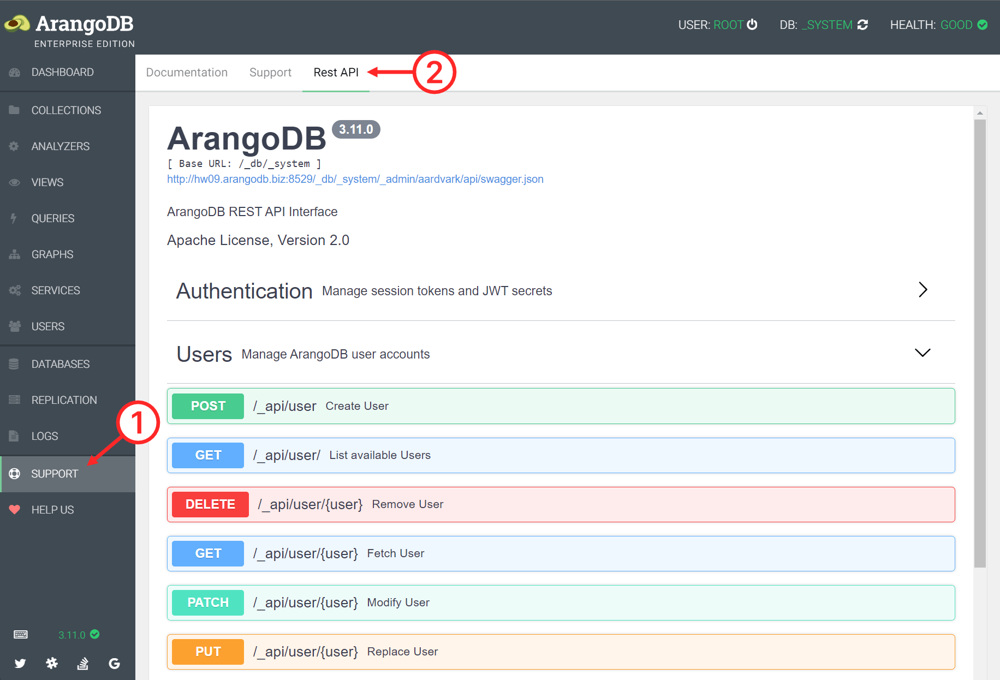

ArangoDB servers expose an application programming interface (API) for managing
the database system. It is based on the HTTP protocol that powers the
world wide web. All interactions with a server are ultimately carried out via
this HTTP API.

You can use the API by sending HTTP requests to the server directly, but the
more common way of communicating with the server is via a [database driver](../drivers/_index.md).
A driver abstracts the complexity of the API away by providing a simple
interface for your programming language or environment and handling things like
authentication, connection pooling, asynchronous requests, and multi-part replies
in the background. You can also use ArangoDB's [web interface](../components/web-interface/_index.md),
the [_arangosh_](../components/tools/arangodb-shell/_index.md) shell, or other tools.

The API documentation is relevant for you in the following cases:

- You want to build or extend a driver.
- You want to utilize a feature that isn't exposed by your driver or tool.
- You need to send many requests and avoid any overhead that a driver or tool might add.
- You operate a server instance and need to perform administrative actions via the API.
- You are interested in how the low-level communication works.

## RESTful API

The API adheres to the design principles of [REST](https://en.wikipedia.org/wiki/Representational_state_transfer) 
(Representational State Transfer). A REST API is a specific type of HTTP API
that uses HTTP methods to represent operations on resources (mainly `GET`,
`POST`, `PATCH`, `PUT`, and `DELETE`), and resources are identified by URIs.
A resource can be a database record, a server log, or any other data entity or
object. The communication between client and server is stateless.

## Swagger specification

ArangoDB's RESTful HTTP API is documented using the industry-standard
**OpenAPI Specification**, more specifically [Swagger 2.0](https://swagger.io/specification/v2/).
You can explore the API with the interactive **Swagger UI** using the
[ArangoDB web interface](../components/web-interface/_index.md).

1. Click **SUPPORT** in the main navigation of the web interface.
2. Click the **Rest API** tab.
3. Click a section and endpoint to view the description and parameters.

Also see this blog post:
[Using the ArangoDB Swagger.io Interactive API Documentation](https://www.arangodb.com/2018/03/using-arangodb-swaggerio-interactive-api-documentation/).
