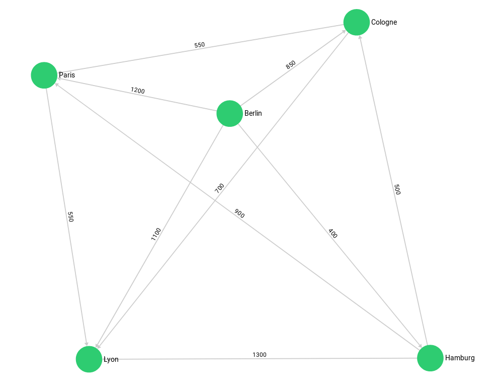

## Finding the start vertex via a geo query

Our first example will locate the start vertex for a graph traversal via [a geo index](../../core-topics/indexing/working-with-indexes/geo-spatial-indexes.md).
We use [the city graph](../../core-topics/graphs/_index.md#the-city-graph) and its geo indexes:



```js
---
name: COMBINING_GRAPH_01_create_graph
description: ''
render: input/output
version: '3.11'
release: stable
---
var examples = require("@arangodb/graph-examples/example-graph.js");
var g = examples.loadGraph("routeplanner");
~examples.dropGraph("routeplanner");
```

We search all german cities in a range of 400 km around the ex-capital **Bonn**: **Hamburg** and **Cologne**.
We won't find **Paris** since its in the `frenchCity` collection.

```aql
---
name: COMBINING_GRAPH_02_show_geo
description: ''
render: input/output
version: '3.11'
release: stable
dataset: routeplanner
bindVars: 
  {
        "bonn": [7.0998, 50.7340],
        "radius": 400000
      }
---
FOR startCity IN germanCity
  FILTER GEO_DISTANCE(@bonn, startCity.geometry) < @radius
RETURN startCity._key
```

Let's revalidate that the geo indexes are actually used:

```aql
---
name: COMBINING_GRAPH_03_explain_geo
description: ''
render: input/output
version: '3.11'
release: stable
dataset: routeplanner
explain: true
bindVars: 
  {
        "bonn": [7.0998, 50.7340],
        "radius": 400000
      }
---
FOR startCity IN germanCity
  FILTER GEO_DISTANCE(@bonn, startCity.geometry) < @radius
RETURN startCity._key
```

And now combine this with a graph traversal:

```aql
---
name: COMBINING_GRAPH_04_combine
description: ''
render: input/output
version: '3.11'
release: stable
dataset: routeplanner
bindVars: 
  {
        "bonn": [7.0998, 50.7340],
        "radius": 400000
      }
---
FOR startCity IN germanCity
  FILTER GEO_DISTANCE(@bonn, startCity.geometry) < @radius
FOR v, e, p IN 1..1 OUTBOUND startCity
  GRAPH 'routeplanner'
RETURN {startcity: startCity._key, traversedCity: v._key}
```

The geo index query returns us `startCity` (**Cologne** and **Hamburg**) which we then use as starting point for our graph traversal.
For simplicity we only return their direct neighbours. We format the return result so we can see from which `startCity` the traversal came.

Alternatively we could use a `LET` statement with a subquery to group the traversals by their `startCity` efficiently:

```aql
---
name: COMBINING_GRAPH_05_combine_let
description: ''
render: input/output
version: '3.11'
release: stable
dataset: routeplanner
bindVars: 
  {
        "bonn": [7.0998, 50.7340],
        "radius": 400000
      }
---
FOR startCity IN germanCity
  FILTER GEO_DISTANCE(@bonn, startCity.geometry) < @radius
LET oneCity = (
  FOR v, e, p IN 1..1 OUTBOUND startCity
GRAPH 'routeplanner' RETURN v._key
)
  RETURN {startCity: startCity._key, connectedCities: oneCity}
```

Finally, we clean up again:

```js
---
name: COMBINING_GRAPH_06_cleanup
description: ''
render: input/output
version: '3.11'
release: stable
---
~var examples = require("@arangodb/graph-examples/example-graph.js");
~var g = examples.loadGraph("routeplanner");
examples.dropGraph("routeplanner");
```
