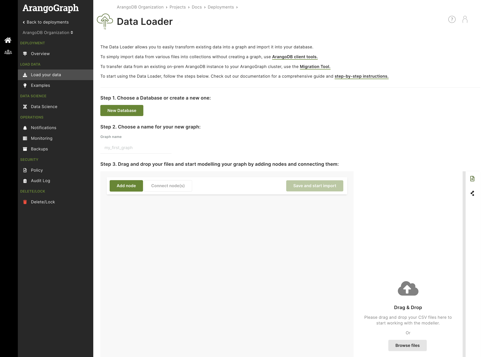

The ArangoGraph Data Loader allows you to transform existing data from CSV file
formats into data that can be analyzed by the ArangoGraph platform.

You provide your data in CSV format, a common format used for exports of data
from various systems. Then, using a no-code editor, you can model the schema of
this data and the relationships between them. This allows you to ingest your
existing datasets into your ArangoGraph database, without the need for any
development effort.

You can get started in a few easy steps.




Choose an existing database or create a new one.



Choose a name for your graph.



Drag and drop your data files in CSV format.



Model your graph by adding nodes and connecting them via edges.
Once you are ready, save and start the import. The resulting graph is an
[EnterpriseGraph](../../graphs/enterprisegraphs/_index.md) with its
corresponding collections, available in your ArangoDB database.




## How to access the Data Loader

1. If you do not have a deployment yet, [create a deployment](../deployments/_index.md#how-to-create-a-new-deployment) first.
2. Open your deployment you want to load data into.
3. In the **Load Data** section, click the **Load your data** button.

## Other options to import data into ArangoGraph

To import data from various files into collections **without creating a graph**,
get the ArangoDB client tools for your operating system from the
[download page](https://arangodb.com/download-major/).

- To import data to ArangoGraph from an existing ArangoDB instance, see
  [arangodump](../../components/tools/arangodump/) and
  [arangorestore](../../components/tools/arangorestore/).
- To import pre-existing data in JSON, CSV, or TSV format, see
  [arangoimport](../../components/tools/arangoimport/).
- To transfer data from an existing on-premises ArangoDB instance to your
  ArangoGraph cluster, see the [cloud migration tool](../migrate-to-the-cloud.md).
