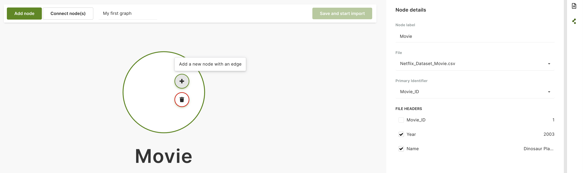
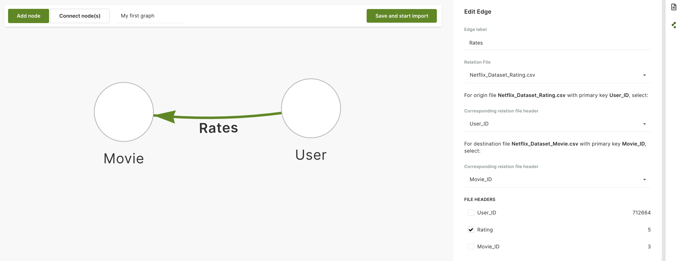

Based on the data you have uploaded, you can start designing your graph.
The graph designer allows you to create a schema using nodes and edges.
Once this is done, you can save and start the import. The resulting
[EnterpriseGraph](../../graphs/enterprisegraphs/_index.md) and the
corresponding collections are created in your ArangoDB database instance.

## How to add a node

Nodes are the main objects in your data model and include the attributes of the
objects.

1. To create a new node, click the **Add node** button.
2. In the graph designer, click on the newly create node to view the **Node details**.
3. In the **Node details** panel, fill in the following fields:
   - For **Node label**, enter a name you want to use for the node.
   - For **File**, select a file from the list to associate it with the node.
   - For **Primary Identifier**, select a field from the list. This is used to
   reference the nodes when you define relations with edges.
   - For **File Headers**, select one or more attributes from the list.

## How to connect nodes

Nodes can be connected by edges to express and categorize the relations between
them. A relation always has a direction, going from one node to another. You can
define this direction in the graph designer by dragging your cursor from a
particular node to another.

To connect two nodes, you can use the **Connect node(s)** button. Click on any
node to self-reference it or drag to connect it to another node. Alternatively,
when you select a node, a plus sign will appear, allowing you to directly add a
new node with an edge.

The edge needs to be associated with a file and must have a label. Note that a
node and an edge cannot have the same label.

See below the steps to add details to an edge.

1. Click on an edge in the graph designer.
2. In the **Edit Edge** panel, fill in the following fields:
   - For **Edge label**, enter a name you want to use for the edge.
   - For **Relation file**, select a file from the list to associate it with the edge.
   - To define how the relation points from one node to another, select the
   corresponding relation file header for both the origin file (`_from`) and the
   destination file (`_to`).
   - For **File Headers**, select one or more attributes from the list.

## How to delete elements

To remove a node or an edge, simply select it in the graph designer and click the
**Delete** icon.