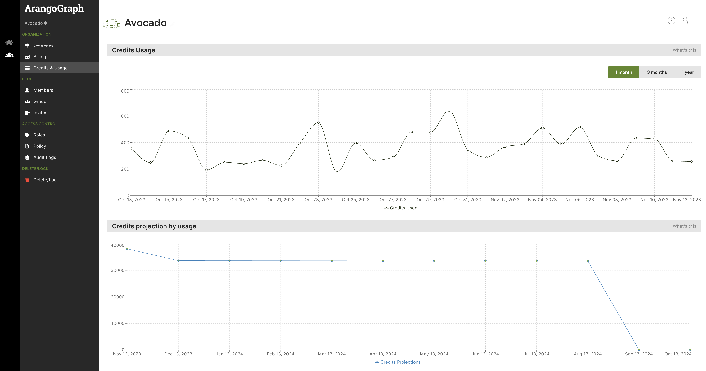




Credits are only available if your organization has signed up for
ArangoGraph's [Committed](../organizations/_index.md#committed) package.


The ArangoGraph credit model is a versatile prepaid model that allows you to
purchase credits and use them in a flexible way, based on what you have running
in ArangoGraph.

Instead of purchasing a particular deployment for a year, you can purchase a
number of ArangoGraph credits that expire a year after purchase. These credits
are then consumed over that time period, based on the deployments you run
in ArangoGraph.

For example, a OneShard (three nodes) A64 deployment consumes more credits per
hour than a smaller deployment such as A8. If you are running multiple deployments,
like pre-production environments or for different use-cases, these would each consume
from the same credit balance. However, if you are not running any deployments
and do not have any backup storage, then none of your credits will be consumed.


To purchase credits for your organization, you need to get in touch with the
ArangoDB team. [Contact us](https://www.arangodb.com/contact/) for more details.


There are a number of benefits that ArangoGraph credits provide:
- **Adaptability**: The pre-paid credit model allows you to adapt your usage to
  changing project requirements or fluctuating workloads. By enabling the use of
  credits for various instance types and sizes, you can easily adjust your
  resource allocation.
- **Efficient handling of resources**: With the ability to purchase credits in
  advance, you can better align your needs in terms of resources and costs.
  You can purchase credits in bulk and then allocate them as needed.
- **Workload Optimization**: By having a clear view of credit consumption and
  remaining balance, you can identify inefficiencies to further optimize your
  infrastructure, resulting in cost savings and better performance.

## How to view the credit usage

1. In the main navigation, click the **Organization** icon.
2. Click **Credits & Usage** in the **Organization** section.
3. In the **Credits & Usage** page, you can:
   - See the remaining credit balance.
   - Track your total credit balance.
   - See a projection of when you will run out of credits, based on the last 30 days of usage. 
   - Get a detailed consumption report in PDF format that shows:
      - The number of credits you had at the start of the month.
      - The number of credits consumed in the month.
      - The number of credits remaining.
      - The number of credits consumed for each deployment.

## FAQs

### Are there any configuration constraints for using the credits?

No. Credits are designed to be used completely flexibly. You can use all of your
credits for multiple small deployments (i.e. A8s) or you can use them for a single
large deployment (i.e. A256), or even multiple large deployments, as long as you
have enough credits remaining.

### What is the flexibility of moving up or down in configuration size of the infrastructure?

You can move up sizes in configuration at any point by editing your deployment
within ArangoGraph, once every 6 hours to allow for in-place disk expansion.
Moving down sizes in configuration is currently only possible via the **Request Help**
button in the web interface.

### Is there a limit to how many deployments I can use my credits on?

There is no specific limit to the number of deployments you can use your credits
on. The credit model is designed to provide you with the flexibility to allocate
credits across multiple deployments as needed. This enables you to effectively
manage and distribute your resources according to your specific requirements and
priorities. However, it is essential to monitor your credit consumption to ensure
that you have sufficient credits to cover your deployments.

### Do the credits I purchase expire?

Yes, credits expire 1 year after purchase. You should ensure that you consume
all of these credits within the year.

### Can I make multiple purchases of credits within a year?

As an organization’s usage of ArangoGraph grows, particularly in the initial
phases of application development and early production release, it is common
to purchase a smaller credit package that is later supplemented by a larger
credit package part-way through the initial credit expiry term.
In this case, all sets of credits will be available for ArangoGraph consumption
as a single credit balance. The credits with the earlier expiry date are consumed
first to avoid credit expiry where possible.

### Can I purchase a specific number of credits (i.e. 3361, 4185)?

ArangoGraph offers a variety of predefined credit packages designed to
accommodate different needs and stages of the application lifecycle.
If you need to purchase a specific number of credits that does not align with
the ArangoGraph standard packages, [contact us](https://www.arangodb.com/contact/).

### How quickly will the credits I purchase be consumed?

The rate at which your purchased credits will be consumed depends on several
factors, including the type and size of instances you deploy, the amount of
resources used, and the duration of usage. Each machine size has an hourly credit
consumption rate, and the overall rate of credit consumption will increase for
larger sizes or for more machines/deployments. Credits will also be consumed for
any variable usage charges such as outbound network traffic and backup storage.

### How can I see how many credits I have remaining?

All details about credits, including how many credits have been purchased,
how many remain, and how they are being consumed are available in the
**Credits & Usage** page within the ArangoGraph web interface.

### I have a large sharded deployment, how do I know how many credits it will consume?

Each node size has a per-hour credit price for a given machine. You can calculate
the price of a sharded deployment by multiplying the machine price by the number
of machines in the deployment. You can download a detail consumption report from
the **Credits & Usage** page that shows you the number of credits consumed by any
deployment you are creating or editing.

### What happens if I run out of credits?

If you run out of credits, your access to ArangoGraph's services and resources
will be temporarily suspended until you purchase additional credits.

### Can I buy credits for a short time period (e.g. 2 months)?

No, you cannot but credits with an expiry of less than 12 months.
If you require credits for a shorter time frame, such as 2 months, you can still
purchase one of the standard credit packages and consume the credits as needed
during that time. You may opt for a smaller credit package that aligns with your
expected usage during the desired period, rather than the full year’s expected usage.
Although the credits will have a longer expiration period, this allows you to have
the flexibility of utilizing the remaining credits for any future needs.