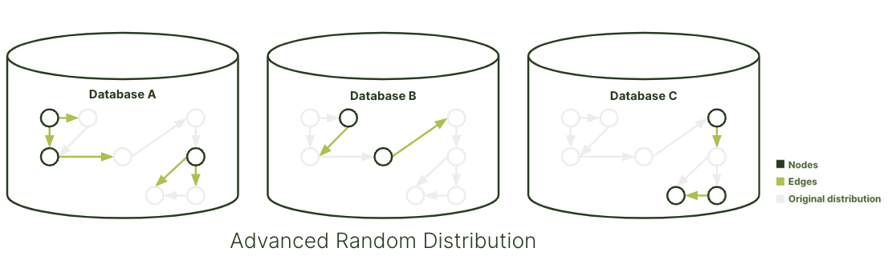



ArangoDB offers multiple graph types to create and handle graphs in single server
or clustered environments with different sharding strategies.

The Community Edition of ArangoDB includes:
- [General Graphs](general-graphs/_index.md)

The Enterprise Edition of ArangoDB includes:
- [SmartGraphs](smartgraphs/_index.md)
- [EnterpriseGraphs](enterprisegraphs/_index.md)
- [SatelliteGraphs](satellitegraphs/_index.md)

## When to use General Graphs

The General Graph is the basic graph type in ArangoDB, suitable for small-scale
graph use cases. Data in this type is randomly distributed across all configured
machines, making it easy to set up. However, this approach may result in
suboptimal query performance due to random data distribution.


General graphs are the easiest way to get started, no special configuration required.


## When to use SmartGraphs

The SmartGraphs further optimize data distribution by allowing you to define a
property called `smartGraphAttribute`. This property leverages your application's
knowledge about the graph's interconnected communities to improve data
organization and query performance.


For the best query performance, especially in highly interconnected graph
scenarios, use SmartGraphs. Organize your data efficiently using the
`smartGraphAttribute`.


## When to use EnterpriseGraphs

The EnterpriseGraphs are designed for large-scale graph use cases in enterprise
environments. While data is also randomly sharded, this graph type ensures that
all edges adjacent to a vertex are co-located on the same server. This
optimization significantly improves query performance by reducing network hops.


If you need improved query execution without manual data distribution, consider
using EnterpriseGraphs.


## When to use SatelliteGraphs

SatelliteGraphs replicate one or more graphs to all machines within a cluster
so queries can be executed locally. All vertices and edges are available on
every node for maximum data locality, therefore no network hops are required
to traverse the graph.


When using SatelliteGraphs, expect slower write performance because the data is
replicated across DB-Servers. For a more efficient option that doesn't replicate
all graph data to every server in your cluster, consider SmartGraphs.
