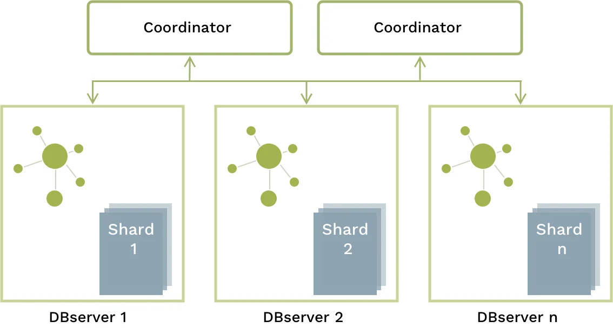


## What is a SatelliteGraph?

_SatelliteGraphs_ are a specialized _named graph_ type available for cluster
deployments. Their underlying collections are synchronously replicated to all
DB-Servers that are part of the cluster, which enables DB-Servers to execute
graph traversals locally. This includes shortest path and k-shortest paths
computations, and possibly even joins with traversals. They greatly improve
the performance of such queries.

They are the natural extension of the [SatelliteCollections](../../develop/satellitecollections.md)
concept to graphs. The same benefits and caveats apply.

## Why use a SatelliteGraph?

When doing queries in an ArangoDB cluster, data has to be exchanged between
different cluster nodes if the data is sharded and therefore residing
on multiple nodes. In particular graph traversals are usually executed on a
Coordinator, because they need global information. This results in a lot of
network traffic and potentially slow query execution.

Take a permission management use case for example, where you have a permissions
graph as well as a large, sharded collection of documents. You probably want to
determine quickly if a user, group or device has permission to access certain
information from that large collection. You would do this by traversing the
graph to figure out the permissions and then join it with the large collection.
With SatelliteGraphs, the entire permissions graph is available on all
DB-Servers. Thus, traversals can be executed locally. A traversal can even be
executed on multiple DB-Servers independently, so that the traversal results
are then available locally on every node, which means that the subsequent join
operation can also be executed without talking to other DB-Servers.

## When to use SatelliteGraphs?

While General Graphs are available in all Editions, the Enterprise Edition
offers two more _named graph_ types to achieve single-server alike query
execution times for graph queries in cluster deployments.

- **General Graphs**:
  The underlying collections of managed graphs can be sharded to distribute the
  data across multiple DB-Servers. However, General Graphs do not enforce or
  maintain special sharding properties of the collections. The document
  distribution is arbitrary and data locality tends to be low. On the positive
  side, it is possible to combine arbitrary sets of existing collections.
  If the graph data is on a single shard, then graph queries can be executed
  locally, but the results still need to be communicated to other nodes.

- **SmartGraphs**:
  Shard the data based on an attribute value, so that documents with the same
  value are stored on the same DB-Server. This can improve data locality and
  reduce the number of network hops between cluster nodes depending on the
  graph layout and traversal query. It is suitable for large scale graphs,
  because the graph data gets sharded to distribute it across multiple
  DB-Servers. Use SmartGraphs instead of General Graphs whenever possible for
  a performance boost.

- **SatelliteGraph**:
  Make the entire graph available on all DB-Servers using synchronous
  replication. All vertices and edges will be available on every node for
  maximum data locality. No network hops are required to traverse the graph.
  The graph data must fit on each node, therefore it will typically be a small
  to medium sized graph. The performance will be the highest if you are not
  permanently updating the graph's structure and content because every change
  needs to be replicated to all other DB-Servers.

With SatelliteGraphs, the performance of writes into the affected graph collections
will become slower due the fact that the graph data is replicated to the
participating DB-Servers. Also, as writes are performed on every DB-Server, it
will allocate more storage distributed around the whole cluster environment.

If you want to distribute a very large graph and you don't want to replicate
all graph data to all DB-Servers that are part of your cluster, then you should
consider [SmartGraphs](../smartgraphs/_index.md) instead.
