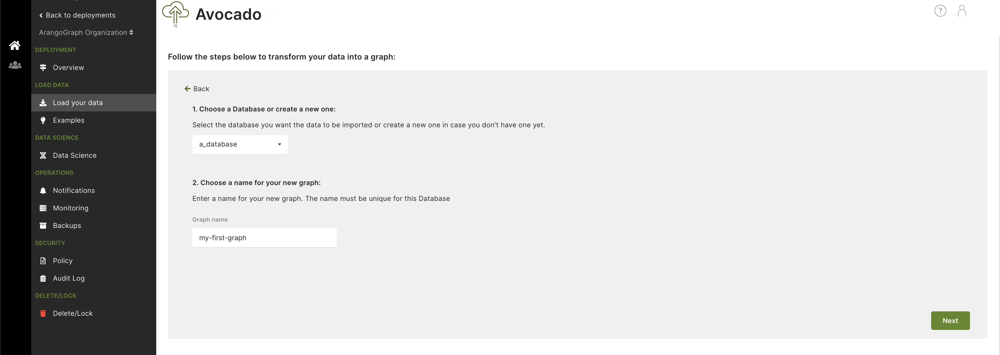
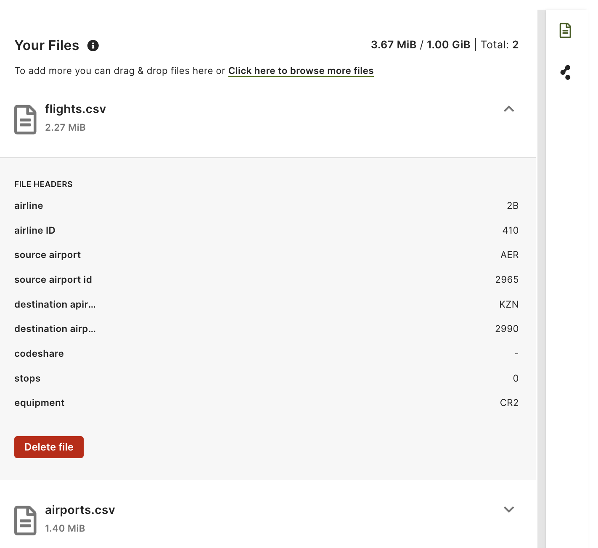
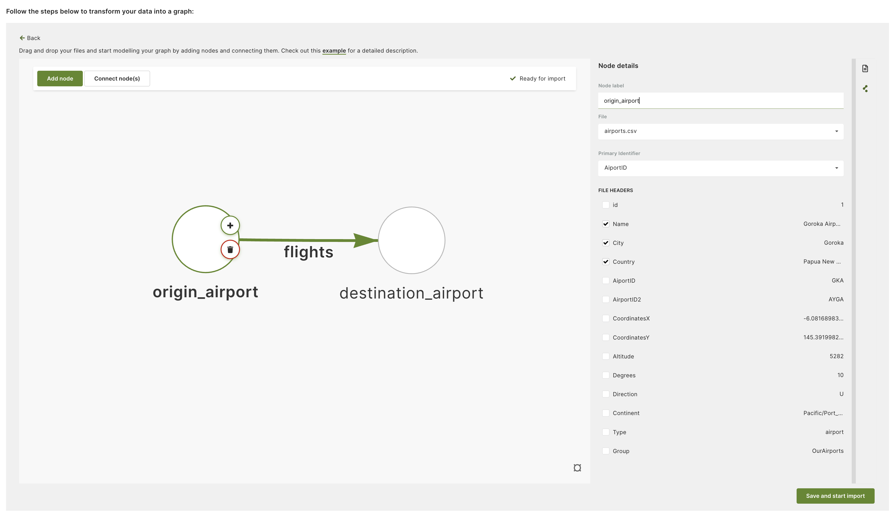
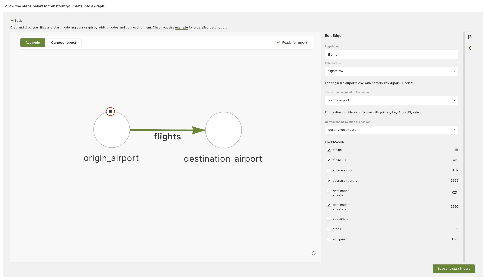
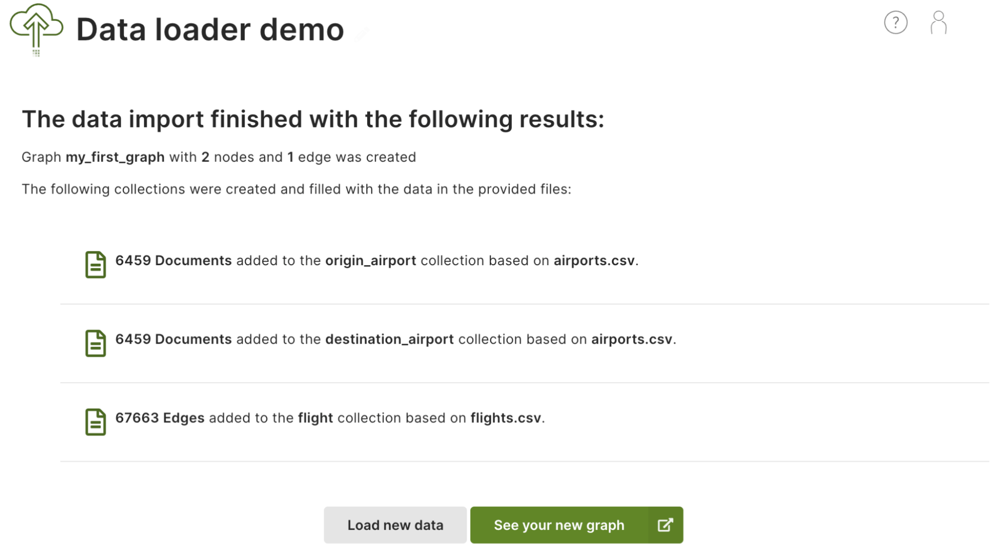
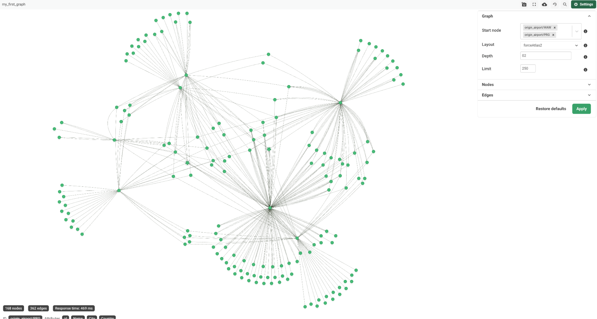

To transform your data into a graph, you need to have CSV files with entities
representing the nodes and a corresponding CSV file representing the edges.

This example uses a sample data set of two files, `airports.csv` and `flights.csv`
to create a graph showing flights arriving to and departing from various cities.

The `airports.csv` contains rows of airport entries, which are the future nodes
in your graph. The `flights.csv` contains rows of flight entries, which are the
future edges connecting the nodes.

The whole process can be broken down into these steps:

1. Enter a name for the database and the graph you would like to use for the
   data import.
2. Upload the files to the Data Loader web interface. You can simply drag and
   drop them.
3. Create your graph schema by adding nodes and edges and map data from the
   uploaded files to them. This allows creating the corresponding documents
   and collections for your graph.
4. Import the data and start using your newly created graph and collections.

## Step 1: Create database and choose graph name

Start by creating a new database and adding a name for your graph.

## Step 2: Add files

Upload your CSV files to the Data Loader web interface. You can drag and drop
them or upload them via a file browser window.

See also [Add files into Data Loader](../data-loader/add-files.md).

## Step 3: Design graph schema

Once the files are added, you can start designing the graph schema. This example
uses a simple graph consisting of:
- Two nodes (`origin_airport` and `destination_airport`)
- One directed edge going from the origin airport to the destination one
  representing a flight

Click **Add node** to create the nodes and connect them with edges.

Next, for each of the nodes and edges, you need to create a mapping to the
corresponding file and headers.

For nodes, the **Node label** is going to be a node collection name and the
**Primary identifier** will be used to populate the `_key` attribute of documents.
You can also select any additional headers to be included as document attributes.

In this example, two node collections have been created (`origin_airport` and
`destination_airport`) and `AirportID` header is used to create the `_key`
attribute for documents in both node collections. The header preview makes it
easy to select the headers you want to use.

For edges, the **Edge label** is going to be an edge collection name. Then, you
need to specify how edges will connect nodes. You can do this by selecting the
*from* and *to* nodes to give a direction to the edge.
In this example, the `source airport` header has been selected as a source and
the `destination airport` header as a target for the edge.

Note that the values of source and target for the edge correspond to the
**Primary identifier** (`_key` attribute) of the nodes. In this case, it is the
airport code (i.e. GKA) used as the `_key` in the node documents and in the source
and destination headers to configure the edges.

See also [Design your graph in the Data Loader](../data-loader/design-graph.md). 

## Step 4: Import and see resulting graph

After all the mapping is done, all you need to do is click
**Save and start import**. The report provides an overview of the files
processed and the documents created, as well as a link to your new graph.
See also [Start import](../data-loader/import.md).

Finally, click **See your new graph** to open the ArangoDB web interface and
explore your new collections and graph.

Happy graphing!