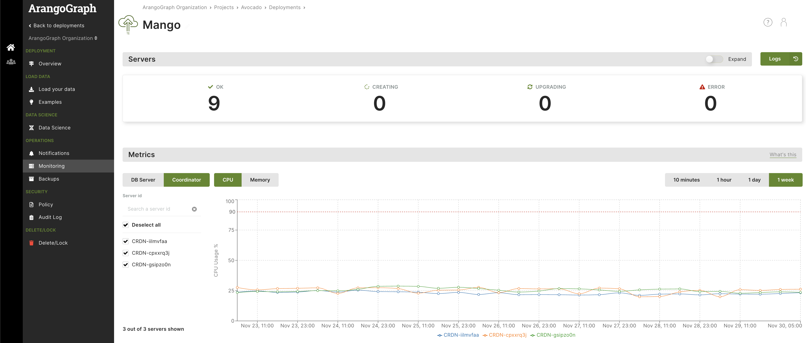
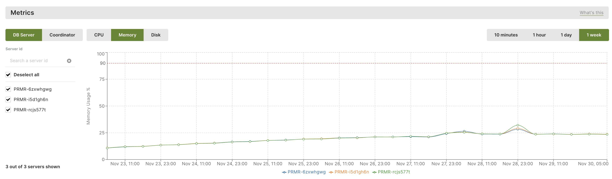

The ArangoGraph Insights Platform provides integrated charts, metrics, and logs
to help you monitor your deployment. This allows you to track your deployment's
performance, resource utilization, and its overall status.

The key features include:
- **Built-in monitoring**: Get immediate access to monitoring capabilities for
  your deployments without any additional setup.
- **Chart-based metrics representation**: Visualize the usage of the DBServers
  and Coordinators over a selected timeframe.
- **Integration with Prometheus and Grafana**: Connect your metrics to Prometheus
  and Grafana for in-depth visualization and analysis.

To get started, select an existing deployment from within a project and
click **Monitoring** in the navigation. 



## Build-in monitoring and metrics

### In the **Servers** section

The **Servers** section offers an overview of the DBServers, Coordinators,
and Agents used in your deployment. It provides essential details such as each
server's ID and type, the running ArangoDB version, as well as their memory,
CPU, and disk usage.

Additionally, you can access detailed logs via the **Logs** button. This allows
you to apply filters to obtain logs from all server types or select specific ones
(i.e. only Coordinators or only DBServers) within a timeframe. To download the
logs, click the **Save** button.


### In the **Metrics** section

The **Metrics** section displays a chart-based representation depicting the
resource utilization of DBServers and Coordinators within a specified timeframe.

You can select one or more DBServers and choose **CPU**, **Memory**, or **Disk**
to visualize their respective usage. Likewise, you can repeat the process for
Coordinators.



## Connect with Prometheus and Grafana

The ArangoGraph Insights Platform provides metrics for each deployment in a 
[Prometheus](https://prometheus.io/) compatible format.
You can use these metrics to gather detailed insights into the current
and previous states of your deployment.
Once metrics are collected by Prometheus, you can inspect them using tools
such as [Grafana](https://grafana.com/oss/grafana/).


### Metrics tokens

The **Metrics tokens** section allows you to create a new metrics token,
which is required for connecting to Prometheus.

1. To create a metrics token, click **New metrics token**.
2. For **Name**, enter a name for the metrics token.
3. Optionally, you can also enter a **Short description**.
4. Select the **Lifetime** of the metrics token. 
5. Click **Create**.


### How to connect Prometheus

1. In the **Metrics** section, click **Connect Prometheus**.
2. Create the `prometheus.yml` file with the following content:
   ```yaml
   global:
   scrape_interval: 60s
   scrape_configs:
   - job_name: 'deployment'
       bearer_token: '<fill-your-metrics-token-here>'
       scheme: 'https'
       static_configs:
       - targets: ['6775e7d48152.arangodb.cloud:8829']
       tls_config:
       insecure_skip_verify: true
   ```
3. Start Prometheus with the following command:
   ```sh
   docker run -d \
   -p 9090:9090 -p 3000:3000 --name prometheus \
   -v $(pwd)/prometheus.yml:/etc/prometheus/prometheus.yml:ro \
   prom/prometheus
   ```
   
   This command also opens a port 3000 for Grafana. In a production environment,
   this is not needed and not recommended to have it open.
   

### How to connect Grafana

1. Start Grafana with the following command:
   ```sh
   docker run -d \
   --network container:prometheus \
   grafana/grafana
   ```  
2. Go to `localhost:3000` and log in with the following credentials:
   - For username, enter *admin*.
   - For password, enter *admin*. 

    
    After the initial login, make sure to change your password.
    

3. To add a data source, click **Add your first data source** and then do the following:
   - Select **Prometheus**.
   - For **HTTP URL**, enter `http://localhost:9090`.
   - Click **Save & Test**.      
4. To add a dashboard, open the menu and click **Create** and then **Import**.
5. Download the [Grafana dashboard for ArangoGraph](https://github.com/arangodb-managed/grafana-dashboards).
6. Copy the contents of the `main.json` file into the **Import via panel json** field in Grafana.
7. Click **Load**.
