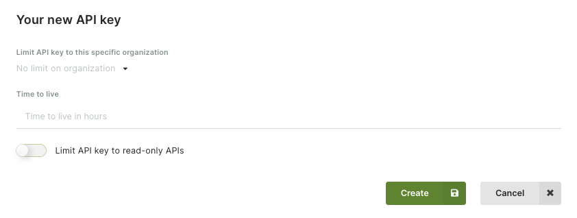

ArangoGraph provides support to control and manage members access in
ArangoGraph organizations with the
**System for Cross-domain Identity Management** (SCIM) provisioning. 
This enables you to propagate to ArangoGraph any user access changes by using
the dedicated API.


To enable the SCIM feature, get in touch with the ArangoGraph team via
**Request Help**, available in the left sidebar menu of the ArangoGraph Dashboard.


## About SCIM

[SCIM](https://www.rfc-editor.org/rfc/rfc7644), or the System
for Cross-domain Identity Management [specification](http://www.simplecloud.info/),
is an open standard designed to manage user identity information.
SCIM provides a defined schema for representing users, and a RESTful
API to run CRUD operations on these user resources.

The SCIM specification expects the following operations so that the SSO system
can sync the information about user resources in real time:

- `GET /Users` - List all users.
- `GET /Users/:user_id` - Get details for a given user ID.
- `POST /Users` - Invite a new user to ArangoGraph.
- `PUT /Users/:user_id` - Update a given user ID.
- `DELETE /Users/:user_id` - Delete a specified user ID.

ArangoGraph organization administrators can generate an API key for a specific organization.
The API token consists of a key and a secret. Using this key and secret as the
Basic Authentication Header (Basic Auth) in SCIM provisioning, you can access the APIs and
manage the user resources.

To learn how to generate a new API key in the ArangoGraph Dashboard, see the
[API Keys](../../my-account.md#api-keys) section.


When creating an API key, it is required to select an organization from the
list.


## Enable SCIM provisioning in Okta

To enable SCIM provisioning, you first need to create an SSO integration that
supports the SCIM provisioning feature.

1. To enable SCIM provisioning for your integration, go to the **General** tab.
2. In the **App Settings** section, select **Enable SCIM provisioning**.
3. Navigate to the **Provisioning** tab. The SCIM connection settings are
   displayed under **Settings > Integration**.
4. Fill in the following fields:
   - For **SCIM connector base URL**, use `https://dashboard.arangodb.cloud/api/scim/v1`
   - For **Unique identifier field for users**, use `userName`
5. For **Supported provisioning actions**, enable the following:
   - **Import New Users and Profile Updates**
   - **Push New Users**
   - **Push Profile Updates** 
6. From the **Authentication Mode** menu, select the **Basic Auth** option.
   To authenticate using this mode, you need to provide the username and password
   for the account that handles the SCIM actions - in this case ArangoGraph.
7. Go to the ArangoGraph Dashboard and create a new API key ID and Secret.

   

   Make sure to select one organization from the list and do not set any
   value in the **Time to live** field. For more information,
   see [How to create a new API key](../../my-account.md#how-to-create-a-new-api-key).
8. Use these authentication tokens as username and password when using the
   **Basic Auth** mode and click **Save**.
