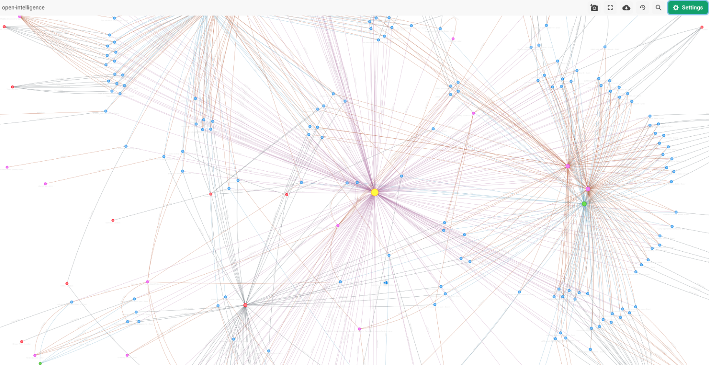

ArangoGraphML provides an easy-to-use & scalable interface to run Graph Machine Learning on ArangoDB Data. Since all of the orchestration and ML logic is managed by ArangoGraph, all that is typically required are JSON specifications outlining individual processes to solve an ML Task. If you are using the self-managed solution, additional configurations may be required.

The `arangoml` is a Python Package allowing you to manage all of the necessary ArangoGraphML components, including:
- **Project Management**: Projects are a metadata-tracking entity that sit at the top level of ArangoGraphML. All activities must link to a project.
- **Featurization**: The step of converting human-understandable data to machine-understandable data (i.e features), such that it can be used to train Graph Neural Networks (GNNs).
- **Training**: Train a set of models based on the name of the generated/existing features, and a definition of the ML Task we want to solve (e.g Node Classification, Embedding Generation).
- **Model Selection**: Select the best model based on the metrics generated during training.
- **Predictions**: Generate predictions based on the selected model, and persit the results to the source graph (either in the source document, or in a new collection).


To enable the ArangoGraphML services in the ArangoGraph platform,
[get in touch](https://www.arangodb.com/contact/)
with the ArangoDB team. Regular notebooks in ArangoGraph don't include the
`arangoml` package.


ArangoGraphML's suite of services and packages is driven by **"specifications"**. These specifications are standard Python dictionaries that describe the task being performed, & the data being used. The ArangoGraphML services work closely together, with the previous task being used as the input for the next.

Let's take a look at using the `arangoml` package to:

1. Manage projects
2. Featurize data
3. Submit Training Jobs
4. Evaluate Model Metrics
5. Generate Predictions

## Initialize ArangoML





**API Documentation: [arangoml.ArangoMLMagics.enable_arangoml](https://arangoml.github.io/arangoml/magics.html#arangoml.magic.ArangoMLMagics.enable_arangoml)**

The `arangoml` package comes pre-loaded with every ArangoGraphML notebook environment.
To start using it, simply import it, and enable it via a Jupyter Magic Command.

```py
arangoml = %enable_arangoml
```


ArangoGraphML comes with other ArangoDB Magic Commands! See the full list [here](https://arangoml.github.io/arangoml/magics.html).






**API Documentation: [arangoml.ArangoML](https://arangoml.github.io/arangoml/client.html#arangoml.main.ArangoML)**

The `ArangoML` class is the main entry point for the `arangoml` package.
It has the following parameters:
- `client`: An instance of arango.client.ArangoClient. Defaults to `None`. If not provided, the **hosts** argument must be provided.
- `hosts`: The ArangoDB host(s) to connect to. This can be a single host, or a
  list of hosts.
- `username`: The ArangoDB username to use for authentication.
- `password`: The ArangoDB password to use for authentication.
- `user_token`: The ArangoDB user token to use for authentication.
  This is an alternative to username/password authentication.
- `ca_cert_file`: The path to the CA certificate file to use for TLS
  verification. Defaults to `None`.
- `api_endpoint`: The URL to the ArangoGraphML API Service.
- `settings_files`: A list of secrets files to be loaded as settings. Parameters provided as arguments will override those in the settings files (e.g `settings.toml`).
- `version`: The ArangoML API date version. Defaults to the latest version.

It is possible to instantiate an ArangoML object in multiple ways:

1. Via parameters
```py
from arangoml import ArangoML

arangoml = ArangoML(
    hosts="http://localhost:8529"
    username="root",
    password="password",
    # ca_cert_file="/path/to/ca.pem",
    # user_token="..."
    api_endpoint="http://localhost:8501",
)
```

2. Via parameters and a custom `ArangoClient` instance
```py
from arangoml import ArangoML
from arango import ArangoClient

client = ArangoClient(
    hosts="http://localhost:8529",
    verify_override="/path/to/ca.pem",
    hosts_resolver=...,
    ...
)

arangoml = ArangoML(
    client=client,
    username="root",
    password="password",
    # user_token="..."
    api_endpoint="http://localhost:8501",
)
```

3. Via environment variables
```py
import os
from arangoml import ArangoML

os.environ["ARANGODB_HOSTS"] = "http://localhost:8529"
os.environ["ARANGODB_CA_CERT_FILE"]="/path/to/ca.pem"
os.environ["ARANGODB_USER"] = "root"
os.environ["ARANGODB_PW"] = "password"
# os.environ["ARANGODB_USER_TOKEN"] = "..."
os.environ["ML_API_SERVICES_ENDPOINT"] = "http://localhost:8501"

arangoml = ArangoML()
```

4. Via configuration files
```py
import os
from arangoml import ArangoML

arangoml = ArangoML(settings_files=["settings_1.toml", "settings_2.toml"])
```

5. Via a Jupyter Magic Command

**API Documentation: [arangoml.ArangoMLMagics.enable_arangoml](https://arangoml.github.io/arangoml/magics.html#arangoml.magic.ArangoMLMagics.enable_arangoml)**

```
%load_ext arangoml
%enable_arangoml
```

This assumes you are working out of a Jupyter Notebook environment, and
have set the environment variables in the notebook environment with user
authentication that has **_system** access.



Running `%load_ext arangoml` also provides access to other [ArangoGraphML
Jupyter Magic Commands](https://arangoml.github.io/arangoml/magics.html).






## Load the database

This example is using ArangoML to predict the **class** of `Events` in a
Knowledge Graph constructed from the [GDELT Project](https://www.gdeltproject.org/).

> GDELT monitors the world's news media from nearly every corner of every
  country in print, broadcast, and web formats, in over 100 languages, every
  moment of every day. [...] Put simply, the GDELT Project is a realtime open
  data global graph over human society as seen through the eyes of the world's
  news media, reaching deeply into local events, reaction, discourse, and
  emotions of the most remote corners of the world in near-realtime and making
  all of this available as an open data firehose to enable research over human
  society.

The events used range from peaceful protests to significant battles in Angola.
The image below depicts the connections around an example event:


You can also see a larger portion of this graph, showing how the events, actors,
news sources, and locations are interconnected into a large graph.



Let's get started!





The [`arango-datasets`](../../components/tools/arango-datasets.md) Python package
allows you to load pre-defined datasets into ArangoDB. It comes pre-installed in the
ArangoGraphML notebook environment.

```py
DATASET_NAME = "OPEN_INTELLIGENCE_ANGOLA"

%delete_database {DATASET_NAME}
%create_database {DATASET_NAME}
%use_database {DATASET_NAME}
%load_dataset {DATASET_NAME}
```





The [`arango-datasets`](../../components/tools/arango-datasets.md) Python package
allows you to load pre-defined datasets into ArangoDB. It can be installed with the
following command:

```
pip install arango-datasets
```

```py
from arango_datasets.datasets import Datasets

DATASET_NAME = "OPEN_INTELLIGENCE_ANGOLA"

db = arangoml.client.db(
    name=DATASET_NAME, 
    username=arangoml.settings.get("ARANGODB_USER"),
    password=arangoml.settings.get("ARANGODB_PW"),
    user_token=arangoml.settings.get("ARANGODB_USER_TOKEN"),
    verify=True
)

Datasets(dataset_db).load(DATASET_NAME)
```




## Projects

**API Documentation: [ArangoML.projects](https://arangoml.github.io/arangoml/api.html#projects)**

Projects are an important reference used throughout the entire ArangoGraphML
lifecycle. All activities link back to a project. The creation of the project
is very simple. 

### Get/Create a project
```py
project = arangoml.get_or_create_project(DATASET_NAME)
```

### List projects

```py
arangoml.projects.list_projects()
```

## Featurization

**API Documentation: [ArangoML.jobs.featurize](https://arangoml.github.io/arangoml/api.html#agml_api.jobs.v1.api.jobs_api.JobsApi.featurize)**

**The Featurization Service depends on a `Featurization Specification` that contains**:
- `featurizationName`: A name for the featurization task.

- `projectName`: The associated project name. You can use `project.name` here
  if it was created or retrieved as described above.

- `graphName`: The associated graph name that exists within the database.

- `featureSetID` Optional: The ID of an existing Feature Set to re-use. If provided, the `metagraph` dictionary can be ommitted. Defaults to `None`.

- `featurizationConfiguration` Optional: The optional default configuration to be applied
  across all features. Individual collection feature settings override this option.

  - `featurePrefix`: The prefix to be applied to all individual features generated. Default is `feat_`. 

  - `outputName`: Adjust the default feature name. This can be any valid ArangoDB attribute name. Defaults to `x`.

  - `dimensionalityReduction`: Object configuring dimensionality reduction.
    - `disabled`: Whether to disable dimensionality reduction. Default is `false`,
    therefore dimensionality reduction is applied after Featurization by default.
    - `size`: The number of dimensions to reduce the feature length to. Default is `512`.

  - `defaultsPerFeatureType`: A dictionary mapping each feature to how missing or mismatched values should be handled. The keys of this dictionary are the features, and the values are sub-dictionaries with the following keys:
    - `missing`: A sub-dictionary detailing how missing values should be handled.
      - `strategy`: The strategy to use for missing values. Options include `REPLACE` or `RAISE`.
      - `replacement`: The value to replace missing values with. Only needed if `strategy` is `REPLACE`.
    - `mismatch`: A sub-dictionary detailing how mismatched values should be handled.
      - `strategy`: The strategy to use for mismatched values. Options include `REPLACE`, `RAISE`, `COERCE_REPLACE`, or `COERCE_RAISE`.
      - `replacement`: The value to replace mismatched values with. Only needed if `strategy` is `REPLACE`, or `COERCE_REPLACE`.

- `jobConfiguration` Optional: A set of configurations that are applied to the job.
  - `batchSize`: The number of documents to process in a single batch. Default is `32`.
  - `runAnalysisChecks`: Whether to run analysis checks, used  to perform a high-level analysis of the data quality before proceeding. Default is `true`.
  - `skipLabels`: Skips the featurization process for attributes marked as `label`. Default is `false`.
  - `useFeatureStore`: Enables the use of the Feature Store database, which allows you to store features separately from your Source Database. Default is `false`, therefore features are written to the source graph.
  - `overwriteFSGraph`: Whether to overwrite the Feature Store Graph if features were previously generated. Default is `false`, therefore features are written to an existing Feature Store Graph.s
  - `writeToSourceGraph`: Whether to store the generated features on the Source Graph. Default is `true`.

- `metagraph`: Metadata to represent the vertex & edge collections of the graph.
  - `vertexCollections`: A dictionary mapping the vertex collection names to the following values:
    - `features`: A dictionary mapping document properties to the following values:
      - `featureType`: The type of feature. Options include `text`, `category`, `numeric`, or `label`.
    - `config`: Collection-level configuration settings.
      - `featurePrefix`: Identical to global `featurePrefix` but for this collection.
      - `dimensionalityReduction`: Identical to global `dimensionalityReduction` but for this collection.
      - `outputName`: Identical to global `outputName`, but specifically for this collection.
      - `defaultsPerFeatureType`: Identical to global `defaultsPerFeatureType`, but specifically for this collection.
  - `edgeCollections`: A dictionary mapping the edge collection names to an empty dictionary, as edge attributes are not currently supported.

The Featurization Specification example is used for the GDELT dataset:
- It featurizes the `name` attribute of the `Actor`, `Class`, `Country`,
  `Source`, `Location`, and `Region` collections as a `text` features.
- It featurizes the `description` attribute of the `Event` collection as a
  `text` feature.
- It featurizes the `label` attribute of the `Event` collection as a `label`
  feature (this is the attribute you want to predict).
- It featurizes the `sourceScale` attribute of the `Source` collection as a
  `category` feature.
- It featurizes the `name` attribute of the `Region` collection as a
  `category` feature.

```py
# 1. Define the Featurization Specification

featurization_spec = {
    "databaseName": dataset_db.name,
    "projectName": project.name,
    "graphName": graph.name,
    "featurizationName": f"{DATASET_NAME}_Featurization",
    "featurizationConfiguration": {
        "featurePrefix": "feat_",
        "dimensionalityReduction": { "size": 256 },
        "outputName": "x"
    },
    "jobConfiguration": {
        "batchSize": 512,
        "useFeatureStore": False,
        "runAnalysisChecks": False,
    },
    "metagraph": {
        "vertexCollections": { 
            "Actor": {
                "features": {
                    "name": {
                        "featureType": "text",
                    },
                }
            },
            "Country": {
                "features": {
                    "name": {
                        "featureType": "text",
                    }
                }
            },
            "Event": {
                "features": {
                    "description": {
                        "featureType": "text",
                    },
                    "label": {
                        "featureType": "label",
                    },
                }
            },
            "Source": {
                "features": {
                    "name": {
                        "featureType": "text",
                    },            
                    "sourceScale": {
                        "featureType": "category",
                    },
                }
            },
            "Location": {
                "features": {
                    "name": {
                        "featureType": "text",
                    }
                }
            },
            "Region": {
                "features": {
                    "name": {
                        "featureType": "category",
                    },
                }
            }
        },
        "edgeCollections": {
            "eventActor": {},
            "hasSource": {},
            "hasLocation": {},
            "inCountry": {},
            "inRegion": {},
        }
    }
}
```

Once the specification has been defined, a Featurization Job can be triggered using the `arangoml.jobs.featurize` method:

```py
# 2. Submit a Featurization Job

featurization_job = arangoml.jobs.featurize(featurization_spec)
```

Once a Featurization Job has been submitted, you can wait for it to complete using the `arangoml.wait_for_featurization` method:

```py
# 3. Wait for the Featurization Job to complete

featurization_job_result = arangoml.wait_for_featurization(featurization_job.job_id)
```


**Example Output:**
```py
{
  "job_id": "16349541",
  "output_db_name": "OPEN_INTELLIGENCE_ANGOLA",
  "graph": "OPEN_INTELLIGENCE_ANGOLA",
  "feature_set_id": "16349537",
  "feature_set_ids": [
      "16349537"
  ],
  "vertexCollections": {
      "Actor": {
          "x": "OPEN_INTELLIGENCE_ANGOLA_x"
      },
      "Class": {
          "x": "OPEN_INTELLIGENCE_ANGOLA_x"
      },
      "Country": {
          "x": "OPEN_INTELLIGENCE_ANGOLA_x"
      },
      "Event": {
          "x": "OPEN_INTELLIGENCE_ANGOLA_x",
          "y": "OPEN_INTELLIGENCE_ANGOLA_y"
      },
      "Source": {
          "x": "OPEN_INTELLIGENCE_ANGOLA_x"
      },
      "Location": {
          "x": "OPEN_INTELLIGENCE_ANGOLA_x"
      },
      "Region": {
          "x": "OPEN_INTELLIGENCE_ANGOLA_x"
      }
  },
  "edgeCollections": {
      "eventActor": {},
      "hasSource": {},
      "hasLocation": {},
      "inCountry": {},
      "inRegion": {},
      "subClass": {},
      "type": {}
  },
  "label_field": "OPEN_INTELLIGENCE_ANGOLA_y",
  "input_field": "OPEN_INTELLIGENCE_ANGOLA_x",
  "feature_set_id_to_results": {
      "16349537": {
          "feature_set_id": "16349537",
          "output_db_name": "OPEN_INTELLIGENCE_ANGOLA",
          "graph": "OPEN_INTELLIGENCE_ANGOLA",
          "vertexCollections": {
              "Actor": {
                  "x": "OPEN_INTELLIGENCE_ANGOLA_x"
              },
              "Class": {
                  "x": "OPEN_INTELLIGENCE_ANGOLA_x"
              },
              "Country": {
                  "x": "OPEN_INTELLIGENCE_ANGOLA_x"
              },
              "Event": {
                  "x": "OPEN_INTELLIGENCE_ANGOLA_x",
                  "y": "OPEN_INTELLIGENCE_ANGOLA_y"
              },
              "Source": {
                  "x": "OPEN_INTELLIGENCE_ANGOLA_x"
              },
              "Location": {
                  "x": "OPEN_INTELLIGENCE_ANGOLA_x"
              },
              "Region": {
                  "x": "OPEN_INTELLIGENCE_ANGOLA_x"
              }
          },
          "edgeCollections": {
              "eventActor": {},
              "hasSource": {},
              "hasLocation": {},
              "inCountry": {},
              "inRegion": {},
              "subClass": {},
              "type": {}
          },
          "label_field": "OPEN_INTELLIGENCE_ANGOLA_y",
          "input_field": "OPEN_INTELLIGENCE_ANGOLA_x",
          "is_feature_store": false,
          "target_collection": "Event"
      }
  },
  "is_feature_store": false,
  "target_collection": "Event"
}
```

You can also cancel a Featurization Job using the `arangoml.jobs.cancel_job` method:

```py
arangoml.jobs.cancel_job(prediction_job.job_id)
```


## Training

**API Documentation: [ArangoML.jobs.train](https://arangoml.github.io/arangoml/api.html#agml_api.jobs.v1.api.jobs_api.JobsApi.train)**

Training Graph Machine Learning Models with ArangoGraphML requires two steps:
1. Describe which data points should be included in the Training Job.
2. Pass the Training Specification to the Training Service.

**The Training Service depends on a `Training Specification` that contains**:
- `featureSetID`: The feature set ID that was generated during the Featurization Job (if any). It replaces the need to provide the `metagraph`, `databaseName`, and `projectName` fields.

- `databaseName`: The database name the source data is in. Can be omitted if `featureSetID` is provided.

- `projectName`: The top-level project to which all the experiments will link back. Can be omitted if `featureSetID` is provided.

- `useFeatureStore`: Boolean for enabling or disabling the use of the feature store. Default is `false`.

- `mlSpec`: Describes the desired machine learning task, input features, and
    the attribute label to be predicted.
  - `classification`: Dictionary to describe the Node Classification Task Specification.
    - `targetCollection`: The ArangoDB collection name that contains the prediction label.
    - `inputFeatures`: The name of the feature to be used as input.
    - `labelField`: The name of the attribute to be predicted.
    - `batchSize`: The number of documents to process in a single training batch. Default is `64`.
  - `graphEmbeddings`: Dictionary to describe the Graph Embedding Task Specification.
    - `targetCollection`: The ArangoDB collection used to generate the embeddings. 
    - `embeddingSize`: The size of the embedding vector. Default is `128`.
    - `batchSize`: The number of documents to process in a single training batch. Default is `64`.
    - `generateEmbeddings`: Whether to generate embeddings on the training dataset. Default is `false`.

- `metagraph`: Metadata to represent the vertex & edge collections of the graph. If `featureSetID` is provided, this can be omitted.
  - `graph`: The ArangoDB graph name.
  - `vertexCollections`: A dictionary mapping the collection names to the following values:
    - `x`: The name of the feature to be used as input.
    - `y`: The name of the attribute to be predicted. Can only be specified for one collection.
  - `edgeCollections`: A dictionary mapping the edge collection names to an empty dictionary, as edge features are not currently supported.

A Training Specification allows for concisely defining your training task in a
single object and then passing that object to the training service using the
Python API client, as shown below.

The ArangoGraphML Training Service is responsible for training a series of
Graph Machine Learning Models using the data provided in the Training
Specification. It assumes that the data has been featurized and is ready to be
used for training.

Given that we have run a Featurization Job, we can create the Training Specification using the `featurization_job_result` object returned from the Featurization Job:

```py
# 1. Define the Training Specification

# Node Classification example

training_spec = {
    "featureSetID": featurization_job_result.result.feature_set_id,
    "mlSpec": {
        "classification": {
            "targetCollection": "Event",
            "inputFeatures": "OPEN_INTELLIGENCE_ANGOLA_x",
            "labelField": "OPEN_INTELLIGENCE_ANGOLA_y",
        }
    },
}

# Node Embedding example
# NOTE: Full Graph Embeddings support is coming soon

training_spec = {
    "featureSetID": featurization_job_result.result.feature_set_id,
    "mlSpec": {
        "graphEmbeddings": {
            "targetCollection": "Event",
            "embeddingSize": 128,
            "generateEmbeddings": True,
        }
    },
}
```

Once the specification has been defined, a Training Job can be triggered using the `arangoml.jobs.train` method:

```py
# 2. Submit a Training Job

training_job = arangoml.jobs.train(training_spec)
```

Once a Training Job has been submitted, you can wait for it to complete using the `arangoml.wait_for_training` method:

```py
# 3. Wait for the Training Job to complete

training_job_result = arangoml.wait_for_training(training_job.job_id)
```

**Example Output (Node Classification):**
```py
{
  "job_id": "691ceb2f-1931-492a-b4eb-0536925a4697",
  "job_status": "COMPLETED",
  "project_name": "OPEN_INTELLIGENCE_ANGOLA_GraphML_Node_Classification",
  "project_id": "16832427",
  "database_name": "OPEN_INTELLIGENCE_ANGOLA",
  "metagraph": {
      "mlSpec": {
          "classification": {
              "targetCollection": "Event",
              "inputFeatures": "OPEN_INTELLIGENCE_ANGOLA_x",
              "labelField": "OPEN_INTELLIGENCE_ANGOLA_y",
              "metrics": None
          }
      },
      "graph": "OPEN_INTELLIGENCE_ANGOLA",
      "vertexCollections": {
          "Actor": {
              "x": "OPEN_INTELLIGENCE_ANGOLA_x"
          },
          "Class": {
              "x": "OPEN_INTELLIGENCE_ANGOLA_x"
          },
          "Country": {
              "x": "OPEN_INTELLIGENCE_ANGOLA_x"
          },
          "Event": {
              "x": "OPEN_INTELLIGENCE_ANGOLA_x",
              "y": "OPEN_INTELLIGENCE_ANGOLA_y"
          },
          "Source": {
              "x": "OPEN_INTELLIGENCE_ANGOLA_x"
          },
          "Location": {
              "x": "OPEN_INTELLIGENCE_ANGOLA_x"
          },
          "Region": {
              "x": "OPEN_INTELLIGENCE_ANGOLA_x"
          }
      },
      "edgeCollections": {
          "eventActor": {},
          "hasSource": {},
          "hasLocation": {},
          "inCountry": {},
          "inRegion": {},
          "subClass": {},
          "type": {}
      },
      "batch_size": 64
  },
  "time_submitted": "2024-01-12T02:19:19.686286",
  "time_started": "2024-01-12T02:19:29.403742",
  "time_ended": "2024-01-12T02:30:59.313038",
  "job_state": None,
  "job_conditions": None
}
```

**Example Output (Node Embeddings):**
```py
{
    "job_id": "6047e53a-f1dd-4725-83e8-74ac44629c11",
    "job_status": "COMPLETED",
    "project_name": "OPEN_INTELLIGENCE_ANGOLA_GraphML_Node_Embeddings",
    "project_id": "647025872",
    "database_name": "OPEN_INTELLIGENCE_ANGOLA",
    "ml_spec": {
        "graphEmbeddings": {
            "targetCollection": "Event",
            "embeddingLevel": "NODE_EMBEDDINGS",
            "embeddingSize": 128,
            "embeddingTrainingType": "UNSUPERVISED",
            "batchSize": 64,
            "generateEmbeddings": true,
            "bestModelSelection": "BEST_LOSS",
            "persistModels": "ALL_MODELS",
            "modelConfigurations": {}
        }
    },
    "metagraph": {
        "graph": "OPEN_INTELLIGENCE_ANGOLA",
        "vertexCollections": {
            "Actor": {
                "x": "OPEN_INTELLIGENCE_ANGOLA_x"
            },
            "Country": {
                "x": "OPEN_INTELLIGENCE_ANGOLA_x"
            },
            "Event": {
                "x": "OPEN_INTELLIGENCE_ANGOLA_x",
                "y": "OPEN_INTELLIGENCE_ANGOLA_y"
            },
            "Source": {
                "x": "OPEN_INTELLIGENCE_ANGOLA_x"
            },
            "Location": {
                "x": "OPEN_INTELLIGENCE_ANGOLA_x"
            },
            "Region": {
                "x": "OPEN_INTELLIGENCE_ANGOLA_x"
            }
        },
        "edgeCollections": {
            "eventActor": {},
            "hasSource": {},
            "hasLocation": {},
            "inCountry": {},
            "inRegion": {}
        }
    },
    "time_submitted": "2025-03-27T02:55:15.099680",
    "time_started": "2025-03-27T02:57:25.143948",
    "time_ended": "2025-03-27T03:01:24.619737",
    "training_type": "Training"
}
```

You can also cancel a Training Job using the `arangoml.jobs.cancel_job` method:

```py
arangoml.jobs.cancel_job(training_job.job_id)
```

## Model Selection

Model Statistics can be observed upon completion of a Training Job. 
To select a Model, the ArangoGraphML Projects Service can be used to gather
all relevant models and choose the preferred model for a Prediction Job.

First, let's list all the trained models using [ArangoML.list_models](https://arangoml.github.io/arangoml/client.html#arangoml.main.ArangoML.list_models):

```py
# 1. List all trained Models

models = arangoml.list_models(
  project_name=project.name,
  training_job_id=training_job.job_id
)

print(len(models))
```

The cell below selects the model with the highest **test accuracy** using [ArangoML.get_best_model](https://arangoml.github.io/arangoml/client.html#arangoml.main.ArangoML.get_best_model), but there may be other factors that motivate you to choose another model. See the `model_statistics` in the output field below for more information on the full list of available metrics.

```py

# 2. Select the best Model

# Get best Node Classification Model
# Sort by highest test accuracy

best_model = arangoml.get_best_model(
    project.name,
    training_job.job_id,
    sort_parent_key="test",
    sort_child_key="accuracy",
)

# Get best Graph Embedding Model
# Sort by lowest loss

best_model = arangoml.get_best_model(
    project.name,
    training_job.job_id,
    sort_parent_key="loss",
    sort_child_key=None,
    reverse=False
)

print(best_model)
```

**Example Output (Node Classification):**
```py
{
  "job_id": "691ceb2f-1931-492a-b4eb-0536925a4697",
  "model_id": "02297435-3394-4e7e-aaac-82e1d224f85c",
  "model_statistics": {
      "_id": "devperf/123",
      "_key": "123",
      "_rev": "_gkUc8By--_",
      "run_id": "123",
      "test": {
          "accuracy": 0.8891242216547955,
          "confusion_matrix": [[13271, 2092], [1276, 5684]],
          "f1": 0.9,
          "loss": 0.1,
          "precision": 0.9,
          "recall": 0.8,
          "roc_auc": 0.8,
      },
      "validation": {
          "accuracy": 0.9,
          "confusion_matrix": [[13271, 2092], [1276, 5684]],
          "f1": 0.85,
          "loss": 0.1,
          "precision": 0.86,
          "recall": 0.85,
          "roc_auc": 0.85,
      },
  },
  "target_collection": "Event",
  "target_field": "label",
}
```

**Example Output (Node Embeddings):**
```py
{
    "job_id": "6047e53a-f1dd-4725-83e8-74ac44629c11",
    "model_id": "55ae93c2-3497-4405-9c63-0fa0e4a5b5bd",
    "model_display_name": "graphsageencdec Model",
    "model_name": "graphsageencdec Model 55ae93c2-3497-4405-9c63-0fa0e4a5b5bd",
    "model_statistics": {
        "loss": 0.13700408464796796,
        "val_acc": 0.5795393939393939,
        "test_acc": 0.5809545454545455
    },
    "model_tasks": [ "GRAPH_EMBEDDINGS" ]
}
```

## Prediction

**API Documentation: [ArangoML.jobs.predict](https://arangoml.github.io/arangoml/api.html#agml_api.jobs.v1.api.jobs_api.JobsApi.predict)**

Final step!

After selecting a model, a Prediction Job can be created. The Prediction Job
will generate predictions and persist them to the source graph in a new
collection, or within the source documents.

**The Prediction Service depends on a `Prediction Specification` that contains**:
- `projectName`: The top-level project to which all the experiments will link back.
- `databaseName`: The database name the source data is in.
- `modelID`: The model ID to use for generating predictions.
- `featurizeNewDocuments`: Boolean for enabling or disabling the featurization of new documents. Useful if you don't want to re-train the model upon new data. Default is `false`.
- `featurizeOutdatedDocuments`: Boolean for enabling or disabling the featurization of outdated documents. Outdated documents are those whose features have changed since the last featurization. Default is `false`.
- `schedule`: A cron expression to schedule the prediction job (e.g `0 0 * * *` for daily predictions). Default is `None`.
- `embeddingsField`: The name of the field to store the generated embeddings. This is only used for Graph Embedding tasks. Default is `None`.

```py
# 1. Define the Prediction Specification

# Node Classification Example
prediction_spec = {
  "projectName": project.name,
  "databaseName": dataset_db.name,
  "modelID": best_model.model_id,
}

# Node Embedding Example
prediction_spec = {
  "projectName": project.name,
  "databaseName": dataset_db.name,
  "modelID": best_model.model_id,
  "embeddingsField": "embeddings"
}
```

This job updates all documents with the predictions derived from the trained model.
Once the specification has been defined, a Prediction Job can be triggered using the `arangoml.jobs.predict` method:

```py
# 2. Submit a Prediction Job

# For Node Classification
prediction_job = arangoml.jobs.predict(prediction_spec)

# For Graph Embeddings
prediction_job = arangoml.jobs.generate(prediction_spec)
```

Similar to the Training Service, we can wait for a Prediction Job to complete with the `arangoml.wait_for_prediction` method: 

```py
# 3. Wait for the Prediction Job to complete

prediction_job_result = arangoml.wait_for_prediction(prediction_job.job_id)
```

**Example Output (Node Classification):**
```py
{
  "job_id": "b2a422bb-5650-4fbc-ba6b-0578af0049d9",
  "job_status": "COMPLETED",
  "project_name": "OPEN_INTELLIGENCE_ANGOLA_GraphML_Node_Classification",
  "project_id": "16832427",
  "database_name": "OPEN_INTELLIGENCE_ANGOLA",
  "model_id": "1a365657-f5ed-4da9-948b-1ff60bc6e7de",
  "job_state_information": {
      "outputGraphName": "OPEN_INTELLIGENCE_ANGOLA",
      "outputCollectionName": "Event",
      "outputAttribute": "OPEN_INTELLIGENCE_ANGOLA_y_predicted",
      "numberOfPredictedDocuments": 3302,
      "outputEdgeCollectionName": None
  },
  "time_submitted": "2024-01-12T02:31:18.382625",
  "time_started": "2024-01-12T02:31:23.550469",
  "time_ended": "2024-01-12T02:31:40.021035"
}
```

**Example Output (Node Embeddings):**
```py
{
    "job_id": "25260362-9764-47d0-abb4-247cbdce6c7b",
    "job_status": "COMPLETED",
    "project_name": "OPEN_INTELLIGENCE_ANGOLA_GraphML_Node_Embeddings",
    "project_id": "647025872",
    "database_name": "OPEN_INTELLIGENCE_ANGOLA",
    "model_id": "55ae93c2-3497-4405-9c63-0fa0e4a5b5bd",
    "job_state_information": {
        "outputGraphName": "OPEN_INTELLIGENCE_ANGOLA",
        "outputCollectionName": "Event",
        "outputAttribute": "embeddings",
        "numberOfPredictedDocuments": 0, # 0 All documents already have up-to-date embeddings
    },
    "time_submitted": "2025-03-27T14:02:33.094191",
    "time_started": "2025-03-27T14:09:34.206659",
    "time_ended": "2025-03-27T14:09:35.791630",
    "prediction_type": "Prediction"
}
```

You can also cancel a Prediction Job using the `arangoml.jobs.cancel_job` method:

```py
arangoml.jobs.cancel_job(prediction_job.job_id)
```

### Viewing Inference Results

We can now access our results via AQL:

```py
import json

collection_name = prediction_job_result.job_state_information['outputCollectionName']

query = f"""
  FOR doc IN `{collection_name}`
    SORT RAND()
    LIMIT 3
    RETURN doc
"""

docs = list(dataset_db.aql.execute(query))

print(json.dumps(docs, indent=2))
```

## What's next

With the generated Feature (and optionally Node) Embeddings, you can now use them for downstream tasks like clustering, anomaly detection, and link prediction. Consider using [ArangoDB's Vector Search](https://arangodb.com/2024/11/vector-search-in-arangodb-practical-insights-and-hands-on-examples/) capabilities to find similar nodes based on their embeddings.
