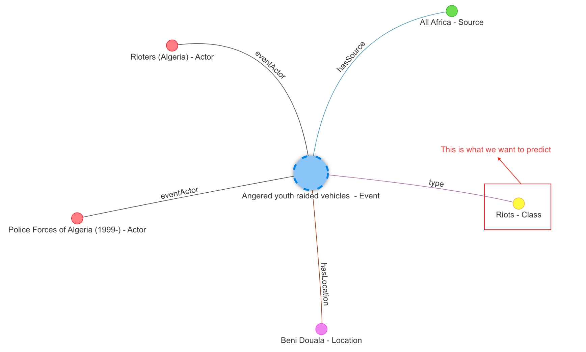



The self-managed GraphML solution allows you to deploy and manage ArangoML
within your Kubernetes environment. You can run ArangoML in your Kubernetes
cluster provided you already have a running `ArangoDeployment`. If you don't
have one yet, consider checking the installation guide of the
[ArangoDB Kubernetes Operator](https://arangodb.github.io/kube-arangodb/docs/using-the-operator.html)
and the [ArangoDeployment Custom Resource](https://arangodb.github.io/kube-arangodb/docs/deployment-resource-reference.html)
description.

To start ArangoML in your Kubernetes cluster, follow the instructions provided
in the [ArangoMLExtension Custom Resource](https://github.com/arangodb/kube-arangodb/blob/master/docs/mlextension-resource.md)
description. Once the `CustomResource` has been created and the ArangoML extension
is ready, you can start using the ArangoML functionalities.

## Node classification

The following is a guide to show how to use the `arangoml` package in order to:
- Manage projects
- Featurize data
- Submit training jobs
- Evaluate model metrics
- Generate predictions

The `arangoml` package requires properly formed **specifications**. The
specifications describe the task being performed and the data being used.
The ArangoML services work closely together, with one task providing inputs
to another.

## Dataset: Open Intelligence GDELT

This example shows how to use ArangoML to predict the **class** of `Events` in
a Knowledge Graph constructed from the [GDETL Project](https://www.gdeltproject.org/).

> GDELT monitors the world's news media from nearly every corner of every country
> in print, broadcast, and web formats, in over 100 languages, every moment of 
> every day. [...] Put simply, the GDELT Project is a realtime open data global
> graph over human society as seen through the eyes of the world's news media,
> reaching deeply into local events, reaction, discourse, and emotions of the most
> remote corners of the world in near-realtime and making all of this available
> as an open data firehose to enable research over human society.

The events used in this example range from peaceful protests to significant
battles. The image below depicts the connections around an example event:



You can also see a larger portion of this graph, showing how the events, actors,
news sources, and locations are interconnected into a large graph.


## Initialize ArangoML

```py
from arangoml import ArangoML

arangoml = ArangoML(
    hosts="http://localhost:8529"
    username="root",
    password="password",
    projects_endpoint="http://localhost:8503",
    training_endpoint="http://localhost:8502",
    prediction_endpoint="http://localhost:8501",
)
```

## Load the database

```py
from arango_datasets.datasets import Datasets

DATASET_NAME = "OPEN_INTELLIGENCE_ANGOLA"

username = arangoml.settings.ARANGODB_USER
password = arangoml.settings.ARANGODB_PW

# Create the Database for the Dataset
system_db = client.db("_system", username=username, password=password, verify=True)
system_db.delete_database(DATASET_NAME, ignore_missing=True)
system_db.create_database(DATASET_NAME)

# Load the Dataset
dataset_db = client.db(DATASET_NAME, username=username, password=password, verify=True)
Datasets(dataset_db).load(DATASET_NAME)
```

## Create a project

```py
# Fetch the ArangoML Project (or create it if it doesn't exist)
project = arangoml.get_project(DATASET_NAME)
```

## Featurize the dataset

```py
# Define the Featurization Spec
featurization_spec = {
    "featurization_name": f"{DATASET_NAME}_Featurization",
    "project_name": project.name,
    "graph_name": DATASET_NAME,
    "default_config": {
        "dimensionality_reduction": {"size": 64},
        "output_name": "x",
    },
    "vertexCollections": {
        "Actor": {
            "features": {
                "name": {
                    "feature_type": "text",
                },
            }
        },
        "Class": {
            "features": {
                "name": {
                    "feature_type": "text",
                },
            }
        },
        "Country": {
            "features": {
                "name": {
                    "feature_type": "text",
                }
            }
        },
        "Event": {
            "features": {
                "description": {
                    "feature_type": "text",
                },
                "label": {
                    "feature_type": "label",
                },
            }
        },
        "Source": {
            "features": {
                "name": {
                    "feature_type": "text",
                },
                "sourceScale": {
                    "feature_type": "category",
                },
            }
        },
        "Location": {
            "features": {
                "name": {
                    "feature_type": "text",
                }
            }
        },
        "Region": {
            "features": {
                "name": {
                    "feature_type": "category",
                },
            }
        },
    },
    "edgeCollections": {
        "eventActor": {},
        "hasSource": {},
        "hasLocation": {},
        "inCountry": {},
        "inRegion": {},
        "subClass": {},
        "type": {},
    },
}

# Run Featurization
feature_result = arangoml.featurization.featurize(
    database_name=dataset_db.name,
    featurization_spec=featurization_spec,
    batch_size=256,
    use_feature_store=False,
    run_analysis_checks=False,
)
```

## Submit a training job

```py
# Define the Training Spec
training_spec = {
    "database_name": dataset_db.name,
    "project_name": project.name,
    "metagraph": {
        "mlSpec": {
            "classification": {
                "targetCollection": "Event",
                "inputFeatures": f"{DATASET_NAME}_x",
                "labelField": f"{DATASET_NAME}_y",
            }
        },
        "graph": DATASET_NAME,
        "vertexCollections": feature_result.vertexCollections,
        "edgeCollections": feature_result.edgeCollections,
    },
}

# Run Training
training_job = arangoml.training.train(training_spec)

# Wait for Training to Complete
training_job_result = arangoml.wait_for_training(training_job.job_id)

# Print the Training Job Result
print(training_job_result)
```

## Get the best model

```py
# Get the best Model by test accuracy
best_model = arangoml.get_best_model(
    project.name,
    training_job.job_id,
    sort_parent_key="test",
    sort_child_key="accuracy",
)

print(best_model)
```

## Generate predictions

```py
# Define the Prediction Spec
prediction_spec = {
    "project_name": project.name,
    "database_name": dataset_db.name,
    "model_id": best_model.model_id,
}

# Run Prediction
prediction_job = arangoml.prediction.predict(prediction_spec)

# Wait for Prediction to Complete
prediction_job_result = arangoml.wait_for_prediction(prediction_job.job_id)

# Print the Prediction Job Result
print(prediction_job_result)
```