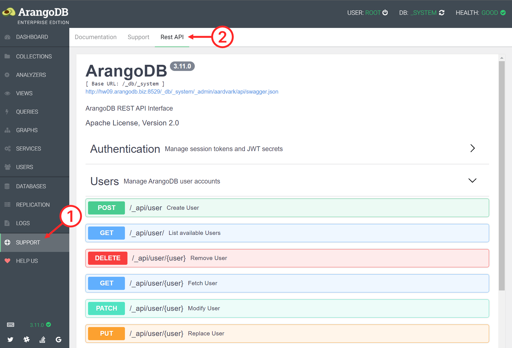

ArangoDB servers expose an application programming interface (API) for managing
the database system. It is based on the HTTP protocol that powers the
world wide web. All interactions with a server are ultimately carried out via
this HTTP API.

You can use the API by sending HTTP requests to the server directly, but the
more common way of communicating with the server is via a [database driver](../drivers/_index.md).
A driver abstracts the complexity of the API away by providing a simple
interface for your programming language or environment and handling things like
authentication, connection pooling, asynchronous requests, and multi-part replies
in the background. You can also use ArangoDB's [web interface](../../components/web-interface/_index.md),
the [_arangosh_](../../components/tools/arangodb-shell/_index.md) shell, or other tools.

The API documentation is relevant for you in the following cases:

- You want to build or extend a driver.
- You want to utilize a feature that isn't exposed by your driver or tool.
- You need to send many requests and avoid any overhead that a driver or tool might add.
- You operate a server instance and need to perform administrative actions via the API.
- You are interested in how the low-level communication works.

## RESTful API

The API adheres to the design principles of [REST](https://en.wikipedia.org/wiki/Representational_state_transfer) 
(Representational State Transfer). A REST API is a specific type of HTTP API
that uses HTTP methods to represent operations on resources (mainly `GET`,
`POST`, `PATCH`, `PUT`, and `DELETE`), and resources are identified by URIs.
A resource can be a database record, a server log, or any other data entity or
object. The communication between client and server is stateless.

A request URL can look like this:
`http://localhost:8529/_db/DATABASE/_api/document/COLLECTION/KEY?returnOld=true&keepNull=false`
- `http` is the scheme, which is `https` if you use TLS encryption
- `http:` is the protocol
- `localhost` is the hostname, which can be an IP address or domain name including subdomains
- `8529` is the port
- `/_db/DATABASE/_api/document/COLLECTION/KEY` is the pathname
- `?returnOld=true&keepNull=false` is the search string
- `returnOld=true&keepNull=false` is the query string

The HTTP API documentation mainly describes the available **endpoints**, like
for updating a document, creating a graph, and so on. Each endpoint description
starts with the HTTP method and the pathname, like `PATCH /_api/document/{collection}/{key}`.
- The `PATCH` method is for updating, `PUT` for replacing, `POST` for creating
  (or triggering an action), `DELETE` for removing, `GET` for reading,
  `HEAD` for reading metadata only
- `/_api/document/…` is the path of ArangoDB's HTTP API for handling documents
  and can be preceded by `/_db/{database}` with `{database}` replaced by a
  database name to select another database than the default `_system` database
- `{collection}` and `{key}` are placeholders called **Path Parameters** that
  you have to replace with a collection name and document key in this case
- The pathname can be followed by a question mark and the so-called
  **Query Parameters**, which is a series of key/value pairs separated by
  ampersands to set options, like `/_api/document/COLLECTION/KEY?returnOld=true&keepNull=false`
- Some endpoints allow you to specify **HTTP headers** in the request
  (not in the URL), like `If-Match: "REVISION"`
- A **Request Body** is the payload you may need to send, typically JSON data
- **Responses** are the possible HTTP responses in reply to your request in terms
  of the HTTP status code and typically a JSON payload with a result or error information

On the wire, a simplified HTTP request can look like this:

```
PATCH /_api/document/coll1/docA?returnOld=true HTTP/1.1
Host: localhost:8529
Authorization: Basic cm9vdDo=
If-Match: "_hV2oH9y---"
Content-Type: application/json; charset=utf-8
Content-Length: 20

{"attr":"new value"}
```

And a simplified HTTP response can look like this:

```
HTTP/1.1 202 Accepted
Etag: "_hV2r5XW---"
Location: /_db/_system/_api/document/coll1/docA
Server: ArangoDB
Connection: Keep-Alive
Content-Type: application/json; charset=utf-8
Content-Length: 160

{"_id":"coll1/docA","_key":"docA","_rev":"_hV2r5XW---","_oldRev":"_hV2oH9y---","old":{"_key":"docA","_id":"coll1/docA","_rev":"_hV2oH9y---","attr":"value"}}
```

## Swagger specification

ArangoDB's RESTful HTTP API is documented using the industry-standard
**OpenAPI Specification**, more specifically [OpenAPI version 3.1](https://swagger.io/specification/).
You can explore the API with the interactive **Swagger UI** using the
[ArangoDB web interface](../../components/web-interface/_index.md).

1. Click **SUPPORT** in the main navigation of the web interface.
2. Click the **Rest API** tab.
3. Click a section and endpoint to view the description and parameters.



Also see this blog post:
[Using the ArangoDB Swagger.io Interactive API Documentation](https://www.arangodb.com/2018/03/using-arangodb-swaggerio-interactive-api-documentation/).
