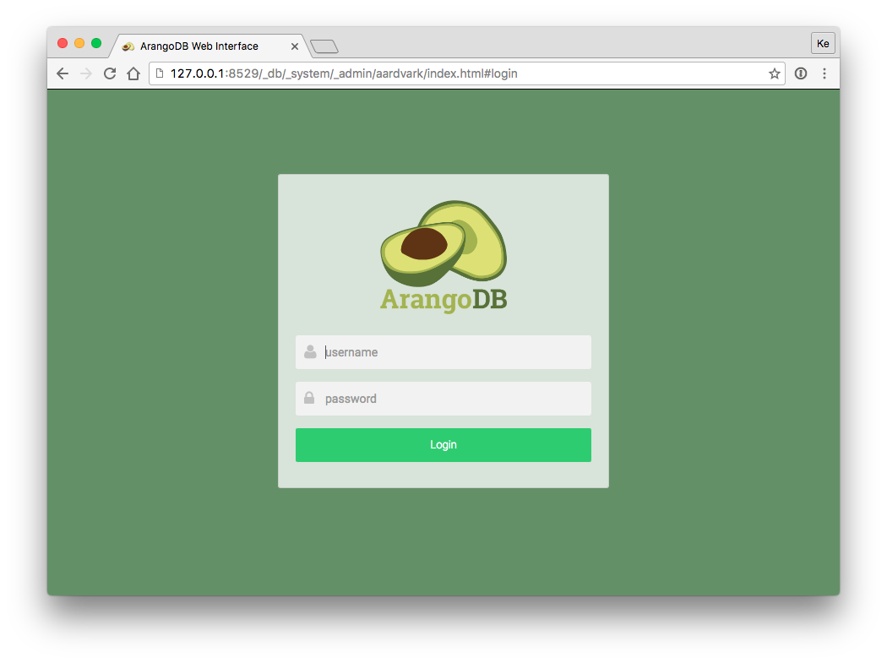
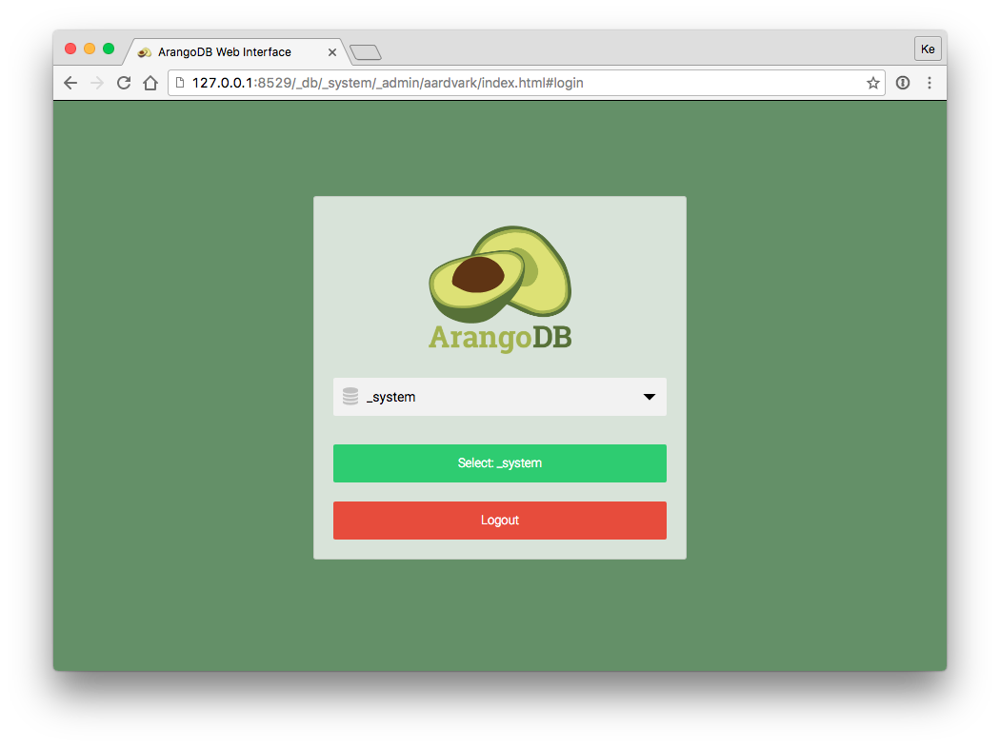
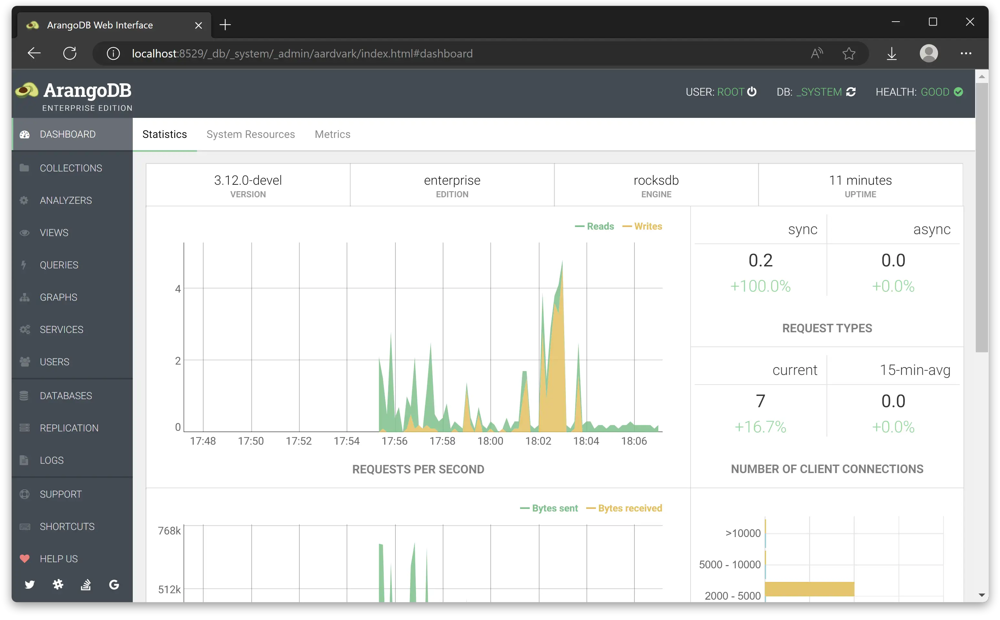


<!-- TODO: title? distinguish between local and on-premises server deployments? -->

## Installation

Head to [arangodb.com/download](https://www.arangodb.com/download/),
select your operating system and download ArangoDB. You may also follow
the instructions on how to install with a package manager, if available.

If you installed a binary package under Linux, the server is
automatically started.

If you installed ArangoDB under Windows as a service, the server is
automatically started. Otherwise, run the `arangod.exe` located in the
installation folder's `bin` directory. You may have to run it as administrator
to grant it write permissions to `C:\Program Files`.

For more in-depth information on how to install ArangoDB, as well as available
startup parameters, installation in a cluster and so on, see
[Installation](../operations/installation/_index.md) and
[Deployment](../deploy/deployment/_index.md).

<!--
The web interface will become available shortly after you started `arangod`.

By default, authentication is enabled. The default user is `root`.
Depending on the installation method used, the installation process either
prompted for the root password or the default root password is empty
(see [Securing the installation](.#securing-the-installation)).



Next you will be asked which database to use. Every server instance comes with
a `_system` database. Select this database to continue.



You should then be presented the dashboard with server statistics like this:



For a more detailed description of the interface, see [Web Interface](../components/web-interface/_index.md).
-->

## Securing the Installation

The default installation contains one database `_system` and a user
named `root`.

Debian-based packages and the Windows installer ask for a
password during the installation process. Red-Hat based packages
set a random password. For all other installation packages, you need to
execute the following:

```
shell> arango-secure-installation
```

This commands asks for a root password and sets it.


The password that is set for the root user during the installation of the ArangoDB
package has **no effect** in case of deployments done with the _ArangoDB Starter_.
See [Securing Starter Deployments](../operations/security/securing-starter-deployments.md) instead.


<!-- NOT ON-PREMISES SPECIFIC!
Authentication

ArangoDB allows to restrict access to databases to certain users. All
users of the system database are considered administrators. During
installation a default user *root* is created, which has access to
all databases.

You should create a database for your application together with a
user that has access rights to this database. See
[Managing Users](../operations/administration/user-management/_index.md).

Use the *arangosh* to create a new database and user.

```js
arangosh> db._createDatabase("example");
arangosh> var users = require("@arangodb/users");
arangosh> users.save("root@example", "password");
arangosh> users.grantDatabase("root@example", "example");
```

You can now connect to the new database using the user
*root@example*.

```
shell> arangosh --server.username "root@example" --server.database example
```
-->
