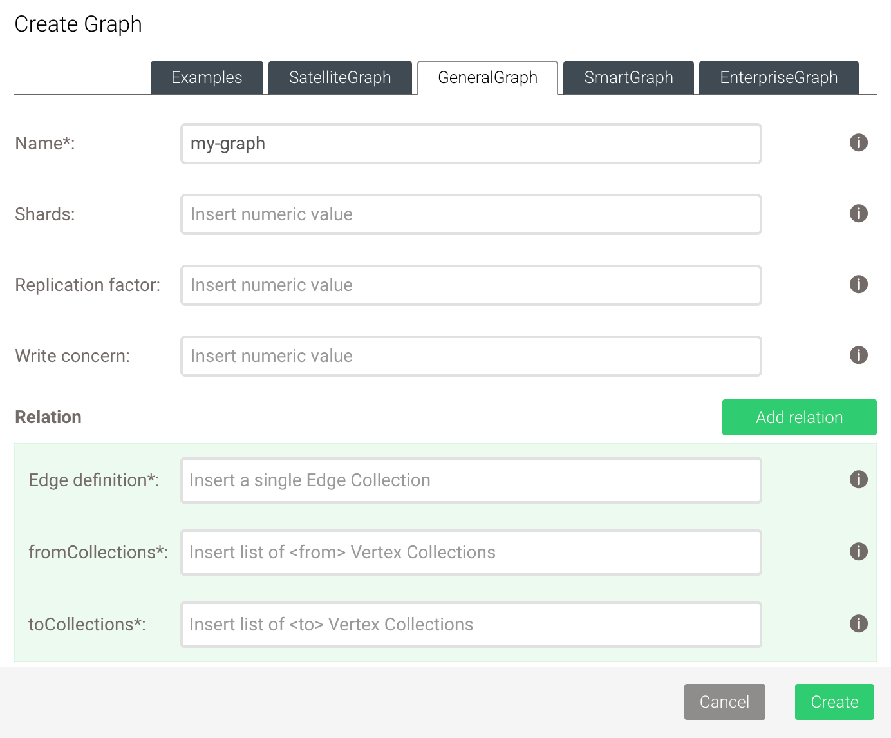

This chapter describes the [general-graph](../_index.md) module.
It allows you to define a graph that is spread across several edge and document
collections.
This allows you to structure your models in line with your domain and group
them logically in collections giving you the power to query them in the same
graph queries.
There is no need to include the referenced collections within the query, this
module will handle it for you.

New to ArangoDB? Take the free
[ArangoDB Graph Course](https://www.arangodb.com/arangodb-graph-course)
for freshers.

## Getting started

### Create a General Graph using the web interface

The web interface (also called Web UI) allows you to easily create and manage
General Graphs. To get started, follow the steps outlined below.

1. In the web interface, navigate to the **GRAPHS** section.
2. To add a new graph, click **Add Graph**.
3. In the **Create Graph** dialog that appears, select the
   **GeneralGraph** tab.
4. Fill in the following fields:
   - For **Name**, enter a name for the General Graph.
   - For **Shards**, enter the number of parts to split the graph into.
   - For **Replication factor**, enter the total number of
     desired copies of the data in the cluster.
   - For **Write concern**, enter the total number of copies
     of the data in the cluster required for each write operation.
5. Define the relation(s) on the General Graph:     
   - For **Edge definition**, insert a single non-existent name to define
     the relation of the graph. This automatically creates a new edge
     collection, which is displayed in the **COLLECTIONS** section of the
     left sidebar menu.
     
     To define multiple relations, press the **Add relation** button.
     To remove a relation, press the **Remove relation** button.
     
   - For **fromCollections**, insert a list of vertex collections
     that contain the start vertices of the relation.
   - For **toCollections**, insert a list of vertex collections that
     contain the end vertices of the relation.
6. If you want to use vertex collections that are part of the graph
   but not used in any edge definition, you can insert them via
   **Orphan collections**.
7. Click **Create**. 
8. Click the card of the newly created graph and use the functions of the Graph
   Viewer to visually interact with the graph and manage the graph data.

   

### Create a General Graph using *arangosh*

**Create a graph**

```js
---
name: generalGraphCreateGraphHowTo1
description: ''
---
var graph_module = require("@arangodb/general-graph");
var graph = graph_module._create("myGraph");
graph;
~graph_module._drop("myGraph", true);
```

**Add some vertex collections**

```js
---
name: generalGraphCreateGraphHowTo2
description: ''
---
~var graph_module = require("@arangodb/general-graph");
~var graph = graph_module._create("myGraph");
graph._addVertexCollection("shop");
graph._addVertexCollection("customer");
graph._addVertexCollection("pet");
graph = graph_module._graph("myGraph");
~graph_module._drop("myGraph", true);
```

**Define relations on the Graph**

```js
---
name: generalGraphCreateGraphHowTo3
description: ''
---
~var graph_module = require("@arangodb/general-graph");
~var graph = graph_module._create("myGraph");
~graph._addVertexCollection("pet");
var rel = graph_module._relation("isCustomer", ["shop"], ["customer"]);
graph._extendEdgeDefinitions(rel);
graph = graph_module._graph("myGraph");
~graph_module._drop("myGraph", true);
```
