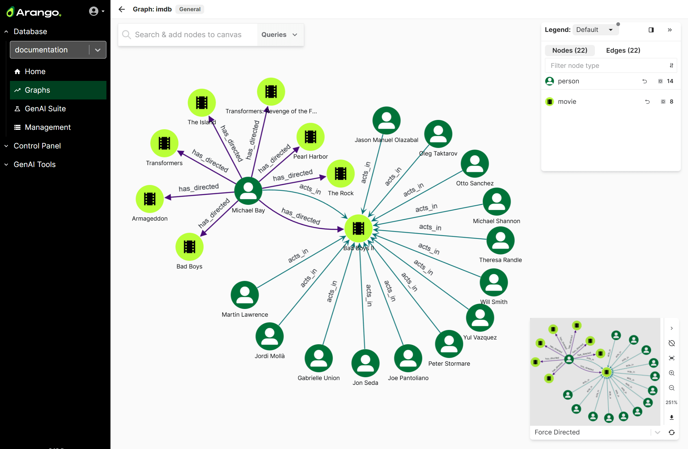
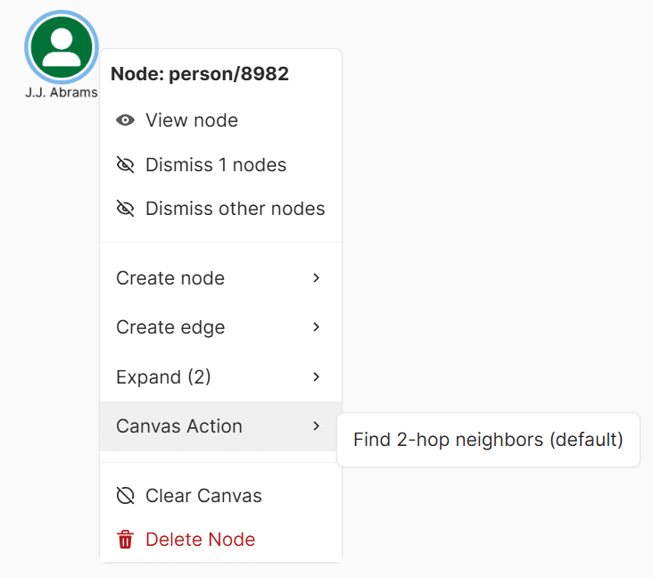
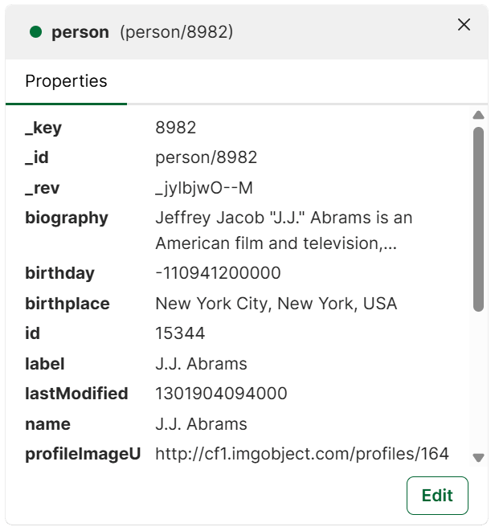




The ArangoDB Platform & GenAI Suite is available as a pre-release. To get
exclusive early access, [get in touch](https://arangodb.com/contact/) with
the ArangoDB team.


The **Graph Visualizer** is a browser-based tool integrated into the web interface
of the ArangoDB Platform. It lets you explore the connections of your named graphs
to visually understand the structure as well as to inspect and edit the attributes
of individual nodes and edges. It also offers query capabilities and you can
create new nodes (vertices) and edges (relations).




Graph creation is **not** performed within the Graph Visualizer. Graphs must be
created in the **Management** section under **Graphs** of the second-level
navigation in the [web interface](../components/web-interface/graphs.md). Once
created, you can select a graph from the list for exploration and visualization.


You can use the Graph Visualizer to do the following:

- Filter and view specific nodes to focus on a subset of your graph.
- Dynamically expand nodes to show more of their neighborhood to see how
  entities are connected.
- Inspect the properties of nodes and edges.
- Modify existing or create new nodes and edges.
- Rearrange nodes automatically or manually for better visual clarity.
- Use zoom and pan to explore large graphs more easily.

## View a graph

The core function of the Graph Visualizer is to provide an intuitive canvas for
exploring graph structures. You can visualize any type of **named graph**
(General Graphs, SmartGraphs, EnterpriseGraphs, SatelliteGraphs).


Anonymous graphs using adhoc sets of document and edge collections are not
supported by the Graph Visualizer.


### Select and load a graph

1. In the ArangoDB Platform web interface, select the database your named graph
   is stored in.
2. Click **Graphs** in the main navigation.
3. Select a graph from the list.
4. The viewport of the Graph Visualizer opens for exploring the graph.

The main area of the viewport may initially be empty in the following cases:

- You opened a graph for the first time and nothing is selected for displaying yet
- You used the **Clear Canvas** option
<!-- TODO: Doesn't it preserve the last state? Can it be lost?
- Reopening the Graph Visualizer after a previous session
-->

You can [Add nodes to the canvas manually](#add-nodes-to-the-canvas-manually)
as well as [Add nodes and edges using a query](#add-nodes-and-edges-using-a-query).
Afterwards, you can also [Add nodes and edges using a query based on a selection](#add-nodes-and-edges-using-a-query-based-on-a-selection)
as well as [Remove nodes from the canvas](#remove-nodes-from-the-canvas).

### The viewport

The Graph Visualizer interface is comprised of the following components:

- **Top bar**: The name and type of the graph, as well as a button to get
  back to the list of named graphs.
- **Canvas**: The main area of the viewport.
- **Search & add nodes to canvas** and **Queries**:
  A widget in the top left corner that opens dialogs for selecting nodes and
  edges to display (manually or using queries).
- [**Customization**](#visual-customization):
  A sidebar on the right-hand side to adjust the styling.
- [**Layout and Navigation**](#layouts-and-navigation-tools):
  A minimap and multiple tools for the canvas in the bottom right corner.

### Add nodes to the canvas manually

You can add individual nodes to the canvas in addition to what is already
displayed.

1. Click **Search & add nodes to canvas**.
2. Select a **Node type**. This is the name of the collection that stores the
   node you want to select.
3. Enter a value into the **Search** field. This searches common attributes
   as indicated by the placeholder text and finds up to 10 nodes that contain
   this text in one of these attributes (case-insensitive).
4. Select one or more nodes from the list on the left-hand side.
5. Optional: You can check the attributes of the selected nodes on the
   right-hand side. Use the buttons at the bottom to switch between nodes.
6. Click **Add _n_ vertices**.
7. To see the neighbor nodes and the edges that connect them, right-click a node,
   click **Expand (_n_)** and then **All (_n_)**.


### Add nodes and edges using a query

You can run an AQL query to add a nodes, edges, or paths of the graph to the canvas.

1. Click **Queries** of the top-left widget.
2. Click **New query**.
3. Enter an AQL query that returns nodes, edges, or paths
   (e.g. a graph traversal query), for example:
   ```aql
   FOR node IN coll LIMIT 10 RETURN node  // [ { "_id": "..." }, ... ]
   ```
   ```aql
   FOR edge IN edgeColl FILTER edge.value > 10 RETURN edge  // [ { "_from": "...", "_to": "...", "_id": "..." }, ... ]
   ```
   ```aql
   FOR v, e, p IN 1..3 ANY "coll/753" GRAPH "myGraph" RETURN p  // [ { "vertices": [...], "edges": [...] }, ... ]
   ```
4. Click **Run query**. Depending on what the query returns, either only nodes
   or edges with their nodes appear on the canvas, in addition to what is
   already displayed.


You can save queries for future use: 

1. Click **Queries** of the top-left widget.
2. Click **New query**.
3. Enter or edit the AQL query you want to save. You can optionally use
   bind variables to parameterize saved queries.
4. Enter a name and optionally a description, then click **Save**.
5. To run a saved query, click **Queries** of the top-left widget.
6. Select a query from the list. The following actions are available for each query:
  -  Copy the query string to the clipboard.
  - **Bind Variables** to set for the query.
  -  Edit the query.
  -  Delete a no longer needed query.
  -  Run the query.



### Add nodes and edges using a query based on a selection

You can select nodes and edges on the canvas and then use a **Canvas Action**.
This runs an AQL query to add nodes, edges, or paths of the graph to the canvas.
The query has access to the current selection via special bind variables.

1. Create a selection. You have different options:
   - Click a node or edge to select only this element.
   - Hold the  or  key and click multiple nodes and edges.
   - Hold the  or  key and drag the mouse to perform a box selection.
2. Right-click the canvas, click **Canvas Action**, and select a saved action.
3. Depending on the query, additional nodes or edges with their nodes are added
   to the canvas.
4. To create a custom Canvas Action query, click **Queries** of the top-left widget.
5. Click **Canvas Actions**, then **New action**.
6. Enter an AQL query that makes use of the special bind variable `@nodes`,
   `@edges`, or both and returns nodes, edges, or paths. Examples:
   ```aql
   FOR selectedNode IN @nodes
     FOR v, e, p IN 1..3 ANY selectedNode GRAPH "myGraph"
     FILTER p.edges[*].value ALL < 7
     LIMIT 20
     RETURN p
   ```
7. Enter a name and optionally a description for the action and click **Save**.



### Remove nodes from the canvas

You can dismiss nodes to show less nodes and edges on the canvas to focus on the
relevant parts of the graph at a given time. This only changes what is displayed
on the canvas. It doesn't delete the underlying documents and you can add the
dismissed nodes and their edges back to the canvas later on.

1. Decide which nodes you want to either dismiss or keep. You can select nodes
   in different ways:
   - Right-click a single node to select only this node.
   - Hold the  or  key and click multiple nodes or drag the
     mouse to perform a box selection, then right-click one of the selected nodes.
2. In the context menu, click **Dismiss _n_ nodes** to hide the selected nodes,
   or click **Dismiss other nodes** to only keep the selection.
3. The canvas updates to only display the remaining nodes, with no dangling edges.

### View node and edge properties

You can inspect the document attributes of node or edge as follows:

- Double-click a node or edge to open a dialog with the properties.
- Right-click a node to open the context menu and click **View Node** to open
  the dialog with the properties.



### Layouts and navigation tools

These features allow you to clear, zoom, and pan the canvas, as well as rearrange
the displayed graph data for a better spatial understanding of node clusters,
hierarchies, and relationship flows.

- **Minimap**: A small overview to easier navigate the canvas.

- **Zoom Controls**: Zoom in/out or reset the zoom to 100%.

- **Fit to Screen**: Resize and center the canvas so you can see everything.

- **Re-run Layout**: Automatically rearrange the nodes using the selected algorithm.

- **Layout Algorithms**: Choose between different ways of arranging the nodes.
  Which algorithm to use depends on the situation and the graph topology.

## Edit graph data

While the Graph Visualizer is primarily designed for exploring graph data, you
can also create and modify nodes and edges directly from the canvas.

You need to have write access for the database and the collections for this.

### Create new nodes

You can add nodes to the graph's document collections directly from the
canvas. This allows you to create additional entities to the graph.

1. In the **Graphs** section of the ArangoDB web interface, select your graph.
2. Right-click on the canvas and choose **Create Node**.
3. A dialog opens with the following options:
   - Select the target collection (**Node Type**).
   - Optionally specify a unique identifier (**Node ID**).
4. Click **Create** to add the node to the canvas and database.

### Create New Edges

You can add edges to the graph's edge collections directly from the canvas.
This allows you to create additional connections between nodes.

1. In the **Graphs** section of the ArangoDB web interface, select your graph.
2. Right-click on the canvas and choose **Create Edge**.
3. In the dialog:
   - Select the target collection (**Edge Type**, which corresponds to an edge collection).
   - Set the `_from` and `_to` fields by selecting the source and target nodes.
   - Optionally specify a unique identifier (**Edge ID**).
4. Click **Create** to add the edge to the canvas and database.


If you select two nodes before right-clicking to open the edge creation
dialog, the `_from` and `_to` fields are automatically pre-filled.
You may need to swap the IDs as the order is not based on your selection sequence.



### Edit node and edge properties

You can modify the document attributes of nodes and edges from the canvas as follows:

1. Double-click a node or edge.
2. In the properties dialog that opens, click **Edit**.
3. Change the properties and click **Save**. <!-- TODO: Can't change system attributes, even though _from and _to are generally mutable -->

### Delete nodes

You can delete individual nodes which deletes the corresponding document.

1. Right-click a node to open the context menu.
2. Click **Delete Node**.
3. Any edges connected to this node are deleted by default to ensure graph
   consistency. To keep the edges, untick **Delete connected edge(s)**.
4. Confirm the deletion by clicking **Delete**.

### Delete edges

1. Right-click an edge to open the context menu.
2. Click **Delete Edge**.
3. Confirm the deletion by clicking **Delete**.

## Visual customization

You can adjust how the graph data is displayed, like the color, opacity, and
labels. All styling changes are visual-only and do not affect the underlying data.

1. Optional: Reset to default styling if desired.
2. Click the _palette_ icon in the top right to open the **Customization** panel
   if it's closed.
3. Adjust the styling for nodes or edges:
   - Select a **Label Attribute** to display a custom top-level field
     (e.g. `name` or `type`) instead of `_id`.
   - Assign a specific **Color** to highlight and distinguish elements.
   - Adjust how transparent elements are with the **Opacity**.
   - Set the **Line Thickness** (edges only).
   - Choose different **Arrowhead Styles** (edges only).
4. You can also do the following:
   - Clear the styling modifications.
   - See the number of nodes respectively edges on the canvas (by collection).


