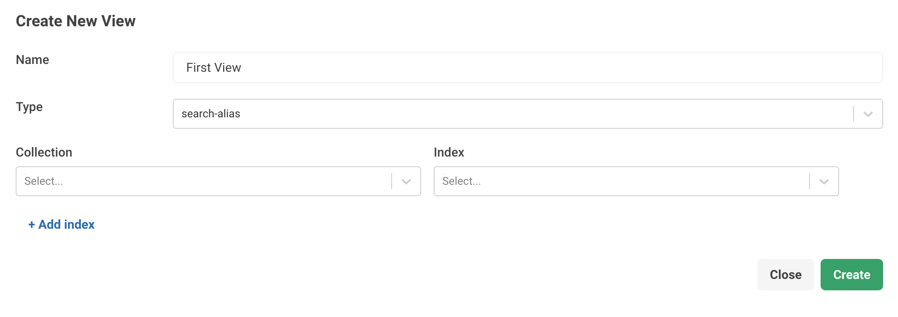

`search-alias` Views let you add one or more inverted indexes to a View, enabling
federate searching, sorting search results by relevance, and search highlighting, on top of
sophisticated information retrieval capabilities such as full-text search for
unstructured or semi-structured data provided by the inverted indexes that they
are comprised of.

## How to use `search-alias` Views

You need to create one or more [inverted indexes](../indexing/working-with-indexes/persistent-indexes.md).
All settings about how data shall be indexed are part of the inverted index
definition. You can then create a `search-alias` View and add inverted indexes
to it. You can also create the View first and later create and add the inverted
indexes to it.

Some of the inverted index settings only apply if they are used in a
`search-alias` View, whereas others equally apply whether you use an inverted
index standalone or as part of a View.

Inverted indexes can be managed as follows:
- in the web interface, in the **COLLECTIONS** section, in the **Indexes** tab
  of a collection
- via the [Indexes HTTP API](../../develop/http-api/indexes/inverted.md)
- through the [JavaScript API](../indexing/working-with-indexes/_index.md#creating-an-index)
  with `<collection>.ensureIndex()`

Views can be managed as follows:
- in the web interface, in the **VIEWS** section
- via the [Views HTTP API](../../develop/http-api/views/_index.md)
- through the [JavaScript API](../../develop/javascript-api/@arangodb/db-object.md#views)

Once you set up a View, you can query it via AQL with the
[`SEARCH` operation](../../aql/high-level-operations/search.md).

See [Information Retrieval with ArangoSearch](_index.md) for an
introduction to Views and how to search them.

## Create `search-alias` Views using the web interface

You can create and manage a `search-alias` View through the web interface.
To get started, follow the steps outlined below.

1. In the web interface, go to the left sidebar menu and select
   the **VIEWS** entry.
2. To add a new View, click **Add View**.
3. Fill in the required fields:
   - For **Name**, enter a name for the View.
   - For **Type**, select `search-alias` from the dropdown menu.
4. Select an existing collection from the dropdown menu. You can also add it
   later via the Views editor.
5. Select an existing inverted index of the collection that you previously
   selected. You can also add it later via the Views editor.
6. To define multiple indexes, click the **Add index** button.
7. Click **Create**.    



## Create `search-alias` Views using the JavaScript API

The following example shows how you can create a `search-alias` View in _arangosh_:

```js
---
name: viewSearchAliasCreate
description: ''
---
var coll = db._create("books");
var idx = coll.ensureIndex({ type: "inverted", name: "inv-idx", fields: [ { name: "title", analyzer: "text_en" } ] });
db._createView("products", "search-alias", { indexes: [
  { collection: "books", index: "inv-idx" }
] });
~db._dropView("products");
~db._drop(coll.name());
```

## View Definition

A `search-alias` View is configured via an object containing a set of
View-specific configuration directives, allowing you to add inverted indexes:

- **name** (string, _immutable_): the View name
- **type** (string, _immutable_): the value `"search-alias"`
- **indexes** (array, _optional_): a list of inverted indexes for the View.
  Default: `[]`
  - **collection** (string, _required_): the name of a collection
  - **index** (string, _required_): the name of an inverted index of the
    `collection`, or the index ID without the `<collection>/` prefix

## View Modification

You can add or remove inverted indexes from the View definition:

- **indexes** (array, _optional_): a list of inverted indexes to add to or
  remove from the View. Default: `[]`
  - **collection** (string, _required_): the name of a collection
  - **index** (string, _required_): the name of an inverted index of the
    `collection`, or the index ID without the `<collection>/` prefix
  - **operation** (string, _optional_): whether to add or remove the index to
    the stored `indexes` property of the View. Possible values: `"add"`, `"del"`.
    The default is `"add"`
