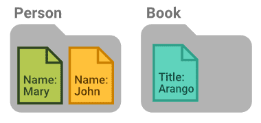

ArangoDB combines the analytical power of native graphs with an integrated
search engine, JSON support, and a variety of data access patterns via a single,
composable query language.

ArangoDB is available in a community and a commercial [edition](features/_index.md).
You can use it for on-premises deployments, as well as a fully managed
cloud service, the [ArangoGraph Insights Platform](../arangograph/_index.md).

## What are Graphs?

Graphs are information networks comprised of nodes and edges.


A social network is a common example of a graph. People are represented by nodes
and their friendships by relations.


Nodes are also called vertices (singular: vertex), and edges are relations that
connect nodes.
A node typically represents a specific entity (a person, a book, a sensor
reading, etc.) and an edge defines how one entity relates to another.


This paradigm of storing data feels natural because it closely matches the
cognitive model of humans. It is an expressive data model that allows you to
represent many problem domains and solve them with semantic queries and graph
analytics.

## Beyond Graphs

Not everything is a graph use case. ArangoDB lets you equally work with
structured, semi-structured, and unstructured data in the form of schema-free
JSON objects, without having to connect these objects to form a graph.



Depending on your needs, you may mix graphs and unconnected data.
ArangoDB is designed from the ground up to support multiple data models with a
single, composable query language.

```aql
FOR book IN Books
  FILTER book.title == "Arango"
  FOR person IN 2..2 INBOUND book transferred, OUTBOUND knows
    RETURN person.name
```

ArangoDB also comes with an integrated search engine for information retrieval,
such as full-text search with relevance ranking.

ArangoDB is written in C++ for high performance and built to work at scale, in
the cloud or on-premises.

<!-- deployment options, move from features page, on-prem vs cloud? -->
