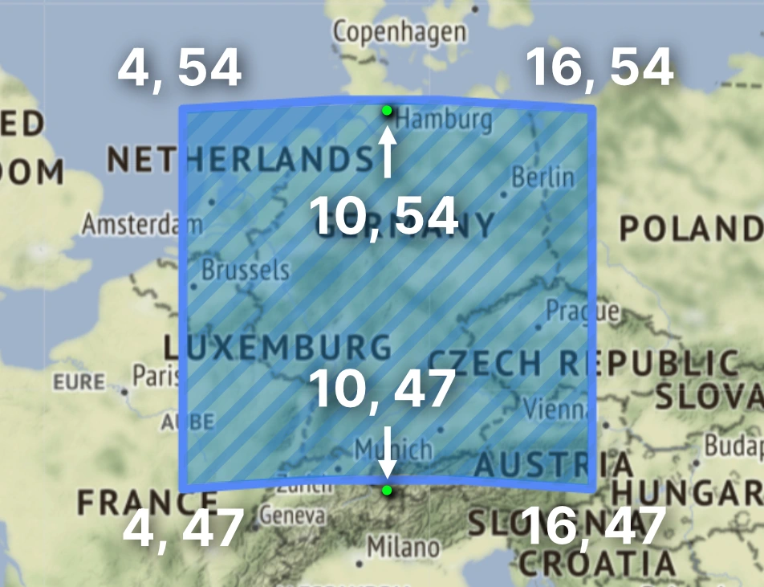
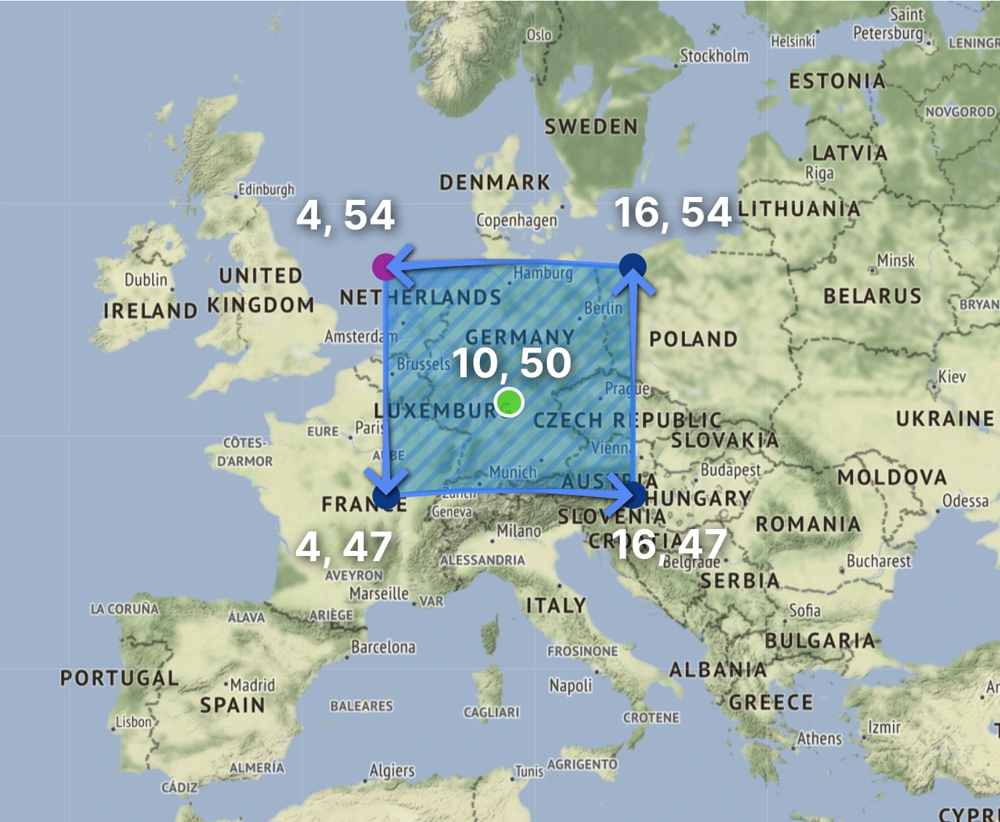
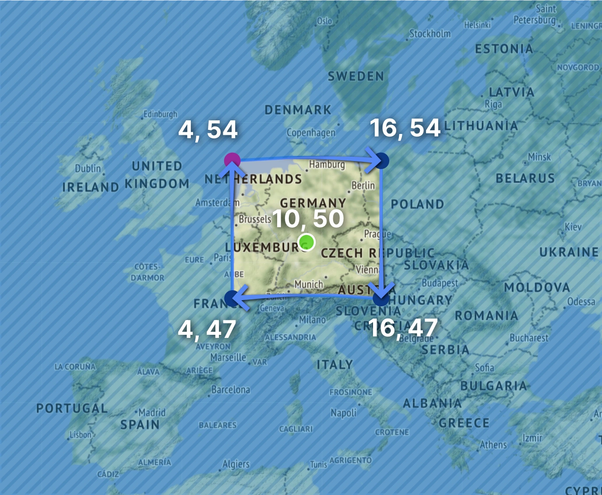

## Geo-spatial data representations

You can model geo-spatial information in different ways using the data types
available in ArangoDB. The recommended way is to use objects with **GeoJSON**
geometry but you can also use **longitude and latitude coordinate pairs**
for points. Both models are supported by
[Geo-Spatial Indexes](../../index-and-search/indexing/working-with-indexes/geo-spatial-indexes.md).

### Coordinate pairs

Longitude and latitude coordinates are numeric values and can be stored in the
following ways:

- Coordinates using an array with two numbers in `[longitude, latitude]` order,
  for example, in a user-chosen attribute called `location`:

  ```json
  {
    "location": [ -73.983, 40.764 ]
  }
  ```

- Coordinates using an array with two numbers in `[latitude, longitude]` order,
  for example, in a user-chosen attribute called `location`:

  ```json
  {
    "location": [ 40.764, -73.983 ]
  }
  ```

- Coordinates using two separate numeric attributes, for example, in two
  user-chosen attributes called `lat` and `lng` as sub-attributes of a `location`
  attribute:

  ```json
  {
    "location": {
      "lat": 40.764,
      "lng": -73.983
    }
  }
  ```

### GeoJSON

GeoJSON is a geospatial data format based on JSON. It defines several different
types of JSON objects and the way in which they can be combined to represent
data about geographic shapes on the Earth surface.

Example of a document with a GeoJSON Point stored in a user-chosen attribute
called `location` (with coordinates in `[longitude, latitude]` order):

```json
{
  "location": {
    "type": "Point",
    "coordinates": [ -73.983, 40.764 ]
  }
}
```

GeoJSON uses a geographic coordinate reference system,
World Geodetic System 1984 (WGS 84), and units of decimal degrees.

Internally, ArangoDB maps all coordinate pairs onto a unit sphere. Distances are
projected onto a sphere with the Earth's *Volumetric mean radius* of
*6371 km*. ArangoDB implements a useful subset of the GeoJSON format
[(RFC 7946)](https://tools.ietf.org/html/rfc7946).
Feature Objects and the GeometryCollection type are not supported.
Supported geometry object types are:

- Point
- MultiPoint
- LineString
- MultiLineString
- Polygon
- MultiPolygon

#### Point

A [GeoJSON Point](https://tools.ietf.org/html/rfc7946#section-3.1.2) is a
[position](https://tools.ietf.org/html/rfc7946#section-3.1.1) comprised of
a longitude and a latitude:

```json
{
  "type": "Point",
  "coordinates": [100.0, 0.0]
}
```

GeoJSON Points can optionally have a third coordinate for the elevation, but
ArangoDB doesn't use it in calculations:

```json
{
  "location": {
    "type": "Point",
    "coordinates": [ 100.0, 0.0, 43.0 ]
  }
}
```

#### MultiPoint

A [GeoJSON MultiPoint](https://tools.ietf.org/html/rfc7946#section-3.1.7) is
an array of positions:

```json
{
  "type": "MultiPoint",
  "coordinates": [
    [100.0, 0.0],
    [101.0, 1.0]
  ]
}
```

#### LineString

A [GeoJSON LineString](https://tools.ietf.org/html/rfc7946#section-3.1.4) is
an array of two or more positions:

```json
{
  "type": "LineString",
  "coordinates": [
    [100.0, 0.0],
    [101.0, 1.0]
  ]
}
```

#### MultiLineString

A [GeoJSON MultiLineString](https://tools.ietf.org/html/rfc7946#section-3.1.5) is
an array of LineString coordinate arrays:

```json
{
  "type": "MultiLineString",
  "coordinates": [
    [
      [100.0, 0.0],
      [101.0, 1.0]
    ],
    [
      [102.0, 2.0],
      [103.0, 3.0]
    ]
  ]
}
```

#### Polygon

A [GeoJSON Polygon](https://tools.ietf.org/html/rfc7946#section-3.1.6) consists
of a series of closed `LineString` objects (ring-like). These *Linear Ring*
objects consist of four or more coordinate pairs with the first and last
coordinate pair being equal. Coordinate pairs of a Polygon are an array of
linear ring coordinate arrays. The first element in the array represents
the exterior ring. Any subsequent elements represent interior rings
(holes within the surface).

The orientation of the first linear ring is crucial: the right-hand-rule
is applied, so that the area to the left of the path of the linear ring
(when walking on the surface of the Earth) is considered to be the
"interior" of the polygon. All other linear rings must be contained
within this interior. According to the GeoJSON standard, the subsequent
linear rings must be oriented following the right-hand-rule, too,
that is, they must run **clockwise** around the hole (viewed from
above). However, ArangoDB is tolerant here (as suggested by the
[GeoJSON standard](https://datatracker.ietf.org/doc/html/rfc7946#section-3.1.6)),
all but the first linear ring are inverted if the orientation is wrong.

In the end, a point is considered to be in the interior of the polygon,
if and only if one has to cross an odd number of linear rings to reach the
exterior of the polygon prescribed by the first linear ring.

A number of additional rules apply (and are enforced by the GeoJSON
parser):

- A polygon must contain at least one linear ring, i.e., it must not be
  empty.
- A linear ring may not be empty, it needs at least three _distinct_
  coordinate pairs, that is, at least 4 coordinate pairs (since the first and
  last must be the same).
- No two edges of linear rings in the polygon must intersect, in
  particular, no linear ring may be self-intersecting.
- Within the same linear ring, consecutive coordinate pairs may be the same,
  otherwise all coordinate pairs need to be distinct (except the first and last one).
- Linear rings of a polygon must not share edges, but they may share coordinate pairs.
- A linear ring defines two regions on the sphere. ArangoDB always
  interprets the region that lies to the left of the boundary ring (in
  the direction of its travel on the surface of the Earth) as the
  interior of the ring. This is in contrast to earlier versions of
  ArangoDB before 3.10, which always took the **smaller** of the two
  regions as the interior. Therefore, from 3.10 on one can now have
  polygons whose outer ring encloses more than half the Earth's surface.
- The interior rings must be contained in the (interior) of the outer ring.
- Interior rings should follow the above rule for orientation
  (counterclockwise external rings, clockwise internal rings, interior
  always to the left of the line).

Here is an example with no holes:

```json
{
  "type": "Polygon",
    "coordinates": [
    [
      [100.0, 0.0],
      [101.0, 0.0],
      [101.0, 1.0],
      [100.0, 1.0],
      [100.0, 0.0]
    ]
  ]
}
```

Here is an example with a hole:

```json
{
  "type": "Polygon",
  "coordinates": [
    [
      [100.0, 0.0],
      [101.0, 0.0],
      [101.0, 1.0],
      [100.0, 1.0],
      [100.0, 0.0]
    ],
    [
      [100.8, 0.8],
      [100.8, 0.2],
      [100.2, 0.2],
      [100.2, 0.8],
      [100.8, 0.8]
    ]
  ]
}
```

#### MultiPolygon

A [GeoJSON MultiPolygon](https://tools.ietf.org/html/rfc7946#section-3.1.6) consists
of multiple polygons. The "coordinates" member is an array of
_Polygon_ coordinate arrays. See [above](#polygon) for the rules and
the meaning of polygons.

If the polygons in a MultiPolygon are disjoint, then a point is in the
interior of the MultiPolygon if and only if it is
contained in one of the polygons. If some polygon P2 in a MultiPolygon
is contained in another polygon P1, then P2 is treated like a hole
in P1 and containment of points is defined with the even-odd-crossings rule
(see [Polygon](#polygon)).

Additionally, the following rules apply and are enforced for
MultiPolygons:

- No two edges in the linear rings of the polygons of a MultiPolygon
  may intersect.
- Polygons in the same MultiPolygon may not share edges, but they may share
  coordinate pairs.

Example with two polygons, the second one with a hole:

```json
{
    "type": "MultiPolygon",
    "coordinates": [
        [
            [
                [102.0, 2.0],
                [103.0, 2.0],
                [103.0, 3.0],
                [102.0, 3.0],
                [102.0, 2.0]
            ]
        ],
        [
            [
                [100.0, 0.0],
                [101.0, 0.0],
                [101.0, 1.0],
                [100.0, 1.0],
                [100.0, 0.0]
            ],
            [
                [100.2, 0.2],
                [100.2, 0.8],
                [100.8, 0.8],
                [100.8, 0.2],
                [100.2, 0.2]
            ]
        ]
    ]
}
```

## GeoJSON interpretation

Note the following technical detail about GeoJSON: The
[GeoJSON standard, Section 3.1.1 Position](https://datatracker.ietf.org/doc/html/rfc7946#section-3.1.1)
prescribes that lines are **cartesian lines in cylindrical coordinates**
(longitude/latitude). However, this definition is inconvenient in practice,
since such lines are not geodesic on the surface of the Earth.
Furthermore, the best available algorithms for geospatial computations on Earth
typically use geodesic lines as the boundaries of polygons on Earth.

Therefore, ArangoDB uses the **syntax of the GeoJSON** standard,
but then interprets lines (and boundaries of polygons) as
**geodesic lines (pieces of great circles) on Earth**. This is a
violation of the GeoJSON standard, but serving a practical purpose.

Note in particular that this can sometimes lead to unexpected results.
Consider the following polygon (remember that GeoJSON has
**longitude before latitude** in coordinate pairs):

```json
{ "type": "Polygon", "coordinates": [[
  [4, 54], [4, 47], [16, 47], [16, 54], [4, 54]
]] }
```



It does not contain the point `[10, 47]` since the shortest path (geodesic)
from `[4, 47]` to `[16, 47]` lies North relative to the parallel of latitude at
47 degrees. On the contrary, the polygon does contain the point `[10, 54]` as it
lies South of the parallel of latitude at 54 degrees.


ArangoDB version before 3.10 did an inconsistent special detection of "rectangle"
polygons that later versions from 3.10 onward no longer do, see
[Legacy Polygons](../../index-and-search/indexing/working-with-indexes/geo-spatial-indexes.md#legacy-polygons).


Furthermore, there is an issue with the interpretation of linear rings
(boundaries of polygons) according to
[GeoJSON standard, Section 3.1.6 Polygon](https://datatracker.ietf.org/doc/html/rfc7946#section-3.1.6).
This section states explicitly:

> A linear ring MUST follow the right-hand rule with respect to the
> area it bounds, i.e., exterior rings are counter-clockwise, and
> holes are clockwise.

This rather misleading phrase means that when a linear ring is used as
the boundary of a polygon, the "interior" of the polygon lies **to the left**
of the boundary when one travels on the surface of the Earth and
along the linear ring. For
example, the polygon below travels **counter-clockwise** around the point
`[10, 50]`, and thus the interior of the polygon contains this point and
its surroundings, but not, for example, the North Pole and the South
Pole.

```json
{ "type": "Polygon", "coordinates": [[
  [4, 54], [4, 47], [16, 47], [16, 54], [4, 54]
]] }
```



On the other hand, the following polygon travels **clockwise** around the point
`[10, 50]`, and thus its "interior" does not contain `[10, 50]`, but does
contain the North Pole and the South Pole:

```json
{ "type": "Polygon", "coordinates": [[
  [4, 54], [16, 54], [16, 47], [4, 47], [4, 54]
]] }
```



Remember that the "interior" is to the left of the given
linear ring, so this second polygon is basically the complement on Earth
of the previous polygon!

ArangoDB versions before 3.10 did not follow this rule and always took the
"smaller" connected component of the surface as the "interior" of the polygon.
This made it impossible to specify polygons which covered more than half of the
sphere. From version 3.10 onward, ArangoDB recognizes this correctly.
See [Legacy Polygons](../../index-and-search/indexing/working-with-indexes/geo-spatial-indexes.md#legacy-polygons)
for how to deal with this issue.

## Geo utility functions

The following helper functions **can** use geo indexes, but do not have to in
all cases. You can use all of these functions in combination with each other,
and if you have configured a geo index it may be utilized,
see [Geo Indexing](../../index-and-search/indexing/working-with-indexes/geo-spatial-indexes.md).

### DISTANCE()

`DISTANCE(latitude1, longitude1, latitude2, longitude2) → distance`

Calculate the distance between two arbitrary points in meters (as birds
would fly). The value is computed using the haversine formula, which is based
on a spherical Earth model. It's fast to compute and is accurate to around 0.3%,
which is sufficient for most use cases such as location-aware services.

- **latitude1** (number): the latitude of the first point
- **longitude1** (number): the longitude of the first point
- **latitude2** (number): the latitude of the second point
- **longitude2** (number): the longitude of the second point
- returns **distance** (number): the distance between both points in **meters**

```aql
// Distance from Brandenburg Gate (Berlin) to ArangoDB headquarters (Cologne)
DISTANCE(52.5163, 13.3777, 50.9322, 6.94) // 476918.89688380965 (~477km)

// Sort a small number of documents based on distance to Central Park (New York)
FOR doc IN coll // e.g. documents returned by a traversal
  SORT DISTANCE(doc.latitude, doc.longitude, 40.78, -73.97)
  RETURN doc
```

### GEO_CONTAINS()

`GEO_CONTAINS(geoJsonA, geoJsonB) → bool`

Checks whether the [GeoJSON object](#geojson) `geoJsonA`
fully contains `geoJsonB` (every point in B is also in A). The object `geoJsonA`
has to be of type _Polygon_ or _MultiPolygon_. For other types containment is
not well-defined because of numerical stability problems.

- **geoJsonA** (object): First GeoJSON object.
- **geoJsonB** (object): Second GeoJSON object, or a coordinate array in
  `[longitude, latitude]` order.
- returns **bool** (bool): `true` if every point in B is also contained in A,
  otherwise `false`.


ArangoDB follows and exposes the same behavior as the underlying
S2 geometry library. As stated in the S2 documentation:

> Point containment is defined such that if the sphere is subdivided
> into faces (loops), every point is contained by exactly one face.
> This implies that linear rings do not necessarily contain their vertices.

As a consequence, a linear ring or polygon does not necessarily contain its
boundary edges!


You can optimize queries that contain a `FILTER` expression of the following
form with an S2-based [geospatial index](../../index-and-search/indexing/working-with-indexes/geo-spatial-indexes.md):

```aql
FOR doc IN coll
  FILTER GEO_CONTAINS(geoJson, doc.geo)
  ...
```

In this example, you would create the index for the collection `coll`, on the
attribute `geo`. You need to set the `geoJson` index option to `true`.
The `geoJson` variable needs to evaluate to a valid GeoJSON object. Also note
the argument order: the stored document attribute `doc.geo` is passed as the
second argument. Passing it as the first argument, like
`FILTER GEO_CONTAINS(doc.geo, geoJson)` to test whether `doc.geo` contains
`geoJson`, cannot utilize the index.

### GEO_DISTANCE()

`GEO_DISTANCE(geoJsonA, geoJsonB, ellipsoid) → distance`

Return the distance between two GeoJSON objects in meters, measured from the
**centroid** of each shape. For a list of supported types see the
[geo index page](#geojson).

- **geoJsonA** (object): First GeoJSON object, or a coordinate array in
  `[longitude, latitude]` order.
- **geoJsonB** (object): Second GeoJSON object, or a coordinate array in
  `[longitude, latitude]` order.
- **ellipsoid** (string, *optional*): Reference ellipsoid to use.
  Supported are `"sphere"` (default) and `"wgs84"`.
- returns **distance** (number): The distance between the centroid points of
  the two objects on the reference ellipsoid in **meters**.

```aql
LET polygon = {
  type: "Polygon",
  coordinates: [[[-11.5, 23.5], [-10.5, 26.1], [-11.2, 27.1], [-11.5, 23.5]]]
}
FOR doc IN collectionName
  LET distance = GEO_DISTANCE(doc.geometry, polygon) // calculates the distance
  RETURN distance
```

You can optimize queries that contain a `FILTER` expression of the following
form with an S2-based [geospatial index](../../index-and-search/indexing/working-with-indexes/geo-spatial-indexes.md):

```aql
FOR doc IN coll
  FILTER GEO_DISTANCE(geoJson, doc.geo) <= limit
  ...
```

In this example, you would create the index for the collection `coll`, on the
attribute `geo`. You need to set the `geoJson` index option to `true`.
`geoJson` needs to evaluate to a valid GeoJSON object. `limit` must be a
distance in meters; it cannot be an expression. An upper bound with `<`,
a lower bound with `>` or `>=`, or both, are equally supported.

You can also optimize queries that use a `SORT` condition of the following form
with a geospatial index:

```aql
  SORT GEO_DISTANCE(geoJson, doc.geo)
```

The index covers returning matches from closest to furthest away, or vice versa.
You may combine such a `SORT` with a `FILTER` expression that utilizes the
geospatial index, too, via the [`GEO_DISTANCE()`](#geo_distance),
[`GEO_CONTAINS()`](#geo_contains), and [`GEO_INTERSECTS()`](#geo_intersects)
functions.

### GEO_AREA()

`GEO_AREA(geoJson, ellipsoid) → area`

Return the area for a [Polygon](#polygon) or [MultiPolygon](#multipolygon)
on a sphere with the average Earth radius, or an ellipsoid.

- **geoJson** (object): A GeoJSON object.
- **ellipsoid** (string, *optional*): Reference ellipsoid to use.
  Supported are `"sphere"` (default) and `"wgs84"`.
- returns **area** (number): The area of the polygon in **square meters**.

```aql
LET polygon = {
  type: "Polygon",
  coordinates: [[[-11.5, 23.5], [-10.5, 26.1], [-11.2, 27.1], [-11.5, 23.5]]]
}
RETURN GEO_AREA(polygon, "wgs84")
```

### GEO_EQUALS()

`GEO_EQUALS(geoJsonA, geoJsonB) → bool`

Checks whether two [GeoJSON objects](#geojson) are equal or not.

- **geoJsonA** (object): First GeoJSON object.
- **geoJsonB** (object): Second GeoJSON object.
- returns **bool** (bool): `true` if they are equal, otherwise `false`.

```aql
LET polygonA = GEO_POLYGON([
  [-11.5, 23.5], [-10.5, 26.1], [-11.2, 27.1], [-11.5, 23.5]
])
LET polygonB = GEO_POLYGON([
  [-11.5, 23.5], [-10.5, 26.1], [-11.2, 27.1], [-11.5, 23.5]
])
RETURN GEO_EQUALS(polygonA, polygonB) // true
```

```aql
LET polygonA = GEO_POLYGON([
  [-11.1, 24.0], [-10.5, 26.1], [-11.2, 27.1], [-11.1, 24.0]
])
LET polygonB = GEO_POLYGON([
  [-11.5, 23.5], [-10.5, 26.1], [-11.2, 27.1], [-11.5, 23.5]
])
RETURN GEO_EQUALS(polygonA, polygonB) // false
```

### GEO_INTERSECTS()

`GEO_INTERSECTS(geoJsonA, geoJsonB) → bool`

Checks whether the [GeoJSON object](#geojson) `geoJsonA`
intersects with `geoJsonB` (i.e. at least one point in B is also in A or vice-versa).

- **geoJsonA** (object): First GeoJSON object.
- **geoJsonB** (object): Second GeoJSON object, or a coordinate array in
  `[longitude, latitude]` order.
- returns **bool** (bool): `true` if B intersects A, `false` otherwise.

You can optimize queries that contain a `FILTER` expression of the following
form with an S2-based [geospatial index](../../index-and-search/indexing/working-with-indexes/geo-spatial-indexes.md):

```aql
FOR doc IN coll
  FILTER GEO_INTERSECTS(geoJson, doc.geo)
  ...
```

In this example, you would create the index for the collection `coll`, on the
attribute `geo`. You need to set the `geoJson` index option to `true`.
`geoJson` needs to evaluate to a valid GeoJSON object. Also note
the argument order: the stored document attribute `doc.geo` is passed as the
second argument. Passing it as the first argument, like
`FILTER GEO_INTERSECTS(doc.geo, geoJson)` to test whether `doc.geo` intersects
`geoJson`, cannot utilize the index.

### GEO_IN_RANGE()

<small>Introduced in: v3.8.0</small>

`GEO_IN_RANGE(geoJsonA, geoJsonB, low, high, includeLow, includeHigh) → bool`

Checks whether the distance between two [GeoJSON objects](#geojson)
lies within a given interval. The distance is measured from the **centroid** of
each shape.

- **geoJsonA** (object\|array): First GeoJSON object, or a coordinate array
  in `[longitude, latitude]` order.
- **geoJsonB** (object\|array): Second GeoJSON object, or a coordinate array
  in `[longitude, latitude]` order.
- **low** (number): Minimum value of the desired range.
- **high** (number): Maximum value of the desired range.
- **includeLow** (bool, optional): Whether the minimum value shall be included
  in the range (left-closed interval) or not (left-open interval). The default
  value is `true`.
- **includeHigh** (bool): Whether the maximum value shall be included in the
  range (right-closed interval) or not (right-open interval). The default value
  is `true`.
- returns **bool** (bool): Whether the evaluated distance lies within the range.

### IS_IN_POLYGON()

Determine whether a point is inside a polygon.


The `IS_IN_POLYGON()` AQL function is **deprecated** as of ArangoDB 3.4.0 in
favor of the new [`GEO_CONTAINS()` AQL function](#geo_contains), which works with
[GeoJSON](https://tools.ietf.org/html/rfc7946) Polygons and MultiPolygons.


`IS_IN_POLYGON(polygon, latitude, longitude) → bool`

- **polygon** (array): An array of arrays with two elements each, representing the
  points of the polygon in the format `[latitude, longitude]`.
- **latitude** (number): The latitude of the point to search for.
- **longitude** (number): The longitude of the point to search for.
- returns **bool** (bool): `true` if the point (`[latitude, longitude]`) is
  inside the `polygon` or `false` if it's not. The result is undefined (can be
  `true` or `false`) if the specified point is exactly on a boundary of the
  polygon.

```aql
// checks if the point (latitude 4, longitude 7) is contained inside the polygon
IS_IN_POLYGON( [ [ 0, 0 ], [ 0, 10 ], [ 10, 10 ], [ 10, 0 ] ], 4, 7 )
```

---

`IS_IN_POLYGON(polygon, coord, useLonLat) → bool`

The second parameter can alternatively be specified as an array with two values.

By default, each array element in `polygon` is expected to be in the format
`[latitude, longitude]`. This can be changed by setting the third parameter to `true` to
interpret the points as `[longitude, latitude]`. `coord` is then also interpreted in
the same way.

- **polygon** (array): An array of arrays with 2 elements each, representing the
  points of the polygon.
- **coord** (array): The point to search as a numeric array with two elements.
- **useLonLat** (bool, *optional*): If set to `true`, the coordinates in
  `polygon` and the coordinate pair `coord` are interpreted as
  `[longitude, latitude]` (like in GeoJSON). The default is `false` and the
  format `[latitude, longitude]` is expected.
- returns **bool** (bool): `true` if the point `coord` is inside the `polygon`
  or `false` if it's not. The result is undefined (can be `true` or `false`) if
  the specified point is exactly on a boundary of the polygon.

```aql
// checks if the point (lat 4, lon 7) is contained inside the polygon
IS_IN_POLYGON( [ [ 0, 0 ], [ 0, 10 ], [ 10, 10 ], [ 10, 0 ] ], [ 4, 7 ] )

// checks if the point (lat 4, lon 7) is contained inside the polygon
IS_IN_POLYGON( [ [ 0, 0 ], [ 10, 0 ], [ 10, 10 ], [ 0, 10 ] ], [ 7, 4 ], true )
```

## GeoJSON Constructors

The following helper functions are available to easily create valid GeoJSON
output. In all cases you can write equivalent JSON yourself, but these functions
will help you to make all your AQL queries shorter and easier to read.

### GEO_LINESTRING()

`GEO_LINESTRING(points) → geoJson`

Construct a GeoJSON LineString.
Needs at least two longitude/latitude pairs.

- **points** (array): An array of `[longitude, latitude]` pairs, or optionally
  `[longitude, latitude, elevation]`.
- returns **geoJson** (object): A valid GeoJSON LineString.

```aql
---
name: aqlGeoLineString_1
description: ''
---
RETURN GEO_LINESTRING([
    [35, 10], [45, 45]
])
```

### GEO_MULTILINESTRING()

`GEO_MULTILINESTRING(points) → geoJson`

Construct a GeoJSON MultiLineString.
Needs at least two elements consisting valid LineStrings coordinate arrays.

- **points** (array): An array of arrays of `[longitude, latitude]` pairs,
  or optionally `[longitude, latitude, elevation]`.
- returns **geoJson** (object): A valid GeoJSON MultiLineString.

```aql
---
name: aqlGeoMultiLineString_1
description: ''
---
RETURN GEO_MULTILINESTRING([
    [[100.0, 0.0], [101.0, 1.0]],
    [[102.0, 2.0], [101.0, 2.3]]
])
```

### GEO_MULTIPOINT()

`GEO_MULTIPOINT(points) → geoJson`

Construct a GeoJSON LineString. Needs at least two longitude/latitude pairs.

- **points** (array): An array of `[longitude, latitude]` pairs, or optionally
  `[longitude, latitude, elevation]`.
- returns **geoJson** (object): A valid GeoJSON Point.

```aql
---
name: aqlGeoMultiPoint_1
description: ''
---
RETURN GEO_MULTIPOINT([
    [35, 10], [45, 45]
])
```

### GEO_POINT()

`GEO_POINT(longitude, latitude, elevation) → geoJson`

Construct a valid GeoJSON Point.

- **longitude** (number): The longitude portion of the point.
- **latitude** (number): The latitude portion of the point.
- **elevation** (number, *optional*): The elevation portion of the point
  (introduced in v3.12.6).
- returns **geoJson** (object): A valid GeoJSON Point.

```aql
---
name: aqlGeoPoint_1
description: ''
---
RETURN GEO_POINT(1.0, 2.0)
```

### GEO_POLYGON()

`GEO_POLYGON(points) → geoJson`

Construct a GeoJSON Polygon. Needs at least one array representing
a linear ring. Each linear ring consists of an array with at least four
longitude/latitude pairs. The first linear ring must be the outermost, while
any subsequent linear ring will be interpreted as holes.

For details about the rules, see [GeoJSON polygons](#polygon).

- **points** (array): An array of (arrays of) `[longitude, latitude]` pairs,
  or optionally `[longitude, latitude, elevation]`.
- returns **geoJson** (object\|null): A valid GeoJSON Polygon.

A validation step is performed using the S2 geometry library. If the
validation is not successful, an AQL warning is issued and `null` is
returned.

Simple Polygon:

```aql
---
name: aqlGeoPolygon_1
description: ''
---
RETURN GEO_POLYGON([
    [0.0, 0.0], [7.5, 2.5], [0.0, 5.0], [0.0, 0.0]
])
```

Advanced Polygon with a hole inside:

```aql
---
name: aqlGeoPolygon_2
description: ''
---
RETURN GEO_POLYGON([
    [[35, 10], [45, 45], [15, 40], [10, 20], [35, 10]],
    [[20, 30], [30, 20], [35, 35], [20, 30]]
])
```

### GEO_MULTIPOLYGON()

`GEO_MULTIPOLYGON(polygons) → geoJson`

Construct a GeoJSON MultiPolygon. Needs at least two Polygons inside.
See [`GEO_POLYGON()`](#geo_polygon) and [GeoJSON MultiPolygon](#multipolygon)
for the rules of Polygon and MultiPolygon construction.

- **polygons** (array): An array of arrays of arrays of `[longitude, latitude]`
  pairs, or optionally `[longitude, latitude, elevation]`.
- returns **geoJson** (object\|null): A valid GeoJSON MultiPolygon.

A validation step is performed using the S2 geometry library, if the
validation is not successful, an AQL warning is issued and `null` is
returned.

MultiPolygon comprised of a simple Polygon and a Polygon with hole:

```aql
---
name: aqlGeoMultiPolygon_1
description: ''
---
RETURN GEO_MULTIPOLYGON([
    [
        [[40, 40], [20, 45], [45, 30], [40, 40]]
    ],
    [
        [[20, 35], [10, 30], [10, 10], [30, 5], [45, 20], [20, 35]],
        [[30, 20], [20, 15], [20, 25], [30, 20]]
    ]
])
```

## Geo Index Functions


The AQL functions `NEAR()`, `WITHIN()` and `WITHIN_RECTANGLE()` are
deprecated starting from version 3.4.0.
Please use the [Geo utility functions](#geo-utility-functions) instead.


AQL offers the following functions to filter data based on
[geo indexes](../../index-and-search/indexing/working-with-indexes/geo-spatial-indexes.md). These functions require the collection
to have at least one geo index. If no geo index can be found, calling this
function will fail with an error at runtime. There is no error when explaining
the query however.

### NEAR()


`NEAR()` is a deprecated AQL function from version 3.4.0 on.
Use [`DISTANCE()`](#distance) in a query like this instead:

```aql
FOR doc IN coll
  SORT DISTANCE(doc.latitude, doc.longitude, paramLatitude, paramLongitude) ASC
  RETURN doc
```
Assuming there exists a geo-type index on `latitude` and `longitude`, the
optimizer recognizes it and accelerates the query.


`NEAR(coll, latitude, longitude, limit, distanceName) → docArray`

Return at most `limit` documents from collection `coll` that are near
`latitude` and `longitude`. The result contains at most `limit` documents,
returned sorted by distance, with closest distances being returned first.
Optionally, the distances in meters between the specified coordinate pair
(`latitude` and `longitude`) and the stored coordinate pairs can be returned as
well. To make use of that, the desired attribute  name for the distance result
has to be specified in the `distanceName` argument. The result documents
contains the distance value in an attribute of that name.

- **coll** (collection): A collection.
- **latitude** (number): The latitude of the point to search for.
- **longitude** (number): The longitude of the point to search for.
- **limit** (number, *optional*): Cap the result to at most this number of
  documents. The default is `100`. If more documents than `limit` are found,
  it is undefined which ones are returned.
- **distanceName** (string, *optional*): Include the distance (in meters)
  between the reference point and the stored point in the result, using the
  attribute name `distanceName`.
- returns **docArray** (array): An array of documents, sorted by distance
  (shortest distance first).

### WITHIN()


`WITHIN()` is a deprecated AQL function from version 3.4.0 on.
Use [`DISTANCE()`](#distance) in a query like this instead:

```aql
FOR doc IN coll
  LET d = DISTANCE(doc.latitude, doc.longitude, paramLatitude, paramLongitude)
  FILTER d <= radius
  SORT d ASC
  RETURN doc
```

Assuming there exists a geo-type index on `latitude` and `longitude`, the
optimizer recognizes it and accelerates the query.


`WITHIN(coll, latitude, longitude, radius, distanceName) → docArray`

Return all documents from collection `coll` that are within a radius of `radius`
around the specified coordinate pair (`latitude` and `longitude`). The documents
returned are sorted by distance to the reference point, with the closest
distances being returned first. Optionally, the distance (in meters) between the
reference point and the stored point can be returned as well. To make
use of that, an attribute name for the distance result has to be specified in
the `distanceName` argument. The result documents contains the distance
value in an attribute of that name.

- **coll** (collection): A collection.
- **latitude** (number): The latitude of the point to search for.
- **longitude** (number): The longitude of the point to search for.
- **radius** (number): Radius in meters.
- **distanceName** (string, *optional*): Include the distance (in meters)
  between the reference point and stored point in the result, using the
  attribute name `distanceName`.
- returns **docArray** (array): An array of documents, sorted by distance
  (shortest distance first).

### WITHIN_RECTANGLE()


`WITHIN_RECTANGLE()` is a deprecated AQL function from version 3.4.0 on. Use
[`GEO_CONTAINS()`](#geo_contains) and a GeoJSON polygon instead - but note that
this uses geodesic lines from version 3.10.0 onward
(see [GeoJSON interpretation](#geojson-interpretation)):

```aql
LET rect = GEO_POLYGON([ [
  [longitude1, latitude1], // bottom-left
  [longitude2, latitude1], // bottom-right
  [longitude2, latitude2], // top-right
  [longitude1, latitude2], // top-left
  [longitude1, latitude1], // bottom-left
] ])
FOR doc IN coll
  FILTER GEO_CONTAINS(rect, [doc.longitude, doc.latitude])
  RETURN doc
```

Assuming there exists a geo-type index on `latitude` and `longitude`, the
optimizer recognizes it and accelerates the query.


`WITHIN_RECTANGLE(coll, latitude1, longitude1, latitude2, longitude2) → docArray`

Return all documents from collection `coll` that are positioned inside the
bounding rectangle with the points (`latitude1`, `longitude1`) and (`latitude2`,
`longitude2`). There is no guaranteed order in which the documents are returned.

- **coll** (collection): A collection.
- **latitude1** (number): The latitude of the bottom-left point to search for.
- **longitude1** (number): The longitude of the bottom-left point to search for.
- **latitude2** (number): The latitude of the top-right point to search for.
- **longitude2** (number): The longitude of the top-right point to search for.
- returns **docArray** (array): An array of documents, in random order.
