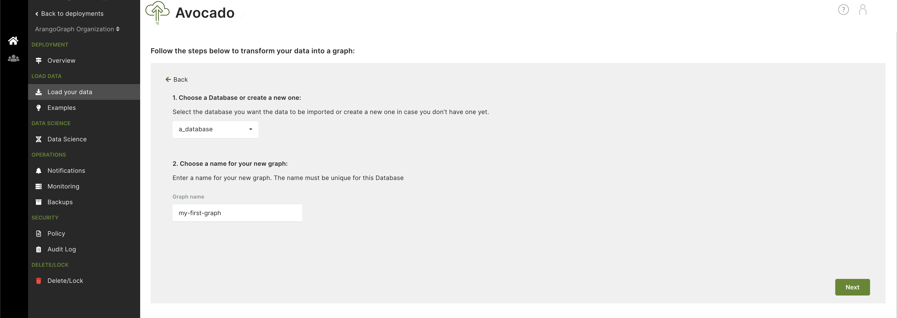
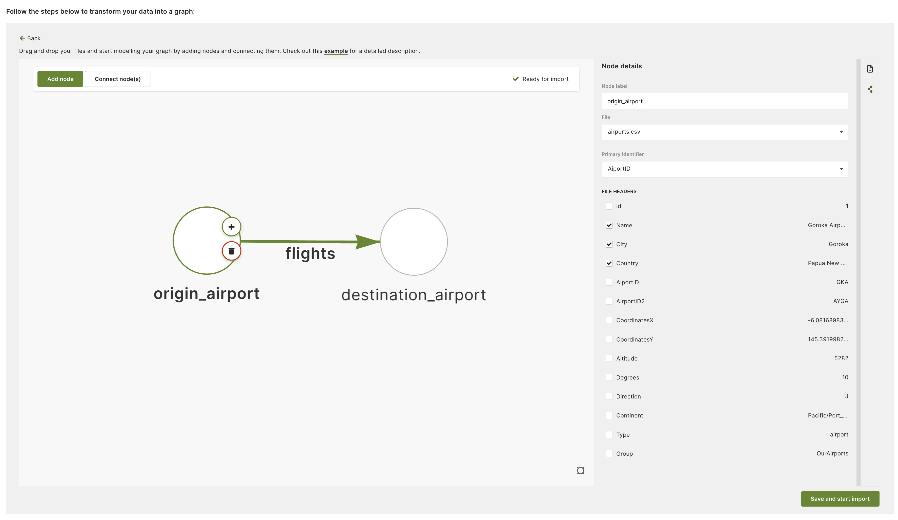
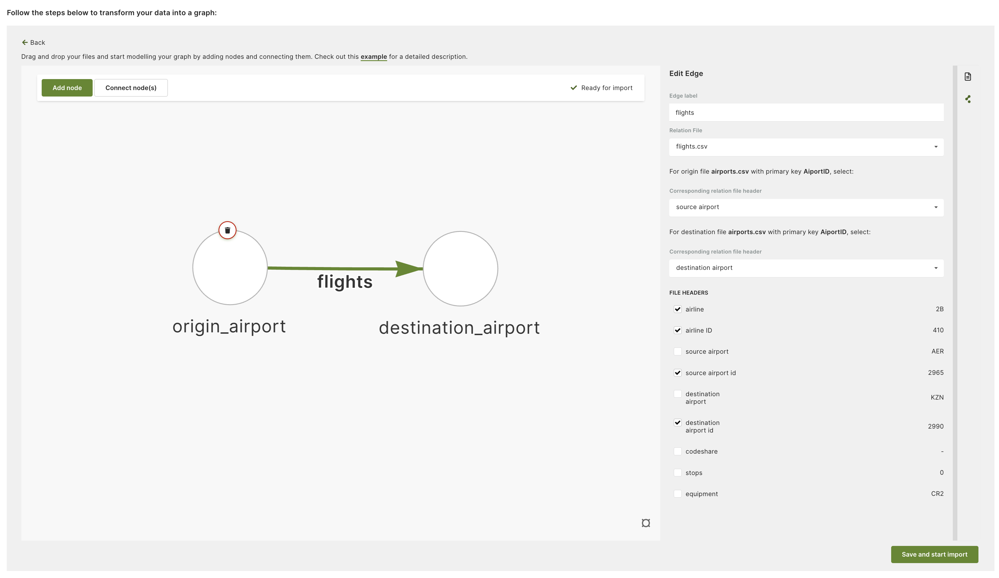

To transform your data into a graph, you need to have CSV files with entities
representing the nodes and a corresponding CSV file representing the edges.

This example uses a sample data set of two files, `airports.csv`, and `flights.csv`.
These files are used to create a graph showing flights arriving at and departing
from various cities.
You can download the files from [GitHub](https://github.com/arangodb/example-datasets/tree/master/Data%20Loader).

The `airports.csv` contains rows of airport entries, which are the future nodes
in your graph. The `flights.csv` contains rows of flight entries, which are the
future edges connecting the nodes.

The whole process can be broken down into these steps:

1. **Database and graph setup**: Begin by choosing an existing database or
   create a new one and enter a name for your new graph.
2. **Add files**: Upload the CSV files to the Data Loader web interface. You can
   simply drag and drop them or upload them through the file browser window.
3. **Design graph**: Design your graph schema by adding nodes and edges and map
   data from the uploaded files to them. This allows creating the corresponding
   documents and collections for your graph.
4. **Import data**: Import the data and start using your newly created 
   [EnterpriseGraph](../../graphs/enterprisegraphs/_index.md) and its
   corresponding collections.

## Step 1: Create a database and choose the graph name

Start by creating a new database and adding a name for your graph.

## Step 2: Add files

Upload your CSV files to the Data Loader web interface. You can drag and drop
them or upload them via a file browser window.

See also [Add files into Data Loader](../data-loader/add-files.md).

## Step 3: Design graph schema

Once the files are added, you can start designing the graph schema. This example
uses a simple graph consisting of:
- Two nodes (`origin_airport` and `destination_airport`)
- One directed edge going from the origin airport to the destination one
  representing a flight

Click **Add node** to create the nodes and connect them with edges.

Next, for each of the nodes and edges, you need to create a mapping to the
corresponding file and headers.

For nodes, the **Node label** is going to be a node collection name and the
**Primary identifier** will be used to populate the `_key` attribute of documents.
You can also select any additional headers to be included as document attributes.

In this example, two node collections have been created (`origin_airport` and
`destination_airport`) and `AirportID` header is used to create the `_key`
attribute for documents in both node collections. The header preview makes it
easy to select the headers you want to use.

For edges, the **Edge label** is going to be an edge collection name. Then, you
need to specify how edges will connect nodes. You can do this by selecting the
*from* and *to* nodes to give a direction to the edge.
In this example, the `source airport` header has been selected as a source and
the `destination airport` header as a target for the edge.

Note that the values of the source and target for the edge correspond to the
**Primary identifier** (`_key` attribute) of the nodes. In this case, it is the
airport code (i.e. GKA) used as the `_key` in the node documents and in the source
and destination headers to configure the edges.

See also [Design your graph in the Data Loader](../data-loader/design-graph.md). 

## Step 4: Import and see the resulting graph

After all the mapping is done, all you need to do is click
**Save and start import**. The report provides an overview of the files
processed and the documents created, as well as a link to your new graph.
See also [Start import](../data-loader/import.md).

Finally, click **See your new graph** to open the ArangoDB web interface and
explore your new collections and graph.

Happy graphing!