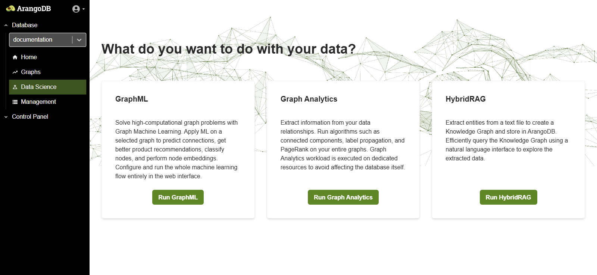
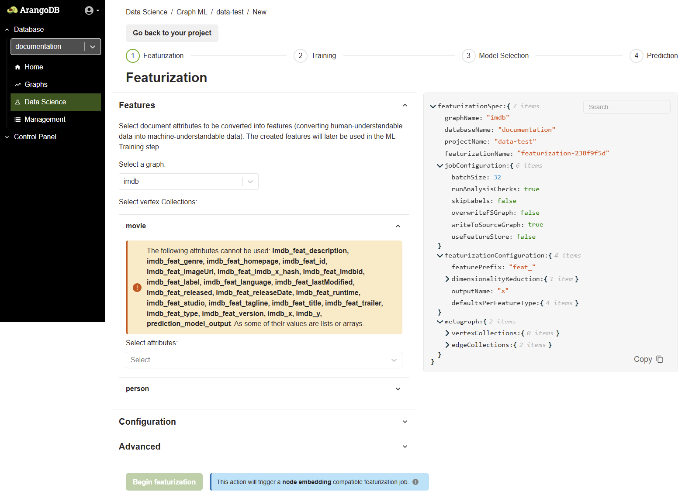

Solve high-computational graph problems with Graph Machine Learning. Apply ML on a selected graph to predict connections, get better product recommendations, classify nodes, and perform node embeddings. Configure and run the whole machine learning flow entirely in the web interface.
## Creating a GraphML Project via the Web Interface
To create a new GraphML project using the ArangoDB Web UI, follow these steps:
1. **Open the Web Interface** – Launch the ArangoDB web interface in your browser.
2. **Select the Target Database** – From the **Database** dropdown in the left-hand sidebar, select the database where the project should reside.
3. **Navigate to the Data Science Section** – In the left-hand navigation menu, click on **Data Science** to open the GraphML project management interface.
  
4. **Click "Add new project"** – In the **GraphML projects** view, click the green **Add new project** button at the top-right.
5. **Fill in Project Details** – A modal titled **Create ML project** will appear. Enter a **name** for your machine learning project and review the information.
6. **Create the Project** – Click the **Create project** button to finalize the creation.
7. **Verify Project in the List** – After creation, the new project will appear in the list under **GraphML projects**. Click the project name to enter and begin creating ML jobs like Featurization, Training, or Prediction.

## Featurization Phase
After clicking on a project name, you are taken to a screen where you can configure and start a new Featurization job. Follow these steps:
1. **View the ML Workflow Tabs** – You’ll see the four-step ML workflow: `Featurization`, `Training`, `Model Selection`, and `Prediction`.
2. **Select a Graph** – In the **Features** section, choose your target graph from the **Select a graph** dropdown (e.g., `imdb`).
3. **Choose Vertex Collections** – Pick the vertex collections (e.g., `movie`, `person`) that you want to include for feature extraction.
4. **Select Attributes** – From the dropdown, choose the attributes from your vertex collection to convert into machine-understandable features. 
<!---The UI will inform you which attributes are invalid (e.g., lists or arrays).-->

The following attributes cannot be used: imdb_feat_description, imdb_feat_genre, imdb_feat_homepage, imdb_feat_id, imdb_feat_imageUrl, imdb_feat_imdb_x_hash, imdb_feat_imdbId, imdb_feat_label, imdb_feat_language, imdb_feat_lastModified, imdb_feat_released, imdb_feat_releaseDate, imdb_feat_runtime, imdb_feat_studio, imdb_feat_tagline, imdb_feat_title, imdb_feat_trailer, imdb_feat_type, imdb_feat_version, imdb_x, imdb_y, prediction_model_output. As some of their values are lists or arrays.


5. **Expand Configuration and Advanced Settings** – Optionally adjust parameters like batch size, feature prefix, dimensionality reduction, and write behavior. These settings are also shown in JSON format on the right side of the screen for transparency.

- **Batch size** – The number of documents to process in a single batch.
- **Run analysis checks** – Whether to run analysis checks to perform a high-level analysis of the data quality before proceeding. Default is `true`.
- **Skip labels** – Skip the featurization process for attributes marked as labels. Default is `false`.
- **Overwrite FS graph** – Whether to overwrite the Feature Store graph if features were previously generated. Default is `false`, so features are written to an existing graph.
- **Write to source graph** – Whether to store the generated features in the source graph. Default is `true`.
- **Use feature store** – Enable the use of the Feature Store database, which stores features separately from the source graph. Default is `false`, so features are written to the source graph.

6. **Click "Begin Featurization"** – Once all selections are done, click the **Begin featurization** button. This will trigger a **node embedding-compatible featurization job**.
 write this sattement Once the job status changes to "Ready for training" you can start the ML Training step
Once the job status changes to **"Ready for training"**, you can start the **ML Training** step.

## Training Phase

This is the second step in the ML workflow after featurization. In the training phase, you configure and launch a machine learning training job on your graph data.

### Select Type of Training Job

You can choose between two types of training jobs depending on your use case:

### Node Classification

Node Classification is used to categorize the nodes in your graph based on their features and structural connections within the graph.

**Use cases include:**
- Entity categorization (e.g., movies into genres, users into segments)
- Fraud detection in transaction networks
- Anomaly detection in IT or social graphs

**Configuration Parameters:**
- **Type of Training Job:** Node classification
- **Target Vertex Collection:** Choose the collection to classify (e.g., `movie`)
- **Batch Size:** Number of samples per training step (e.g., 256)
- **Data Load Batch Size:** Number of documents fetched during data loading (e.g., 50000)
- **Data Load Parallelism:** Number of threads used for data loading (e.g., 10)

After setting these values, click the **Begin training** button to start the job.

###  Node Embedding

Node Embedding is used to generate vector embeddings (dense numerical representations) of graph nodes that capture structural and feature-based information.

**Use cases include:**
- Similarity search (e.g., finding similar products, users, or documents)
- Link prediction (e.g., suggesting new connections)
- Input for downstream ML tasks like clustering or visualization

**Configuration Parameters:**
- **Type of Training Job:** Node embeddings
- **Target Vertex Collection:** Select the collection to generate embeddings for (e.g., `movie` or `person`)
- No label is required for training in this mode

Once the configuration is complete, click **Begin training** to launch the embedding job.

After training is complete, you can proceed to **Model Selection**, the third step in the ArangoGraphML workflow.

## Model Selection Phase

Once the training is finished, the job status updates to READY FOR MODEL SELECTION. This means the model has been trained using the provided vertex and edge data and is now ready for evaluation.

**Understanding Vertex Collections:**

**X Vertex Collection:** These are the source nodes used during training. They represent the full set of nodes on which features were computed (e.g., person, movie).

**Y Vertex Collection:** These are the target nodes that contain labeled data. The labels in this collection are used to supervise the training process and are the basis for evaluating prediction quality.

The target collection is where the model’s predictions will be stored once prediction is executed.

**Model Selection Interface:**

You will be shown a list of trained models along with performance metrics such as accuracy, loss, and evaluation scores.

Review the results of different model runs and configurations.

Select the best performing model suitable for your prediction task.

## Prediction Phase
Once the best-performing model has been selected, you move to the final step of the GraphML pipeline: generating predictions for new or unlabeled data.
### Overview
The Prediction interface allows you to run inference using the selected model. You can define how predictions are executed, which collections are involved, and whether new or outdated documents should be automatically featurized before prediction.

### Configuration Options
In the Prediction screen, you will see the following configuration options:

- Selected Model: Displays the model you selected during the Model Selection phase. This model will be used to perform inference.

- Target Vertex Collection: This is the vertex collection on which predictions will be applied.

- Prediction Type: Depending on your training job (e.g., classification or embedding), the prediction will output class labels or updated embeddings.

### Featurization Settings
Two toggles are available to control automatic featurization during prediction

**Featurize New Documents:**
Enable or disable the featurization of newly added documents. This is useful when new data is added after training and you want to ensure that predictions are still made without needing a full re-training process.

**Featurize Outdated Documents:**
Enable or disable the featurization of outdated documents. Outdated documents are those whose attributes (used during featurization) have changed since the last feature computation. This ensures prediction results are based on up-to-date information.

These options give you flexibility in handling dynamic graph data and keeping your predictions relevant without having to repeat the entire ML workflow.

**Data load batch size** – Specifies the number of documents to load in a single batch (e.g., 500000).

**Data load parallelism** – Number of parallel threads used to process the prediction workload (e.g., 10).

**Prediction field** – The field in the documents where the predicted values will be stored (e.g., prediction).

### Enable Scheduling

You can configure automatic predictions using the **Enable scheduling** checkbox.

When scheduling is enabled, predictions will be executed automatically based on a specified **CRON expression**. This is useful for regularly updating prediction outputs as new data enters the system.

#### Schedule (CRON expression)

You can define a CRON expression that sets when the prediction job should run. For example:
0 0 1 1 *
This CRON pattern will execute the prediction **every year on January 1st at 00:00**.

Below the CRON field, a user-friendly scheduling interface helps translate it:

- **Period**: Options include *Hourly*, *Daily*, *Weekly*, *Monthly*, or *Yearly*.
- **Month**: *(e.g., January)*
- **Day of Month**: *(e.g., 1)*
- **Day of Week**: *(optional)*
- **Hours and Minutes**: Set the exact time for execution *(e.g., 0:00)*

### Execute Prediction
After reviewing the configuration, click the Run Prediction button. ArangoGraphML will then:

1. Perform featurization 

2. Run inference using the selected model

3. Write prediction results into the target vertex collection or a specified output location

Once prediction is complete, you can analyze the results directly in the UI or export them for downstream use.
