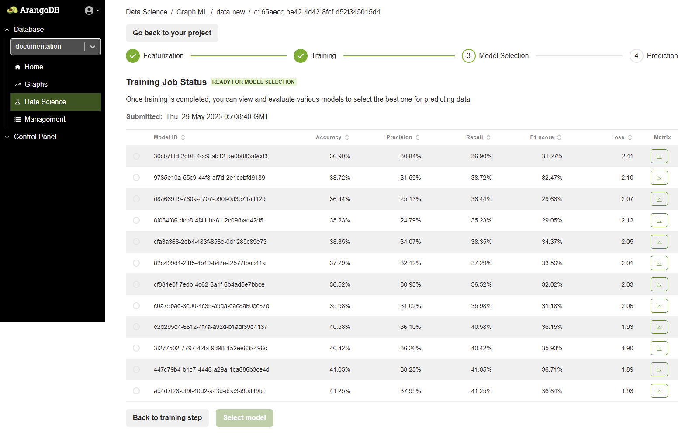

Solve high-computational graph problems with Graph Machine Learning. Apply ML on a selected graph to predict connections, get better product recommendations, classify nodes, and perform node embeddings. Configure and run the whole machine learning flow entirely in the web interface.

## What You Can Do with GraphML

GraphML directly supports two primary machine learning tasks:

*   **Node Classification:** Automatically assign a label to nodes in your graph. For example, you can classify customers as "likely to churn" or "high value," or identify fraudulent transactions.
*   **Node Embeddings:** Generate numerical representations (vectors) for each node. The main purpose of these embeddings is to measure similarity: nodes that are alike are placed close together in a high-dimensional space. By comparing the embeddings of two nodes, you can calculate their similarity. This is the foundation for advanced tasks like link prediction (predicting a future connection), building recommendation engines, and finding similar items.

## How ArangoGraphML Works

The underlying framework for ArangoGraphML is **[GraphSAGE](https://snap.stanford.edu/graphsage/)**. GraphSAGE (Graph Sample and AggreGatE) is a powerful Graph Neural Network (GNN) **framework** designed for inductive representation learning on large graphs. It is used to generate low-dimensional vector representations for nodes and is especially useful for graphs that have rich node attribute information. The overall process involves two main stages:

1.  **Featurization**: Your raw graph data is transformed into numerical representations that the model can understand.
    *   The system iterates over your selected vertices and converts their attributes: booleans become `0` or `1`, numbers are normalized, and text attributes are converted into numerical vectors using sentence transformers.
    *   All of these numerical features are then combined (concatenated).
    *   Finally, **Incremental PCA** (Incremental Principal Component Analysis a dimensionality reduction technique) is used to reduce the size of the combined features, which helps remove noise and keep only the most important information.

2.  **Training**: The model learns from the graph's structure by sampling and aggregating information from each node's local neighborhood.
    *   For each node, GraphSAGE looks at connections up to **2 hops away**.
    *   Specifically, it uniformly samples up to **25 direct neighbors** (depth 1) and for each of those, it samples up to **10 of their neighbors** (depth 2).
    *   By aggregating feature information from this sampled neighborhood, the model creates a rich "embedding" for each node that captures both its own features and its role in the graph.

## Limitations

*   **Edge Attributes**: The current version of ArangoGraphML does not support the use of edge attributes as features.
*   **Dangling Edges**: Edges that point to non-existent vertices ("dangling edges") are not caught during the featurization analysis. They may cause errors later, during the Training phase.
*   **Prediction Scope**: Predictions can only be run in batches on the graph. It is not possible to request a prediction for a single document on-the-fly (Example, via an AQL query).
*   **Memory Usage**: Both featurization and training can be memory-intensive. Out-of-memory errors can occur on large graphs with insufficient system resources.

## The GraphML Workflow

The entire process is organized into sequential steps within a **Project**, giving you a clear path from data to prediction:

1.  **Featurization:** Select your data and convert it into numerical features.
2.  **Training:** Train a GraphSAGE model on the features and graph structure.
3.  **Model Selection:** Evaluate the trained models and choose the best one.
4.  **Prediction:** Use the selected model to generate predictions on your data.
5.  **Scheduling (Optional):** Automate the prediction process to run at regular intervals.

## Creating a GraphML Project

To create a new GraphML project using the ArangoDB Web Interface, follow these steps:

1. From the left-hand sidebar, select the database where you want to create the project.
2. In the left-hand navigation menu, click **Data Science Suite** to open the GraphML project management interface, then click Run GraphML.
     
3. In the **GraphML projects** view, click  **Add new project**.
4. The **Create ML project** modal opens. Enter a **Name** for your machine learning project.
5. Click the **Create project** button to finalize the creation.
6. After creation, the new project appears in the list under **GraphML projects**. Click the project name to begin with a Featurization job.

## Featurization Phase

After clicking on a project name, you are taken to a screen where you can configure and start a new Featurization job. Follow these steps:
- **Select a Graph** – In the **Features** section, choose your target graph from the **Select a graph** dropdown.
- **Choose Vertex Collections** – Pick the vertex collections that you want to include for feature extraction.
- **Select Attributes** – Choose the attributes from your vertex collection to convert into machine-understandable features. 


Attributes cannot be used if their values are lists or arrays.



A metagraph is basically just the configured subset of a graph (the vertex and edge collections and the specified attributes). This is what you see represented in the metagraph object in the JSON specification on the right.


The featurization process has several configurable options, grouped into Configuration and Advanced settings. These are also shown in a JSON format on the right side of the screen for transparency.

**Configuration**
These settings control the overall featurization job and how features are stored.

- **Batch size** – The number of documents to process in a single batch.
- **Run analysis checks** – Whether to run analysis checks to perform a high-level analysis of the data quality before proceeding. Default is `true`.
- **Skip labels** – Skip the featurization process for attributes marked as labels. Default is `false`.

**Feature Storage Options**
These settings control where the generated features are stored.

- **Overwrite FS graph** – Whether to overwrite the Feature Store graph if features were previously generated. Default is `false`, therefore features are written to an existing graph Featere store graph.
- **Write to source graph** – Whether to store the generated features on the Source Graph. Default is `true`.
- **Use feature store** – Enable the use of the Feature Store database, which allows you to store features separately from your Source Database. Default is `false`, therefore feature are written to the source graph.

**Advanced Settings: Handling Imperfect Data**

Real-world data is often messy. It can have missing values or mismatched data types. This section allows you to define default rules for how the featurization process should handle these data quality issues for each feature type, preventing the job from failing unexpectedly.

For each feature type (Text, Numeric, Category, and Label), you can set two types of strategies:

**Missing Strategy:** Defines what to do when an attribute is completely missing from a document.

**Mismatch Strategy:** Defines what to do when an attribute exists but has the wrong data type.

**Missing Value Strategies**

**Raise:** The job immediately stops and reports an error if a data type mismatch is found. Use this when any type mismatch indicates a critical data error.

**Replace:** Replaces a missing value with a default you provide (e.g., 0 for numbers, "unknown" for text). The job then continues. Use this when missing values are expected.

**Mismatch Value Strategies**

**Raise:** The strictest option. The job will immediately stop and report an error if a data type mismatch is found. Use this when any type mismatch indicates a critical data error.

**Replace:** If a mismatch is found, the system immediately replaces the value with the default you specify, without attempting to convert it first. Use this when you don't trust the mismatched data and prefer to substitute it directly.

**Coerce and raise:** A balanced approach. The system first tries to convert (coerce) the value to the correct type (e.g., string "123" to number 123). If the conversion is successful, it uses the new value. If it fails, the job stops. This is often the best default strategy.

**Coerce and replace:** The most forgiving option. The system first tries to convert the value. If the conversion fails, it replaces the value with the default you specify and continues the job. Use this for very "dirty" datasets where completing the job is the highest priority.

Once all selections are done, click the **Begin featurization** button. This triggers a **node embedding-compatible featurization job**. Once the job status changes to **Ready for training**, you can start the **ML Training** step.

 

## Training Phase

The training is the second step in the ML workflow after featurization. In the training phase, you configure and launch a machine learning training job on your graph data.

- **Select a training job type** – From the **Select a type of training job** dropdown, choose the type of model you want to train (Example, Node Classification, Node Embedding).

#### Node Classification

Node Classification is used to categorize the nodes in your graph based on their features and structural connections within the graph.

**Use cases include:**
- Entity categorization (Example, movies into genres, users into segments)
- Fraud detection in transaction networks

**Configuration Parameters:**
- **Type of Training Job:** Node classification
- **Target Vertex Collection:** Choose the collection to classify (Example, `movie`)
- **Batch Size:** The nummer of documents processed in a single training iteration.  (Example, 256)
- **Data Load Batch Size:** The number of documents loaded from ArangoDB into memory in a single batch during the data loading phase. (Example, 50000)
- **Data Load Parallelism:** The number of parallel processes used when loading data from ArangoDB into memory for trainnig. (Example, 10)

After setting these values, click the **Begin training** button to start the job.

 ####  Node Embedding

Node Embedding is used to generate vector embeddings (dense numerical representations) of graph nodes that capture structural and feature-based information.

**Use cases include:**
- Similarity search (Example, finding similar products, users, or documents)
- Link prediction (Example, suggesting new connections)

**Configuration Parameters:**
- **Type of Training Job:** Node embeddings
- **Target Vertex Collection:** Select the collection to generate embeddings for (Example, `movie` or `person`)
- No label is required for training in this mode

Once the configuration is complete, click **Begin training** to launch the embedding job.

After training is complete, the next step in the ArangoGraphML workflow is **Model Selection**.

## Model Selection Phase

Once the training is finished, the job status updates to **READY FOR MODEL SELECTION**. This means the model has been trained using the provided vertex and edge data and is now ready for evaluation.

**Understanding Vertex Collections:**

**X Vertex Collection:** These are the source nodes used during training. They represent the full set of nodes on which features were computed (Example, person, movie).

**Y Vertex Collection:** These are the target nodes that contain labeled data. The labels in this collection are used to supervise the training process and are the basis for evaluating prediction quality.

The target collection is where the model's predictions are stored when running a prediction job.

**Model Selection Interface:**

A list of trained models is displayed, along with performance metrics (Accuracy, Precision, Recall, F1 score, Loss).
Review the results of different model runs and configurations.

Select the best performing model suitable for your prediction task.

## Prediction Phase

After selecting a model, you can create a Prediction Job. The Prediction Job generates predictions and persists them to the source graph, either in a new collection or within the source documents.

### Overview

The Prediction interface allows inference to be run using the selected model. It enables configuration of how predictions are executed, which collections are involved, and whether new or outdated documents should be automatically featurized before prediction.

You have two important options for this:

**Featurize new documents:** Enable this option to generate features for documents that have been added since the model was trained. This is useful for getting predictions on new data without having to retrain the model.

**Featurize outdated documents:** Enable this option to re-generate features for documents that have been modified since the last featurization. This ensures your predictions reflect the latest changes to your data.
In addition to these settings, you will also define the target data, where to store results, and whether to run the job on a recurring schedule.

In addition to these settings, you also define the target data, where to store results, and whether to run the job on a recurring schedule.

### Configuration Options
The Prediction screen displays the following configuration options:

- Selected Model: Displays the model selected during the Model Selection phase. This model will be used to perform inference.

- Target Vertex Collection: This is the vertex collection on which predictions are applied.

- Prediction Type: Depending on the training job (for example, classification or embedding), the prediction outputs class labels or updated embeddings.

### Featurization Settings
Two toggles are available to control automatic featurization during prediction

**Featurize New Documents:**
This option controls whether newly added documents are automatically featurized. It is useful when new data arrives after training, allowing predictions to continue without requiring a full retraining process.

**Featurize Outdated Documents:**
Enable or disable the featurization of outdated documents. Outdated documents are those whose attributes (used during featurization) have changed since the last feature computation. This ensures prediction results are based on up-to-date information.

These options provide flexibility in handling dynamic graph data and keeping predictions relevant without repeating the entire ML workflow.

**Data load batch size** – Specifies the number of documents to load in a single batch (Example, 500000).

**Data load parallelism** – Number of parallel threads used to process the prediction workload (Example, 10).

**Prediction field** – The field in the documents where the predicted values are stored.

### Enable Scheduling

You can configure automatic predictions using the **Enable scheduling** checkbox.

When scheduling is turned on, predictions run automatically based on a set CRON expression. This helps keep prediction results up to date as new data is added to the system.

#### Schedule (CRON expression)

You can define a CRON expression that sets when the prediction job should run. For example:
0 0 1 1 *
This CRON pattern executes the prediction every year on January 1st at 00:00.

Below the CRON field, a user-friendly scheduling interface helps translate it:

- **Period**: Options include *Hourly*, *Daily*, *Weekly*, *Monthly*, or *Yearly*.
- **Month**: *(Example, January)*
- **Day of Month**: *(Example, 1)*
- **Day of Week**: *(optional)*
- **Hours and Minutes**: Set the exact time for execution *(Example, 0:00)*

### Execute Prediction
After reviewing the configuration, click the Run Prediction button. ArangoGraphML then:

- Perform featurization 

- Run inference using the selected model

- Write prediction results into the target vertex collection or a specified output location

Once prediction is complete, you can analyze the results directly in the Web Interface or export them for downstream use.
