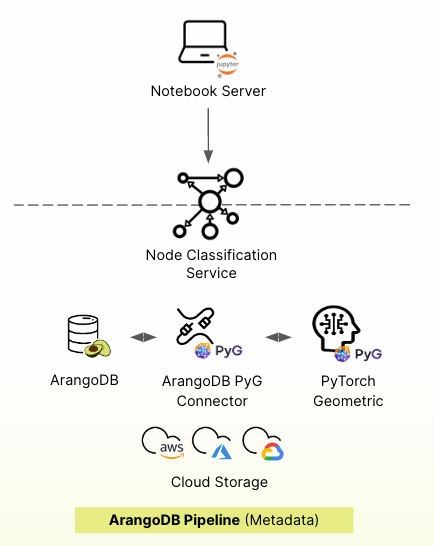

## Managed cloud service versus self-managed

ArangoDB offers two deployment options, tailored to suit diverse requirements
and infrastructure preferences: 
- Managed cloud service via the [ArangoGraph Insights Platform](https://dashboard.arangodb.cloud/home?utm_source=docs&utm_medium=cluster_pages&utm_campaign=docs_traffic)
- Self-managed solution via the [ArangoDB Kubernetes Operator](https://github.com/arangodb/kube-arangodb)

### ArangoGraphML

ArangoGraphML provides enterprise-ready Graph Machine Learning as a
Cloud Service via Jupyter Notebooks that run on the
[ArangoGraph Insights Platform](https://dashboard.arangodb.cloud/home?utm_source=docs&utm_medium=cluster_pages&utm_campaign=docs_traffic).


To get access to ArangoGraphML services and packages,
[get in touch](https://www.arangodb.com/contact/)
with the ArangoDB team.


- **Accessible at all levels**
  - Low code UI
  - Notebooks
  - APIs
- **Full usability**
  - MLOps lifecycle
  - Metrics
  - Metadata capture
  - Model management

#### Setup

The ArangoGraphML managed-service runs on the
[ArangoGraph Insights Platform](https://dashboard.arangodb.cloud/home?utm_source=docs&utm_medium=cluster_pages&utm_campaign=docs_traffic).
It offers a pre-configured environment where everything,
including necessary components and configurations, comes preloaded. You don't
need to set up or configure the infrastructure, and can immediately start using the
GraphML functionalities.

To summarize, all you need to do is:
1. Sign up for an [ArangoGraph account](https://dashboard.arangodb.cloud/home?utm_source=docs&utm_medium=cluster_pages&utm_campaign=docs_traffic).
2. Create a new [deployment in ArangoGraph](../../arangograph/deployments/_index.md#how-to-create-a-new-deployment).
3. Start using the ArangoGraphML functionalities.

### Self-managed ArangoGraphML



The self-managed solution enables you to deploy and manage ArangoML within your
Kubernetes cluster using the [ArangoDB Kubernetes Operator](https://github.com/arangodb/kube-arangodb).

The self-managed package includes the same features as in ArangoGraphML.
The primary distinction lies in the environment setup: with the self-managed
solution, you have direct control over configuring your environment.

#### Setup

You can run ArangoGraphML in your Kubernetes
cluster provided you already have a running `ArangoDeployment`. If you don't
have one yet, consider checking the installation guide of the
[ArangoDB Kubernetes Operator](https://arangodb.github.io/kube-arangodb/docs/using-the-operator.html)
and the [ArangoDeployment Custom Resource](https://arangodb.github.io/kube-arangodb/docs/deployment-resource-reference.html)
description.

To start ArangoGraphML in your Kubernetes cluster, follow the instructions provided
in the [ArangoMLExtension Custom Resource](https://arangodb.github.io/kube-arangodb/docs/mlextension-resource.html)
description. Once the `CustomResource` has been created and the ArangoGraphML extension
is ready, you can start using it.