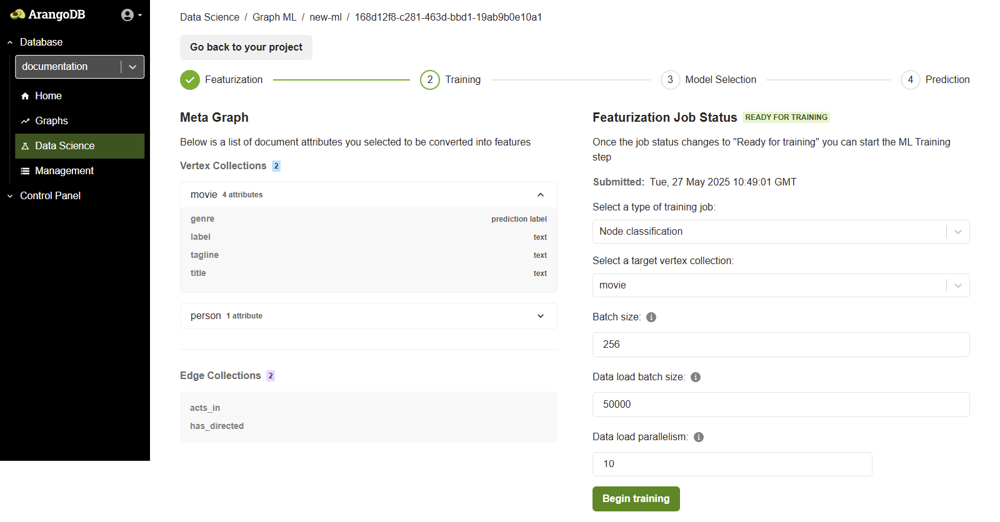
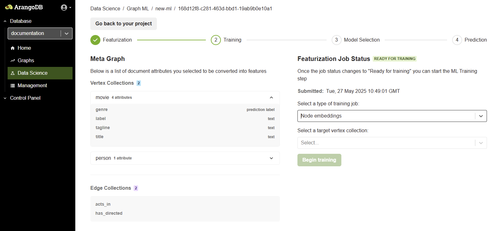
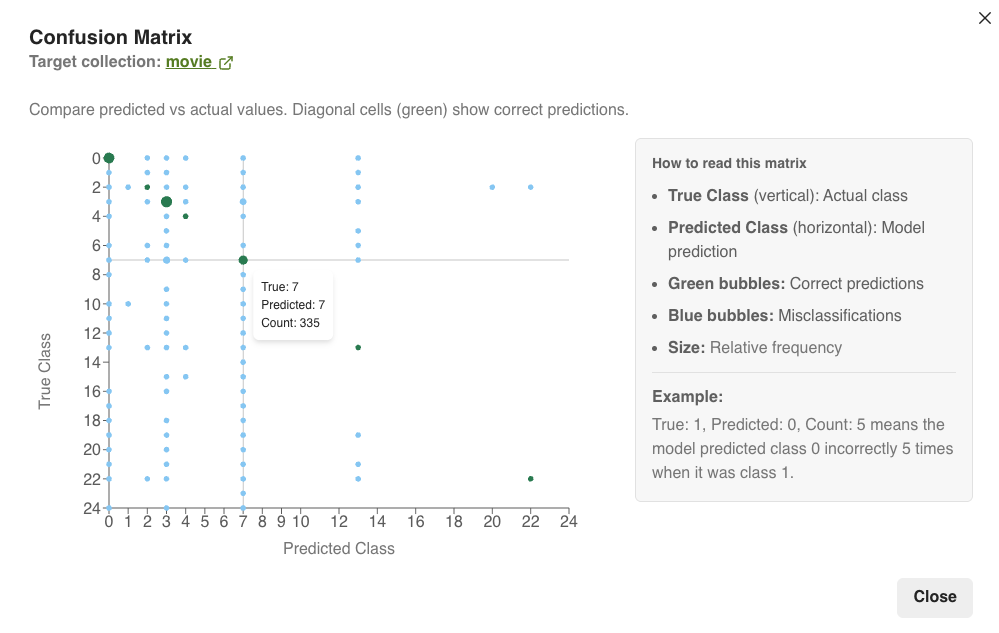
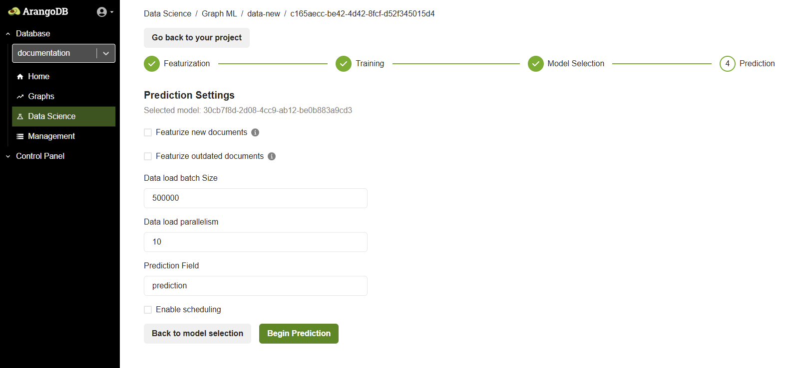



## The GraphML workflow in the web interface

The entire process is organized into sequential steps within a **Project**,
giving you a clear path from data to prediction:

1. **Featurization**: Select your data and convert it into numerical representations.
2. **Training**: Train a GraphSAGE model on the features and graph structure.
3. **Model Selection**: Evaluate the trained models and choose the best one.
4. **Prediction**: Use the selected model to generate predictions on your data.
   You can also automate the prediction process to run at regular intervals.

## Create a GraphML project

To create a new GraphML project using the ArangoDB Platform web interface, follow these steps:

1. From the left-hand sidebar, select the database where you want to create the project.
2. In the left-hand sidebar, click **GenAI** to open the GraphML project management interface, then click **Run GraphML**.
     
3. In the **GraphML projects** view, click **Add new project**.
4. The **Create ML project** modal opens. Enter a **Name** for your machine learning project.
5. Click the **Create project** button to finalize the creation.
6. After creation, the new project appears in the list under **GraphML projects**.
   Click the project name to begin with a Featurization job.

## Featurization phase

After clicking on a project name, you are taken to a screen where you can
configure and start a new Featurization job. Follow these steps:
1. **Select a Graph**: In the **Features** section, choose your target graph from the **Select a graph** dropdown menu.
2. **Select Vertex Collection(s)**: Pick the vertex collection(s) that you want to include for feature extraction.
3. **Select Attributes**: Choose the attributes from your vertex collection to
  convert into machine-understandable features. Attributes cannot be used if their values are lists or arrays.


A metagraph is basically just the configured subset of a graph (the vertex and
edge collections and the specified attributes). This is what you see represented
in the metagraph object in the JSON specification on the right.


### Configuration options

The featurization process has several configurable options, grouped into
**Configuration** and **Advanced** settings. These are also shown in a JSON
format on the right side of the screen for transparency.

In the **Configuration** tab, you can control the overall featurization job and
how features are stored.
- **Batch size**: The number of documents to process in a single batch.
- **Run analysis checks**: Whether to run analysis checks to perform a high-level
  analysis of the data quality before proceeding. The default value is `true`.
- **Skip labels**: Skip the featurization process for attributes marked as labels.
  The default value is `false`.
- **Overwrite FS graph**: Whether to overwrite the Feature Store graph if features
  were previously generated. The default value is `false`, therefore features are
  written to an existing Feature Store graph.
- **Write to source graph**: Whether to store the generated features on the Source
 Graph. The default value is `true`.
- **Use feature store**: Enable the use of the Feature Store database, which
 allows you to store features separately from your Source Database. The default
 value is `false`, therefore features are written to the source graph.

### Handling imperfect data

Real-world datasets often contain missing values or mismatched data types. Use
the strategies below to control how each feature type (**Text**, **Numeric**,
**Category**, **Label**) handles these issues during featurization.

| **Strategy type** | **Option**            | **Description**                                                                                     | **When to use**                                               |
|-------------------|-----------------------|-----------------------------------------------------------------------------------------------------|---------------------------------------------------------------|
| Missing           | **Raise**             | Stops the job and reports an error when a value is missing.                                         | When missing data indicates a critical issue.                 |
|                   | **Replace**           | Substitutes missing values with a default you provide (e.g., `0` for numbers, `"unknown"` for text).                                  | When missing values are expected.         |
| Mismatch          | **Raise**             | The strictest option. Stops the job on any data type mismatch.                                                            | When any data type mismatch indicates a critical error.                            |
|                   | **Replace**           | Replaces mismatched values with a default you provide, without trying to convert it first.                              | When mismatched values are unreliable, and you prefer to substitute it directly.       |
|                   | **Coerce and Raise**  | Attempts to convert (coerce) the value to the correct type (e.g. string "123" to number `123`). If the conversion is successful, it uses the new value. If it fails, the job stops.              | A balanced approach, often the best default strategy. |
|                   | **Coerce and Replace**| The most forgiving option. The system first tries to convert the value. If it fails, it replaces the value with the specified default and continues the job.                                | For very dirty datasets where completing the job is the highest priority.          | 

Once you’ve set your strategies, click **Begin featurization** to start the node
embedding-compatible featurization job. When the job status updates to
**Ready for training**, proceed to the **Training** step.

 

## Training phase

The training is the second step in the ML workflow after featurization.
In the training phase, you configure and launch a machine learning training
job on your graph data.

From the **Select a type of training job** dropdown menu, choose the type of
model you want to train (**Node Classification** or **Node Embeddings**).

#### Node classification

Node Classification is used to categorize the nodes in your graph based on their
features and structural connections within the graph.

**Use cases include:**
- Entity categorization (e.g. movies into genres, users into segments)
- Fraud detection in transaction networks

**Configuration parameters:**
- **Type of Training Job**: Node classification
- **Target Vertex Collection**: Choose the collection to classify (e.g. `movie`)
- **Batch Size**: The number of documents processed in a single training iteration. (e.g. `256`)
- **Data Load Batch Size**: The number of documents loaded from ArangoDB into memory in a single batch during the data loading phase (e.g. `50000`).
- **Data Load Parallelism**: The number of parallel processes used when loading data from ArangoDB into memory for training (e.g. `10`).

After setting these values, click the **Begin training** button to start the job.

####  Node embeddings

Node Embeddings are used to generate vector embeddings (dense numerical representations)
of graph nodes that capture structural and feature-based information.

**Use cases include:**
- Similarity search (e.g. finding similar products, users, or documents)
- Link prediction (e.g. suggesting new connections)

**Configuration parameters:**
- **Type of Training Job:** Node embeddings
- **Target Vertex Collection:** Select the collection to generate embeddings for (e.g. `movie` or `person`)
- No label is required for training in this mode

**Understanding Vertex Collections:**

- **Vertex Collection**: These are the source nodes used during training.
  They represent the full set of nodes on which features were computed (e.g. `person`, `movie`).
- **Vertex Collection**: These are the target nodes that contain labeled data.
  The labels in this collection are used to supervise the training process and
  are the basis for evaluating prediction quality.

The target collection is where the model's predictions are stored when running a prediction job.

Once the configuration is complete, click **Begin training** to start the embedding job.

## Model selection phase

Once the training is finished, the job status updates to **READY FOR MODEL SELECTION**.
This means the model has been trained using the provided vertex and edge data
and is now ready for evaluation.

A list of trained models is displayed, along with performance metrics
(**Accuracy**, **Precision**, **Recall**, **F1 score**, **Loss**). Review the results of different
model runs and configurations.

Select the best performing model suitable for your prediction task. You can also
open the **Confusion Matrix** to compare predicted values versus actual values.

## Prediction phase

After selecting a model, you can create a Prediction Job. The Prediction Job
generates predictions and persists them to the source graph, either in a new
collection or within the source documents.

The Prediction interface allows inference to be run using the selected model.
It enables configuration of how predictions are executed, which collections are
involved, and whether new or outdated documents should be automatically featurized
before prediction.

You have two important options:

- **Featurize new documents:** Enable this option to generate features for
  documents that have been added since the model was trained. This is useful
  for getting predictions on new data without having to retrain the model.
- **Featurize outdated documents:** Enable this option to re-generate features
  for documents that have been modified. Outdated documents are those whose
  attributes (used during featurization) have changed since the last feature
  computation. This ensures your predictions reflect the latest changes to your data.

In addition to these settings, you can also define the target data, where to store
results, and whether to run the job on a recurring schedule.

These options provide flexibility in handling dynamic graph data and keeping
predictions relevant without repeating the entire ML workflow.

- **Data load batch size**: Specifies the number of documents to load in a
  single batch (e.g. `500000`).
- **Data load parallelism**: The number of parallel threads used to process
  the prediction workload (e.g. `10`).
- **Prediction field**: The field in the documents where the predicted values are stored.

### Configuration options

The Prediction screen displays the following configuration options:
- **Select Model**: Displays the model selected during the Model Selection phase. This model will be used to perform inference.
- **Target Vertex Collection**: This is the vertex collection on which predictions are applied.
- **Prediction Type**: Depending on the training job (for example, classification or embedding), the prediction outputs class labels or updated embeddings.

### Enable scheduling

You can configure automatic predictions using the **Enable scheduling** checkbox.
When scheduling is enabled, predictions run automatically based on a set CRON
expression. This helps keep prediction results up-to-date as new data is added to the system.

You can define a cron expression that sets when the prediction job should run.
The cron syntax is a set of five fields in a line, indicating when the job should
be executed. The format must follow the following order: `minute` `hour` `day-of-month` `month` `day-of-week`
(e.g. `0 0 * * *` for daily predictions at 00:00, or `0 0 1 1 *` to execute the prediction
on January 1st at 00:00).

When a field is set to an asterisk `*`, it means that any value is allowed for that field,
whenever the other field conditions are met.

Below the CRON field, a user-friendly scheduling interface helps translate it:
- **Period**: Options include **Hourly**, **Daily**, **Weekly**, **Monthly**, or **Yearly**.
- **Month**: Indicates the month. For example, `1` for January.
- **Day of Month**: Indicates the day of the month. For example, `1` for
  the first day of the month.
- **Day of Week** (optional): Indicates the day of the week. For example,
  Monday is `1` and Tuesday is `2`.
- **Hours and Minutes**: Set the exact time for execution. For example,
  if the hour is set to `8` and the minute to `0`, then the job runs at 8:00 AM.

### Execute prediction

After reviewing the configuration, click the **Run Prediction** button. 
Once prediction is complete, you can analyze the results directly in
the Web Interface or export them for downstream use.

## Limitations

- **Edge Attributes**: The current version of GraphML does not support the use of edge attributes as features.
- **Dangling Edges**: Edges that point to non-existent vertices ("dangling edges") are not caught during the featurization analysis. They may cause errors later, during the Training phase.
- **Memory Usage**: Both featurization and training can be memory-intensive. Out-of-memory errors can occur on large graphs with insufficient system resources.
