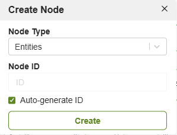
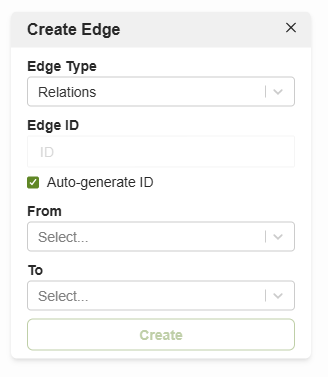

The **Graph Visualizer** provides an interactive interface to explore graph
connections in your ArangoDB database. It allows users to navigate edges, inspect
vertices, and visually understand the data structure.


Graph creation is **not** performed within the Graph Visualizer. Graphs must be
created in the **Graphs** section, accessible from the second-level navigation in
the web interface. Once created, graphs automatically appear in the Graph
Visualizer, ready for exploration and visualization.


Once your graph is created through the main interface, you can use the Graph
Visualizer to:

- Traverse nodes and edges to see how entities are connected.
- Click on vertices or edges to inspect their properties.
- Filter specific collections to focus on a subset of your graph.
- Rearrange nodes manually for better visual clarity.
- Use zoom and pan to explore large graphs more easily.

## View and Edit Graph Data

While the Graph Visualizer is primarily designed for exploring graph data, you
can also create and modify nodes and edges directly from the canvas.

###  Add New Vertices(Nodes)

You can add a vertex to one of the graph's document collections directly from the
canvas. This allows you to expand your graph structure:

To add a new vertex to a graph:

1. In the **Graphs** section of the ArangoDB web interface, select your graph.
2. Right-click on the canvas and choose **Create Node**.
3. In the dialog:
   - Select the target collection (**Node Type**)
   - Optionally specify a unique identifier (**Node ID**)
4. Click **Create** to add the node to the canvas and database.

### Add New Edges

To add a new edge between nodes:

1. In the **Graphs** section of the ArangoDB web interface, select your graph.
2. Right-click on the canvas and choose **Create Edge**.
3. In the dialog:
   - Select the target collection (**Edge Type**, which corresponds to an edge collection)
   - Set the `_from` and `_to` fields by selecting the source and target nodes
   - Optionally specify a unique identifier (**Edge ID**)
4. Click **Create** to add the edge to the canvas and database.


If you select two nodes before right-clicking to open the edge creation
dialog, the `_from` and `_to` fields are automatically pre-filled. Note: the
order is not based on your selection sequence, but may depend on internal ID 
orting.


### Delete Nodes or Edges

To delete a node or edge:

1. Click on the node or edge to select it.
2. Right-click to open the context menu.
3. Choose **Delete** from the menu.


To select and move multiple nodes, hold down the `Ctrl` key (or
`Cmd` on macOS) and drag a selection box around them. However, context menu
actions like **Delete** only work for single selections.


- **Select Node and Right-click**

- **Select Edge and Right-click**

### View Node Properties

To view properties:

- Click on a node or edge to open its properties pop-up.

- **Select a node to display its properties.**

## Graph Visualization

The core function of the Graph Visualizer is to provide an intuitive canvas for
exploring graph structures.

### List All Graphs

ArangoDB supports the following types of **named graphs**, which are available
for visualization:

- General Graphs
- Smart Graphs
- Satellite Graphs
- Disjoint Smart Graphs


Anonymous (adhoc) graphs are not supported in the Graph Visualizer.


### Select and Load a Graph

After selecting a graph from the list, it may not be immediately visualized on
the canvas. In cases such as:

- Using the **Clear Canvas** option
- Reopening the Graph Visualizer after a previous session
- Selecting a graph with no initial nodes displayed

You may see a message prompting you to use the **Explore** button.  
To view the graph:

- Click **Explore** and search for a node by name or ID.
- Alternatively, use the **New Query** or **Saved Query** buttons to display part
of the graph.


Use the **Explore** button to run AQL queries and render results directly on the
graph. You can also save your queries for future use.


## Search & Filter Data

The top-left section of the Graph Visualizer includes powerful search and query
tools for interactive exploration.

### Search

To find specific vertices or edges:

1. Click the **Explore** button in the top-left panel of the Graph Visualizer.
2. Use the search box to look up a node by name or ID.
3. Matching nodes will be highlighted or loaded onto the canvas.


You can also use the **New Query** or **Saved Query** buttons to load
specific subgraphs using AQL queries.


### Saved Queries

To run a saved query:

1. Click the **Explore** button at the top-left of the Graph Visualizer.
2. In the panel that opens, click the **Saved Queries** tab.
3. Each saved query has options to:
  - **Run** it again
  - **Copy** to modify
  - **Delete** if no longer needed

### New Queries

To run a custom query:

1. Click the **Explore** button at the top-left of the Graph Visualizer.
2. In the panel that opens, click the **New Query** tab.
3. Enter your AQL query in the editor.
4. Click **Run** to visualize the result on the graph canvas.

- **Response of the NewQuery**

## Visual Customization

Click the **Style** panel (bottom-right) to:

- Change node/edge colors  
- Adjust opacity  
- Select a **Label** attribute to display a custom field (e.g., “name” or “type”)
  on nodes instead of `_id`  
- Reset to default styling after making changes  

**Reset Button:** Click **Reset** in the style panel to restore nodes and
edges to their original colors, opacity, and labels.  
**Node Count:** The **“Nodes in Graph”** indicator at the top of the panel
shows how many vertices are currently loaded or visible. It updates automatically
when you run queries, apply filters, or add/delete elements.
<!-- 

- **Reset Button:** Click **Reset** in the style panel to restore nodes and
edges to their original colors, opacity, and labels.  
- **Node Count:** The **“Nodes in Graph”** indicator at the top of the panel
shows how many vertices are currently loaded or visible. It updates automatically
when you run queries, apply filters, or add/delete elements.
 -->
### Vertice Styling Options 

You can modify styling attributes of selected **nodes** for emphasis,
categorization, or clarity.

- **Color**: Assign a specific color to highlight elements  
- **Opacity**: Make elements more or less transparent  
- **Label Attribute**: Choose a field (e.g., `name`, `title`) to show instead of
  `_id`  
- **Reset**: Clear all styling modifications  

### Edge-Specific Options

You can modify styling attributes of selected **Edges** for emphasis,
categorization, or clarity.
In addition to the shared styling settings, edges offer further customization:

- **Line Thickness**: Set thickness to reflect edge weight or significance  
- **Arrowhead Styles**: Choose different arrow types for **source** and **target**
  directions  
- **Label Attribute**: Select an edge field to display as a label on the edge  

> Note: All styling changes are visual-only and do not affect the underlying data.

## Layouts and Navigation Tools

**Graph Layout Tools**:

- **Mini-map**: Small overview to navigate the graph.

- **Zoom Controls**: Zoom in/out or set specific zoom.

- **Fit to Screen**: Resize and center the graph view.

- **Re-run Layout**: Automatically rearranges nodes.

- **Layout Algorithms**: Choose between layouts to better see clusters or flows.

These features allow better spatial understanding of node clusters, hierarchies,
and relationship flows.
