The **Graph Visualizer** provides an interactive interface to explore graph connections
in your ArangoDB database. It allows users to navigate edges, inspect vertices,
and visually understand the data structure.


💡 **Note:** Graph creation is **not** performed within the Graph Visualizer. Graphs must be created in the **Graphs** section of the application. Once a graph is created there, it will automatically appear in the Graph Visualizer, ready for exploration and visualization.


## 1.Graph Creation

While the Graph Visualizer is primarily designed for exploring graph data, you can also create and modify nodes and edges directly from the canvas.

### A. Add New Nodes

  Right-click anywhere on the canvas to open the context menu and select **Create Node**. A dropdown appears listing available document collections. Select a collection (vertex type), enter a unique identifier, and create the node. It is then added to the visualization.

##### 1. Open the Graph Interface
Launch the **Graphs** tab on the left sidebar and select the graph where the new node is to be created.
##### 2. Navigate to the Node Section
Right click on the graph area
##### 3. Add a New Node
Locate the **Create Node** option and click on it. A form or dialog box should appear select the **Collection** name.
##### 4. Enter Node Details
Provide:
- **ID**: Option to selct A unique identifier or user can add manually.
##### 5. Save the Node
Click the save button. The node should appear in the graph visualization.

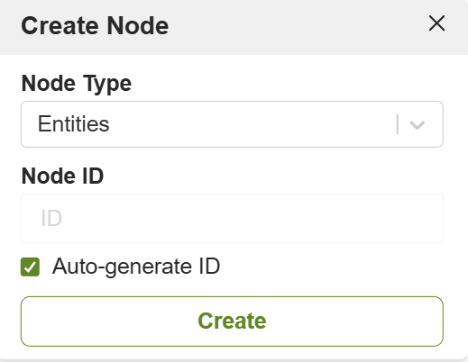

### B. Add New Edges
  Right-click on the canvas and select **"Create Edge"**. Choose the edge collection from the dropdown, provide a name for the edge, and correctly set the `_from` and `_to` fields by selecting source and target nodes. The edge will be created and visualized between the two nodes.

##### 1. Open the Graph Interface
Launch the **Graphs** tab on the left sidebar and select the graph where the new edge is to be created.
##### 2. Navigate to the Edge Section
Right click on the graph area
##### 3. Add a New Edge
Locate the **Create Edge** option and click on it. A form or dialog box should appear select the **Collection** name.
##### 4. Enter Edge Details
Provide:
- **ID**: Option to selct A unique identifier or user can add manually.
- **_from**: Option to selct the collection name manually from the drop down.
- **_to**: Option to selct the collection name manually from the drop down.
##### 5. Save the Edge
Click the save button. The edge should appear in the graph visualization.
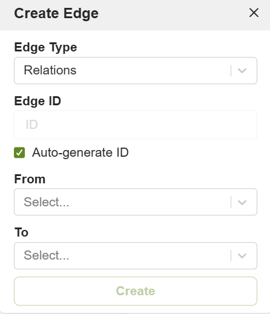

### C. Delete Nodes or Edges

  Select a node or edge and right-click to access the **"Delete"** option. This action removes the selected element from both the graph and the database.

- **Select Node and Right-click**
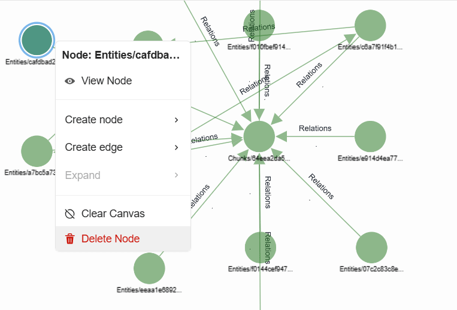
- **Select Edge and Right-click**
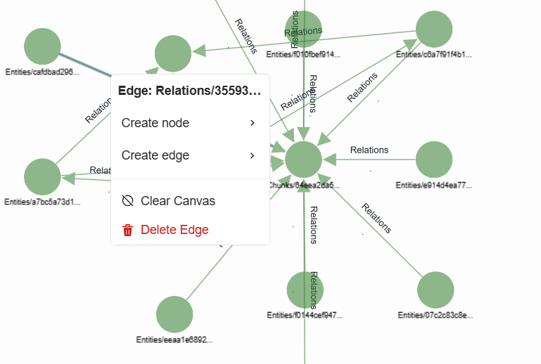

### D. View Node Properties
If You Select a node or edge a Pop-In will appear and select **View-Node** to display the properties of selected Node.

- **Select Node to display the Properties**
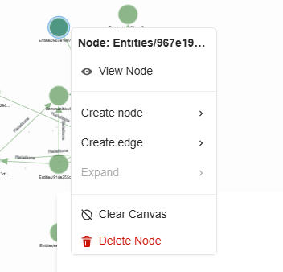

## 2.Graph Visualization

The core function of the Graph Visualizer is to provide an intuitive canvas for exploring graph structures.

### A. List All Graphs
  View and select any graph from the list of connected graphs, including **General Graphs**, **Smart Graphs**, **Satellite Graphs**, **Enterprise Graphs**, and **Knowledge Graphs**.
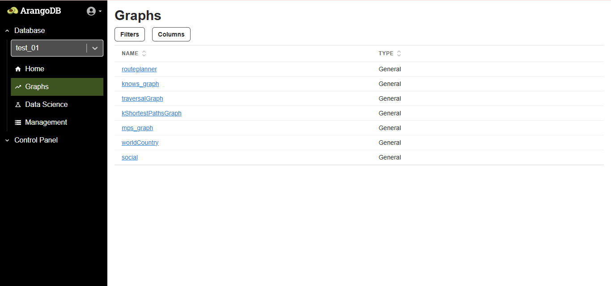

### B. Select and Load a Graph 
  Upon selecting a graph, its nodes and edges are visualized. The visualization includes a summary of the vertex and edge collections involved, providing a clear view of the data model and relationships.
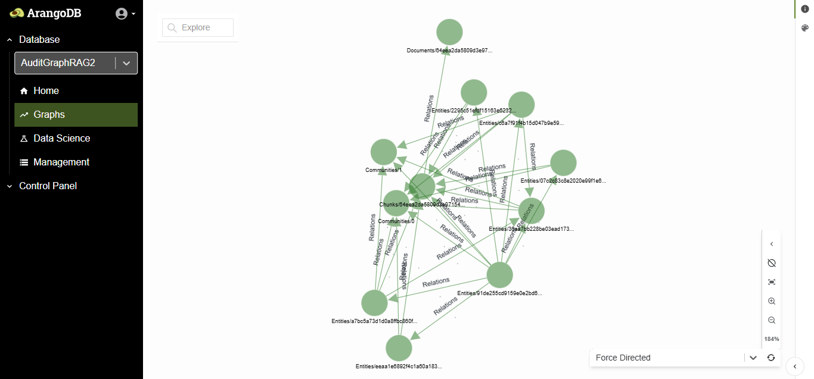
### C. Dynamic Graph Rendering
  In addition to static graphs, you can dynamically render graphs using the **New Query** or **Saved Queries** options. This allows visualizing results from custom AQL queries on demand.

💡 On CLick search bar (Explore) user can able to run the query and see the result on Canvas.And also user can able to save the query for future use.

## 3.Search & Filter Data

The top-left section of the Graph Visualizer includes powerful search and query tools for interactive exploration.

### Search
Click on Search Icon to get Pop-Up then User have to select one of the type of vertex from the provided dropdown and by entering the property name or field  name user can able to fetch the data.

#### 1. Search Icon 
Click on search Icon to get Pop-Up 
#### 2. Select Vertex Type
Select One of the type of vertes from the provided dropdown
#### 3. Search Response
Enter the DataValue or fields to get the required Data
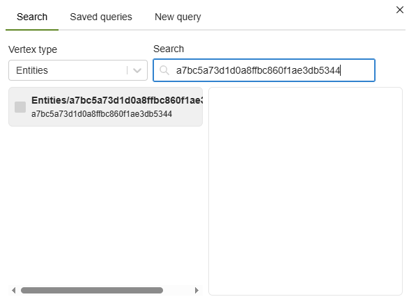

### Saved Queries
Lists all previously saved AQL queries.Each entry supports **Run**, **Copy**, and
**Delete** actions for ease of reuse.
- **Click on Search Icon and Select Saved Queries**
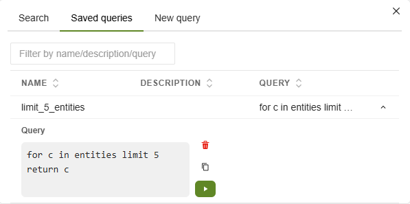
### New Query
Write and execute custom AQL queries within the visualizer.Results are rendered
directly onto the graph canvas.You can save queries with a **custom name and description**,
making them available under **Saved Queries**.

- **Click on Search Icon and Select New Query**
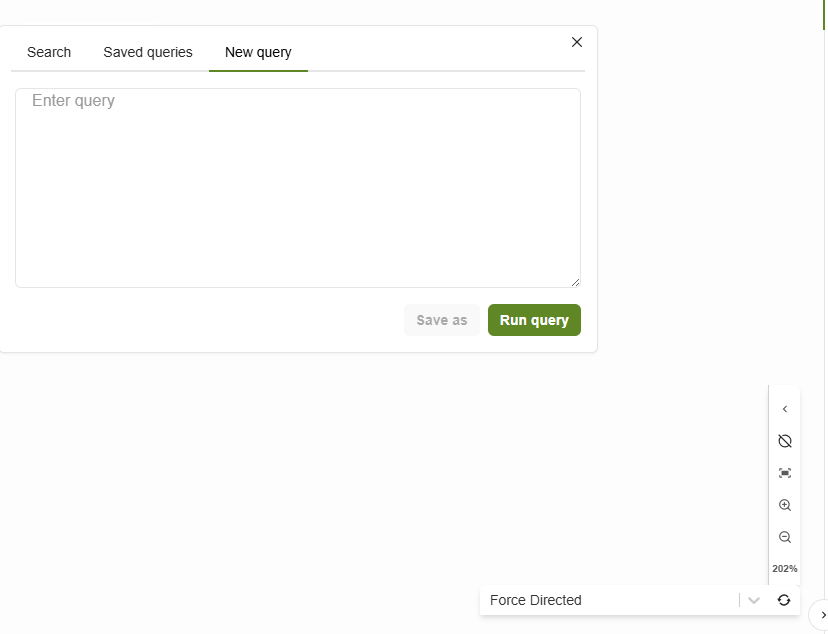

- **Response of the NewQuery**
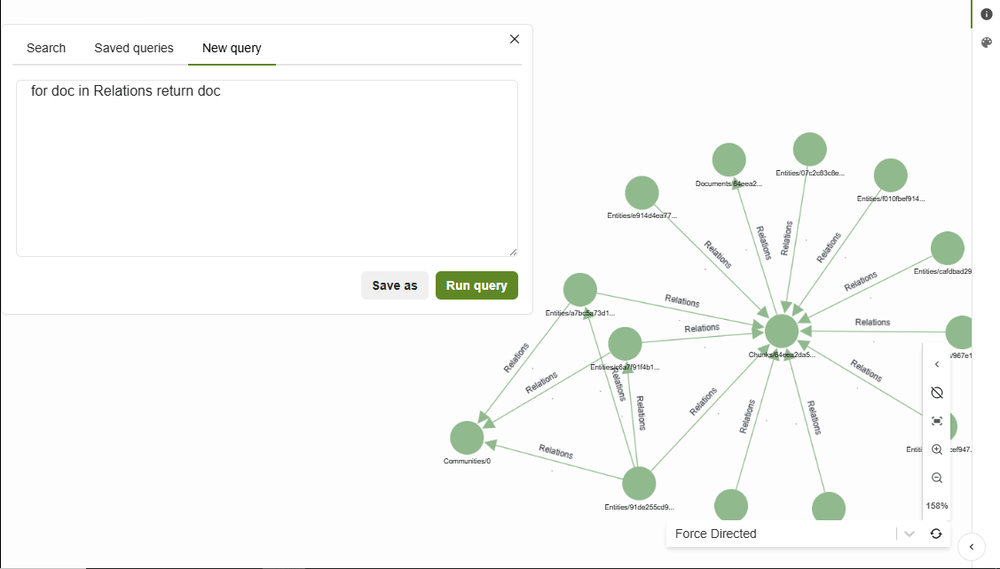

## 4.Visual Customization

Click the **navigation icon** at the bottom-right of the canvas to reveal styling and customization tools.

### Styling Options 
Modify the **color** and **opacity** of selected nodes or edges for emphasis or categorization.
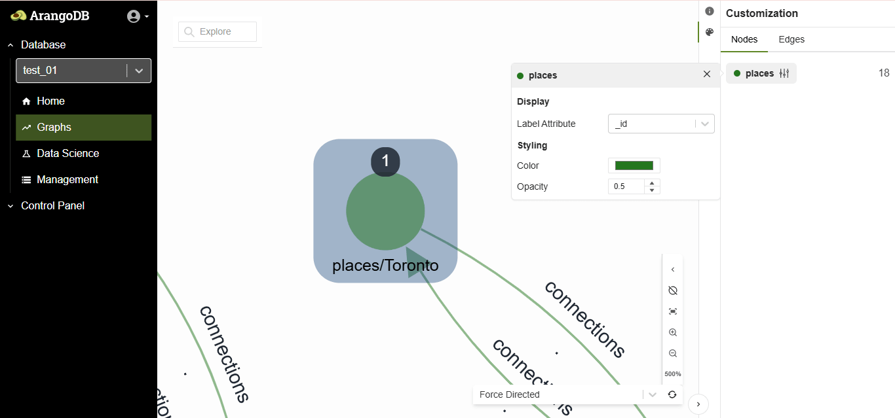

### Edge-Specific Options
- Adjust **line thickness** to represent weight or importance.
- Set **arrowhead styles** for source and target, choosing from different shapes.
These options are especially helpful when working with dense or complex graphs, making key elements stand out.
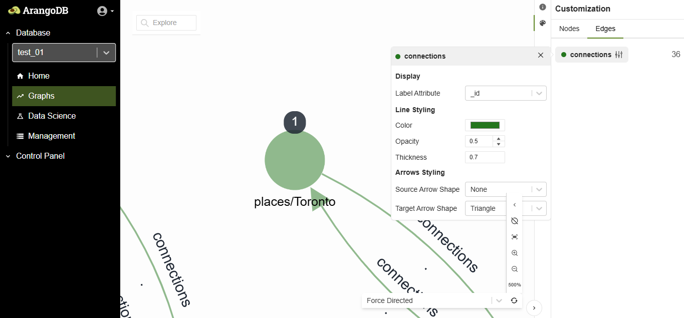

## 5.Layouts and Navigation Tools

Graph layout and navigation tools help users manage large and complex graphs effectively.

- **Mini-map:**  
  View a compact overview of the graph and navigate quickly.
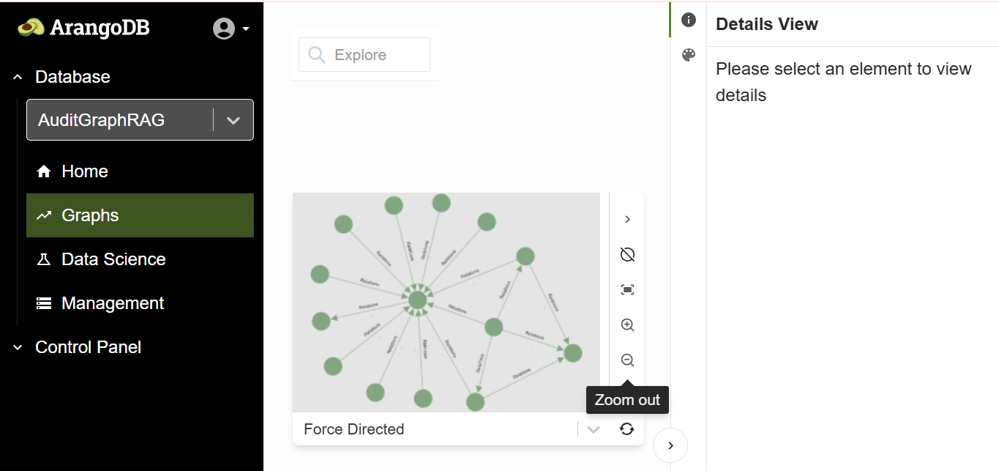

- **Zoom Controls:**  
  Use the buttons to zoom in/out, or manually set a specific zoom percentage.

- **Fit to Screen:**  
  Automatically resize and center the graph to fit the visible canvas.

- **Re-run Layout:**  
  Rearrange nodes and edges to apply a fresh layout for improved clarity.

- **Layout Algorithms:**  
  Switch between layout styles such as:

These features allow better spatial understanding of node clusters, hierarchies,
and relationship flows.
