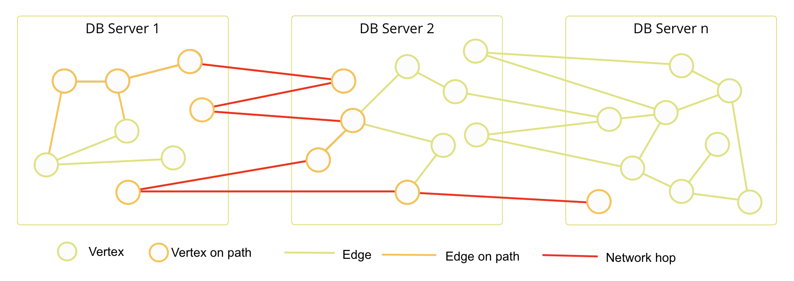
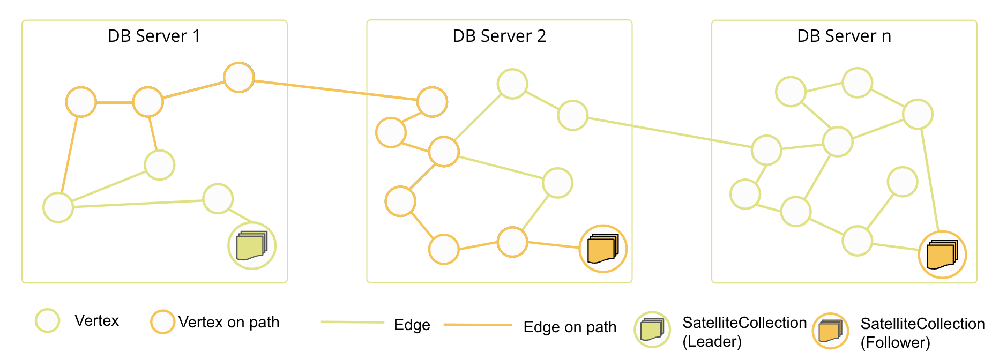

SmartGraphs are specifically targeted at graphs that need scalability and
high performance. They let you intelligently shard large graph datasets for
distributing data across multiple servers with minimal network latency.

Most graphs have one feature - a value that is stored in every node - that
divides the entire graph into several smaller subgraphs. These subgraphs have a
large amount of edges that only connect nodes in the same subgraph and only
have few edges connecting nodes from other subgraphs. If this feature is
known, SmartGraphs can make use if it.

Examples for such graphs are:

- **Social Networks**\
  Typically the feature here is the region/country users live in. Every user has
  more contacts in the same region/country than in other regions/countries.

- **Transport Systems**\
  For transport systems, the common feature is the region/country. There are
  many local connections, but only a few go across countries.

- **E-Commerce**\
  In this case, the category of products is a good feature. Products of the same
  category are often bought together.

In terms of querying there is no difference between SmartGraphs and General Graphs.
For graph querying please refer to [AQL Graph Operations](../../aql/graphs/_index.md)
and [General Graph Functions](../general-graphs/functions.md) sections.
The optimizer is clever enough to identify
whether it is a SmartGraph or not.

Do the hands-on
[ArangoDB SmartGraphs Tutorial](https://www.arangodb.com/using-smartgraphs-arangodb/)
to learn more.

## How SmartGraphs work

Typically, when you shard your data with ArangoDB the goal is to have an even
distribution of data across multiple servers. This approach allows you to scale
out your data at a rather high speed in most cases. However, since one of the
best features of ArangoDB is fast graph traversals, this sort of distribution
can start causing problems if your data grows exponentially.

Instead of traveling across every server before returning data, SmartGraphs use
a clever and optimized way of moving data through the cluster so that you retain
the scalability as well as the performance of graph traversals in ArangoDB. 

The examples below illustrate the difference in how data is sharded in the
cluster for both scenarios. Let's take a closer look at it.

### Random data distribution

The natural distribution of data for graphs that handle large datasets involves
a series of highly interconnected nodes with many edges running between them.

_The orange line indicates an example graph traversal. Notice how it touches nodes on every server._

Once you start connecting the nodes to each other, it becomes clear that the
graph traversal might need to travel across every server before returning
results. This sort of distribution results in many network hops between
DB-Servers and Coordinators.

### Smart data distribution

By optimizing the distribution of data, SmartGraphs reduce the number of network
hops traversals require. 

SmartGraphs come with a concept of a `smartGraphAttribute` that is used to
inform the database how exactly to shard data. When defining this attribute,
think of it as a value that is stored in every node. For instance, in
social network datasets, this attribute can be the ID or the region/country of
the users. 

The graph will than be automatically sharded in such a way that all nodes
with the same value are stored on the same physical machine, all edges
connecting nodes with identical `smartGraphAttribute` values are stored on
this machine as well. Sharding with this attribute means that the relevant data
is now co-located on servers, whenever possible.

_The outcome of moving the data like this is that you retain the scalability as well as the performance of graph traversals in ArangoDB._

## SmartGraphs using SatelliteCollections

SmartGraphs are capable of using [SatelliteCollections](../../develop/satellitecollections.md)
to enable more local execution of graph queries.

You can specify SatelliteCollections in graph definitions as node collections to
create relations between SmartCollections and SatelliteCollections. As SatelliteCollections
(and the edge collections between SmartGraph collections and SatelliteCollections)
are globally replicated to each participating DB-Server, graph traversals
and path search queries can partially be executed locally on each DB-Server.
This means a larger part of the query can be executed fully local
whenever data from the SatelliteCollections is required.

## Disjoint SmartGraphs

Disjoint SmartGraphs are useful for use cases which have to deal with a
large forest of graphs, when you have clearly separated subgraphs in your
graph dataset. Disjoint SmartGraphs enable the automatic sharding of these
subgraphs and prohibit edges connecting them.

_This ensures that graph traversals, shortest path, and k-shortest-paths queries
can be executed locally on a DB-Server, achieving improved performance for
these type of queries._

## Disjoint SmartGraphs using SatelliteCollections

Disjoint SmartGraphs using SatelliteCollections prohibit
edges between nodes with different `smartGraphAttribute` values.
All smart nodes can be connected to satellite nodes.
