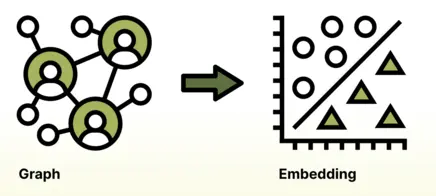

Traditional machine learning overlooks the connections and relationships
between data points, which is where graph machine learning excels. However,
accessibility to GraphML has been limited to sizable enterprises equipped with
specialized teams of data scientists. ArangoGraphML, on the other hand,
simplifies the utilization of GraphML, enabling a broader range of personas to
extract profound insights from their data.

## How GraphML works

GraphML focuses on the utilization of neural networks specifically for
graph-related tasks. It is well-suited for addressing vague or fuzzy problems
and facilitating their resolution. The process involves incorporating a graph's
topology (node and edge structure) and the node and edge characteristics and
features to create a numerical representation known as an embedding.

Graph Neural Networks (GNNs) are explicitly designed to learn meaningful
numerical representations, or embeddings, for nodes and edges in a graph.

By applying a series of steps, GNNs effectively create graph embeddings,
which are numerical representations that encode the essential information
about the nodes and edges in the graph. These embeddings can then be used
for various tasks, such as node classification, link prediction, and
graph-level classification, where the model can make predictions based on the
learned patterns and relationships within the graph.

It is no longer necessary to understand the complexities involved with graph
machine learning, thanks to the accessibility of the ArangoML package.
Solutions with ArangoGraphML only require input from a user about
their data, and the ArangoGraphML managed service handles the rest.

The platform comes preloaded with all the tools needed to prepare your graph
for machine learning, high-accuracy training, and persisting predictions back
to the database for application use.

### Classification

Node classification is a natural fit for graph databases as it can leverage
existing graph analytics insights during model training. For instance, if you
have performed some community detection, you can use these insights as inputs
for graph machine learning. 

#### What is Node Classification

The goal of node classification is to categorize the nodes in a graph based on
their neighborhood connections and characteristics in the graph. Based on the
behaviors or patterns in the graph, the Graph Neural Network (GNN) will be able
to learn what makes a node belong to a category.

Node classification can be used to solve complex problems such as:
- Entity Categorization 
  - Email
  - Books
  - WebPage
  - Transaction
- Social Networks
  - Events
  - Friends
  - Interests
- BioPharmaceutical
  - Protein-protein interaction
  - Drug Categorization
  - Sequence grouping
- Behavior
  - Fraud 
  - Purchase/decision making
  - Anomaly 

Many use cases can be solved with node classification. With many challenges,
there are multiple ways to attempt to solve them, and that's why the
ArangoGraphML node classification is only the first of many techniques to be
introduced. You can sign up to get immediate access to our latest stable
features and also try out other features included in the pipeline, such as
embedding similarity or link prediction.

For more information, [get in touch](https://www.arangodb.com/contact/)
with the ArangoDB team.

### Metrics and Compliance

#### Training Performance

Before using a model to provide predictions to your application, there needs
to be a way to determine its level of accuracy. Additionally, a mechanism must
be in place to ensure the experiments comply with auditor requirements.

ArangoGraphML supports these objectives by storing all relevant training data
and metrics in a metadata graph, which is only available to you and is never
viewable by ArangoDB. This metagraph contains valuable training metrics such as
average accuracy (the general metric for determining model performance), F1,
Recall, Precision, and confusion matrix data. This graph links all experiments
to the source data, feature generation activities, training runs, and prediction
jobs. Having everything linked across the entire pipeline ensures that, at any
time, anything done that could be considered associated with sensitive user data,
it is logged and easily accessible.

### Security

Each deployment that uses ArangoGraphML has an `arangopipe` database created,
which houses all this information. Since the data lives with the deployment,
it benefits from the ArangoGraph SOC 2 compliance and Enterprise security features.
All ArangoGraphML services live alongside the ArangoGraph deployment and are only
accessible within that organization.