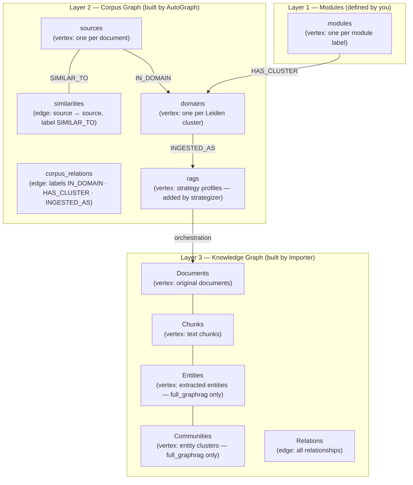
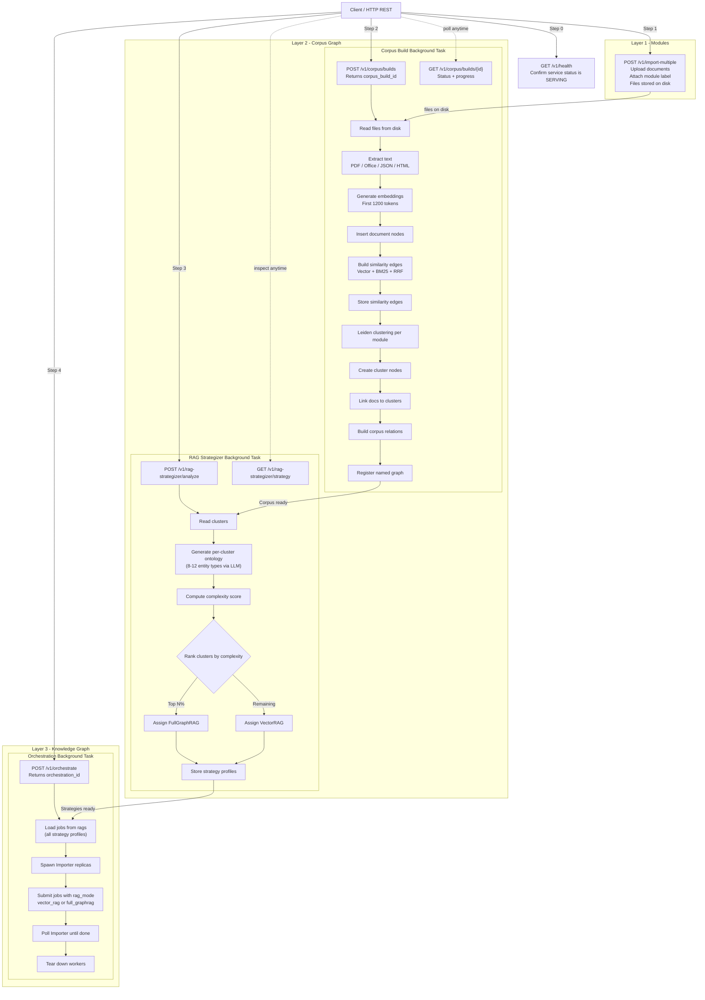

## Three-Layer Knowledge Graph

AutoGraph organizes data in ArangoDB across three layers. Each layer has a clear
owner, a set of collections, and a specific purpose.

All collection names are prefixed with your project name. For example, if the
project is `myapp`, collections will be `myapp_sources`, `myapp_domains`, and so on.

## Collections per layer

### Layer 1 and 2

AutoGraph builds the corpus by creating collections in Layers 1 and 2. These
collections are organized into a named graph called `{project}_CorpusGraph`.

| Collection | Type | Built by |
|------------|------|----------|
| `modules` | vertex | You (via import or build parameters) |
| `sources` | vertex (one per document) | AutoGraph (corpus build) |
| `similarities` | edge (source ↔ source) with label `SIMILAR_TO` | AutoGraph (corpus build) |
| `domains` | vertex (Leiden clusters) | AutoGraph (corpus build) |
| `corpus_relations` | edge with labels `IN_DOMAIN`, `HAS_CLUSTER`, `INGESTED_AS` | AutoGraph (corpus build) |
| `rags` | vertex (strategy profiles) | AutoGraph (RAG Strategizer) |


The `rags` collection is populated by the RAG Strategizer,
and not during the initial corpus build.


**Edge labels in the corpus graph**

AutoGraph assigns semantic labels to edges in the corpus graph to distinguish
different relationship types:

- `SIMILAR_TO`: Applied to edges in the `similarities` collection connecting
  semantically similar documents. These edges include a `similarity_score` field
  (0.0-1.0) computed via vector similarity, BM25 lexical search, and Reciprocal Rank Fusion.
- `IN_DOMAIN`: Applied to membership edges in the `corpus_relations` collection,
  linking documents from the `sources` collection to their cluster vertex in the
  `domains` collection.
- `HAS_CLUSTER`: Edges in the `corpus_relations` collection connecting module vertices to
  their clusters. Links from the `modules` collection to the `domains` collection.
- `INGESTED_AS`: Edges in the `corpus_relations` collection connecting clusters to their
  RAG strategy profiles. Links from the `domains` collection to the `rags` collection.

Labels are stored in the `label` field on each edge document. AQL queries can filter
by label to select specific relationship types (e.g., `FILTER edge.label == "SIMILAR_TO"`).

### Layer 3

The GraphRAG Importer constructs Layer 3 by processing documents into a detailed knowledge
graph stored in the named graph `{project}_kg`. This layer contains the actual document
content, text chunks, and optionally extracted entities and communities, depending on
your chosen RAG strategy.

| Collection | Type | `full_graphrag` | `vector_rag` |
|------------|------|:-:|:-:|
| `Documents` | vertex (original documents) | yes | yes |
| `Chunks` | vertex (text chunks with optional embeddings) | yes | yes |
| `Entities` | vertex (extracted entities with embeddings) | yes | — |
| `Communities` | vertex (entity clusters with optional embeddings) | yes | — |
| `Relations` | edge (PART_OF, MENTIONED_IN, RELATED_TO, IN_COMMUNITY, SUB_COMMUNITY_OF) | yes | yes |
| `SemanticUnits` | vertex (web URLs and images, optional) | if enabled | if enabled |


The `SemanticUnits` collection is intended to hold semantic units extracted from
document content (for example, citations referencing web URLs and images). While
the orchestrator enables semantic units for FullGraphRAG partitions
(`enable_semantic_units: true`), automatic extraction and node creation is not yet
implemented. The collection structure exists but requires manual population or
custom post-processing. See [Known Limitations](reference/error-handling.md#citation-handling) for details.


Layer 3 collections share the same `{project}_` prefix. Each document in Layer 3
carries a `partition_id` field so data from different partitions coexists in the same collections.

The named graph `{project}_CorpusGraph` ties Layers 1 and 2 together.
It contains two edge definitions:
- `similarities` (connecting sources to sources),
- `corpus_relations` (connecting sources, domains, and modules).

## Complete Pipeline

The diagram below shows the full end-to-end API flow across all three layers.
Solid arrows are the sequential pipeline steps; dashed arrows are polling and
inspection calls that you can make at any time.

