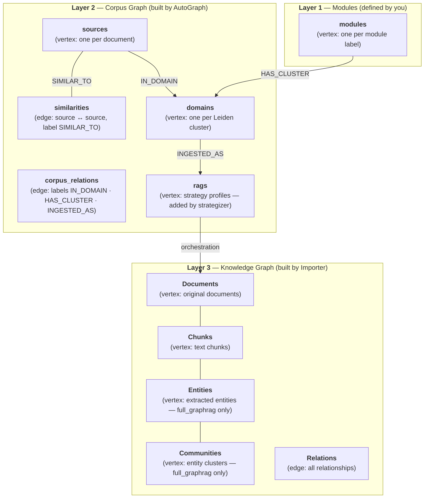
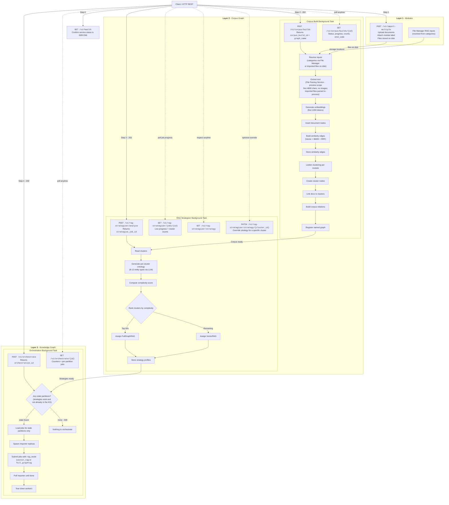
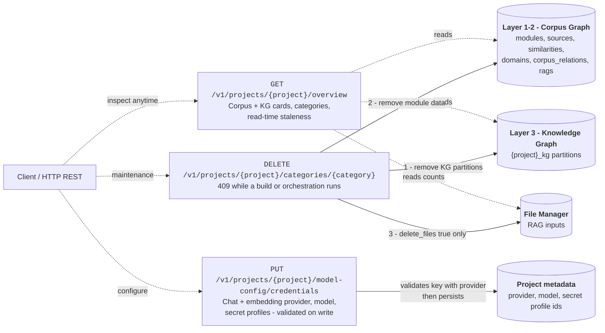

## Three-Layer Knowledge Graph

AutoGraph organizes data in ArangoDB across three layers. Each layer has a clear
owner, a set of collections, and a specific purpose.

All collection names are prefixed with your project name. For example, if the
project is `myapp`, collections will be `myapp_sources`, `myapp_domains`, and so on.

An AutoGraph project is made of two graphs that work as a pipeline: the **corpus
graph** (`{project}_CorpusGraph`) organizes the documents you feed in, and the
**knowledge graph** (`{project}_kg`) is the GraphRAG graph built inside each
partition. They meet only at the `partition_id` link.



## Collections per layer

```mermaid
graph TD
  subgraph "`**Layer 1** — Modules  (defined by you)`"
    modules["`**modules**
      (vertex: one per module label)`"]
  end

  subgraph "`**Layer 2** — Corpus Graph  (built by AutoGraph)`"
    sources["`**sources**
      (vertex: one per document)`"]
    similarities["`**similarities**
      (edge: source ↔ source, label SIMILAR_TO)`"]
    domains["`**domains**
      (vertex: one per Leiden cluster)`"]
    corpus_relations["`**corpus_relations**
      (edge: labels IN_DOMAIN · HAS_CLUSTER · INGESTED_AS)`"]
    rags["`**rags**
      (vertex: strategy profiles — added by strategizer)`"]
  end

  subgraph "`**Layer 3** — Knowledge Graph  (built by Importer)`"
    Documents["`**Documents**
      (vertex: original documents)`"]
    Chunks["`**Chunks**
      (vertex: text chunks)`"]
    Entities["`**Entities**
      (vertex: extracted entities — full_graphrag only)`"]
    Communities["`**Communities**
      (vertex: entity clusters — full_graphrag only)`"]
    Relations["`**Relations**
      (edge: all relationships)`"]
  end

  modules -->|HAS_CLUSTER| domains
  sources ---|SIMILAR_TO| similarities
  sources -->|IN_DOMAIN| domains
  domains -->|INGESTED_AS| rags
  rags -->|orchestration| Documents
  Documents --- Chunks
  Chunks --- Entities
  Entities --- Communities
```

### Layer 1 and 2

AutoGraph builds the corpus by creating collections in Layers 1 and 2. These
collections are organized into a named graph called `{project}_CorpusGraph`.



| Collection | Type | Built by |
|------------|------|----------|
| `modules` | vertex | You (via import or build parameters) |
| `sources` | vertex (one per document) | AutoGraph (corpus build) |
| `similarities` | edge (source ↔ source) with label `SIMILAR_TO` | AutoGraph (corpus build) |
| `domains` | vertex (Leiden clusters) | AutoGraph (corpus build) |
| `corpus_relations` | edge with labels `IN_DOMAIN`, `HAS_CLUSTER`, `INGESTED_AS` | AutoGraph (corpus build) |
| `rags` | vertex (strategy profiles) | AutoGraph (RAG Strategizer) |


The `rags` collection is populated by the RAG Strategizer,
and not during the initial corpus build.


**Edge labels in the corpus graph**

AutoGraph assigns semantic labels to edges in the corpus graph to distinguish
different relationship types:

- `SIMILAR_TO`: Applied to edges in the `similarities` collection connecting
  semantically similar documents. These edges include a `similarity_score` field
  (0.0-1.0) computed via vector similarity, BM25 lexical search, and Reciprocal Rank Fusion.
- `IN_DOMAIN`: Applied to membership edges in the `corpus_relations` collection,
  linking documents from the `sources` collection to their cluster vertex in the
  `domains` collection.
- `HAS_CLUSTER`: Edges in the `corpus_relations` collection connecting module vertices to
  their clusters. Links from the `modules` collection to the `domains` collection.
- `INGESTED_AS`: Edges in the `corpus_relations` collection connecting clusters to their
  RAG strategy profiles. Links from the `domains` collection to the `rags` collection.

Labels are stored in the `label` field on each edge document. AQL queries can filter
by label to select specific relationship types (e.g., `FILTER edge.label == "SIMILAR_TO"`).

### Layer 3

The GraphRAG Importer constructs Layer 3 by processing documents into a detailed knowledge
graph stored in the named graph `{project}_kg`. This layer contains the actual document
content, text chunks, and optionally extracted entities and communities, depending on
your chosen RAG strategy.



| Collection | Type | `full_graphrag` | `vector_rag` |
|------------|------|:-:|:-:|
| `Documents` | vertex (original documents) | yes | yes |
| `Chunks` | vertex (text chunks with optional embeddings) | yes | yes |
| `Entities` | vertex (extracted entities with embeddings) | yes | — |
| `Communities` | vertex (entity clusters with optional embeddings) | yes | — |
| `Relations` | edge (PART_OF, MENTIONED_IN, RELATED_TO, IN_COMMUNITY, SUB_COMMUNITY_OF) | yes | yes |
| `SemanticUnits` | vertex (web URLs and images, optional) | if enabled | if enabled |


The `SemanticUnits` collection is intended to hold semantic units extracted from
document content (for example, citations referencing web URLs and images). While
the orchestrator enables semantic units for FullGraphRAG partitions
(`enable_semantic_units: true`), automatic extraction and node creation is not yet
implemented. The collection structure exists but requires manual population or
custom post-processing. See [Known Limitations](reference/error-handling.md#citation-handling) for details.


Layer 3 collections share the same `{project}_` prefix. Each document in Layer 3
carries a `partition_id` field so data from different partitions coexists in the same collections.


**Where the relationship type is stored differs between the two graphs.** In the
corpus graph, `corpus_relations` and `similarities` store the relationship name in
a **`label`** field. In the knowledge graph, `{project}_Relations` stores it in a
**`type`** field instead (`PART_OF`, `MENTIONED_IN`, `RELATED_TO`, `IN_COMMUNITY`,
`SUB_COMMUNITY_OF`). In both cases the value also lines up one-to-one with the
`_from`/`_to` collection pair, so you can filter either way. See
[Edge fields](#edge-fields) for the full per-edge field list.


The named graph `{project}_CorpusGraph` ties Layers 1 and 2 together.
It contains two edge definitions:
- `similarities` (connecting sources to sources),
- `corpus_relations` (connecting sources, domains, modules, and rags).

## Node fields

When you open a node in the
[Graph Visualizer](../../platform-suite/graph-visualizer.md#view-node-and-edge-properties)
(right-click a node and choose **View node**), a Properties panel lists that node's fields. The tables below show
the fields you can expect on one node of each type, with example values. The system
fields `_id`, `_key`, and `_rev` exist on every node and are omitted. Collection
names use the `{project}_` prefix (the examples below come from a project whose
prefix is `SG_`).

### Corpus-graph nodes

**`sources`** — one ingested source document

| Field | Example value | What it is |
|-------|---------------|------------|
| `filename` | `about-us.md` | Original file name. |
| `content` | `"--- source: https://… Building the world's leading AI data…"` | The raw source text. |
| `module` | `default` | Which module / corpus it belongs to. |
| `partition_id` | (empty until assigned) | Filled once its domain becomes a partition. |
| `embeddings` | `[vector]` | Corpus-level vector used to cluster sources into domains. |

**`domains`** — a topic cluster of similar sources

| Field | Example value | What it is |
|-------|---------------|------------|
| `size` | `100` | Number of sources in the cluster. |
| `members` | `[source ids]` | The sources grouped into this domain. |
| `module` | `default` | Owning module. |

**`rags`** — the RAG-partition configuration (written by the RAG Strategizer)

| Field | Example value | What it is |
|-------|---------------|------------|
| `rag_mode` / `strategy_type` | `FullGraphRAG` | Which RAG strategy the partition uses. |
| `rag_partition_id` | `default_0_a` | Links the partition to its knowledge-graph rows. |
| `chunk_token_size` | `1200` | Target chunk size when splitting documents. |
| `chunk_overlap_token_size` | `100` | Token overlap between consecutive chunks. |
| `enable_chunk_embeddings` | `true` | Whether chunks get their own embeddings. |
| `entity_types` | `[configured types]` | Entity types the extractor may produce (the per-cluster ontology; typically 8–12 types). |
| `smart_graph_attribute` | `partition_id` | The SmartGraph sharding key. |
| `divergence_score` | `0.20` | FullGraphRAG only. How far the partition has drifted since it was last clustered. It is calculated again after every [incremental graph update](incremental-graph-updates.md#partition-divergence-and-reclustering). |
| `divergence_threshold` | `0.25` | FullGraphRAG only. If the score gets above this value, the partition is flagged for reclustering. Stored per partition, but not configurable through the API. |
| `needs_reclustering` | `false` | FullGraphRAG only. Set to `true` if the `divergence_score` is above the threshold. You still need to start the reclustering yourself. |
| `last_reclustered_at` | `2026-05-04T09:12:00Z` | FullGraphRAG only. When the partition was last clustered or reclustered successfully. |

The divergence fields are only used for **FullGraphRAG** partitions. The
divergence is calculated from the entities of a partition, and a reclustering
rebuilds its communities. A VectorRAG partition has neither collection, see
[Layer 3](#layer-3), so it is never flagged for reclustering.

**`modules`** — the top-level corpus container

| Field | Example value | What it is |
|-------|---------------|------------|
| `name` | `default` | Module name. |
| `clusters` | `[domains/cluster_default_0]` | The domains grouped under this module. |

### Knowledge-graph nodes

**`Documents`** — a full document inside a partition (provenance)

| Field | Example value | What it is |
|-------|---------------|------------|
| `file_name` | `enterprise-context-management.md` | Source file (provenance). |
| `content` | `"--- source: https://…"` | Full document text. |
| `partition_id` | `default_0_a` | Which RAG partition it belongs to. |
| `import_number` | `1` | Which import / build produced it. Every incremental import into the same partition adds another batch. |
| `file_ids` | `["rag-input-…"]` | The File Manager IDs stored at import time. [Incremental graph updates](incremental-graph-updates.md) use them to find a document that you want to delete. |

**`Chunks`** — a token-sized passage, the retrieval unit

| Field | Example value | What it is |
|-------|---------------|------------|
| `tokens` | `740` | Length of the chunk in tokens. |
| `chunk_order_index` | `0` | Position of the chunk within its document. |
| `content` | `"--- source: …"` | The passage text. |
| `partition_id` | `default_0_a` | Owning partition. |
| `embedding` | `[vector, when enabled]` | Per-chunk vector for search. |

**`Entities`** — an extracted entity, a node in the graph

| Field | Example value | What it is |
|-------|---------------|------------|
| `entity_name` | `CUSTOMER 360 CO-PILOTS` | The entity's name. |
| `entity_type` | `use_case` | One of the partition's configured ontology types. |
| `description` | `"A use case of the Arango AI Data Platform that unifies profiles…"` | LLM-written description. |
| `partition_id` | `default_0_a` | Owning partition. |
| `embedding` | `[vector]` | Entity embedding for similarity. |

The set of `entity_type` values you see across a corpus is the union of every
partition's ontology, so a multi-cluster corpus shows more distinct types than any
single partition's 8–12.

**`Communities`** — a cluster of related entities

| Field | Example value | What it is |
|-------|---------------|------------|
| `title` | `Cluster 32` | Community title. |
| `level` | `1` | Level in the community hierarchy. |
| `report_string` | `"# GraphRAG and ArangoDB… Community…"` | LLM-written summary report (Markdown). |
| `report_json` | `{ title, summary, rating, rating_explanation, findings }` | Structured version of the report. |
| `occurrence` | `0.37` | How prominent the community is. |
| `sub_communities` | `[ids, if any]` | Child communities (hierarchy). |

## Edge fields

Each edge collection records its relationship name in a different field, plus a few
extras. This is the distinction that is easiest to misread, so it is worth checking
the field name before writing AQL filters.

| Edge collection | Relationship-type field | Other fields |
|-----------------|-------------------------|--------------|
| `corpus_relations` | `label` = `HAS_CLUSTER` / `IN_DOMAIN` / `INGESTED_AS` | `module`, `cluster_id` (IN_DOMAIN only), `_from`, `_to` |
| `Relations` | `type` = `PART_OF` / `MENTIONED_IN` / `RELATED_TO` / `IN_COMMUNITY` / `SUB_COMMUNITY_OF` | `partition_id`, `import_number`, `type`, `_from`, `_to` |
| `similarities` | `label` = `SIMILAR_TO` | `similarity_score`, `module`, `_from`, `_to` |

Knowledge-graph relationships in `Relations` also line up one-to-one with the
collections each edge connects:

| `_from` | `type` | `_to` |
|---------|--------|-------|
| `Entities` | `MENTIONED_IN` | `Chunks` |
| `Entities` | `IN_COMMUNITY` | `Communities` |
| `Entities` | `RELATED_TO` | `Entities` |
| `Chunks` | `PART_OF` | `Documents` |
| `Communities` | `SUB_COMMUNITY_OF` | `Communities` |

## Things people misread

- **Two graphs, not one.** The corpus graph and the knowledge graph are separate;
  they meet only at the partition.
- **The relationship type lives in different fields.** `corpus_relations` and
  `similarities` use a `label` field; `Relations` uses a `type` field. Both also
  match the `_from`/`_to` collections.
- **Arrow direction is not build order.** Arrows show ownership/provenance, not the
  sequence in which the pipeline created the nodes.
- **`rags` → `Documents` is a property link, not a stored edge.** They are joined by
  the `rags` side's `rag_partition_id` matching `Documents.partition_id`, not by an
  edge in any collection.
- **`module` is both a vertex and a property.** It is a node in the `modules`
  collection and also a field stored on `sources`, `domains`, and `rags`.
- **The corpus embedding is not the retrieval index.** The `sources` embedding is a
  single-vector clustering signature (from the first chunk); the full text is
  chunked and indexed separately in the knowledge graph.

## Complete Pipeline

The diagram below shows the full end-to-end API flow across all three layers.
Solid arrows are the sequential pipeline steps; dashed arrows are polling and
inspection calls that you can make at any time.

```mermaid
flowchart TD

    Client["Client / HTTP REST"]

    %% Entry points
    Client -->|Step 0| HEALTH
    Client -->|Step 1| IMP
    Client -->|Step 2 - 202| BUILD
    Client -.->|poll anytime| STATUS
    Client -->|Step 3 - 202| STRAT
    Client -.->|poll job progress| STRATJOB
    Client -.->|inspect anytime| GETSTRAT
    Client -.->|optional override| PATCHSTRAT
    Client -->|Step 4 - 202| ORCH
    Client -.->|poll anytime| ORCHSTATUS

    %% Health
    HEALTH["`<code>GET /v1/health</code>
      Confirm service status is <code>SERVING</code>`"]

    %% Layer 1
    subgraph L1 ["`**Layer 1** - Modules`"]
        IMP["`<code>POST /v1/import-multiple</code>
          Upload documents
          Attach module label
          Files stored on disk`"]
        FM["`File Manager RAG inputs
          (resolved from categories)`"]
    end

    %% Layer 2
    subgraph L2 ["`**Layer 2** - Corpus Graph`"]

        %% Build Pipeline
        subgraph BUILD_PIPE [Corpus Build Background Task]
            BUILD["`<code>POST /v1/corpus/builds</code>
              Returns <code>corpus_build_id</code> + <code>graph_name</code>`"]
            STATUS["`<code>GET /v1/corpus/builds/{id}</code>
              Status, progress, counts, error_code`"]

            B1["`Resolve inputs
              (categories via File Manager
              or imported files on disk)`"]
            B2["`Extract text
              (File Parsing Service - preview scope
              first 4800 chars, no images;
              imported files parsed in-process)`"]
            B3["`Generate embeddings
              (first 1200 tokens)`"]
            B4["Insert document nodes"]
            B5["`Build similarity edges
              (Vector + BM25 + RRF)`"]
            B6["Store similarity edges"]
            B7["Leiden clustering per module"]
            B8["Create cluster nodes"]
            B9["Link docs to clusters"]
            B10["Build corpus relations"]
            B11["Register named graph"]

            BUILD --> B1 --> B2 --> B3 --> B4 --> B5 --> B6 --> B7 --> B8 --> B9 --> B10 --> B11
        end

        %% Strategizer
        subgraph STRAT_PIPE [RAG Strategizer Background Task]
            STRAT["`<code>POST /v1/rag-strategizer/analyze</code>
              Returns <code>strategize_job_id</code>`"]
            STRATJOB["`<code>GET /v1/rag-strategizer/jobs/{id}</code>
              Live progress + cluster counts`"]
            GETSTRAT["`<code>GET /v1/rag-strategizer/strategy</code>`"]
            PATCHSTRAT["`<code>PATCH /v1/rag-strategizer/strategy/{cluster_id}</code>
              Override strategy for a specific cluster`"]

            S1["Read clusters"]
            S2["`Generate per-cluster ontology
              (8-12 entity types via LLM)`"]
            S3["Compute complexity score"]
            S4{"Rank clusters by complexity"}
            S5["Assign FullGraphRAG"]
            S6["Assign VectorRAG"]
            S7["Store strategy profiles"]

            STRAT --> S1 --> S2 --> S3 --> S4
            S4 -->|Top N%| S5 --> S7
            S4 -->|Remaining| S6 --> S7
        end
    end

    %% Layer 3
    subgraph L3 ["`**Layer 3** - Knowledge Graph`"]

        subgraph ORCH_PIPE [Orchestration Background Task]
            ORCH["`<code>POST /v1/orchestrate</code>
              Returns <code>orchestration_id</code>`"]
            ORCHSTATUS["`<code>GET /v1/orchestrate/{id}</code>
              Counters + per-partition jobs`"]

            O0{"`Any stale partitions?
              (strategies exist and
              not already in the KG)`"}
            O1["Load jobs for stale partitions only"]
            O2["Spawn Importer replicas"]
            O3["`Submit jobs with <code>rag_mode</code>
              (<code>vector_rag</code> or <code>full_graphrag</code>`"]
            O4["Poll Importer until done"]
            O5["Tear down workers"]

            ORCH --> O0
            O0 -->|none - 409| ORCHREJECT["Nothing to orchestrate"]
            O0 -->|stale found| O1 --> O2 --> O3 --> O4 --> O5
        end
    end

    %% Cross-layer connections
    IMP -->|files on disk| B1
    FM -->|storage locations| B1
    B11 -->|Corpus ready| S1
    S7 -->|Strategies ready| O0
```

## Project-level operations

These endpoints sit outside the sequential pipeline. You can inspect and configure
a project at any time. Deleting a category is guarded against a running corpus
build or orchestration.

```mermaid
flowchart LR

    Client["Client / HTTP REST"]

    Client -.->|inspect anytime| OVERVIEW
    Client -.->|configure| MODELCFG
    Client -.->|maintenance| DELCAT

    OVERVIEW["`<code>GET /v1/projects/{project}/overview</code>
      Corpus + KG cards, categories,
      read-time staleness`"]
    MODELCFG["`<code>PUT /v1/projects/{project}/model-config/credentials</code>
      Chat + embedding provider, model,
      secret profiles - validated on write`"]
    DELCAT["`<code>DELETE /v1/projects/{project}/categories/{category}</code>
      409 while a build or orchestration runs`"]

    L2R[("`**Layer 1-2 - Corpus Graph**
      modules, sources, similarities,
      domains, corpus_relations, rags`")]
    L3R[("`**Layer 3 - Knowledge Graph**
      {project}_kg partitions`")]
    FMR[("`**File Manager**
      RAG inputs`")]
    META[("`**Project metadata**
      provider, model, secret profile ids`")]

    OVERVIEW -.->|reads| L2R
    OVERVIEW -.->|reads| L3R
    OVERVIEW -.->|reads counts| FMR

    MODELCFG -->|"`validates key with provider
      then persists`"| META

    DELCAT -->|1 - remove KG partitions| L3R
    DELCAT -->|2 - remove module data| L2R
    DELCAT -->|3 - delete_files true only| FMR
```
