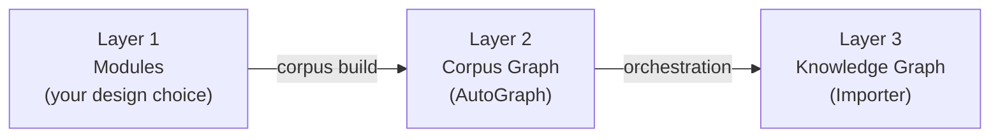

This guide explains how to structure your data when building knowledge graphs
with AutoGraph. It covers module design, the three processing layers, and when
to use each component.

## AutoGraph vs. Importer

AutoGraph and the Importer are separate services with distinct responsibilities:

**AutoGraph** (this service) is the primary control plane for ingestion and
corpus graph construction. It handles importing files, building the corpus graph
(similarity edges and Leiden clusters), running the RAG strategizer, and
orchestrating Importer workers. It writes Layer 1 and Layer 2 data to ArangoDB
and strategy profiles to the `rags` collection.

**The Importer** is a GraphRAG worker that executes per-partition import jobs
submitted by AutoGraph after orchestration. It produces Layer 3 artifacts
(chunking, entity extraction) inside each `rag_partition_id`.

**Which service do I call?**

| What you need to do | Service |
|---------------------|---------|
| Import or manage files in the corpus | AutoGraph |
| Build similarity edges or Leiden clusters | AutoGraph |
| Assign or inspect RAG strategies (`rags`) | AutoGraph |
| Run the GraphRAG pipeline for a partition | Importer (via AutoGraph orchestration) |


In the standard workflow, you do not call the Importer directly. AutoGraph's
`POST /v1/orchestrate` spawns Importer replicas and submits jobs automatically.
Call the Importer yourself only for standalone integrations or recovery
scenarios (for example, re-running a single failed partition).


## The three layers

AutoGraph organizes data across three layers. Each layer builds on the one
below it. See the [Architecture](architecture.md) page for the full collections
diagram.



### Layer 1 - Modules (your design choice)

A module is a label you attach to documents via the `module` field at
[import time](reference/importing-files.md), or assigned from metadata during
the corpus build. Modules are the unit of isolation:

- No cross-module similarity edges
- Clustering runs inside each module independently
- Rebuilds can target a single module using `incremental: true` with `modules`

See [Designing modules](#designing-modules) for split-vs-merge trade-offs.

### Layer 2 - Corpus Graph (AutoGraph)

For each module, AutoGraph builds:
- Document vertices in the `sources` collection
- Similarity edges (vector + BM25 + RRF) in `similarities`
- Leiden cluster vertices in `domains`
- Membership and `HAS_CLUSTER` edges in `corpus_relations`
- A `modules` collection linking modules to their clusters
- Strategy profiles in `rags` (after running the
  [RAG strategizer](reference/rag-strategizer.md))

The named graph `{project}_CorpusGraph` is the map of your entire corpus; it
shows what is connected to what before the full GraphRAG import.

### Layer 3 - Per-partition Knowledge Graph (Importer)

After strategies exist, [orchestration](reference/orchestration.md) assigns each
`rag_partition_id` to an Importer job. The Importer creates `Documents`,
`Chunks`, and `Relations` for every partition. FullGraphRAG partitions also get
`Entities` and `Communities` (rich entity and relationship graphs); VectorRAG
skips those for a lighter path.

All Layer 3 data lives in the `{project}_kg` named graph, partitioned by the
`partition_id` field on each document.

## What can a module be?

A module is any stable string identifier that groups documents that should share
similarity and clustering with each other, but not with other groups. Treat it
as a shard key for the corpus graph, not a display name.

Good candidates:

- **Product or surface**: `"docs"`, `"api"`, `"console"`
- **Audience or function**: `"legal"`, `"support"`, `"engineering"`
- **Locale**: `"en"`, `"de"` - useful when you do not want cross-language similarity
- **Tenant or org unit**: one module per customer or business unit when isolation is required
- **Default bucket**: omit the module at import time or rely on `default` (assigned during corpus build for any file without a label) for a single mixed corpus

## How modules become a partitioned knowledge graph

The same module string flows through the entire pipeline, from files to
Importer partitions:

1. **Ingestion** —
   [`POST /v1/import-multiple`](reference/importing-files.md) accepts a `module`
   field for the batch. Files without a module receive the `default` label when
   the corpus build runs.

2. **Corpus build** —
   Processing runs per module, sequentially. Within a module, similarity
   computation and Leiden clustering see only that module's documents.

3. **Cluster key naming** —
   Cluster vertices use keys like `cluster_<module>_<n>` when a module label is
   present (for example, `cluster_legal_0`), or `cluster_<n>` when no module was
   assigned. This prevents collisions across modules.

4. **Graph wiring** —
   `modules` vertices link to their clusters via `HAS_CLUSTER` edges. Documents
   link into clusters via `corpus_relations` membership edges.

5. **RAG strategizer** —
   The [strategizer](reference/rag-strategizer.md) reads clusters, ranks them by
   complexity, and assigns VectorRAG or FullGraphRAG. It writes profiles to the
   `rags` collection with a `rag_partition_id` derived from the cluster key.
   - Suffix `_a` indicates a FullGraphRAG partition
   - Suffix `_b` indicates a VectorRAG partition
   - Example: cluster key `cluster_legal_0` produces partition ID `legal_0_a`

6. **Orchestration** —
   [`POST /v1/orchestrate`](reference/orchestration.md) loads every matching
   profile from `rags` and runs one Importer job per `rag_partition_id`. This is
   how modules become parallel partitions in Layer 3; a partitioned knowledge
   graph, not a single undifferentiated blob.

Use `partition_ids` on the orchestrate request to re-run or subset specific
partitions (for example, only `legal_0_a`) without touching others.

---

## When to use AutoGraph

Use AutoGraph for everything up to and including Layer 2.

| Goal | Endpoint |
|------|----------|
| Import documents and assign them to a module | [`POST /v1/import-multiple`](reference/importing-files.md) |
| Build the corpus graph (similarity + clusters) | [`POST /v1/corpus/builds`](reference/corpus-build.md) |
| Monitor a build in progress | [`GET /v1/corpus/builds/{id}`](reference/corpus-build.md#monitoring-build-status) |
| Assign VectorRAG or FullGraphRAG per cluster | [`POST /v1/rag-strategizer/analyze`](reference/rag-strategizer.md) |
| Run orchestration (Importer jobs for all profiles) | [`POST /v1/orchestrate`](reference/orchestration.md) |
| Add a module without rebuilding the whole corpus | [`POST /v1/corpus/builds`](reference/corpus-build.md#incremental-builds) with `incremental: true` |
| Embed a field on an existing ArangoDB collection | [`POST /v1/embed-field-in-collection`](reference/embeddings.md) |

### Incremental vs. full builds

- **`incremental: false`** (default) - wipes and rebuilds data for all
  discovered modules. Use for first builds or full rebuilds.
- **`incremental: true`** - preserves all modules except those listed in
  `modules`, which are wiped and rebuilt from their current files. Use to add a
  new module or update one module without touching others.


Do not use incremental mode for a first-time build; there is no existing data
to preserve. See [Incremental Builds](reference/corpus-build.md#incremental-builds)
for details.


---

## When to use the Importer

The Importer populates Layer 3 (the Knowledge Graph). Under normal operation,
you do not call it directly. AutoGraph spawns Importer workers automatically
when you call `POST /v1/orchestrate`.

```
AutoGraph orchestration (POST /v1/orchestrate)
  │
  ├─ Loads every strategy profile from rags (VectorRAG + FullGraphRAG)
  │
  ├─ Spawns Importer replica pool
  │
  └─ Submits one import job per profile
       • vector_rag   → Documents, Chunks, Relations
       • full_graphrag → Documents, Chunks, Entities, Communities, Relations
```

**When you do interact with the Importer directly:**

- **Re-running a specific partition** - pass `partition_ids` in
  [`POST /v1/orchestrate`](reference/orchestration.md) to target only the
  partitions you need rather than re-orchestrating the entire corpus.
- **Configuring Importer behavior** - pass environment variable overrides in
  the `importer_env` map of the orchestration request (for example, chunk sizes
  or model endpoints) without rebuilding the corpus.
- **Standalone mode** - if you are running the Importer as an independent
  service outside AutoGraph, you call it directly with a pre-existing partition.
  This is an advanced pattern not required for the standard workflow.


After the RAG strategizer has written profiles to `rags`, call
`POST /v1/orchestrate` to have Importer workers process those profiles. Both
FullGraphRAG and VectorRAG partitions receive Importer jobs. Use `partition_ids`
to target specific partitions if you want to exclude some from processing.


---

## Per-cluster ontology (entity_types)

Beyond assigning VectorRAG or FullGraphRAG, the
[strategizer](reference/rag-strategizer.md) generates a domain-specific ontology
for each cluster - a list of 8–12 entity types that defines what the Importer
extracts.

**How it works:**

1. The strategizer samples documents from each cluster.
2. An LLM analyzes the samples and identifies the most representative entity
   types for that domain.
3. The resulting list is stored in the `rags` collection alongside the strategy
   profile. For example:
   - Aviation corpus: `DRONE`, `FLIGHT_PLAN`, `SENSOR`, `AIRSPACE`
   - Legal corpus: `CONTRACT`, `JURISDICTION`, `LEGISLATION`
4. Orchestration passes the ontology to the Importer, which uses it to constrain
   entity extraction; only entities matching the ontology are created in the
   knowledge graph.

Without a per-cluster ontology, the Importer falls back to generic entity types
and misses domain-specific concepts. The ontology is the schema of your
knowledge graph; it determines what entities, relationships, and communities
Layer 3 contains.

You can inspect each cluster's ontology via
[`GET /v1/rag-strategizer/strategy`](reference/rag-strategizer.md#retrieve-rag-strategies)
(the `entity_types` field in each strategy profile).

---

## Designing modules

Modules are the primary architectural decision you make at ingestion time. They
cannot be merged after the fact without a full rebuild of the affected modules.

**Split into separate modules when:**

- Documents belong to fundamentally different knowledge domains (for example,
  legal contracts vs. product engineering specs)

**Keep as a single module (or use `default`) when:**

- All documents cover a single product or system (for example, all technical
  guides for one software platform)
- You have a small corpus (fewer than a few hundred documents); clustering
  benefits diminish when the pool is too small to form meaningful groups
- You are prototyping and have not yet determined domain boundaries

**Practical naming examples:**

| Scenario | Suggested modules |
|----------|-------------------|
| SaaS product with docs, legal, and support content | `"docs"`, `"legal"`, `"support"` |
| Multi-language knowledge base | `"en"`, `"de"`, `"fr"` |
| Single unified internal wiki | `"default"` |
| Regulated industry with strict data separation | one module per business unit |

**Rules of thumb:**
- Start with fewer modules and split later if queries return irrelevant
  cross-domain results.
- A module with fewer than ~20 documents produces a single cluster; the RAG
  strategizer has little signal to differentiate strategies.
- Module names are stored in document metadata and in `HAS_CLUSTER` edges.
  Choose names that are stable identifiers, not human-readable labels that might
  change.

## Next steps

- [Architecture](architecture.md): Collections and named graphs per layer
- [Quickstart](quickstart.md): End-to-end setup with the web interface or API
- [Import Files](reference/importing-files.md): Upload documents with module labels
- [Corpus Build](reference/corpus-build.md): Trigger and monitor corpus builds
- [RAG Strategizer](reference/rag-strategizer.md): Analyze clusters and assign strategies
- [Orchestration](reference/orchestration.md): Spawn Importer workers
- [Error Handling](reference/error-handling.md): Troubleshooting common issues
