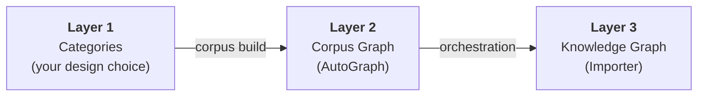

This guide explains how to structure your data when building knowledge graphs
with AutoGraph. It covers category design, the three processing layers, and when
to use each component.

## AutoGraph vs. Importer

AutoGraph and the Importer are separate services with distinct responsibilities:

**AutoGraph** (this service) is the primary control plane for ingestion and
corpus graph construction. It handles importing files, building the corpus graph
(similarity edges and Leiden clusters), running the RAG strategizer, and
orchestrating Importer workers. It writes Layer 1 and Layer 2 data to ArangoDB
and strategy profiles to the `rags` collection.

**The Importer** is a GraphRAG worker that executes per-partition import jobs
submitted by AutoGraph after orchestration. It produces Layer 3 artifacts
(chunking, entity extraction) inside each `rag_partition_id`.

**Which service do I call?**

| What you need to do | Service |
|---------------------|---------|
| Import or manage files in the corpus | AutoGraph |
| Build similarity edges or Leiden clusters | AutoGraph |
| Assign or inspect RAG strategies (`rags`) | AutoGraph |
| Run the GraphRAG pipeline for a partition | Importer (via AutoGraph orchestration) |


In the standard workflow, you do not call the Importer directly. AutoGraph's
`POST /v1/orchestrate` spawns Importer replicas and submits jobs automatically.
Call the Importer yourself only for standalone integrations or recovery
scenarios (for example, re-running a single failed partition).


## The three layers

AutoGraph organizes data across three layers. Each layer builds on the one
below it. See the [Architecture](architecture.md) page for the full collections
diagram.


```mermaid
flowchart LR
  L1["`**Layer 1**
    Categories
    (your design choice)`"]      
  L2["`**Layer 2**
    Corpus Graph
    (AutoGraph)`"]      
  L3["`**Layer 3**
    Knowledge Graph
    (Importer)`"]      
  L1 -->|corpus build| L2 -->|orchestration| L3
```

### Layer 1 - Categories (your design choice)

A category is the label a document is filed under: the second level of its
[File Manager](../../platform-suite/file-manager/api.md#scopes) scope,
`[project, category]`.
A legacy [`POST /v1/import-multiple`](reference/importing-files.md) upload sets
it through the `module` field instead. Categories are the unit of isolation:

- No cross-category similarity edges
- Clustering runs inside each category independently
- A build targets individual categories through the `categories` parameter

See [Designing categories](#designing-categories) for split-vs-merge trade-offs.


**`module` is the internal name of the same thing.** The corpus graph stores a
category as a `module`, and several internal fields keep that name, such as the
`modules` collection and the `jobs[].category` of an orchestration status. Those
values are encoded, for example `myproject_legal`, and are never what you send.
Requests always take the bare label, see
[The category contract](reference/_index.md#the-category-contract).


### Layer 2 - Corpus Graph (AutoGraph)

For each category, AutoGraph builds:
- Document vertices in the `sources` collection
- Similarity edges (vector + BM25 + RRF) in `similarities`
- Leiden cluster vertices in `domains`
- Membership and `HAS_CLUSTER` edges in `corpus_relations`
- A `modules` collection linking categories to their clusters
- Strategy profiles in `rags` (after running the
  [RAG strategizer](reference/rag-strategizer.md))

The named graph `{project}_CorpusGraph` is the map of your entire corpus; it
shows what is connected to what before the full GraphRAG import.

### Layer 3 - Per-partition Knowledge Graph (Importer)

After strategies exist,
[orchestration](reference/orchestration.md#trigger-orchestration) assigns each
`rag_partition_id` to an Importer job. The Importer creates `Documents`,
`Chunks`, and `Relations` for every partition. FullGraphRAG partitions also get
`Entities` and `Communities` (rich entity and relationship graphs); VectorRAG
skips those for a lighter path.

All Layer 3 data lives in the `{project}_kg` named graph, partitioned by the
`partition_id` field on each document.

## What can a category be?

A category is any stable string identifier that groups documents that should
share similarity and clustering with each other, but not with other groups.
Treat it as a shard key for the corpus graph, not a display name.

Good candidates:

- **Product or surface**: `"docs"`, `"api"`, `"console"`
- **Audience or function**: `"legal"`, `"support"`, `"engineering"`
- **Locale**: `"en"`, `"de"` - useful when you do not want cross-language similarity
- **Tenant or org unit**: one category per customer or business unit when isolation is required
- **Default bucket**: a single mixed corpus can rely on `default`, which the corpus build assigns to any file that has no label

## How categories become a partitioned knowledge graph

The same category label flows through the entire pipeline, from files to
Importer partitions:

1. **Ingestion** -
   Files uploaded to the
   [File Manager](../../platform-suite/file-manager/api.md#upload-a-rag-input-file)
   carry the category as the second level of their scope, and
   [`POST /v1/corpus/builds`](reference/corpus-build.md) takes those labels in
   `categories`. The legacy
   [`POST /v1/import-multiple`](reference/importing-files.md) accepts a `module`
   field for the batch instead. Files without a label receive the `default`
   category when the corpus build runs.

2. **Corpus build** -
   Processing runs per category, sequentially. Within a category, similarity
   computation and Leiden clustering see only that category's documents.

3. **Cluster key naming** -
   Cluster vertices use keys like `cluster_<module>_<n>`, where `<module>` is the
   stored form of the category (for example, `cluster_legal_0`), or
   `cluster_<n>` when no label was assigned. This prevents collisions across
   categories.

4. **Graph wiring** -
   `modules` vertices link to their clusters via `HAS_CLUSTER` edges. Documents
   link into clusters via `corpus_relations` membership edges.

5. **RAG strategizer** -
   The [strategizer](reference/rag-strategizer.md) reads clusters, ranks them by
   complexity, and assigns VectorRAG or FullGraphRAG. It writes profiles to the
   `rags` collection with a `rag_partition_id` derived from the cluster key.
   - Suffix `_a` indicates a FullGraphRAG partition
   - Suffix `_b` indicates a VectorRAG partition
   - Example: cluster key `cluster_legal_0` produces partition ID `legal_0_a`

6. **Orchestration** -
   [`POST /v1/orchestrate`](reference/orchestration.md#trigger-orchestration) loads every matching
   profile from `rags` and runs one Importer job per `rag_partition_id`. This is
   how categories become parallel partitions in Layer 3; a partitioned knowledge
   graph, not a single undifferentiated blob.

Use `categories` on the orchestrate request to subset the run to specific
categories (for example, only `legal`) without touching the others. Scoping
stops at the category, so you cannot single out one partition of a category. To
reprocess individual documents, pass their `file_ids` instead.

---

## When to use AutoGraph

Use AutoGraph for everything up to and including Layer 2.

| Goal | Endpoint |
|------|----------|
| Upload documents and assign them to a category | Upload to the [File Manager](../../platform-suite/file-manager/api.md#upload-a-rag-input-file) under the scope `[project, category]`, then build with those labels in `categories` |
| Build the corpus graph (similarity + clusters) | [`POST /v1/corpus/builds`](reference/corpus-build.md) |
| Monitor a build in progress | [`GET /v1/corpus/builds/{id}`](reference/corpus-build.md#monitoring-build-status) |
| Assign VectorRAG or FullGraphRAG per cluster | [`POST /v1/rag-strategizer/analyze`](reference/rag-strategizer.md) |
| Run orchestration (Importer jobs for all profiles) | [`POST /v1/orchestrate`](reference/orchestration.md#trigger-orchestration) |
| Add a category without rebuilding the whole corpus | [`POST /v1/corpus/builds`](reference/corpus-build.md) with only the new category in `categories` |
| Append documents to a category that is already built | [`POST /v1/corpus/builds`](reference/corpus-build.md#incremental-builds) with `incremental: true` |
| Add, remove, or replace individual documents in an existing category | [`POST /v1/graph/insert`, `/delete`, `/update`](reference/orchestration.md#insert-documents) |
| Rebuild the Layer 3 communities of a FullGraphRAG partition after many document changes | [`POST /v1/graph/recluster`](reference/orchestration.md#trigger-reclustering) |
| Inspect the state of the project and its categories | [`GET /v1/projects/{project}/overview`](reference/project-operations.md#project-overview) |
| Remove a category and everything it contributed | [`DELETE /v1/projects/{project}/categories/{category}`](reference/project-operations.md#delete-category) |
| Embed a field on an existing ArangoDB collection | [`POST /v1/embed-field-in-collection`](reference/embeddings.md) |

### Incremental vs. full builds

- **`incremental: false`** (default) - builds the listed categories from scratch.
  It is only accepted when every listed category is **new** to the corpus. Use it
  for a first build and when you add a category.
- **`incremental: true`** - appends to the listed categories and leaves every
  other category untouched. On a File Manager build it also removes corpus
  documents that are no longer in the File Manager listing.


**A category that is already built cannot be rebuilt in place.** A build with
`incremental: false` that lists an existing category is rejected with
`REBUILD_NOT_ALLOWED`, because the knowledge graph cannot be rebuilt from the
new vectors.

To rebuild a category cleanly, remove it with
[`DELETE /v1/projects/{project}/categories/{category}`](reference/project-operations.md#delete-category)
first, then build it, run the RAG Strategizer, and orchestrate again.


### Document-level changes

Neither build mode is a good fit if documents change regularly. A build works at
the granularity of a whole category and recomputes its similarity and clustering,
and it never touches Layer 3. To add, remove, or replace individual documents in
a category that is already built, and keep its clusters, strategy profiles, and
knowledge graph consistent, use
[Incremental Graph Updates](incremental-graph-updates.md) instead.

| Change | How to apply it |
|--------|------|
| A few documents are added, removed, or replaced | [Incremental Graph Updates](incremental-graph-updates.md) |
| Many documents are added to an existing category | Corpus build with that category in `categories` and `incremental: true` |
| A new category | Corpus build with only the new category in `categories` |
| A clean rebuild of one category | [Delete the category](reference/project-operations.md#delete-category), then build, strategize, and orchestrate it again |

---

## When to use the Importer

The Importer populates Layer 3 (the Knowledge Graph). Under normal operation,
you do not call it directly. AutoGraph spawns Importer workers automatically
when you call `POST /v1/orchestrate`.

```
AutoGraph orchestration (POST /v1/orchestrate)
  │
  ├─ Loads every strategy profile from rags (VectorRAG + FullGraphRAG)
  │
  ├─ Spawns Importer replica pool
  │
  └─ Submits one import job per profile
       • VectorRAG    → Documents, Chunks, Relations
       • FullGraphRAG → Documents, Chunks, Entities, Communities, Relations
```

**When you do interact with the Importer directly:**

- **Re-running part of the corpus** - pass `categories` in
  [`POST /v1/orchestrate`](reference/orchestration.md#trigger-orchestration) to orchestrate only the
  categories you need, or `file_ids` to reprocess only specific documents, rather
  than re-orchestrating the entire corpus.
- **Configuring Importer behavior** - pass environment variable overrides in
  the `importer_env` map of the orchestration request (for example, chunk sizes
  or model endpoints) without rebuilding the corpus.
- **Standalone mode** - if you are running the Importer as an independent
  service outside AutoGraph, you call it directly with a pre-existing partition.
  This is an advanced pattern not required for the standard workflow.


After the RAG strategizer has written profiles to `rags`, call
`POST /v1/orchestrate` to have Importer workers process those profiles. Both
FullGraphRAG and VectorRAG partitions receive Importer jobs. Use `categories` to
scope the run to specific categories if you want to exclude the others.


---

## Per-cluster ontology (entity_types)

Beyond assigning VectorRAG or FullGraphRAG, the
[strategizer](reference/rag-strategizer.md) generates a domain-specific ontology
for each cluster - a list of 8–12 entity types that defines what the Importer
extracts.

**How it works:**

1. The strategizer samples documents from each cluster.
2. An LLM analyzes the samples and identifies the most representative entity
   types for that domain.
3. The resulting list is stored in the `rags` collection alongside the strategy
   profile. For example:
   - Aviation corpus: `DRONE`, `FLIGHT_PLAN`, `SENSOR`, `AIRSPACE`
   - Legal corpus: `CONTRACT`, `JURISDICTION`, `LEGISLATION`
4. Orchestration passes the ontology to the Importer, which uses it to constrain
   entity extraction; only entities matching the ontology are created in the
   knowledge graph.

Without a per-cluster ontology, the Importer falls back to generic entity types
and misses domain-specific concepts. The ontology is the schema of your
knowledge graph; it determines what entities, relationships, and communities
Layer 3 contains.

You can inspect each cluster's ontology via
[`GET /v1/rag-strategizer/strategy`](reference/rag-strategizer.md#retrieve-rag-strategies)
(the `entity_types` field in each strategy profile).

---

## Designing categories

Categories are the primary architectural decision you make at ingestion time.
They cannot be merged after the fact without a full rebuild of the affected
categories.

**Split into separate categories when:**

- Documents belong to fundamentally different knowledge domains (for example,
  legal contracts vs. product engineering specs)

**Keep as a single category (or use `default`) when:**

- All documents cover a single product or system (for example, all technical
  guides for one software platform)
- You have a small corpus (fewer than a few hundred documents); clustering
  benefits diminish when the pool is too small to form meaningful groups
- You are prototyping and have not yet determined domain boundaries

**Practical naming examples:**

| Scenario | Suggested categories |
|----------|----------------------|
| SaaS product with docs, legal, and support content | `"docs"`, `"legal"`, `"support"` |
| Multi-language knowledge base | `"en"`, `"de"`, `"fr"` |
| Single unified internal wiki | `"default"` |
| Regulated industry with strict data separation | one category per business unit |

**Rules of thumb:**
- Start with fewer categories and split later if queries return irrelevant
  cross-domain results.
- A category with fewer than ~20 documents produces a single cluster; the RAG
  strategizer has little signal to differentiate strategies.
- Category labels are stored in document metadata and in `HAS_CLUSTER` edges.
  Choose names that are stable identifiers, not human-readable labels that might
  change.

## Next steps

- [Architecture](architecture.md): Collections and named graphs per layer
- [Incremental Graph Updates](incremental-graph-updates.md): Insert, delete, and
  update documents in a knowledge graph that has already been built
- [Setup](setup.md): End-to-end setup with the web interface or API
- [Import Files](reference/importing-files.md): Upload documents with the legacy `module` label
- [Corpus Build](reference/corpus-build.md): Trigger and monitor corpus builds
- [RAG Strategizer](reference/rag-strategizer.md): Analyze clusters and assign strategies
- [Graph Operations](reference/orchestration.md): Spawn Importer workers and
  apply document-level graph updates
- [Error Handling](reference/error-handling.md): Troubleshooting common issues
