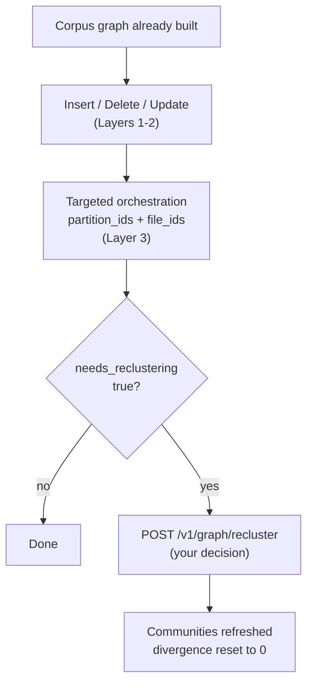

**Incremental Graph Updates (IGU)** keep an existing AutoGraph project current
at document level. Once a corpus graph has been built, you can add new
documents, remove obsolete ones, and replace documents whose content has
changed - without re-running the corpus build, the RAG Strategizer, and a full
orchestration pass.

IGU updates all [three layers](design-guide.md#the-three-layers): it maintains
the corpus graph (sources, similarity edges, cluster membership) in Layers 1
and 2, and drives the Importer to materialize or clean up the knowledge graph
(documents, chunks, entities, communities, relationships) in Layer 3. Existing
clusters and strategy profiles are preserved; new documents join the nearest
existing cluster instead of triggering a re-clustering of the whole module.

Which layer an operation touches determines how you observe it. Layers 1 and 2
are AutoGraph's own data, so changes there are reported synchronously. Layer 3
belongs to the Importer, a separate service, so that work is always
asynchronous - you either trigger it with orchestration or poll for it to
finish.

For routine document churn this is substantially cheaper and faster than a
rebuild, because the work is scoped to the documents that actually changed.


**IGU is API-only in Arango Contextual Data Platform 4.1.0.** Insert, delete,
update, and recluster are available through the
[HTTP endpoints](reference/orchestration.md#insert-documents) only. The
[web interface](web-interface.md) does not expose them, so document-level
changes have to be driven with API calls in this release.



Reclustering is never automatic. AutoGraph measures how far a partition has
drifted from its last clustering and flags it, but you decide whether to pay
for a refresh. It applies to **FullGraphRAG** partitions only. See
[Partition divergence and
reclustering](#partition-divergence-and-reclustering).


## Supported operations

| Operation | Endpoint | Purpose |
|-----------|----------|---------|
| Insert | [`POST /v1/graph/insert`](reference/orchestration.md#insert-documents) | Add a document that is not already in the graph |
| Delete | [`POST /v1/graph/delete`](reference/orchestration.md#delete-documents) | Remove a document and its artifacts |
| Update | [`POST /v1/graph/update`](reference/orchestration.md#update-documents) | Replace the content of a document that already exists |
| Recluster | [`POST /v1/graph/recluster`](reference/orchestration.md#trigger-reclustering) | Refresh Layer 3 communities after a FullGraphRAG partition has drifted |

Insert, delete, and update start in Layers 1 and 2 (AutoGraph) and reach Layer 3
through the Importer. Recluster skips that first leg: it names Layer 3
partitions directly and only schedules Importer work, writing the reset
divergence state back on success.

This page covers the concepts: when to use IGU, how it compares with a rebuild,
and how partition divergence is measured. The request and response details of
each endpoint are in the
[Graph Operations](reference/orchestration.md) reference.

## When to use IGU

Use IGU when all of the following hold:

- The initial corpus build has completed successfully, and usually the RAG
  Strategizer and orchestration have run as well.
- You need to add, remove, or replace **individual documents** in an
  **existing** module.
- Cluster topology is still valid - you are not redesigning modules or
  recomputing similarity and clustering for a whole module.

### When not to use IGU

| Situation | Use instead |
|-----------|-------------|
| No corpus graph exists yet | The [standard workflow](reference/_index.md#standard-workflow) |
| Adding an entirely **new module** | [`POST /v1/corpus/builds`](reference/corpus-build.md) with the new module in `modules` |
| **Clean rebuild** of a module (wrong embeddings, bad clusters, wholesale file replacement) | [`POST /v1/corpus/builds`](reference/corpus-build.md) with that module in `modules` and `incremental: false` - wipes and rebuilds only that module |
| **Bulk append** of many documents to an existing module | [`POST /v1/corpus/builds`](reference/corpus-build.md#incremental-builds) with that module in `modules` and `incremental: true` - keeps existing collections and adds the new documents alongside them |
| You only need vectors on an existing collection | [`POST /v1/embed-field-in-collection`](reference/embeddings.md) |

**Rule of thumb:** document-level churn goes through IGU; a bulk append goes
through an incremental corpus build; a new module or a clean module rebuild
goes through a corpus build.

## Prerequisites

- **Arango Contextual Data Platform 4.1.0**, where IGU is driven through the
  HTTP API only - there is no web-interface equivalent.
- An AutoGraph project already exists and its corpus graph has been built.
  Typically the RAG Strategizer and orchestration have also run.
- The project was built through the
  [File Manager](../../platform-suite/file-manager/) path, so every document
  in the project is resolvable by `file_id`.
- The documents you are changing belong to **existing** modules.

## Full rebuild vs. IGU

| | Full rebuild | IGU |
|--|--------------|-----|
| **How** | [`POST /v1/corpus/builds`](reference/corpus-build.md) with the module in `modules` and `incremental: false`, then the RAG Strategizer and orchestration as needed | `POST /v1/graph/insert`, `/delete`, or `/update`, then targeted orchestration for Layer 3; optional `/recluster` when divergence is high |
| **Scope** | The entire module: similarity, clustering, and related graph data are wiped and rebuilt | Individual documents inside an existing module |
| **Clusters and strategies** | Recomputed for the processed module | Existing clusters and `rags` profiles are preserved; new documents join the nearest cluster |
| **Layer 3** | Re-orchestrated for the affected partitions after the Strategizer | Targeted orchestration for the changed `file_id`s and partitions; deletes are cleaned up asynchronously |
| **Cost and time** | Higher - full extract, embed, cluster, and usually a Strategizer plus Importer pass | Lower - work is scoped to the changed documents |
| **Use when** | Embeddings or clusters are wrong, files are replaced wholesale, or module topology must be reset | Routine add, remove, or replace of documents while cluster topology is still valid |

## Insert vs. update

| | Insert | Update |
|--|--------|--------|
| **Use when** | The document is **not** already in the graph | The document **already exists** and you are replacing its content |
| **Effect** | Adds the source and its embedding, assigns the nearest cluster, updates Layers 1 and 2 | Deletes the old graph data, waits for Layer 3 cleanup, then re-inserts the replacement into Layers 1 and 2 |
| **Layer 3** | Run targeted orchestration afterwards so the knowledge graph includes the new document | Run targeted orchestration afterwards for the replacement |
| **Wrong choice** | Using insert for a `doc_name` or `file_id` that already exists is unsafe (duplicates and conflicts) | Using update for a document that is not in the graph fails validation |


Insert is not a safe substitute for update. Replacing content with an insert
call leaves the previous version of the document in the graph.


## Workflow



1. **Mutate.** Call
   [insert](reference/orchestration.md#insert-documents),
   [delete](reference/orchestration.md#delete-documents), or
   [update](reference/orchestration.md#update-documents), depending on what
   changed.
2. **Materialize Layer 3.** After an insert or a successful update, run
   [targeted orchestration](reference/orchestration.md) with the returned
   `rag_partition_id` and `file_id` so the knowledge graph reflects the new
   content. This assumes File Manager input: a document submitted as inline
   `content` gets no `file_id`, so it cannot be targeted and has to be
   materialized by orchestrating the whole partition instead - see
   [Identifying documents for Layer 3](#identifying-documents-for-layer-3).
   A delete schedules its own Layer 3 cleanup in the background.
3. **Check divergence.** On a **FullGraphRAG** partition, each operation
   recomputes a `divergence_score` and sets `needs_reclustering` when the score
   exceeds the partition's threshold. **VectorRAG** partitions have nothing to
   measure and are never flagged, so this step and the next one do not apply to
   them - see [Partition divergence and
   reclustering](#partition-divergence-and-reclustering).
4. **Recluster if you want to.** When the flag is `true` and you decide the
   cost is worthwhile, call
   [recluster](reference/orchestration.md#trigger-reclustering) with the
   affected `rag_partition_id`s.

### Identifying documents for Layer 3

Step 2 identifies documents by `file_id`, and that is the only identifier
targeted orchestration accepts - `doc_name` is not an option there. This
constrains how you should submit an insert or an update:

| Input used for insert/update | `file_id` available afterwards | Can you target it in Layer 3? |
|------------------------------|:-:|---|
| File Manager `file_id` | Yes, echoed back on the per-file result | Yes - pass it in `file_ids` |
| Inline base64 `content` | No | No - nothing to put in `file_ids` |


**Use File Manager `file_id` input for any document you intend to materialize in
Layer 3.** Inline `content` is accepted by insert and update, but no File
Manager id is created for such a document and none is returned, so it cannot be
named in the `file_ids` of a targeted orchestration. Ids have the derived form
`rag-input-{base64url(db:path)}` and refer to a File Manager path, so one cannot
be constructed for content that was never staged there.


This is why the [prerequisites](#prerequisites) call for a project built through
the File Manager path: it keeps every document in the project resolvable by
`file_id`. Upload the document with
[`POST /_platform/filemanager/_db/{database}/rag-input`](../../platform-suite/file-manager/api.md)
first, then pass the resulting id to insert or update.

If a document was already inserted with inline `content`, the alternative is to
orchestrate the whole partition (supply `partition_ids` and omit `file_ids`),
which reprocesses everything in it rather than just the new document. Weigh that
against deleting the document and re-inserting it from the File Manager, because
re-importing documents that are already in the partition adds a further import
batch - see [Updating a
document](../importer/incremental-updates.md#updating-a-document).

## Partition divergence and reclustering

After every insert, delete, or update, AutoGraph measures how far each affected
**FullGraphRAG** Layer 3 partition has drifted from the state it was in at its
last Leiden clustering. The result is a **`divergence_score`**, persisted on the
partition's `rags` strategy profile and returned on the per-file IGU outcome
when available.

Everything in this section - the score, the threshold, the flag, and
reclustering - applies to FullGraphRAG partitions only.

Divergence is a **signal, not an action**. AutoGraph never reclusters on its
own. When the score crosses the partition's threshold, it sets
**`needs_reclustering: true`** and leaves the decision to you.


**Divergence and reclustering apply to FullGraphRAG partitions only.** Both
signals below are computed from a partition's `Entities`, and reclustering
rebuilds its `Communities` and community edges. **VectorRAG** partitions
(`rag_mode: vector_rag`, `rag_partition_id` suffix `_b`) contain neither
collection - see the [Layer 3
collections](architecture.md#layer-3) - so they carry no meaningful divergence
score, are never flagged for reclustering, and have nothing for a recluster to
rebuild. IGU insert, delete, and update themselves work on both kinds of
partition.


### How the score is computed

The persisted score is the larger of two complementary signals:

```text
divergence_score = max(gross_churn_score, multi_batch_score)
needs_reclustering = (divergence_score > divergence_threshold)
```

The default **`divergence_threshold`** is **`0.25`** (25%). Equality does not
trip the flag - only a score strictly greater than the threshold does. The
threshold is stored per partition and can be configured when the strategy
profile is created.

**Gross churn score**

```text
gross_churn_score = cumulative_churn / baseline_entity_count
```

- **`baseline_entity_count`** is the logical entity count (distinct entity
  names) at the last successful clustering or reclustering. On the first
  measurement after a partition is built, the current count becomes the
  baseline and the score starts at `0`.
- **`cumulative_churn`** is the total number of entities added **plus** deleted
  across every insert, delete, and update leg since that baseline. Churn is
  **gross, not net**: an update that removes 100 entities and re-inserts 100
  contributes about 200 to the accumulator, not 0.

For example, with a baseline of `1000` entities, a delete of `100` followed by
an insert of `100` gives `cumulative_churn = 200` and therefore
`gross_churn_score = 0.20`.

**Multi-batch score**

When a partition has taken several incremental imports without consolidation,
the same logical entities can appear duplicated across import batches.
AutoGraph groups entities by import batch, treats the **largest** batch as the
stable baseline, and counts everything outside it as changed:

```text
multi_batch_score = (total_entities - largest_batch) / total_entities
```

A partition with a single batch (or no entities) scores `0` on this signal.
For example, batch sizes of `[500, 300, 200]` give
`(1000 - 500) / 1000 = 0.50`.

**Combined example**

If gross churn is `0.20` and the multi-batch spread is `0.50`, the
`divergence_score` is `0.50`. With the default threshold of `0.25`,
`needs_reclustering` becomes `true`.

### Divergence lifecycle

| Event | Effect on divergence state |
|-------|----------------------------|
| First measurement after a build | Baseline adopted from the current entity count; score `0`; flag `false` |
| Insert, delete, or update (once Layer 3 reflects the change) | Score recomputed; flag set when the score exceeds the threshold |
| Successful `POST /v1/graph/recluster` | Score reset to `0`, churn cleared, new baseline adopted, flag cleared |
| Failed or incomplete recluster | Score and flag unchanged, so you can retry later |

### When the score is authoritative

- **Delete**: divergence is stamped after Layer 3 cleanup finishes, and
  surfaced through the pollable delete outcome.
- **Insert**: the immediate insert response may carry a score computed before
  the new Layer 3 entities exist. The authoritative value is written after
  targeted orchestration has materialized them.
- **Update**: the delete and insert legs each accumulate gross churn. The
  combined per-file outcome reflects the state after the insert leg, with the
  same Layer 3 timing caveat as insert.

## Next steps

- [Graph Operations](reference/orchestration.md#insert-documents): Request and
  response reference for `/v1/graph/insert`, `/delete`, `/update`, and
  `/recluster`, plus targeted orchestration with `partition_ids` and `file_ids`
- [Design Guide](design-guide.md): How modules, layers, and partitions fit
  together
- [Corpus Build](reference/corpus-build.md#incremental-builds): Incremental
  builds for new modules and bulk appends
- [Importer Incremental Updates](../importer/incremental-updates.md): What the
  Importer does for Layer 3 deletes and reclustering
- [Error Handling](reference/error-handling.md): HTTP codes and general
  troubleshooting
