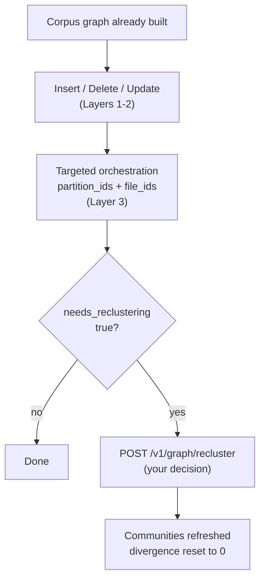

**Incremental Graph Updates (IGU)** keep an existing AutoGraph project current
at document level. Once a corpus graph has been built, you can add new
documents, remove obsolete ones, and replace documents whose content has
changed - without re-running the corpus build, the RAG Strategizer, and a full
orchestration pass.

IGU updates all [three layers](design-guide.md#the-three-layers): it maintains
the corpus graph (sources, similarity edges, cluster membership) in Layers 1
and 2, and drives the Importer to materialize or clean up the knowledge graph
(documents, chunks, entities, communities, relationships) in Layer 3. Existing
clusters and strategy profiles are preserved; new documents join the nearest
existing cluster instead of triggering a re-clustering of the whole module.

Which layer an operation touches determines how you observe it. Layers 1 and 2
are AutoGraph's own data, so changes there are reported synchronously. Layer 3
belongs to the Importer, a separate service, so that work is always
asynchronous - you either trigger it with orchestration or poll for it to
finish.

For routine document churn this is substantially cheaper and faster than a
rebuild, because the work is scoped to the documents that actually changed.


Reclustering is never automatic. AutoGraph measures how far a partition has
drifted from its last clustering and flags it, but you decide whether to pay
for a refresh. See [Partition divergence and
reclustering](#partition-divergence-and-reclustering).


## Supported operations

| Operation | Endpoint | Purpose |
|-----------|----------|---------|
| Insert | [`POST /v1/graph/insert`](#insert-documents) | Add a document that is not already in the graph |
| Delete | [`POST /v1/graph/delete`](#delete-documents) | Remove a document and its artifacts |
| Update | [`POST /v1/graph/update`](#update-documents) | Replace the content of a document that already exists |
| Recluster | [`POST /v1/graph/recluster`](#trigger-reclustering) | Refresh Layer 3 communities after a partition has drifted |

Every IGU operation starts in Layers 1 and 2 (AutoGraph) and reaches Layer 3
through the Importer.

## When to use IGU

Use IGU when all of the following hold:

- The initial corpus build has completed successfully, and usually the RAG
  Strategizer and orchestration have run as well.
- You need to add, remove, or replace **individual documents** in an
  **existing** module.
- Cluster topology is still valid - you are not redesigning modules or
  recomputing similarity and clustering for a whole module.

### When not to use IGU

| Situation | Use instead |
|-----------|-------------|
| No corpus graph exists yet | The [standard workflow](reference/_index.md#standard-workflow) |
| Adding an entirely **new module** | [`POST /v1/corpus/builds`](reference/corpus-build.md) with the new module in `modules` |
| **Clean rebuild** of a module (wrong embeddings, bad clusters, wholesale file replacement) | [`POST /v1/corpus/builds`](reference/corpus-build.md) with that module in `modules` and `incremental: false` - wipes and rebuilds only that module |
| **Bulk append** of many documents to an existing module | [`POST /v1/corpus/builds`](reference/corpus-build.md#incremental-builds) with that module in `modules` and `incremental: true` - keeps existing collections and adds the new documents alongside them |
| You only need vectors on an existing collection | [`POST /v1/embed-field-in-collection`](reference/embeddings.md) |

**Rule of thumb:** document-level churn goes through IGU; a bulk append goes
through an incremental corpus build; a new module or a clean module rebuild
goes through a corpus build.

## Prerequisites

- An AutoGraph project already exists and its corpus graph has been built.
  Typically the RAG Strategizer and orchestration have also run.
- The project was built through the
  [File Manager](../../platform-suite/file-manager/) path, so every document
  in the project is resolvable by `file_id`.
- The documents you are changing belong to **existing** modules.

## Full rebuild vs. IGU

| | Full rebuild | IGU |
|--|--------------|-----|
| **How** | [`POST /v1/corpus/builds`](reference/corpus-build.md) with the module in `modules` and `incremental: false`, then the RAG Strategizer and orchestration as needed | `POST /v1/graph/insert`, `/delete`, or `/update`, then targeted orchestration for Layer 3; optional `/recluster` when divergence is high |
| **Scope** | The entire module: similarity, clustering, and related graph data are wiped and rebuilt | Individual documents inside an existing module |
| **Clusters and strategies** | Recomputed for the processed module | Existing clusters and `rags` profiles are preserved; new documents join the nearest cluster |
| **Layer 3** | Re-orchestrated for the affected partitions after the Strategizer | Targeted orchestration for the changed `file_id`s and partitions; deletes are cleaned up asynchronously |
| **Cost and time** | Higher - full extract, embed, cluster, and usually a Strategizer plus Importer pass | Lower - work is scoped to the changed documents |
| **Use when** | Embeddings or clusters are wrong, files are replaced wholesale, or module topology must be reset | Routine add, remove, or replace of documents while cluster topology is still valid |

## Insert vs. update

| | Insert | Update |
|--|--------|--------|
| **Use when** | The document is **not** already in the graph | The document **already exists** and you are replacing its content |
| **Effect** | Adds the source and its embedding, assigns the nearest cluster, updates Layers 1 and 2 | Deletes the old graph data, waits for Layer 3 cleanup, then re-inserts the replacement into Layers 1 and 2 |
| **Layer 3** | Run targeted orchestration afterwards so the knowledge graph includes the new document | Run targeted orchestration afterwards for the replacement |
| **Wrong choice** | Using insert for a `doc_name` or `file_id` that already exists is unsafe (duplicates and conflicts) | Using update for a document that is not in the graph fails validation |


Insert is not a safe substitute for update. Replacing content with an insert
call leaves the previous version of the document in the graph.


## Workflow



1. **Mutate.** Call
   [insert](#insert-documents), [delete](#delete-documents), or
   [update](#update-documents), depending on what changed.
2. **Materialize Layer 3.** After an insert or a successful update, run
   [targeted orchestration](reference/orchestration.md) with the returned
   `rag_partition_id` and `file_id` so the knowledge graph reflects the new
   content. A delete schedules its own Layer 3 cleanup in the background.
3. **Check divergence.** Each operation recomputes a `divergence_score` for
   the affected partition and sets `needs_reclustering` when the score exceeds
   the partition's threshold.
4. **Recluster if you want to.** When the flag is `true` and you decide the
   cost is worthwhile, call [recluster](#trigger-reclustering) with the
   affected `rag_partition_id`s.

## Partition divergence and reclustering

After every insert, delete, or update, AutoGraph measures how far each affected
Layer 3 partition has drifted from the state it was in at its last Leiden
clustering. The result is a **`divergence_score`**, persisted on the
partition's `rags` strategy profile and returned on the per-file IGU outcome
when available.

Divergence is a **signal, not an action**. AutoGraph never reclusters on its
own. When the score crosses the partition's threshold, it sets
**`needs_reclustering: true`** and leaves the decision to you.

### How the score is computed

The persisted score is the larger of two complementary signals:

```text
divergence_score = max(gross_churn_score, multi_batch_score)
needs_reclustering = (divergence_score > divergence_threshold)
```

The default **`divergence_threshold`** is **`0.25`** (25%). Equality does not
trip the flag - only a score strictly greater than the threshold does. The
threshold is stored per partition and can be configured when the strategy
profile is created.

**Gross churn score**

```text
gross_churn_score = cumulative_churn / baseline_entity_count
```

- **`baseline_entity_count`** is the logical entity count (distinct entity
  names) at the last successful clustering or reclustering. On the first
  measurement after a partition is built, the current count becomes the
  baseline and the score starts at `0`.
- **`cumulative_churn`** is the total number of entities added **plus** deleted
  across every insert, delete, and update leg since that baseline. Churn is
  **gross, not net**: an update that removes 100 entities and re-inserts 100
  contributes about 200 to the accumulator, not 0.

For example, with a baseline of `1000` entities, a delete of `100` followed by
an insert of `100` gives `cumulative_churn = 200` and therefore
`gross_churn_score = 0.20`.

**Multi-batch score**

When a partition has taken several incremental imports without consolidation,
the same logical entities can appear duplicated across import batches.
AutoGraph groups entities by import batch, treats the **largest** batch as the
stable baseline, and counts everything outside it as changed:

```text
multi_batch_score = (total_entities - largest_batch) / total_entities
```

A partition with a single batch (or no entities) scores `0` on this signal.
For example, batch sizes of `[500, 300, 200]` give
`(1000 - 500) / 1000 = 0.50`.

**Combined example**

If gross churn is `0.20` and the multi-batch spread is `0.50`, the
`divergence_score` is `0.50`. With the default threshold of `0.25`,
`needs_reclustering` becomes `true`.

### Divergence lifecycle

| Event | Effect on divergence state |
|-------|----------------------------|
| First measurement after a build | Baseline adopted from the current entity count; score `0`; flag `false` |
| Insert, delete, or update (once Layer 3 reflects the change) | Score recomputed; flag set when the score exceeds the threshold |
| Successful `POST /v1/graph/recluster` | Score reset to `0`, churn cleared, new baseline adopted, flag cleared |
| Failed or incomplete recluster | Score and flag unchanged, so you can retry later |

### When the score is authoritative

- **Delete**: divergence is stamped after Layer 3 cleanup finishes, and
  surfaced through the pollable delete outcome.
- **Insert**: the immediate insert response may carry a score computed before
  the new Layer 3 entities exist. The authoritative value is written after
  targeted orchestration has materialized them.
- **Update**: the delete and insert legs each accumulate gross churn. The
  combined per-file outcome reflects the state after the insert leg, with the
  same Layer 3 timing caveat as insert.

## Insert documents



Add documents that are not already in the graph. Runs **synchronously**.

The corpus and the target module must already exist. If the project has
exactly one module, `module` can be omitted; otherwise it is required.

### Request

Inline content, base64-encoded:

```json
{
  "files": [
    {
      "doc_name": "new-contract.txt",
      "content": "Q29udHJhY3QgdGV4dA==",
      "citable_url": "https://example.com/new-contract"
    }
  ],
  "module": "legal"
}
```

To fetch the file from the File Manager instead, omit `content` and provide
`file_id`:

```json
{
  "files": [
    {
      "doc_name": "new-contract.pdf",
      "file_id": "<file-manager-file-id>"
    }
  ],
  "module": "legal"
}
```

### Parameters

| Parameter | Type | Required | Description |
|-----------|------|----------|-------------|
| `files` | object[] | Yes | Documents to insert. Must be non-empty, with no duplicate `doc_name` or `file_id` values. |
| `files[].doc_name` | string | Yes | File name of the document. Must match the File Manager file name when `file_id` is used. |
| `files[].content` | string | No | File bytes, base64-encoded. Provide either `content` or `file_id`. |
| `files[].file_id` | string | No | File Manager id to fetch the document from. Preferred over inline content. |
| `files[].citable_url` | string | No | Canonical URL for citations, carried through the pipeline. |
| `module` | string | Conditional | Target module. Required unless the project has exactly one module. |

### Response

```json
{
  "results": [
    {
      "doc_name": "new-contract.txt",
      "success": true,
      "cluster_key": "cluster_legal_0",
      "rag_partition_id": "legal_0_a",
      "divergence_score": 0.12,
      "needs_reclustering": false
    }
  ]
}
```

| Field | Meaning |
|-------|---------|
| `doc_name` | The document this result refers to. |
| `success` | Whether the source document was inserted. |
| `error_message` | Set when this file failed. Other files in the batch can still succeed. |
| `cluster_key` | Existing cluster selected for the document. Can be empty when no suitable clustered neighbor exists. |
| `rag_partition_id` | Layer 3 partition linked to the selected cluster. Can be empty when no strategy profile exists yet. |
| `file_id` | Echoed when File Manager input was used. |
| `divergence_score` | Partition divergence after this insert. Can understate churn until targeted orchestration creates the Layer 3 entities. See [Partition divergence and reclustering](#partition-divergence-and-reclustering). |
| `needs_reclustering` | `true` when `divergence_score` strictly exceeds the partition's threshold. Nothing is reclustered automatically. |

Insert extracts the text, generates an embedding, stores the source, assigns
the closest existing cluster, and adds membership and similarity edges. It
updates **Layers 1 and 2 only**. To materialize the document in Layer 3, run
targeted orchestration with its `file_id` and the returned `rag_partition_id`.

| Status Code | Meaning |
|-------------|---------|
| `200` | Request processed. Inspect each `results[].success`. |
| `400` | Empty or invalid batch, corpus not built, invalid module, duplicate names or ids, file name mismatch, or File Manager fetch failure. |
| `401` | Authentication failed. |
| `403` | Access denied. |
| `409` | Another corpus mutation is running. |
| `500` | Server error. |
| `503` | A required dependency is temporarily unavailable. |

### HTTP example

```bash
curl -X POST \
  -H "Content-Type: application/json" \
  -H "Authorization: Bearer <token>" \
  -d '{
    "files": [{
      "doc_name": "new-contract.txt",
      "content": "Q29udHJhY3QgdGV4dA=="
    }],
    "module": "legal"
  }' \
  https://<EXTERNAL_ENDPOINT>:8529/autograph/v1/graph/insert
```

## Delete documents



Remove documents from an existing corpus graph. Layers 1 and 2 are updated
**synchronously**; Layer 3 cleanup runs **asynchronously** in the Importer.

Prefer stable File Manager `file_ids`. Alternatively, provide `doc_names`,
which are resolved inside the requested module. At least one of the two lists
is required.

### Request

```json
{
  "file_ids": [
    "<file-manager-file-id-1>",
    "<file-manager-file-id-2>"
  ],
  "module": "legal",
  "replicas": 2
}
```

By file name instead:

```json
{
  "doc_names": ["old-contract.pdf"],
  "module": "legal"
}
```

### Parameters

| Parameter | Type | Required | Description |
|-----------|------|----------|-------------|
| `file_ids` | string[] | Conditional | File Manager ids of the documents to delete. Required unless `doc_names` is given. |
| `doc_names` | string[] | Conditional | File names to resolve inside `module`. Required unless `file_ids` is given. |
| `module` | string | Conditional | Module the targets belong to. Required unless the project has exactly one module. |
| `replicas` | integer | No | Importer worker replicas to use for the background Layer 3 cleanup. Omit to use the service default. |


The batch is validated before anything is removed. If any target is invalid,
the request returns `400` and nothing is deleted.


### Response

```json
{
  "results": [
    {
      "file_id": "<file-manager-file-id-1>",
      "status": "LAYER2_DELETE_STATUS_SUCCESS",
      "rag_partition_id": "legal_0_a",
      "cluster_key": "cluster_legal_0",
      "similarity_edges_removed": 4
    }
  ],
  "affected_rag_partitions": ["legal_0_a"],
  "removed_rag_partitions": [],
  "affected_cluster_ids": ["cluster_legal_0"],
  "removed_cluster_ids": [],
  "layer3_results": [],
  "layer3_overall_status": "LAYER3_DELETE_STATUS_PENDING"
}
```

The response confirms the Layer 1 and Layer 2 changes.
`LAYER3_DELETE_STATUS_PENDING` means the Importer is still removing the
Layer 3 documents, chunks, entities, and edges. Poll the
`importerOrchestration` status in your platform project metadata until it
reports `completed` or `failed`.


Layer 1 and Layer 2 deletion is not rolled back if the Layer 3 cleanup fails.


After Layer 3 cleanup finishes, AutoGraph recomputes divergence for each
affected partition and stamps `divergence_score` and `needs_reclustering` onto
the per-file outcome in that pollable status.

| Status Code | Meaning |
|-------------|---------|
| `200` | Layer 1 and Layer 2 results returned. Inspect `layer3_overall_status`. |
| `400` | Missing or duplicate identifiers, invalid module, target missing, or target belongs to another module. Nothing is deleted. |
| `401` | Authentication failed. |
| `403` | Access denied. |
| `409` | Another corpus mutation is running. |
| `500` | Server error. |
| `503` | A required dependency is temporarily unavailable. |

### HTTP example

```bash
curl -X POST \
  -H "Content-Type: application/json" \
  -H "Authorization: Bearer <token>" \
  -d '{
    "file_ids": ["<file-manager-file-id>"],
    "module": "legal"
  }' \
  https://<EXTERNAL_ENDPOINT>:8529/autograph/v1/graph/delete
```

## Update documents



Replace the content of documents that are already in the graph. Runs
**asynchronously**.

Every target must already exist and belong to the requested module. A single
invalid target rejects the whole batch before anything is mutated.

### Request

```json
{
  "files": [
    {
      "doc_name": "existing-contract.txt",
      "content": "VXBkYXRlZCBjb250cmFjdCB0ZXh0"
    }
  ],
  "module": "legal"
}
```

As with insert, supply either base64 `content` or a File Manager `file_id`.

### Immediate response

```json
{
  "update_id": "update_1721840400_a1b2c3d4",
  "accepted": true,
  "message": "Update started",
  "results": []
}
```

`accepted: true` means the update was validated and dispatched, not that it
finished. Poll the `importerOrchestration` slot in your platform project
metadata. The phases are:

1. `DELETE_L12` - remove the old source and corpus-graph data.
2. `DELETE_L3` - wait for the Importer to remove the old knowledge-graph data.
3. `INSERT_L12` - insert the replacement and reassign its cluster.
4. `DONE` - terminal success or failure.

A terminal status message looks like this:

```json
{
  "phase": "DONE",
  "status": "completed",
  "summary": "Updated 1 file(s) in Layers 1-2; run orchestrate to re-import Layer 3",
  "files": [
    {
      "file": "existing-contract.txt",
      "result": "updated",
      "cluster": "cluster_legal_0",
      "previous_cluster": "cluster_legal_1",
      "partition": "legal_0_a",
      "divergence_score": 0.20,
      "needs_reclustering": false
    }
  ]
}
```

| Field in `files[]` | Meaning |
|--------------------|---------|
| `file` | The document this outcome refers to. |
| `result` | Per-file outcome, for example `updated`. |
| `cluster` / `previous_cluster` | Cluster assigned to the replacement, and the cluster the old version belonged to. |
| `partition` | Layer 3 partition of the new cluster. |
| `divergence_score` | Partition divergence after the delete and insert legs (gross churn). See [Partition divergence and reclustering](#partition-divergence-and-reclustering). |
| `needs_reclustering` | `true` when the score exceeds the partition threshold. AutoGraph does not recluster automatically. |

Update waits for the old Layer 3 data to be cleaned up before re-inserting,
which avoids old and new knowledge-graph data coexisting. It is still not a
database transaction.


If the delete leg succeeds but the insert leg fails, the document stays
removed. Fix the underlying problem and restore it with
`POST /v1/graph/insert`.


After a successful update, run targeted orchestration to import the
replacement into Layer 3.

| Status Code | Meaning |
|-------------|---------|
| `200` | Update validated and dispatched. Poll for completion. |
| `400` | Empty or invalid batch, invalid module, or a target that is not already in the graph. |
| `401` | Authentication failed. |
| `403` | Access denied. |
| `409` | Another corpus mutation is running. |
| `500` | Server error. |
| `503` | A required dependency is temporarily unavailable. |

### HTTP example

```bash
curl -X POST \
  -H "Content-Type: application/json" \
  -H "Authorization: Bearer <token>" \
  -d '{
    "files": [{
      "doc_name": "existing-contract.txt",
      "content": "VXBkYXRlZCBjb250cmFjdCB0ZXh0"
    }],
    "module": "legal"
  }' \
  https://<EXTERNAL_ENDPOINT>:8529/autograph/v1/graph/update
```

## Trigger reclustering



Schedule Layer 3 reclustering for one or more RAG partitions. Returns a
scheduling status immediately; the work itself runs **asynchronously**.

Call this when an insert, delete, or update outcome - or the partition's `rags`
profile - reports `needs_reclustering: true` and you decide that refreshing the
communities is worth the cost. AutoGraph never starts a recluster on its own.

### Request

```json
{
  "partition_ids": ["legal_0_a", "engineering_0_a"]
}
```

| Parameter | Type | Required | Description |
|-----------|------|----------|-------------|
| `partition_ids` | string[] | Yes | One or more `rag_partition_id` values, for example from an IGU response. At least one non-blank id is required; duplicates are ignored. |

### Response

```json
{
  "results": [
    {
      "rag_partition_id": "legal_0_a",
      "accepted": true
    },
    {
      "rag_partition_id": "engineering_0_a",
      "accepted": true
    }
  ]
}
```

| Field | Meaning |
|-------|---------|
| `results[].rag_partition_id` | Partition this scheduling result refers to. |
| `results[].accepted` | `true` when a recluster was scheduled, or coalesced into a recluster already in flight for the same partition. |
| `results[].error_message` | Set when that partition could not be scheduled, for example because the id was blank. |

`accepted: true` means the work was **queued**, not that reclustering finished.
Poll the `importerOrchestration` slot in your platform project metadata for
running, completed, or failed progress. On success, AutoGraph resets the
partition's divergence: `divergence_score` becomes `0`,
`needs_reclustering` becomes `false`, and a new baseline is adopted. On
failure, the score and the flag are left unchanged so you can retry.

| Status Code | Meaning |
|-------------|---------|
| `200` | Request processed. Inspect each `results[].accepted`. |
| `400` | Missing or empty `partition_ids`. |
| `401` | Authentication failed. |
| `403` | Access denied. |
| `500` | Server error. |

**Notes:**

- A recluster for a partition that is already in flight **coalesces** - a
  second request does not spawn a second Importer job for that partition.
- Reclustering claims the same service-wide mutation slot as build, insert,
  update, and delete, so it does not run concurrently with those operations.
- A failed or skipped recluster does not clear `needs_reclustering`. Trigger it
  again when the slot is free.
- For what the Importer actually does during a recluster, and how long it
  takes, see
  [Importer Incremental Updates](../importer/incremental-updates.md#reclustering).

### HTTP example

```bash
curl -X POST \
  -H "Content-Type: application/json" \
  -H "Authorization: Bearer <token>" \
  -d '{
    "partition_ids": ["legal_0_a"]
  }' \
  https://<EXTERNAL_ENDPOINT>:8529/autograph/v1/graph/recluster
```

## End-to-end example

The calls below assume the corpus graph has already been built.

```bash
# 1. Add a new document to Layers 1 and 2
curl -X POST \
  -H "Content-Type: application/json" \
  -H "Authorization: Bearer <token>" \
  -d '{
    "files": [{
      "doc_name": "new.txt",
      "file_id": "<new-file-id>"
    }],
    "module": "legal"
  }' \
  https://<EXTERNAL_ENDPOINT>:8529/autograph/v1/graph/insert

# 2. Delete an obsolete document (Layer 3 cleanup continues in the background)
curl -X POST \
  -H "Content-Type: application/json" \
  -H "Authorization: Bearer <token>" \
  -d '{
    "file_ids": ["<old-file-id>"],
    "module": "legal"
  }' \
  https://<EXTERNAL_ENDPOINT>:8529/autograph/v1/graph/delete

# 3. Replace an existing document (returns an update_id immediately)
curl -X POST \
  -H "Content-Type: application/json" \
  -H "Authorization: Bearer <token>" \
  -d '{
    "files": [{
      "doc_name": "existing.txt",
      "file_id": "<existing-file-id>"
    }],
    "module": "legal"
  }' \
  https://<EXTERNAL_ENDPOINT>:8529/autograph/v1/graph/update
```

After an insert or a successful update, run targeted orchestration so Layer 3
includes the new content:

```bash
curl -X POST \
  -H "Content-Type: application/json" \
  -H "Authorization: Bearer <token>" \
  -d '{
    "replicas": 1,
    "partition_ids": ["legal_0_a"],
    "file_ids": ["<new-or-updated-file-id>"]
  }' \
  https://<EXTERNAL_ENDPOINT>:8529/autograph/v1/orchestrate
```

If an outcome reports `needs_reclustering: true` for a partition, reclustering
is optional and manual:

```bash
curl -X POST \
  -H "Content-Type: application/json" \
  -H "Authorization: Bearer <token>" \
  -d '{
    "partition_ids": ["legal_0_a"]
  }' \
  https://<EXTERNAL_ENDPOINT>:8529/autograph/v1/graph/recluster
```

Poll `importerOrchestration` in your project metadata until the recluster
finishes. On success, the partition's `divergence_score` resets to `0` and
`needs_reclustering` clears.

## Troubleshooting

- **Insert succeeded but the document is missing from Layer 3.** Insert only
  updates Layers 1 and 2. Run targeted orchestration with the returned
  `rag_partition_id` and the new `file_id`.
- **Delete returned `LAYER3_DELETE_STATUS_PENDING`.** Expected. Layers 1 and 2
  are complete and the Layer 3 cleanup is running in the background. Poll
  `importerOrchestration` in your project metadata.
- **Update returned `accepted: true` but the document has not changed yet.**
  Update is asynchronous. Poll `importerOrchestration` until the JSON message
  reports `phase: "DONE"`.
- **Update failed and the source is gone.** The delete leg committed but the
  insert leg failed. Fix the input or the dependency problem and restore the
  document with `POST /v1/graph/insert`.
- **An IGU call returns `409`.** Another corpus mutation (build, insert,
  update, delete, or recluster) holds the service-wide mutation slot. Wait for
  it to finish and retry.
- **`needs_reclustering: true` after an insert, delete, or update.** The
  partition's divergence score exceeded its threshold (25% by default).
  Nothing is reclustered automatically - call `POST /v1/graph/recluster` with
  the `rag_partition_id` when you want the communities refreshed.
- **An insert showed a low `divergence_score`, then the flag flipped later.**
  Expected. The insert response can be computed before the Layer 3 entities
  exist; the authoritative score is written after targeted orchestration.
- **Recluster was accepted but `needs_reclustering` is still `true`.** The
  scheduling succeeded, but the background job may still be running or may have
  failed. Poll `importerOrchestration`. A failed recluster does not clear the
  flag, so you can retry.

## Next steps

- [Design Guide](design-guide.md): How modules, layers, and partitions fit
  together
- [Orchestration](reference/orchestration.md): Targeted orchestration with
  `partition_ids` and `file_ids`
- [Corpus Build](reference/corpus-build.md#incremental-builds): Incremental
  builds for new modules and bulk appends
- [Importer Incremental Updates](../importer/incremental-updates.md): What the
  Importer does for Layer 3 deletes and reclustering
- [Error Handling](reference/error-handling.md): HTTP codes and general
  troubleshooting
