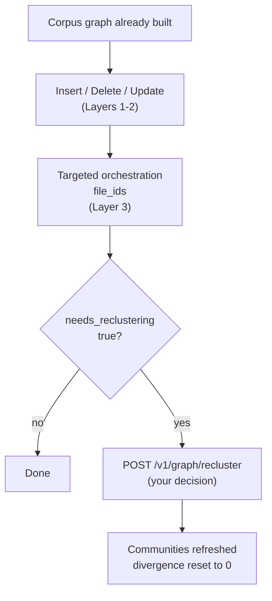

**Incremental Graph Updates (IGU)** keep a knowledge graph up-to-date after it
has been built. You can add new documents, remove obsolete ones, and replace
documents whose content has changed, without running the corpus build, the RAG
Strategizer, and a full orchestration pass again.

IGU updates all [three layers](design-guide.md#the-three-layers). In Layers 1
and 2, it maintains the corpus graph with its sources, similarity edges, and
cluster membership. In Layer 3, it adds or removes the knowledge graph data, such
as documents, chunks, entities, communities, and relationships. Existing clusters
and strategy profiles are kept, and a new document joins the cluster closest to
it, so the whole module does not have to be clustered again.

**Adding to Layer 3 is the Importer's job. Removing from it is not.** AutoGraph
deletes knowledge graph data itself, with AQL queries, and only involves the
Importer when new content has to be extracted, embedded, and clustered:

| Operation | Layers 1 and 2 | Layer 3 |
|-----------|----------------|---------|
| Insert | AutoGraph, reported in the response | The Importer, through a [targeted orchestration](reference/orchestration.md#trigger-orchestration) that you start afterwards |
| Delete | AutoGraph, reported in the response | AutoGraph, in the same call, before Layers 1 and 2 |
| Update | AutoGraph, asynchronous | The old data: AutoGraph, in the same run. The new version: the Importer, through a targeted orchestration |
| Recluster | Not touched | The Importer, rebuilding the communities of the partition |

An update is a delete followed by an insert, which is why its Layer 3 work is
split between the two services in exactly that way.

How you track an operation follows from the table. What AutoGraph does itself is
reported by the call that did it. What the Importer does runs in the background,
so you start it with an orchestration call and poll until it is finished.

For everyday document changes, this is much cheaper and faster than a rebuild,
because only the documents that actually changed are processed.


**IGU is API-only in Arango Contextual Data Platform 4.1.0.** You can insert,
delete, update, and recluster documents through the
[HTTP endpoints](reference/orchestration.md#insert-documents) only. The
[web interface](web-interface.md) does not offer these operations in this
release.



Reclustering is never automatic. AutoGraph measures how far a partition has
drifted since it was last clustered and flags it, but you decide whether to pay
for a refresh. This only applies to **FullGraphRAG** partitions. See
[Partition divergence and
reclustering](#partition-divergence-and-reclustering).


## Supported operations

| Operation | Endpoint | Purpose |
|-----------|----------|---------|
| Insert | [`POST /v1/graph/insert`](reference/orchestration.md#insert-documents) | Add a document that is not in the graph yet |
| Delete | [`POST /v1/graph/delete`](reference/orchestration.md#delete-documents) | Remove a document and its data |
| Update | [`POST /v1/graph/update`](reference/orchestration.md#update-documents) | Replace the content of a document that already exists |
| Recluster | [`POST /v1/graph/recluster`](reference/orchestration.md#trigger-reclustering) | Rebuild the Layer 3 communities of a FullGraphRAG partition that has drifted |

Insert, delete, and update work on documents and start in Layers 1 and 2, as
described above. Reclustering is different: it takes Layer 3 partitions directly,
schedules the Importer work for them, and resets the divergence values if the job
succeeds.

This page explains the concepts: when to use IGU, how it compares to a rebuild,
and how partition divergence is measured. For the requests and responses of each
endpoint, see the [Graph Operations](reference/orchestration.md) reference.

## When to use IGU

Use IGU if all of the following is true:

- The initial corpus build has finished successfully, and usually the RAG
  Strategizer and orchestration have run as well.
- You want to add, remove, or replace documents in an **existing** module. Every
  endpoint takes a batch, so this is not limited to one document per call.
- The change is **small compared to what the module already holds**.
- The cluster topology is still valid. You are not redesigning modules, and you
  do not need to compute the similarity and clustering of a whole module again.


**What matters is the size of the change, not the number of documents.** Insert,
delete, and update all take a list, and a batch of documents is a perfectly
ordinary IGU. Adding a number of documents that is large in relation to what the
partition already holds is the case to avoid: it drives the
[divergence score](#partition-divergence-and-reclustering) up, which flags the
partition for a reclustering that you then have to pay for. Use an incremental
corpus build for changes of that size.


### When not to use IGU

| Situation | Use instead |
|-----------|-------------|
| No corpus graph exists yet | The [standard workflow](reference/_index.md#standard-workflow) |
| Adding an entirely **new module** | [`POST /v1/corpus/builds`](reference/corpus-build.md) with the new module in `categories` and `incremental: false` |
| **Clean rebuild** of a module, for example because of wrong embeddings, bad clusters, or files that are replaced as a whole | [`DELETE /v1/projects/{project}/categories/{category}`](reference/project-operations.md#delete-category), then a corpus build, the RAG Strategizer, and an orchestration for that module. A build with `incremental: false` over a module that already exists is rejected with `REBUILD_NOT_ALLOWED` |
| **Adding documents in bulk** to an existing module, that is, a batch that is large in relation to what the module already holds | [`POST /v1/corpus/builds`](reference/corpus-build.md#incremental-builds) with that module in `categories` and `incremental: true`. This keeps the existing collections and adds the new documents to them |
| You only need vectors on an existing collection | [`POST /v1/embed-field-in-collection`](reference/embeddings.md) |

**Rule of thumb:** Use IGU for changes that are small in relation to the module,
whether that is one document or a batch of them, an incremental corpus build for
bulk additions, and a corpus build for a new module or a clean module rebuild.

## Prerequisites

- **Arango Contextual Data Platform 4.1.0**, where IGU is only available through
  the HTTP API.
- An AutoGraph project with a corpus graph that has already been built.
  Typically, the RAG Strategizer and orchestration have run as well.
- The project was built through the
  [File Manager](../../platform-suite/file-manager/), so that every document in
  the project has a `file_id`.
- The documents you want to change belong to **existing** modules.

## Full rebuild vs. IGU

| | Full rebuild | IGU |
|--|--------------|-----|
| **How** | [Delete the category](reference/project-operations.md#delete-category), then [`POST /v1/corpus/builds`](reference/corpus-build.md) with the module in `categories`, followed by the RAG Strategizer and orchestration | `POST /v1/graph/insert`, `/delete`, or `/update`, then a targeted orchestration for Layer 3 where one is needed. No Strategizer run. Optionally `/recluster` if the divergence is high |
| **Scope** | The entire module. Similarity, clustering, and the related graph data are wiped and rebuilt | Individual documents in an existing module |
| **Clusters and strategies** | Computed again for the processed module | Existing clusters and `rags` profiles are kept. A new document joins the closest cluster at Layer 2 and **inherits that cluster's strategy profile**, so the RAG Strategizer never runs again |
| **Layer 3** | Orchestrated again for the affected partitions after the Strategizer | Targeted orchestration for inserted and updated files, scoped to their `file_ids`. Deletions need no orchestration, they clean up Layer 3 in the same call |
| **Cost and time** | Higher. Full extraction, embedding, and clustering, usually followed by a Strategizer and Importer run | Lower. Only the changed documents are processed |
| **Use if** | Embeddings or clusters are wrong, files are replaced as a whole, or the module topology has to be reset | You regularly add, remove, or replace documents and the cluster topology is still valid |

## Insert vs. update

| | Insert | Update |
|--|--------|--------|
| **Use if** | The document is **not** in the graph yet | The document **already exists** and you want to replace its content |
| **Effect** | Adds the source and its embedding, assigns the closest cluster, and updates Layers 1 and 2 | Deletes the old graph data, waits for the Layer 3 cleanup, and then adds the new version to Layers 1 and 2 |
| **Layer 3** | Run a targeted orchestration afterwards, so that the knowledge graph includes the new document | Run a targeted orchestration afterwards for the new version |
| **Wrong choice** | Using insert for a `doc_name` or `file_id` that already exists creates duplicates and conflicts | Using update for a document that is not in the graph fails the validation |


Insert is not a safe replacement for update. If you replace content with an
insert call, the previous version of the document stays in the graph.


## Workflow



1. **Change the documents.** Call
   [insert](reference/orchestration.md#insert-documents),
   [delete](reference/orchestration.md#delete-documents), or
   [update](reference/orchestration.md#update-documents), depending on what
   changed.
2. **Build Layer 3.** After an insert or a successful update, run a
   [targeted orchestration](reference/orchestration.md) with the returned
   `file_id`, so that the knowledge graph contains the new content. AutoGraph
   works out which strategized clusters hold those ids, so you do not name a
   partition. Both insert and update take File Manager input only, so every
   changed document has a `file_id` you can target with. See
   [Identifying documents for Layer 3](#identifying-documents-for-layer-3). A
   delete needs no orchestration, because it has already removed its Layer 3
   data.
3. **Check the divergence.** On a **FullGraphRAG** partition, a new
   `divergence_score` is calculated once Layer 3 reflects the change, and
   `needs_reclustering` is set if the score is above the partition's threshold.
   Insert and update responses do not carry the score, so read it from
   [`GET /v1/orchestrate/{orchestration_id}`](reference/orchestration.md#monitor-an-orchestration)
   after step 2, see [Where to read the score](#where-to-read-the-score).
   **VectorRAG** partitions have nothing to measure and are never flagged, so
   this step and the next one do not apply to them.
4. **Recluster if you want to.** If the flag is `true` and you think the refresh
   is worth the cost, call
   [recluster](reference/orchestration.md#trigger-reclustering) with the
   affected `rag_partition_id` values, **at most five per request**.
   Reclusterings run one at a time and hold the service-wide write slot for the
   whole run, so plan them like a maintenance window. Confirm the outcome on the
   partition's `rags` node: `needs_reclustering` is cleared and
   `last_reclustered_at` is set only if it really ran.

### Identifying documents for Layer 3

A targeted orchestration identifies documents by `file_id` alone. `doc_name` does
not work here, and it never has to:
[insert](reference/orchestration.md#insert-documents) and
[update](reference/orchestration.md#update-documents) both require a File Manager
`file_id` for every document, so the id you send is the id you pass on to the
orchestration. IDs have the form `rag-input-{base64url(db:path)}` and refer to a
File Manager path, which is why the [prerequisites](#prerequisites) ask for a
project built through the File Manager. Upload a document with
[`POST /_platform/filemanager/_db/{database}/rag-input`](../../platform-suite/file-manager/api.md)
and pass the returned ID.

To orchestrate without ids, provide `categories` and omit `file_ids`. That
processes every document of those categories again, and importing documents that
are already in a partition adds another import batch. See
[Updating a document](../importer/incremental-updates.md#updating-a-document).

## Partition divergence and reclustering

After every insert, delete, and update, AutoGraph measures how far each affected
**FullGraphRAG** partition in Layer 3 has drifted from the state it was in when
it was last clustered with the Leiden algorithm. The result is a
**`divergence_score`**. It is stored in the partition's `rags` strategy profile.
Where you can read it back depends on the operation, see [Where to read the
score](#where-to-read-the-score).

Everything in this section applies to FullGraphRAG partitions only.

The divergence is only a signal. AutoGraph never starts a reclustering on its
own. If the score gets above the partition's threshold, AutoGraph sets
**`needs_reclustering: true`** and leaves the decision to you.


**Divergence and reclustering only apply to FullGraphRAG partitions.** Both
signals below are calculated from a partition's `Entities`, and reclustering
rebuilds its `Communities` and community edges. **VectorRAG** partitions
(`rag_mode: vector_rag`, `rag_partition_id` ending in `_b`) have neither
collection, see [Layer 3 collections](architecture.md#layer-3). Their score
therefore stays at `0`, `needs_reclustering` is never set, and there is nothing
for a reclustering to rebuild. Insert, delete, and update work on both kinds of
partition.


### How the score is calculated

The stored score is the higher one of two values:

```text
divergence_score = max(gross_churn_score, multi_batch_score)
needs_reclustering = (divergence_score > divergence_threshold)
```

The **`divergence_threshold`** is stored per partition on the `rags` profile and
is **`0.25`** (25%) in this release. It is **not configurable through the API**:
no request field sets it, so every partition falls through to the default. The
only way to change it is to edit the `rags` document in ArangoDB by hand. A score
that is equal to the threshold does not set the flag, only a higher score does.

**Gross churn score**

```text
gross_churn_score = cumulative_churn / baseline_entity_count
```

- **`baseline_entity_count`** is the number of distinct entity names at the time
  of the last successful clustering or reclustering. The first time the score is
  measured after a partition is built, the current count becomes the baseline
  and the score starts at `0`.
- **`cumulative_churn`** is the total number of entities that have been added
  **and** deleted by all inserts, deletes, and updates since that baseline. The
  churn is **gross, not net**. An update that removes 100 entities and adds 100
  new ones therefore adds about 200 to the total, not 0.

For example, with a baseline of `1000` entities, deleting `100` entities and
then adding `100` gives a `cumulative_churn` of `200` and thus a
`gross_churn_score` of `0.20`.

**Multi-batch score**

If a partition has taken several incremental imports without being
consolidated, the same entities can exist multiple times across the import
batches. AutoGraph groups the entities by `import_number`, uses the **largest**
batch as the baseline, and counts everything outside of it as changed:

```text
multi_batch_score = (total_entities - largest_batch) / total_entities
```

A partition with a single batch, or with no entities at all, scores `0` here.
Batch sizes of `[500, 300, 200]`, for example, give
`(1000 - 500) / 1000 = 0.50`.

**Combined example**

If the gross churn is `0.20` and the multi-batch value is `0.50`, then the
`divergence_score` is `0.50`. With the threshold of `0.25`,
`needs_reclustering` is set to `true`.

### Where the values are stored

The divergence values are stored in the partition's `rags` strategy profile:

| Field | Meaning |
|-------|---------|
| `divergence_score` | The current score, calculated as described above |
| `divergence_threshold` | The threshold for this partition. Always `0.25`, as no API sets it |
| `needs_reclustering` | `true` as soon as the score is above the threshold |
| `last_reclustered_at` | When the partition was last clustered or reclustered successfully. This is also when the current baseline was taken |

### Divergence lifecycle

| Event | Effect on the divergence values |
|-------|----------------------------|
| First measurement after a build | The current entity count becomes the baseline, the score is `0`, and the flag is `false` |
| Insert, delete, or update, once Layer 3 reflects the change | The score is calculated again, and the flag is set if the score is above the threshold |
| Successful `POST /v1/graph/recluster` | The score is reset to `0`, the churn is cleared, a new baseline is taken, the flag is cleared, and `last_reclustered_at` is set |
| Failed, deferred, or incomplete reclustering | The score and the flag stay as they are, so that you can try again later. A partition that never got the write slot is left untouched in exactly the same way |

### Where to read the score

A score is only meaningful once Layer 3 reflects the change, so **insert and
update do not report one at all**. Their responses are produced while the work is
still in Layers 1 and 2, before a targeted orchestration has created the
entities the score would be measured against. Rather than return a value that is
wrong by construction, AutoGraph leaves the field off.

That leaves three places to read it:

| Where | What you get | Notes |
|-------|--------------|-------|
| [`GET /v1/orchestrate/{orchestration_id}`](reference/orchestration.md#monitor-an-orchestration), per entry of `jobs` | The **authoritative** score for each partition the run touched | This is the value to act on after an insert or an update. Held in memory only: a new `POST /v1/orchestrate` evicts the previous run, and an unknown or evicted id returns `404` |
| [`POST /v1/graph/delete`](reference/orchestration.md#delete-documents), per file in `results` | The score after the deletion | Stamped **only** if `overall_status` is `COMMITTED`. A deletion that ends in `ROLLED_BACK` or `FAILED` writes no score |
| The partition's `rags` strategy profile | The **durable** state, see [Where the values are stored](#where-the-values-are-stored) | Survives eviction. Read it here when the orchestration status is gone |

A delete can report its score directly because it removes the Layer 3 data
itself, before it returns. There is no import to schedule afterwards, so nothing
is still pending when the score is taken.

## Next steps

- [Graph Operations](reference/orchestration.md#insert-documents): The requests
  and responses of `/v1/graph/insert`, `/delete`, `/update`, and `/recluster`,
  as well as targeted orchestration with `file_ids`
- [Design Guide](design-guide.md): How modules, layers, and partitions fit
  together
- [Corpus Build](reference/corpus-build.md#incremental-builds): Incremental
  builds for new modules and bulk additions
- [Importer Incremental Updates](../importer/incremental-updates.md): What the
  Importer does for Layer 3, and its reclustering endpoint
- [Error Handling](reference/error-handling.md): HTTP codes and general
  troubleshooting
