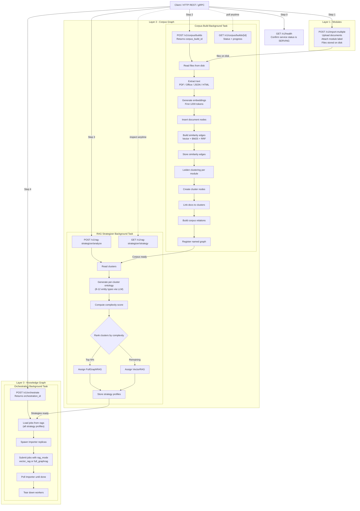

## Overview

The AutoGraph service provides a comprehensive solution for building and managing corpus-based knowledge graphs. It coordinates the entire pipeline from file import through intelligent RAG strategy selection to automated knowledge graph construction and two-stage retrieval.


AutoGraph is designed to work seamlessly with the [Importer](../../reference/importer/) and [Retriever](../../reference/retriever/) services, providing intelligent automation and optimization for large-scale knowledge graph deployments and retrieval.


### Complete Pipeline

The diagram below shows the full end-to-end flow across all service APIs and the three knowledge layers. Solid arrows are the sequential pipeline steps; dashed arrows are polling and inspection calls that can be made at any time.



## Prerequisites

- **ArangoDB** 3.10+
- **LLM and embedding API access** (commonly OpenAI- or Triton-compatible endpoints; your operator configures provider URLs and keys on the service)
- **Valid JWT** for the API (`Authorization: Bearer …`)
- **Platform auth** reachable from the service (for token validation and renewal), if your deployment uses it

Before importing data, you need to create a GraphRAG project. Projects help you 
organize your work and keep your data separate from other projects.

For detailed instructions on creating and managing projects, see the 
[Projects](../../../platform-suite/control-plane-acp.md#projects) section in
the Arango Control Plane (ACP) service documentation.

Once you have created a project, you can reference it when deploying the AutoGraph 
service using the `project_name` field in the service configuration.

## Installation

To install and start the AutoGraph service, use the AI service endpoint
`/v1/AutoGraph`. This endpoint is part of the Arango Control Plane (ACP)
service, which manages the lifecycle of all AI services in the platform.

For detailed instructions on installing, monitoring, and managing the AutoGraph service, 
see [The Arango Control Plane (ACP) service](../../../platform-suite/control-plane-acp.md)
documentation.

## Quick Start

1. Set the environment variables of your deployment (at minimum: ArangoDB credentials, project/database name, chat and embedding keys, and auth integration host if applicable).

2. Start the service.

3. Verify health:



```bash
curl -H "Authorization: Bearer <your_token>" http://localhost:8080/v1/health
```

## Authentication

All endpoints require a **JWT** in the header:

```
Authorization: Bearer <jwt_token>
```

The service handles token renewal automatically, including for long-running background jobs (corpus build, RAG strategizer, orchestration).

## Service Endpoints

REST is exposed on **`http://<host>:8080`**. The same operations are available over **gRPC** on **`9090`**; RPC and message names match the service's proto definition (see [gRPC and protocol buffers](#grpc-and-protocol-buffers)).

### Recommended call sequence

All calls require a valid **`Authorization: Bearer <token>`** header.

**Standard workflow — knowledge graph build**

1. `GET /v1/health` — confirm the service is ready.
2. `POST /v1/import-multiple` — upload documents. Repeat once per module (e.g. call once for `"legal"`, once for `"engineering"`, and so on).
3. `POST /v1/corpus/builds` — trigger the corpus build for all imported modules.
4. Poll `GET /v1/corpus/builds/{corpus_build_id}` until `status` is `completed`.
5. `POST /v1/rag-strategizer/analyze` — assign RAG strategies to clusters.
6. *(Optional)* `GET /v1/rag-strategizer/strategy` — inspect the assigned strategies.
7. `POST /v1/orchestrate` — spawn Importer workers to build the knowledge graph.

**Embed-only (no corpus build needed)**

1. `GET /v1/health`
2. `POST /v1/embed-field-in-collection` — add vector embeddings to an existing ArangoDB collection. Repeat per `(collection, field)` pair.

**Adding a new module to an existing corpus**

Follow the standard workflow, but in step 3 set `incremental: true` and list only the new module in `modules`. Existing modules are preserved; only the listed modules are updated.

**Rules:** Do not call `POST /v1/rag-strategizer/analyze` until the corpus build reaches `status: completed`. Do not call `POST /v1/orchestrate` until the strategizer has completed after a successful build. Only one corpus build and one orchestration run may be active at a time (`409` if you collide).

## Workflow

The typical AutoGraph workflow consists of these stages:

1. **[Import Files](importing-files.md)**: Upload multiple documents with module labels
2. **[Create Corpus Build](corpus-build.md)**: Trigger corpus analysis and clustering
3. **[Monitor Build Progress](corpus-build.md#monitoring-build-status)**: Track the build status
4. **[Analyze RAG Strategies](rag-strategizer.md)**: Let AutoGraph recommend optimal RAG approaches
5. **[Orchestrate Importer Workers](orchestration.md)**: Automatically spawn workers to build knowledge graphs

**Optional operations:**
- **[Incremental Updates](corpus-build.md#incremental-builds)**: Add new modules without rebuilding everything

## Complete Workflow Examples

The examples below show the standard workflows. See [Recommended call sequence](#recommended-call-sequence) for the full ordering rules.

### Knowledge graph (corpus build → strategizer → orchestration)

The typical end-to-end flow for building a knowledge graph:

```bash
# Step 1: Health Check
curl -H "Authorization: Bearer <token>" http://localhost:8080/v1/health

# Step 2: Build Corpus (using File Manager)
curl -X POST \
  -H "Content-Type: application/json" \
  -H "Authorization: Bearer <token>" \
  -d '{
    "embedding_strategy": "first_chunk",
    "file_ids": ["file1", "file2", "file3"],
    "strategy": { "top_k": 7, "cluster_threshold": 2 }
  }' \
  http://localhost:8080/v1/corpus/builds

# Step 3: Monitor Build Progress
curl -H "Authorization: Bearer <token>" \
  http://localhost:8080/v1/corpus/builds/<corpus_build_id>

# Step 4: Analyze Clusters (after build completes)
curl -X POST \
  -H "Content-Type: application/json" \
  -H "Authorization: Bearer <token>" \
  -d '{"full_graph_rag_strategy": "high"}' \
  http://localhost:8080/v1/rag-strategizer/analyze

# Step 5: Review Strategies
curl -H "Authorization: Bearer <token>" \
  http://localhost:8080/v1/rag-strategizer/strategy

# Step 6: Start Orchestration
curl -X POST \
  -H "Content-Type: application/json" \
  -H "Authorization: Bearer <token>" \
  -d '{"replicas": 2, "max_retries": 3}' \
  http://localhost:8080/v1/orchestrate
```

### Field embedding on an existing collection

Use this when you already have documents in ArangoDB and only need vectors + index/view on one attribute. No import or corpus build is required.

```bash
# Health check (same as above)
curl -H "Authorization: Bearer <token>" http://localhost:8080/v1/health

# Embed one field (collection must exist; field must not end with _embedding)
curl -X POST \
  -H "Content-Type: application/json" \
  -H "Authorization: Bearer <token>" \
  -d '{"collection": "my_collection", "field": "content"}' \
  http://localhost:8080/v1/embed-field-in-collection
```

## API Reference

For detailed API documentation, see the
[AutoGraph API Reference](https://arangoml.github.io/platform-dss-api/AutoGraph/proto/index.html).

## gRPC and protocol buffers

The service exposes a **gRPC** interface on port **9090** alongside the HTTP REST API on port **8080**. The RPC and message names correspond to the REST paths documented in this reference section. Your operator can provide the `.proto` service definition file if you need to generate gRPC client stubs for your language.
