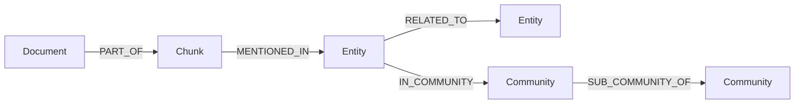
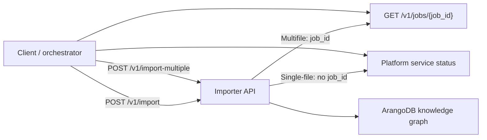

The Importer builds the **Layer 3 knowledge graph** in your ArangoDB database:
the documents, chunks, entities, communities, and relationships that the
Retriever (and downstream applications) query at runtime. This page describes
the collections it creates, the vector indexes it adds, the asynchronous job
lifecycle of an import, and the operational rules to keep in mind when
deploying the service.

For Layer 1 and Layer 2 (modules and corpus graph), see
[AutoGraph Architecture](../autograph/architecture.md).

## Knowledge graph collections

After a successful import, the Importer creates a named graph
`{project_name}_kg` containing the vertex and edge collections below. All
collection names are prefixed with the project name configured at install
time (see [LLM Configuration](llm-configuration.md)).

| Collection | Type | `full_graphrag` | `vector_rag` |
|------------|------|:-:|:-:|
| `{project}_Documents` | vertex | yes | yes |
| `{project}_Chunks` | vertex | yes | yes |
| `{project}_Entities` | vertex | yes | - |
| `{project}_Communities` | vertex | yes | - |
| `{project}_Relations` | edge | yes | yes (PART_OF only) |
| `{project}_SemanticUnits` | vertex | if enabled | if enabled |

Every Layer 3 document carries a `partition_id` field so that data from
different partitions coexists in the same collections. Filter by
`partition_id` when querying a specific partition.

### Documents

- **Purpose**: Original text documents that were processed.
- **Key fields**:
  - `_key`: Unique identifier.
  - `content`: Full text content.
  - `file_name` (multi-file imports only): Original filename.
  - `citable_url` (multi-file imports only): URL used for inline citations at retrieval.
  - `partition_id`: Partition the document belongs to.

### Chunks

- **Purpose**: Text chunks extracted from documents for granular processing.
- **Key fields**:
  - `_key`: Unique identifier.
  - `content`: Chunk text.
  - `tokens`: Number of tokens.
  - `chunk_order_index`: Position within the source document.
  - `embedding`: Vector embedding (when enabled).
  - `partition_id`: Partition the chunk belongs to.

### Entities

- **Purpose**: Entities extracted from text (people, organizations, concepts,
  etc.). Only populated in `full_graphrag` mode.
- **Key fields**:
  - `_key`: Unique identifier.
  - `entity_name`, `entity_type`, `description`.
  - `embedding`: Vector embedding.
  - `clusters`: Community clusters the entity belongs to.
  - `partition_id`: Partition the entity belongs to.

### Communities

- **Purpose**: Clusters of related entities representing themes in the data.
  Only populated in `full_graphrag` mode.
- **Key fields**:
  - `_key`: Unique identifier.
  - `title`: Cluster ID.
  - `report_string`: Markdown report explaining the community.
  - `report_json`: Structured report with `title`, `summary`, `rating`,
    `rating_explanation`, and `findings`.
  - `level`: Hierarchical level (e.g., `1` for top-level).
  - `occurrence`: Normalized score (0-1) for relative frequency.
  - `sub_communities`: References to nested sub-communities.
  - `embedding`: Vector embedding (when `enable_community_embeddings` is `true`).
  - `partition_id`: Partition the community belongs to.

### Relations

- **Purpose**: Edges connecting all nodes in the knowledge graph.
- **Key fields**:
  - `_from`, `_to`: Source and target node references.
  - `type`: Relationship type (see below).
  - For entity-to-entity edges: `weight`, `description`, `source_id`, `order`.
  - `partition_id`: Partition the relationship belongs to.

The Importer creates the following relationship types:

1. **PART_OF**: Links chunks to their parent documents.
2. **MENTIONED_IN**: Connects entities to chunks where they appear.
3. **RELATED_TO**: Relationships between different entities.
4. **IN_COMMUNITY**: Associates entities with their community groups.
5. **SUB_COMMUNITY_OF**: Relates a sub-community to its parent community.

### Semantic Units

- **Purpose**: Image references and web URLs extracted from documents. Only
  created when `enable_semantic_units` is `true`. See
  [Semantic Units](semantic-units.md) for details.

## Vector indexes

The Importer automatically creates a vector index named `vector_cosine` on
the `embedding` field of collections that received embeddings during an import:

- **Entities**: when the selected `rag_mode` imports entities (e.g., `full_graphrag`).
- **Chunks**: when chunk embeddings are enabled (`enable_chunk_embeddings=true`
  in `full_graphrag`, always on in `vector_rag`).
- **Communities**: when `enable_community_embeddings=true` (default).
- **SemanticUnits**: when `enable_semantic_unit_embeddings=true`.
- **Relations**: when `enable_edge_embeddings=true` and the mode imports relations.

These indexes power semantic similarity search and nearest-neighbor queries at
retrieval time. Index parameters (`vector_index_metric`,
`vector_index_use_hnsw`, `vector_index_n_lists`) are set per import; see the
[Parameter Reference](reference/parameters.md#vector-index-configuration).

For background on ArangoDB vector indexes, see
[Vector indexes](../../arangodb/3.12/indexes-and-search/indexing/working-with-indexes/vector-indexes.md).

## Asynchronous import lifecycle

Both `POST /v1/import` and `POST /v1/import-multiple` start work in the
background and return immediately. The diagram below shows how a client
submits an import and monitors progress.

| Pattern | Submit | Monitor |
|---------|--------|---------|
| **Single file** (`POST /v1/import`) | Returns immediately with `success: true` | **No `job_id`**. Use the platform service status (the same status feed AutoGraph reads) |
| **Multiple files** (`POST /v1/import-multiple`) | Returns a `job_id` | Poll `GET /v1/jobs/{job_id}` until `job.is_terminal` is `true` |
| **Concurrency** | Only **one** import per replica at a time | A second submit while one is running gets `success: false` (busy), not an HTTP conflict |

Terminal statuses include `service_completed`, `service_failed`,
`openai_graph_build_failed`, `triton_graph_build_failed`,
`import_graph_to_adb_failed`, and `create_index_failed`. Status messages may
include a `[rag_mode=...]` prefix or markers like `[NO_ENTITIES_WRITTEN]` or
`[KG_VERIFICATION_INCONCLUSIVE]`; see
[Error handling](reference/error-handling.md) for the full list.

## Operational guidance

The recommendations below apply whether you call the Importer directly or via
AutoGraph orchestration.

1. **Choose `rag_mode` explicitly** - `full_graphrag` (default when omitted)
   for entity and community graphs; `vector_rag` for chunk-only retrieval.
2. **Use multi-file imports plus the jobs API** for batches; use single-file
   import only when you already integrate with platform service status.
3. **Serialize imports per replica** - wait for `service_completed` or a
   terminal job status before submitting again.
4. **Match `embedding_dim` to the deployed embedding model**. Mismatches
   cause vector-index creation to fail at runtime.
5. **Keep chat and embedding providers aligned** - both `openai` or both
   `triton` on one instance. OpenAI-compatible vendors (OpenRouter, Azure,
   private endpoints) use `openai` with a custom URL.
6. **Prefer File Manager `file_id`s** for large files already on the platform
   instead of inline base64 payloads.
7. **Plan for long-running jobs**. Graph build and vector-index training can
   take tens of minutes; ensure tokens can renew (the platform JWT lifetime
   applies).
8. **SmartGraph constraints**: use `smart_graph_attribute="partition_id"`, a
   valid `partition_id`, and `shard_count=1` when creating a new SmartGraph.
   See [Import Files](importing-files.md#smartgraph-and-sharding) for details.
