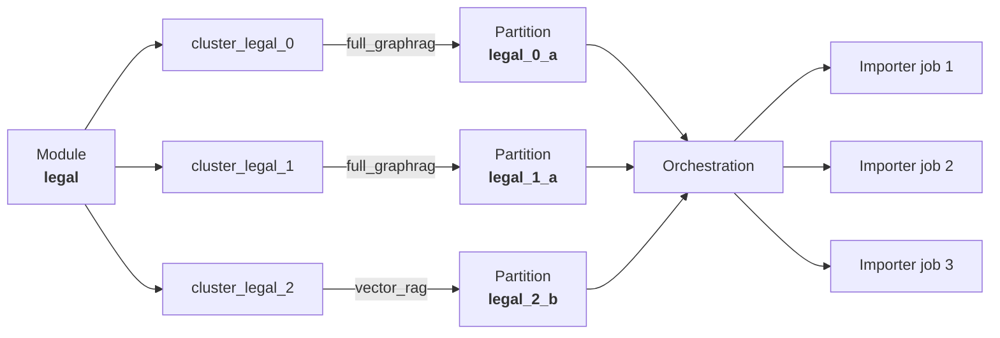

## When to use the Importer standalone vs. with AutoGraph

The Importer supports two distinct usage patterns depending on your needs.

### Standalone Importer (GraphRAG without partitioning)

If you are building a single knowledge graph from your documents and do not
need multiple partitions or automated domain discovery, use the Importer
directly. You can call it through:

- The [Contextual Data Platform web interface](../graphrag/web-interface.md),
  which guides you through configuring and running the Importer step by step.
- The [Import API](importing-files.md) (`POST /v1/import` or
  `POST /v1/import-multiple`), which gives you full control over all parameters.

In this mode, you manage the Importer lifecycle yourself: you install it,
submit import requests, and monitor the results.

### Automated via AutoGraph (multi-partition, strategy-aware builds)

When you need to process large or heterogeneous document collections,
[AutoGraph](../autograph/) manages the Importer for you. AutoGraph
automatically discovers knowledge domains in your data, assigns the optimal
RAG strategy (`full_graphrag` or `vector_rag`) per domain, and spawns
Importer workers to build partitioned knowledge graphs.

In this mode, you **do not call the Importer directly**. AutoGraph handles
replica creation, job submission, `partition_id` and `rag_mode` assignment,
status polling, and teardown.

The rest of this page explains how this automated flow works.

## Three-layer architecture

AutoGraph organizes data across three layers. Each layer has a clear owner
and purpose:

| Layer | Built by | Named Graph | What it contains |
|-------|----------|-------------|------------------|
| **1 - Modules** | You (at import time) | - | Logical groupings of documents (e.g., `"legal"`, `"docs"`, `"support"`) |
| **2 - Corpus Graph** | AutoGraph | `{project}_CorpusGraph` | Document similarity edges, Leiden clusters (`domains`), RAG strategy profiles (`rags`) |
| **3 - Knowledge Graph** | Importer | `{project}_kg` | Documents, Chunks, Entities, Communities, Relations |

The Importer builds **Layer 3 only**. All Layer 3 collections carry a
`partition_id` field so that data from different clusters coexists in the
same collections.

For full details on Layers 1 and 2, see the
[AutoGraph Architecture](../autograph/architecture.md) documentation.

## How AutoGraph spawns import jobs

The same module string flows from **files** to **clusters** to **strategies**
to **Importer partitions**:

1. You [import documents into AutoGraph](../autograph/reference/importing-files.md)
   with a **module** label (e.g., `"legal"`).
2. AutoGraph's [corpus build](../autograph/reference/corpus-build.md) clusters
   documents within each module using Leiden community detection.
3. The [RAG strategizer](../autograph/reference/rag-strategizer.md) analyzes
   each cluster and assigns either `FullGraphRAG` or `VectorRAG`.
4. Each assignment gets a `rag_partition_id` derived from the cluster key.
   For example, cluster `cluster_legal_0` becomes `legal_0_a` (FullGraphRAG)
   or `legal_0_b` (VectorRAG).
5. [Orchestration](../autograph/reference/orchestration.md)
   (`POST /v1/orchestrate`) spawns Importer worker replicas and submits
   **one import job per partition**.
6. Each job payload includes `partition_id` (set to the `rag_partition_id`)
   and `rag_mode` (set to the assigned strategy).

Under normal operation you **do not call the Importer directly**; AutoGraph
handles replica creation, job submission, status polling, and teardown. Call
the Importer yourself only for standalone imports or advanced scenarios
(e.g., re-running a single partition with custom settings).

## How `partition_id` maps to the Corpus Graph

- AutoGraph's `rag_partition_id` (cluster key + strategy suffix `_a`/`_b`)
  is passed as `partition_id` in the import request payload.
- The Importer stores this value on **every** document, chunk, entity,
  community, and relation in the Knowledge Graph.
- Multiple partitions coexist in the same ArangoDB collections; filter by
  `partition_id` when querying.
- When inspecting Layer 3 data, the `partition_id` traces back to a specific
  Leiden cluster and its RAG strategy in the Corpus Graph.

When using the Importer **standalone** (without AutoGraph), you can set
`partition_id` to any string to logically separate different import batches
within the same collections. See the
[`partition_id` parameter reference](reference/parameters.md#partition_id) for details.

## Related resources

- **[AutoGraph overview](../autograph/)**: What AutoGraph is and why to use it.
- **[AutoGraph Architecture](../autograph/architecture.md)**: The three-layer
  knowledge graph architecture and ArangoDB collections.
- **[AutoGraph Design Guide](../autograph/design-guide.md)**: How to structure
  your data with modules and layers.
- **[Corpus Build](../autograph/reference/corpus-build.md)**: Create and
  monitor corpus builds for document clustering.
- **[RAG Strategizer](../autograph/reference/rag-strategizer.md)**: Analyze
  clusters and assign RAG strategies.
- **[Orchestration](../autograph/reference/orchestration.md)**: Spawn Importer
  workers and execute pipeline builds.
