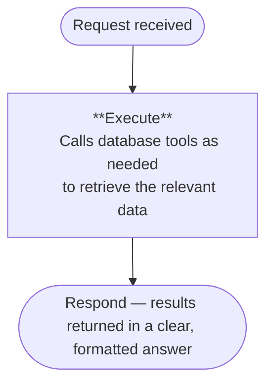
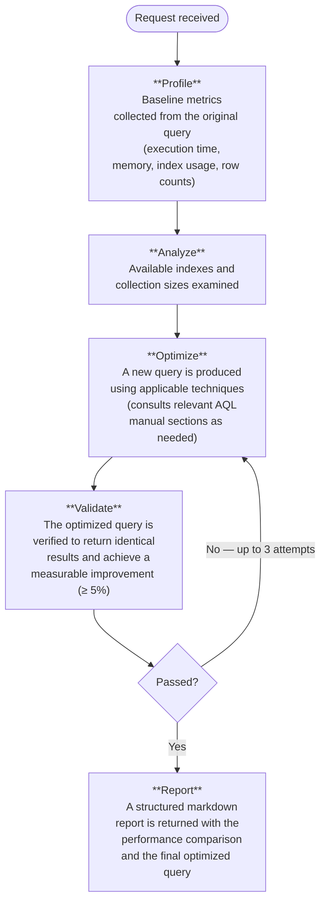
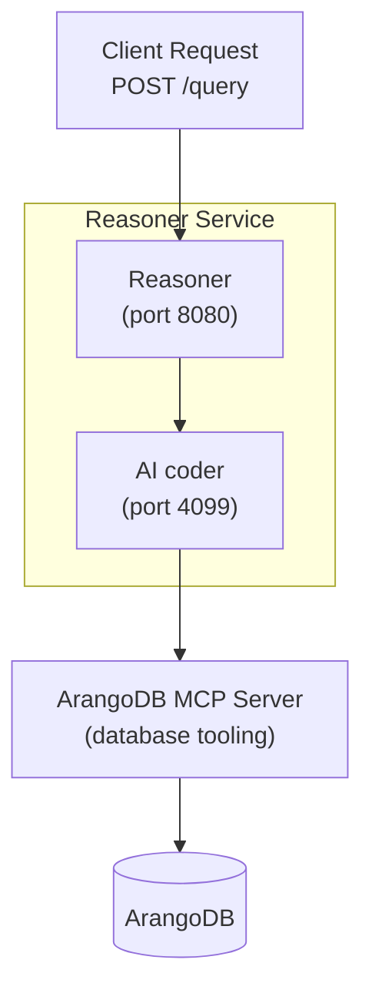

The Reasoner is an AI-powered query optimization service for ArangoDB that
automatically improves the performance of AQL queries. It analyzes slow or
inefficient queries, generates optimized versions, and validates them by
comparing results with the original query to ensure correctness.

You can interact with the Reasoner directly from the **Query Editor** in the
Arango Contextual Data Platform, or through its HTTP API for programmatic
integrations. The service supports both real-time streaming and standard
request/response modes.

The Reasoner is accessible from the **Query Editor**. It requires a license.

> **Note:** The Reasoner requires the **ArangoDB MCP Server** to be running and
> connected. Both services must be active for the Reasoner to function. The MCP
> Server is the bridge through which the Reasoner interacts with your ArangoDB
> database.

## Key capabilities

| Capability | Description |
|---|---|
| **Database Exploration** | Discover collections, graphs, schemas, and document structures without prior knowledge of the database |
| **Query Optimization** | Submit an AQL query and receive a validated, faster version with a detailed performance comparison report |
| **Real-Time Streaming** | Receive results progressively via Server-Sent Events (SSE) as the Reasoner works through each phase |

## How the Reasoner works

The Reasoner automatically identifies the nature of each request and selects
the appropriate processing pipeline.

### General and exploration queries

For requests such as "list all collections" or "show me the graph structure":



### Query optimization

For requests that mention terms such as `optimize`, `slow`, `performance`,
`speed up`, `faster`, `execution time`, or `profile`:



## Architecture overview

The Reasoner runs as a single self-contained service. It bundles an AI coder
that communicates with the ArangoDB MCP Server — a dedicated bridge that
exposes ArangoDB operations as structured tools.



## Prerequisites

The following external services are required:

| Service | Role |
|---|---|
| **ArangoDB MCP Server** | Exposes ArangoDB operations as tools that the Reasoner can call; must be running and reachable before the Reasoner starts |
| **ArangoDB** | The target database |
| **OpenAI API** | An API key is required |

## Access the Reasoner

You can open the Reasoner panel in two ways:

- From the **Welcome** tab of the Query Editor, click **Open Reasoner** in the
  **Start** section.
- From any query tab, click **Optimize** in the toolbar at the bottom of the
  editor.

The Reasoner opens as a **Reasoner** tab in the right panel of the Query Editor.

## Set up the Reasoner

On first use, the **Setup Reasoner** panel prompts you to configure an AI
provider for the current database.

1. In the **OpenAI API Key** field, enter your API key directly or pick one from
   the dropdown of saved secrets managed in the
   [Secrets Manager](../platform-suite/secrets-manager.md).
2. Select an **OpenAI Model** from the dropdown.
3. Click **Start Service**. A progress indicator shows the startup status.
   The service starts and then waits for the MCP server connection to be
   established. Chat input is enabled once the connection is confirmed and
   **MCP Connected** is shown in the bottom status bar.

You can check the status of the service and MCP server, or restart and stop the
service at any time from the **Manage Services** dialog at the bottom of the
panel.

## Ask the Reasoner

Once the Reasoner service is ready, you can submit questions and optimization
requests.

1. Type your question or instruction in the input field at the bottom of the
   Reasoner panel, for example `Optimize this query` or
   `Find all users connected to product X`.
2. Press  to send, or  to insert a
   line break without sending.
3. The Reasoner responds with an **AI Reasoning Response**. Code suggestions in
   the response include an **Open in Editor** button to apply the query to a new
   query tab, where you can verify and run it.


The Reasoner operates in one-shot mode. Each question is independent — there is
no follow-up context between messages.



Always verify AI-generated query optimizations.
AI can make mistakes or produce unexpected results.


## Query optimization

The Reasoner includes a fully automated query optimization pipeline. To trigger
it, include the query you want to optimize in your request along with any of the
following terms: `optimize`, `slow`, `performance`, `speed up`, `faster`,
`execution time`, or `profile`.

### Optimization stages

The pipeline runs through the following stages automatically:

1. **Baseline Profiling** — The original query is profiled to measure execution
   time, memory usage, index utilization, and rows scanned. This establishes the
   benchmark.
2. **Index Discovery** — All available indexes on the relevant collections are
   retrieved to inform the optimization strategy.
3. **Query Rewriting** — A new query is produced using applicable optimization
   techniques.
4. **Syntax Validation** — The rewritten query is validated for correctness
   before execution, at no additional query cost.
5. **Side-by-Side Comparison** — Both the original and optimized queries are
   executed and their performance metrics compared.
6. **Result Verification** — The Reasoner confirms that the optimized query
   returns identical results to the original, matching both row counts and data
   content, before accepting it.
7. **Automatic Retry** — If the improvement does not meet the minimum threshold
   (5%) or the results do not match, a new optimization approach is attempted
   automatically, up to 3 attempts.
8. **Optimization Report** — A structured markdown report is returned including
   a performance comparison table, a summary of what changed, the reason it is
   faster, and the final optimized query.

### Optimization example

**Request:**

```json
{
  "request": "Optimize this query: FOR u IN users FILTER u.status == 'active' SORT u.created_at DESC RETURN u",
  "stream": true
}
```

**Optimization report (delivered in the `done` event `result` field):**

````markdown
## Optimization Summary

### Performance Comparison
| Metric         | Original | Optimized    |
|----------------|----------|--------------|
| Execution time | 0.842s   | 0.091s       |
| Rows returned  | 1,247    | 1,247        |
| Peak memory    | 8.2 MB   | 1.1 MB       |
| Speedup        | —        | 9.25× faster |

### What Changed
- Added a composite index hint on `status` and `created_at` to avoid a full
  collection scan.
- The SORT on `created_at DESC` is now served directly by the index, eliminating
  a separate in-memory sort step.

### Why It's Faster
- The original query performed a full scan of all documents in the `users`
  collection before filtering by status. With the composite index, only documents
  matching `status == 'active'` are read, already in the correct sort order —
  reducing both execution time and memory usage significantly.

### Final Optimized Query
```aql
FOR u IN users
  OPTIONS { indexHint: "status_created_at", forceIndexHint: true }
  FILTER u.status == "active"
  SORT u.created_at DESC
  RETURN u
```
````

### When validation does not pass

Each `validation` SSE event includes a `reason` field that explains why an
attempt did not pass. Common scenarios:

| Symptom | Likely Cause |
|---|---|
| `rows_match: false` | The rewritten query returns a different number of results; the optimization may have altered the query's logic |
| `content_match: false` | Row counts match but the content did not |
| `improvement_pct` below threshold | The optimization is valid but the improvement is less than the minimum required (5%); the Reasoner retries with a different approach |

### Safety guarantees

The optimization pipeline operates in strict **read-only mode**. The Reasoner
rejects any optimization attempt that includes write operations, ensuring the
optimizer never modifies your data or schema.

## History

Click **History** in the top-right corner of the Reasoner panel to expand the
session history. Each past session is listed by its first message and timestamp.
To delete all past sessions, click **Clear History** and confirm when prompted.

## API reference

The Reasoner exposes an HTTP API for programmatic access. All requests are sent
to `POST /query`. The service supports two response modes: streaming and
non-streaming.

### Streaming mode (recommended)

Streaming mode returns results progressively as the Reasoner works through each
phase. Events are delivered over a persistent Server-Sent Events (SSE)
connection, allowing the client to display progress in real time.

**General query — request:**

```json
{
  "request": "List all the collections in database User",
  "stream": true
}
```

**Example SSE stream — general query:**

```
event: phase
data: {"phase": "executing"}

event: tool_call
data: {"tool": "list-collections", "input": {}, "status": "pending"}

event: tool_result
data: {"tool": "list-collections", "result": "[\"users\", \"orders\", \"products\"]"}

event: text
data: {"content": "The database contains 3 collections: **users**, **orders**, and **products**."}

event: done
data: {"synthesized": false}
```

**Optimization query — request:**

```json
{
  "request": "Optimize this query: FOR u IN users FILTER u.status == 'active' SORT u.created_at DESC RETURN u",
  "stream": true
}
```

**Example SSE stream — optimization query:**

```
event: phase
data: {"phase": "executing"}

event: phase
data: {"phase": "validating"}

event: validation
data: {"passed": true, "original_time": 0.842, "optimized_time": 0.091, "improvement_pct": 89.2, "rows_match": true, "content_match": true, "reason": "Optimization valid: execution time reduced by 89.2%, rows match (1247=1247), content verified (hash match)"}

event: phase
data: {"phase": "synthesizing"}

event: done
data: {"synthesized": true, "result": "## Optimization Summary\n\n### Performance Comparison\n| Metric | Original | Optimized |\n..."}
```

### Non-streaming mode

Non-streaming mode waits for the complete result before responding. This is
suited for server-to-server integrations where a single JSON response is
preferred.

**Request:**

```json
{
  "request": "List all graphs in the database",
  "stream": false
}
```

**Response:**

```json
{
  "result": "The database contains 2 named graphs:\n\n- **social_network** — vertices: `users`, edges: `friendships`\n- **supply_chain** — vertices: `products`, `warehouses`, edges: `shipments`"
}
```

### `POST /query` — request parameters

| Field | Type | Required | Default | Description |
|---|---|---|---|---|
| `request` | string | Yes | — | The user question or query to optimize |
| `stream` | boolean | No | `true` | `true` returns an SSE stream; `false` returns a JSON response after completion |

### HTTP status codes

| Code | Description |
|---|---|
| `200` | Request completed successfully |
| `500` | Processing failed — the error detail includes the phase during which the failure occurred |

## MCP Server registration

The Reasoner connects to ArangoDB through the ArangoDB MCP Server. In managed
deployments (Kubernetes / platform), the MCP server is auto-configured at pod
startup via the `MCP_SERVER_URL` environment variable — no manual registration
is needed.

For local or custom deployments, use `POST /mcp/register` to register the MCP
server at runtime.

**Remote (HTTP) MCP Server:**

```bash
curl -X POST http://localhost:8080/mcp/register \
  -H "Content-Type: application/json" \
  -d '{
    "name": "arangodb",
    "config": {
      "type": "remote",
      "url": "http://arangodb-mcp-server-<pod_id>:8080/",
      "enabled": true
    }
  }'
```

Where `<pod_id>` is the ID of your running ArangoDB MCP Server pod (for example
`ir6oe`), giving a URL of the form `http://arangodb-mcp-server-ir6oe:8080/` —
the same pattern used by `MCP_SERVER_POD_ID` at startup.

**Response:**

```json
{
  "success": true,
  "message": "MCP server 'arangodb' registered successfully",
  "server_name": "arangodb"
}
```

> **Note:** Only one MCP server is supported at a time.

### List registered MCP servers

```bash
curl http://localhost:8080/mcp/registered
```

**Response:**

```json
{
  "registered_servers": ["arangodb"]
}
```

## Health and monitoring

The Reasoner exposes three health endpoints for use with Kubernetes probes and
operational monitoring.

| Endpoint | Purpose | Kubernetes Probe |
|---|---|---|
| `GET /health` | Liveness check — confirms the service process is running | Liveness probe |
| `GET /health/ready` | Readiness check — verifies connectivity to the AI coder and the MCP server | Readiness probe |
| `GET /health/mcp` | Detailed MCP server connectivity status | Diagnostic / monitoring |

### Liveness check

Returns `healthy` whenever the service process is running, regardless of
downstream connectivity.

```bash
curl http://localhost:8080/health
```

```json
{
  "status": "healthy",
  "version": "1.0.0",
  "environment": "production"
}
```

### Readiness check

Verifies that the AI coder is reachable and reports MCP server connectivity.
The service is considered ready when the AI coder is available; MCP server
status is reported for visibility.

```bash
curl http://localhost:8080/health/ready
```

```json
{
  "ready": true,
  "checks": {
    "opencode": {
      "status": "healthy",
      "url": "http://localhost:4099"
    },
    "mcp_servers": {
      "status": "available",
      "details": {
        "arangodb": { "status": "connected" }
      }
    }
  }
}
```

### MCP connectivity check

Returns detailed status for all registered MCP servers.

```bash
curl http://localhost:8080/health/mcp
```

```json
{
  "status": "healthy",
  "servers": {
    "arangodb": { "status": "connected" }
  },
  "connected_servers": ["arangodb"],
  "timestamp": "2026-03-27T10:30:00.000Z"
}
```

**Possible status values:**

| Status | Meaning |
|---|---|
| `healthy` | The registered MCP server is connected |
| `degraded` | The registered MCP server is not connected |
| `unhealthy` | No MCP servers are configured |
| `error` | AI coder could not be reached to retrieve MCP status |

## What's next

- **[Query Editor](../platform-suite/query-editor.md#optimize-queries-reasoner)**:
  Learn about the full Query Editor interface including the Optimize button.
- **[AQLizer](aqlizer.md)**: Generate AQL queries from natural language directly
  in the Query Editor.
- **[Secrets Manager](../platform-suite/secrets-manager.md)**: Manage the API
  keys used by the Reasoner and other services.
