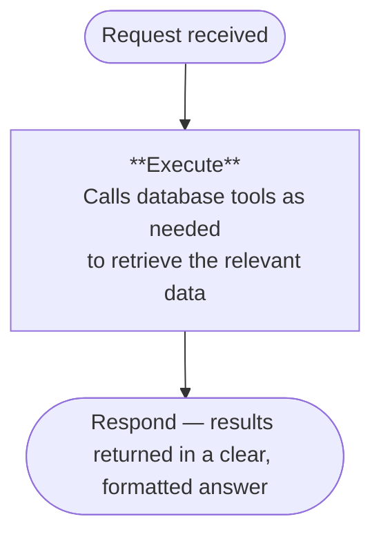
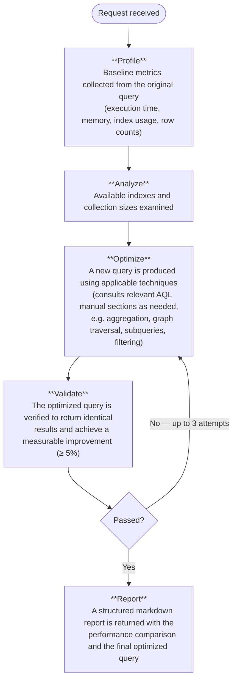
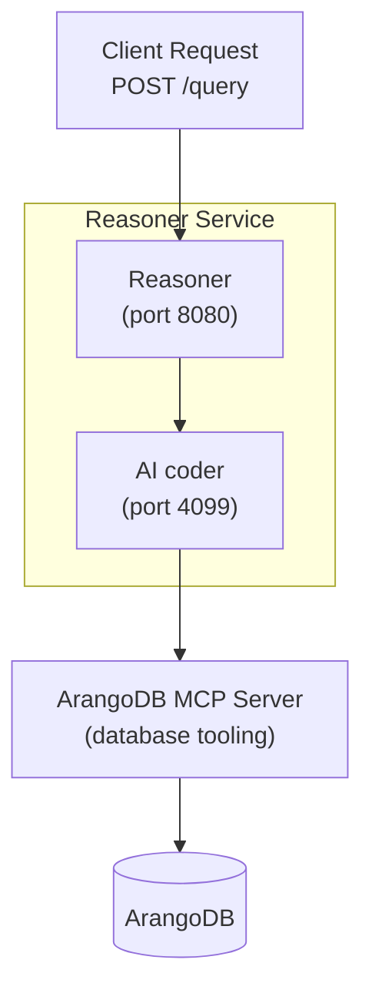

The Reasoner is an AI-powered query optimization service for ArangoDB that
automatically improves the performance of AQL queries. It analyzes slow or
inefficient queries, generates optimized versions, and validates them by
comparing results with the original query to ensure correctness.

You can interact with the Reasoner directly from the **Query Editor** in the
Arango Contextual Data Platform, or through its HTTP API for programmatic
integrations.

> **Note:** The Reasoner requires the **ArangoDB MCP Server** to be running and
> connected. Both services must be active for the Reasoner to function. The MCP
> Server is the bridge through which the Reasoner interacts with your ArangoDB
> database.

## Key capabilities

| Capability | Description |
|---|---|
| **Database Exploration** | Discover collections, graphs, schemas, and document structures without prior knowledge of the database |
| **Query Optimization** | Submit an AQL query and receive a validated, faster version with a detailed performance comparison report |
| **Real-Time Streaming** | Receive results progressively via Server-Sent Events (SSE) as the Reasoner works through each phase (API only) |

## How the Reasoner works

The Reasoner automatically identifies the nature of each request and selects
the appropriate processing pipeline.

### General and exploration queries

For requests such as "list all collections" or "show me the graph structure":

### Query optimization

For requests that mention terms such as `optimize`, `slow`, `performance`,
`speed up`, `faster`, `execution time`, or `profile`:

## Architecture overview

The Reasoner runs as a single self-contained service. It bundles an AI coder
that communicates with the ArangoDB MCP Server — a dedicated bridge that
exposes ArangoDB operations as structured tools.

## Prerequisites

The following external services are required:

| Service | Role |
|---|---|
| **ArangoDB MCP Server** | Exposes ArangoDB operations as tools that the Reasoner can call; must be running and reachable before the Reasoner starts |
| **ArangoDB** | The target database |
| **OpenAI API** | An API key is required |

## Query optimization

The Reasoner includes a fully automated query optimization pipeline. To trigger
it, include the query you want to optimize in your request along with any of the
following terms: `optimize`, `slow`, `performance`, `speed up`, `faster`,
`execution time`, or `profile`.

### Optimization stages

The pipeline runs through the following stages automatically:

1. **Baseline Profiling** — The original query is profiled to measure execution
   time, memory usage, index utilization, and rows scanned. This establishes the
   benchmark.
2. **Index Discovery** — All available indexes on the relevant collections are
   retrieved to inform the optimization strategy.
3. **Query Rewriting** — A new query is produced using applicable optimization
   techniques.
4. **Syntax Validation** — The rewritten query is validated for correctness
   before execution, at no additional query cost.
5. **Side-by-Side Comparison** — Both the original and optimized queries are
   executed and their performance metrics compared.
6. **Result Verification** — The Reasoner confirms that the optimized query
   returns identical results to the original, matching both row counts and data
   content, before accepting it.
7. **Automatic Retry** — If the improvement does not meet the minimum threshold
   (5%) or the results do not match, a new optimization approach is attempted
   automatically, up to 3 attempts.
8. **Optimization Report** — A structured markdown report is returned including
   a performance comparison table, a summary of what changed, the reason it is
   faster, and the final optimized query.

### Safety guarantees

The optimization pipeline operates in strict **read-only mode**. The Reasoner
rejects any optimization attempt that includes write operations, ensuring the
optimizer never modifies your data or schema.

## What's next

- **[Web Interface](web-interface.md)**: Step-by-step instructions for using
  the Reasoner from the Query Editor in the Arango Contextual Data Platform.
- **[API Reference](api-reference.md)**: Use the Reasoner programmatically via
  its HTTP API, including streaming and non-streaming modes.

