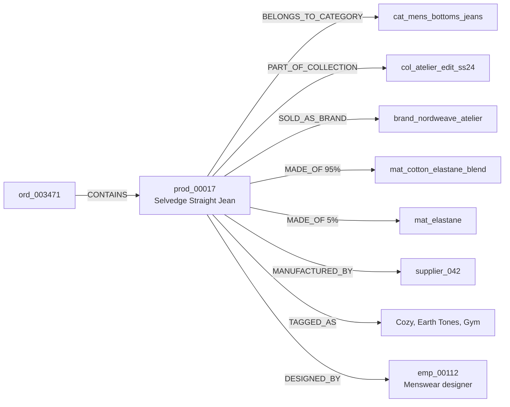
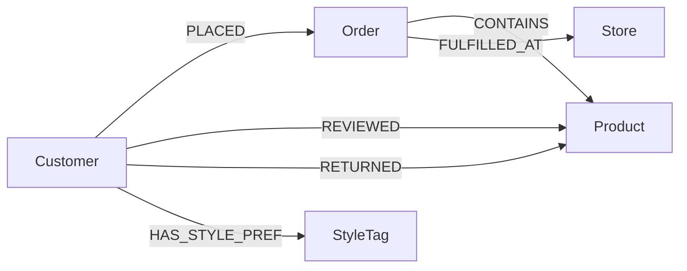
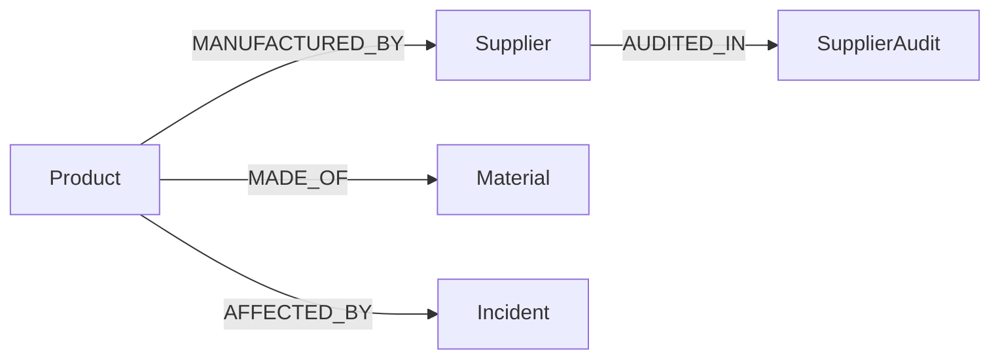
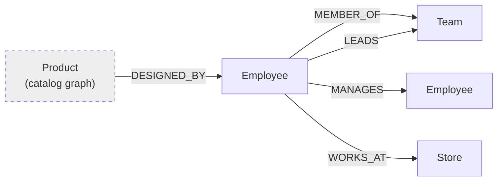

In the previous pages we loaded the Nordweave dataset - 57k vertices and
750k edges of catalog, customer, and supply-chain data - into ArangoDB.
We set the database to OneShard for single-server query speed, and carved
the org chart into a SatelliteGraph so employee lookups stay local on
every DB-Server. The data is in. Now it is time to look at it.

This part of the tutorial covers four things, one per page:

1. Opening the Nordweave graph in the Graph Visualizer and understanding
   what you see (this page).
2. Reading the relationships - how the nodes and edges form the
   connective tissue of Nordweave's business (this page).
3. Building [custom themes](custom-themes.md) so different teams can look
   at the same graph and instantly see what matters to them.
4. Writing [Canvas Actions](canvas-actions.md) - selection-driven queries
   that turn the canvas into an interactive investigation tool.

Then, once you have a feel for the data visually, the final page introduces
[Ada](meeting-ada.md), the ArangoDB AI Digital Assistant.

Whether you have spent years building graph applications or this is your
first time touching a graph database, this chapter is designed to give you
a hands-on feel for what "graph-native" actually looks like when you can
see and interact with it.

## Opening the Graph Visualizer

The Graph Visualizer is the browser-based exploration tool built into the
Arango Contextual Data Platform. It gives you an interactive canvas where
nodes appear as circles, edges appear as lines with arrows, and the whole
thing responds to clicks, drags, and right-click context menus. Think of
it as the visual layer on top of the data you imported with `arangoimport`
earlier in this tutorial.

Before you can visualize anything, the data needs to be registered as a
named graph. The Graph Visualizer works with named graphs - a named graph
is simply a declaration that says "these vertex collections and these edge
collections form a graph, and here is which edge collection connects which
vertex types." You created the data earlier, but we haven't yet told
ArangoDB to treat it as a single coherent graph.

If you haven't already created a named graph for the Nordweave catalog,
head to the web interface, select the `nordweave` database, and navigate
to **Graphs** in the main navigation. Create a new graph - call it
`nordweave_catalog` - and define the edge definitions that bind the
collections together. For example:

- `belongs_to_category`: `products → categories`
- `sold_as_brand`: `products → brands`
- `part_of_collection`: `products → collections`
- `made_of`: `products → materials`
- `manufactured_by`: `products → suppliers`
- `tagged_as`: `products → style_tags`
- `contains`: `orders → products`
- `placed`: `customers → orders`
- `reviewed`: `customers → products`
- `returned`: `customers → products`
- `purchased`: `customers → products`
- `has_style_pref`: `customers → style_tags`
- `fulfilled_at`: `orders → stores`
- `designed_by`: `products → employees`

You can also do this in `arangosh`:

```js
var graph_module = require("@arangodb/general-graph");

graph_module._create("nordweave_catalog", [
  graph_module._relation("belongs_to_category", ["products"], ["categories"]),
  graph_module._relation("sold_as_brand",       ["products"], ["brands"]),
  graph_module._relation("part_of_collection",  ["products"], ["collections"]),
  graph_module._relation("made_of",             ["products"], ["materials"]),
  graph_module._relation("manufactured_by",     ["products"], ["suppliers"]),
  graph_module._relation("tagged_as",           ["products"], ["style_tags"]),
  graph_module._relation("contains",            ["orders"],   ["products"]),
  graph_module._relation("placed",              ["customers"],["orders"]),
  graph_module._relation("reviewed",            ["customers"],["products"]),
  graph_module._relation("returned",            ["customers"],["products"]),
  graph_module._relation("purchased",           ["customers"],["products"]),
  graph_module._relation("has_style_pref",      ["customers"],["style_tags"]),
  graph_module._relation("fulfilled_at",        ["orders"],   ["stores"]),
  graph_module._relation("designed_by",         ["products"], ["employees"])
]);
```

Once the named graph exists, click it in the Graphs list. The Graph
Visualizer opens and automatically populates the canvas with an initial
neighborhood - a handful of nodes and their immediate connections, enough
to give you a starting point.

### What you see on the canvas

The interface breaks down into a few key areas:

- **Top bar** - shows the graph name (`nordweave_catalog`), the graph
  type, and houses the search field and the **Queries** button.
- **Canvas** - the main area. Nodes are circles. Edges are lines with
  directional arrows. Everything is draggable. You can zoom with the
  scroll wheel, pan by dragging the background, and right-click anything
  for a context menu.
- **Legend panel** - on the right side. This is where the magic happens
  for theming. It shows every collection type currently on the canvas,
  how many of each, and lets you customize their appearance.
- **Layout and navigation tools** - bottom right corner. A minimap for
  orientation, zoom controls, layout algorithm selector, screenshot
  download, and the "fit to screen" button you'll click more often than
  you expect.

### First things to try

1. **Expand a node.** Right-click any product node, click **Expand**, then
   **All**. The product's neighbors appear: its category, brand, materials,
   supplier, style tags, and any customers who purchased or reviewed it.
   This is the *star pattern* - one entity radiating outward to everything
   it is connected to.
2. **Find a specific product.** Click the search field in the top bar,
   select `products` as the node type, and search for `prod_00017` - the
   Selvedge Straight Jean from the Atelier Edit. Add it to the canvas,
   then expand it. You'll see it fans out to the brand (NORDWEAVE
   Atelier), the category (`mens_bottoms_jeans`), the collection (Atelier
   Edit SS24), and two materials (cotton-elastane blend and elastane).
3. **Find the shortest path.** Add a second product - say, `prod_00042`.
   Select both products (hold Shift and click each one), right-click, and
   choose **Shortest Path**. If they share a supplier, a material, or a
   customer who bought both, you'll see the connecting chain appear on
   the canvas. This is the moment where "graph" stops being an abstract
   concept and becomes a visible thing.
4. **Dismiss the noise.** Once you've expanded a few nodes, the canvas
   gets busy. Select the nodes you care about, right-click, and choose
   **Dismiss other nodes**. The canvas clears to just your selection and
   the edges between them. This is how you go from "everything" to "just
   the story I'm investigating."

## Understanding the relationships

The Graph Visualizer makes something tangible that was implicit in the
JSONL files we loaded earlier: every `_from` and `_to` field in an
edge file became a visible line on the canvas. Walk through what those
relationships actually mean for Nordweave's business, because understanding
the shape of your graph is the prerequisite for asking good questions of it.

### The product star

A single Nordweave product sits at the center of a dense web of
relationships. Take the Selvedge Straight Jean (`prod_00017`):



Every one of those arrows is an edge document sitting in its own
collection, with its own attributes. The `MADE_OF` edges carry a `pct`
field (95 and 5 in this case). The `CONTAINS` edge carries `qty`, `size`,
`color`, and `unit_price_usd`. Edges in ArangoDB are first-class documents
- they are not just pointers, they carry data.

On the canvas, this looks like a starburst: a central circle (the
product) with lines radiating to its neighbors, each line a different
color depending on which edge collection it belongs to.

### The customer journey

From a customer's perspective, the graph tells a story that reads left to
right through time:



Customer `cust_00289` - Christine Palmer, the return-fraud customer from
the brief - has a pattern that jumps out visually: she has many `PLACED`
edges (she orders frequently), many `RETURNED` edges (she sends most of
them back), and a `return_rate_pct` of 66.67%. When you expand her node on
the canvas, the density of return edges compared to purchase edges tells
the story before you even read a single attribute.

### The supply chain spine

Following a product backward through the supply chain reveals a different
set of relationships:



This chain is how Nordweave answers questions like "which supplier has had
the most SEV1 incidents, and which products did those incidents affect?"
In a relational database, that is a four-table join with careful indexing.
In the graph, it is a traversal - follow the edges, collect what you find.

### The org chart (SatelliteGraph)

Remember the SatelliteGraph from the [previous page](satellitegraphs.md)?
It is a separate named graph (`org_chart`) but it connects to the catalog
through shared collections:



When you expand a designer node, you see both their organizational context
(team, manager, store) and their creative output (products they designed).
The SatelliteGraph ensures these lookups are always local, no matter which
DB-Server handles the query.

### Why this matters for what comes next

Understanding these relationship patterns is not academic. In the next
pages you build [custom themes](custom-themes.md) that color-code these
different relationship types, and [Canvas Actions](canvas-actions.md) that
follow these exact paths interactively. The shape of the graph is your
playbook for both.
