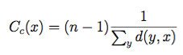

Graph analytics is a branch of data science that deals with analyzing information
networks known as graphs, and extracting information from the data relationships.
It ranges from basic measures that characterize graphs, over PageRank, to complex
algorithms. Common use cases include fraud detection, recommender systems,
and network flow analysis.

ArangoDB offers a feature for running algorithms on your graph data,
called Graph Analytics Engines (GAEs). It is available on request for the
[Arango Managed Platform (AMP)](https://dashboard.arangodb.cloud/home?utm_source=docs&utm_medium=cluster_pages&utm_campaign=docs_traffic)
and included in the [AI Data Platform](../data-platform/_index.md).

Key features:

- **Separation of storage and compute**: GAEs are a solution that lets you run
  graph analytics independent of your ArangoDB Core, including on dedicated machines
  optimized for compute tasks. This separation of OLAP and OLTP workloads avoids
  affecting the performance of the transaction-oriented database systems.

- **Fast data loading**: You can easily and efficiently import graph data from
  ArangoDB and export results back to ArangoDB.

- **In-memory processing**: All imported data is held and processed in the
  main memory of the compute machines for very fast execution of graph algorithms
  such as connected components, label propagation, and PageRank.

## Workflow

The following lists outlines how you can use Graph Analytics Engines (GAEs).
How to perform the steps is detailed in the subsequent sections.




1. Determine the approximate size of the data that you will load into the GAE
   and ensure the machine to run the engine on has sufficient memory. The data as well as the
   temporarily needed space for computations and results needs to fit in memory.
2. [Start a `graphanalytics` service](#start-a-graphanalytics-service) via the AI service
   that manages various Platform components for graph intelligence and machine learning.
   It only takes a few seconds until the engine service can be used. The engine
   runs adjacent to the pods of the ArangoDB Core.
3. [Load graph data](#load-data) from the ArangoDB Core into the engine. You can load
   named graphs or sets of node and edge collections. This loads the edge
   information and a configurable subset of the node attributes.
4. [Run graph algorithms](#run-algorithms) on the data. You only need to load the data once per
   engine and can then run various algorithms with different settings.
5. [Write the computation results back](#store-job-results) to the ArangoDB Core.
6. [Stop the engine service](#stop-a-graphanalytics-service) once you are done.




Before you can use Graph Analytics Engines, you need to request the feature
via __Request help__ in the Arango Managed Platform (AMP) dashboard for a deployment.

The deployment needs to use **AWS** as the cloud provider.

Single server deployments using ArangoDB version 3.11 are not supported.


1. Determine the approximate size of the data that you will load into the GAE
   to select an engine size with sufficient memory. The data as well as the
   temporarily needed space for computations and results needs to fit in memory.
2. Deploy an engine of the desired size and of type `gral`. It only takes a few
   seconds until the engine can be used. The engine runs adjacent to a particular
   AMP deployment.
3. Load graph data from ArangoDB into the engine. You can load named graphs or
   sets of node and edge collections. This loads the edge information and a
   configurable subset of the node attributes.
4. Run graph algorithms on the data. You only need to load the data once per
   engine and can then run various algorithms with different settings.
5. Write the computation results back to ArangoDB.
6. Delete the engine once you are done.




## Authentication




You can use any of the available authentication methods the Data Platform
supports to start and stop `graphanalytics` services via the AI service as
well as to authenticate requests to the [Engine API](#engine-api).

- HTTP Basic Authentication
- Access tokens
- JWT session tokens
<!-- TODO
- Single Sign-On (SSO)
-->



The [Management API](#management-api) for deploying and deleting engines requires
an AMP **API key**. See
[Generating an API Key](../amp/api/get-started.md#generating-an-api-key)
on how to create one.

You then need to generate an **access token** using the API key. See
[Authenticating with Oasisctl](../amp/api/get-started.md#authenticating-with-oasisctl)
on how to do so using `oasisctl login`.

The [Engine API](#engine-api) uses one of two authentication methods, depending
on the [__auto login to database UI__](../amp/deployments/_index.md#auto-login-to-database-ui)
setting in AMP:
- **Enabled**: You can use an AMP access token created with an API key
  (see above), allowing you to use one token for both the Management API and
  the Engine API.
- **Disabled**: You need use a JWT user token created from ArangoDB credentials.
  These session tokens need to be renewed every hour by default. See
  [HTTP API Authentication](../arangodb/3.12/develop/http-api/authentication.md#jwt-user-tokens)
  for details.




## Start and stop Graph Analytics Engines

The interface for managing the engines depends on the environment you use:

- **AI Data Platform**: [AI service](#ai-service)
- **Arango Managed Platform (AMP)**: [Management API](#management-api)

### AI service



GAEs are deployed and deleted via the [AI service](reference/gen-ai.md)
in the AI Data Platform.

If you use cURL, you need to use the `-k` / `--insecure` option for requests
if the Platform deployment uses a self-signed certificate (default).

#### Start a `graphanalytics` service

`POST <ENGINE_URL>/ai/v1/graphanalytics`

Start a GAE via the AI service with an empty request body:

```sh
# Example with a JWT session token
ADB_TOKEN=$(curl -sSk -d '{"username":"root", "password": ""}' -X POST https://127.0.0.1:8529/_open/auth | jq -r .jwt)

Service=$(curl -sSk -H "Authorization: bearer $ADB_TOKEN" -X POST https://127.0.0.1:8529/ai/v1/graphanalytics)
ServiceID=$(echo "$Service" | jq -r ".serviceInfo.serviceId")
if [[ "$ServiceID" == "null" ]]; then 
  echo "Error starting gral engine"
else
  echo "Engine started successfully"
fi
echo "$Service" | jq
```

#### List the services

`POST <ENGINE_URL>/ai/v1/list_services`

You can list all running services managed by the AI service, including the
`graphanalytics` services:

```sh
curl -sSk -H "Authorization: bearer $ADB_TOKEN" -X POST https://127.0.0.1:8529/ai/v1/list_services | jq
```

#### Stop a `graphanalytics` service

Delete the desired engine via the AI service using the service ID:

```sh
curl -sSk -H "Authorization: bearer $ADB_TOKEN" -X DELETE https://127.0.0.1:8529/ai/v1/service/$ServiceID | jq
```

### Management API



GAEs are deployed and deleted with the Management API for graph analytics on the
Arango Managed Platform (AMP). You can also list the available engine sizes and
get information about deployed engines.

To determine the base URL of the management API, use the AMP dashboard
and copy the __APPLICATION ENDPOINT__ of the deployment that holds the graph data
you want to analyze. Replace the port with `8829` and append
`/graph-analytics/api/graphanalytics/v1`, e.g.
`https://123456abcdef.arangodb.cloud:8829/graph-analytics/api/graphanalytics/v1`.

Store the base URL in a variable called `BASE_URL`:

```bash
BASE_URL='https://...'
```

To authenticate requests, you need to use the following HTTP header:

```
Authorization: bearer <ARANGO_GRAPH_TOKEN>
```

You can create an AMP access token with `oasisctl login`. Save it in a
variable to ease scripting. Note that this should be the token string only and
not include quote marks. The following examples assume Bash as the shell and
that the `curl` and `jq` commands are available.

```bash
ARANGO_GRAPH_TOKEN="$(oasisctl login --key-id "<AG_KEY_ID>" --key-secret "<AG_KEY_SECRET>")"
```

Example with cURL that uses the token variable:

```bash
curl -H "Authorization: bearer $ARANGO_GRAPH_TOKEN" "$BASE_URL/api-version"
```

Request and response payloads are JSON-encoded in the management API.

#### Get the API version

`GET <BASE_URL>/api-version`

Retrieve the version information of the management API.

```bash
curl -H "Authorization: bearer $ARANGO_GRAPH_TOKEN" "$BASE_URL/api-version"
```

#### List engine sizes

`GET <BASE_URL>/enginesizes`

List the available engine sizes, which is a combination of the number of cores
and the size of the RAM, starting at 1 CPU and 4 GiB of memory (`e4`).

```bash
curl -H "Authorization: bearer $ARANGO_GRAPH_TOKEN" "$BASE_URL/enginesizes"
```

#### List engine types

`GET <BASE_URL>/enginetypes`

List the available engine types. The only type supported for GAE workloads is
called `gral`.

```bash
curl -H "Authorization: bearer $ARANGO_GRAPH_TOKEN" "$BASE_URL/enginetypes"
```

#### Deploy an engine

`POST <BASE_URL>/engines`

Set up a GAE adjacent to the AMP deployment, for example, using an
engine size of `e4`.

The engine ID is returned in the `id` attribute.

```bash
curl -H "Authorization: bearer $ARANGO_GRAPH_TOKEN" -X POST -d '{"type_id":"gral","size_id":"e4"}' "$BASE_URL/engines"
```

#### List all engines

`GET <BASE_URL>/engines`

List all deployed GAEs of a AMP deployment.

The engine IDs are in the `id` attributes.

```bash
curl -H "Authorization: bearer $ARANGO_GRAPH_TOKEN" "$BASE_URL/engines"
```

#### Get an engine

`GET <BASE_URL>/engines/<ENGINE_ID>`

List the detailed information about a specific GAE.

```bash
ENGINE_ID="zYxWvU9876"
curl -H "Authorization: bearer $ARANGO_GRAPH_TOKEN" "$BASE_URL/engines/$ENGINE_ID"
```

#### Delete an engine

`DELETE <BASE_URL>/engines/<ENGINE_ID>`

Delete a no longer needed GAE, freeing any data it holds in memory.

```bash
ENGINE_ID="zYxWvU9876"
curl -H "Authorization: bearer $ARANGO_GRAPH_TOKEN" -X DELETE "$BASE_URL/engines/$ENGINE_ID"
```

## Engine API

### Determine the engine URL




To determine the base URL of the engine API, use the base URL of the Platform
deployment and append `/gral/<SERVICE_ID>`, e.g.
`https://127.0.0.1:8529/gral/arangodb-gral-tqcge`.

The service ID is returned by the call to the AI service for
[starting the `graphanalytics` service](#start-a-graphanalytics-service).
You can also list the service IDs like so:

```sh
kubectl -n arangodb get svc arangodb-gral -o jsonpath="{.spec.selector.release}"
```

Store the base URL in a variable called `ENGINE_URL`:

```bash
ENGINE_URL='https://...'
```

To authenticate requests, you need to use a bearer token in HTTP header:
```
Authorization: bearer <TOKEN>
```

You can save the token in a variable to ease scripting. Note that this should be
the token string only and not include quote marks. The following examples assume
Bash as the shell and that the `curl` and `jq` commands are available.

An example of authenticating a request using cURL and a session token:

```bash
PLATFORM_BASEURL="https://127.0.0.1:8529"

ADB_TOKEN=$(curl -X POST -d "{\"username\":\"<ADB_USER>\",\"password\":\"<ADB_PASS>\"}" "$PLATFORM_BASEURL/_open/auth" | jq -r '.jwt')

curl -H "Authorization: bearer $ADB_TOKEN" "$ENGINE_URL/v1/jobs"
```



To determine the base URL of the engine API, use the AMP dashboard
and copy the __APPLICATION ENDPOINT__ of the deployment that holds the graph data
you want to analyze. Replace the port with `8829` and append
`/graph-analytics/engines/<ENGINE_ID>`, e.g.
`https://<123456abcdef>.arangodb.cloud:8829/graph-analytics/engines/zYxWvU9876`.
If you can't remember the engine ID, you can [List all engines](#list-all-engines).

Store the base URL in a variable called `ENGINE_URL`:

```bash
ENGINE_URL='https://...'
```

To authenticate requests, you need to use a bearer token in HTTP header:
```
Authorization: bearer <TOKEN>
```

- If __Auto login to database UI__ is enabled for the AMP deployment,
  this can be the same access token as used for the management API.
- If it is disabled, use an ArangoDB session token (JWT user token) instead.

You can save the token in a variable to ease scripting. Note that this should be
the token string only and not include quote marks. The following examples assume
Bash as the shell and that the `curl` and `jq` commands are available.

An example of authenticating a request using cURL and a session token:

```bash
APPLICATION_ENDPOINT="https://123456abcdef.arangodb.cloud:8529"

ADB_TOKEN=$(curl -X POST -d "{\"username\":\"<ADB_USER>\",\"password\":\"<ADB_PASS>\"}" "$APPLICATION_ENDPOINT/_open/auth" | jq -r '.jwt')

curl -H "Authorization: bearer $ADB_TOKEN" "$ENGINE_URL/v1/jobs"
```




All requests to the engine API start jobs, each representing an operation.
You can check the progress of operations and check if errors occurred.
You can submit jobs concurrently and they also run concurrently.

You can find the API reference documentation with detailed descriptions of the
request and response data structures at <https://arangodb.github.io/graph-analytics>.

Request and response payloads are JSON-encoded in the engine API.

### Load data

`POST <ENGINE_URL>/v1/loaddata`

Import graph data from a database of the ArangoDB deployment. You can import
named graphs as well as sets of node and edge collections (see
[Managed and unmanaged graphs](../arangodb/3.12/graphs/_index.md#managed-and-unmanaged-graphs)).

```bash
curl -H "Authorization: bearer $ADB_TOKEN" -XPOST -d '{"database":"_system","graph_name":"connectedComponentsGraph"}' "$ENGINE_URL/v1/loaddata"
```

### Run algorithms

#### PageRank

`POST <ENGINE_URL>/v1/pagerank`

PageRank is a well known algorithm to rank nodes in a graph: the more
important a node, the higher rank it gets. It goes back to L. Page and S. Brin's
[paper](http://infolab.stanford.edu/pub/papers/google.pdf) and
is used to rank pages in search engines (hence the name). The algorithm runs
until the execution converges. To run for a fixed number of iterations, use the
`maximum_supersteps` parameter.

The rank of a node is a positive real number. The algorithm starts with every
node having the same rank (one divided by the number of nodes) and sends its
rank to its out-neighbors. The computation proceeds in iterations. In each iteration,
the new rank is computed according to the formula
`( (1 - damping_factor) / total number of nodes) + (damping_factor * the sum of all incoming ranks)`.
The value sent to each of the out-neighbors is the new rank divided by the number
of those neighbors, thus every out-neighbor gets the same part of the new rank.

The algorithm stops when at least one of the two conditions is satisfied:
- The maximum number of iterations is reached. This is the same `maximum_supersteps`
  parameter as for the other algorithms.
- Every node changes its rank in the last iteration by less than a certain
  threshold. The threshold is hardcoded to `0.0000001`.

It is possible to specify an initial distribution for the node documents in
your graph. To define these seed ranks / centralities, you can specify a
`seeding_attribute` in the properties for this algorithm. If the specified field is
set on a document _and_ the value is numeric, then it is used instead of
the default initial rank of `1 / numNodes`.

Parameters:
- `graph_id`
- `damping_factor`
- `maximum_supersteps`
- `seeding_attribute` (optional, for seeded PageRank)

Result: the rank of each node

```bash
GRAPH_ID="234"
curl -H "Authorization: bearer $ADB_TOKEN" -XPOST -d "{\"graph_id\":$GRAPH_ID,\"damping_factor\":0.85,\"maximum_supersteps\":500,\"seeding_attribute\":\"seed_attr\"}" "$ENGINE_URL/v1/pagerank"
```

 Not merged yet
#### Single-Source Shortest Path (SSSP)

`POST <ENGINE_URL>/v1/single_source_shortest_path`

The algorithm computes the shortest path from a given source node to all other
nodes and returns the length of this path (distance). The algorithm returns a
distance of `-1` for a node that cannot be reached from the source, and `0`
for the source node itself.

Parameters:
- `graph_id`
- `source_vertex`: The document ID of the source node.
- `undirected`: Determines whether the algorithm respects the direction of edges.

Result: the distance of each node to the `source_vertex`

```bash
GRAPH_ID="234"
curl -H "Authorization: bearer $ADB_TOKEN" -XPOST -d "{\"graph_id\":$GRAPH_ID,\"source_vertex\":\"node/345\",\"undirected\":false}" "$ENGINE_URL/v1/single_source_shortest_path"
```


#### Weakly Connected Components (WCC)

`POST <ENGINE_URL>/v1/wcc`

The weakly connected component algorithm partitions a graph into maximal groups
of nodes, so that within a group, all nodes are reachable from each node
by following the edges, ignoring their direction.

In other words, each weakly connected component is a maximal subgraph such that
there is a path between each pair of nodes where one can also follow edges
against their direction in a directed graph.

Parameters:
- `graph_id`

Result: a component ID for each node. All nodes from the same component
obtain the same component ID, every two nodes from different components
obtain different IDs.

```bash
GRAPH_ID="234"
curl -H "Authorization: bearer $ADB_TOKEN" -XPOST -d "{\"graph_id\":$GRAPH_ID}" "$ENGINE_URL/v1/wcc"
```

#### Strongly Connected Components (SCC)

`POST <ENGINE_URL>/v1/scc`

The strongly connected components algorithm partitions a graph into maximal
groups of nodes, so that within a group, all nodes are reachable from each
node by following the edges in their direction.

In other words, a strongly connected component is a maximal subgraph, where for
every two nodes, there is a path from one of them to the other, forming a
cycle. In contrast to a weakly connected component, one cannot follow edges
against their direction.

Parameters:

- `graph_id`

Result: a component ID for each node. All nodes from the same component
obtain the same component ID, every two nodes from different components
obtain different IDs.

```bash
GRAPH_ID="234"
curl -H "Authorization: bearer $ADB_TOKEN" -XPOST -d "{\"graph_id\":$GRAPH_ID}" "$ENGINE_URL/v1/scc"
```

#### Vertex Centrality

Centrality measures help identify the most important nodes in a graph.
They can be used in a wide range of applications:
to identify influencers in social networks, or middlemen in terrorist
networks.

There are various definitions for centrality, the simplest one being the
node degree. These definitions were not designed with scalability in mind.
It is probably impossible to discover an efficient algorithm which computes
them in a distributed way. Fortunately there are scalable substitutions
available, which should be equally usable for most use cases.


##### Betweenness Centrality 

`POST <ENGINE_URL>/v1/betweennesscentrality`

A relatively expensive algorithm with complexity `O(V*E)` where `V` is the
number of nodes and `E` is the number of edges in the graph.

Betweenness-centrality can be approximated by cheaper algorithms like
Line Rank but this algorithm strives to compute accurate centrality measures.

Parameters:
- `graph_id`
- `k` (number of start nodes, 0 = all)
- `undirected`
- `normalized`
- `parallelism`

Result: a centrality measure for each node

```bash
GRAPH_ID="234"
curl -H "Authorization: bearer $ADB_TOKEN" -XPOST -d "{\"graph_id\":$GRAPH_ID,\"k\":0,\"undirected\":false,\"normalized\":true}" "$ENGINE_URL/v1/betweennesscentrality"
```

 Not merged yet
##### Effective Closeness

A common definitions of centrality is the **closeness centrality**
(or closeness). The closeness of a node in a graph is the inverse average
length of the shortest path between the node and all other nodes.
For nodes *x*, *y* and shortest distance `d(y, x)` it is defined as:



Effective Closeness approximates the closeness measure. The algorithm works by
iteratively estimating the number of shortest paths passing through each node.
The score approximates the real closeness score, since it is not possible
to actually count all shortest paths due to the horrendous `O(n^2 * d)` memory
requirements. The algorithm is from the paper
*Centralities in Large Networks: Algorithms and Observations (U Kang et.al. 2011)*.

ArangoDBs implementation approximates the number of shortest paths in each
iteration by using a HyperLogLog counter with 64 buckets. This should work well
on large graphs and on smaller ones as well. The memory requirements should be
**O(n * d)** where *n* is the number of nodes and *d* the diameter of your
graph. Each node stores a counter for each iteration of the algorithm.

Parameters:
- `graph_id`
- `undirected`: Whether to ignore the direction of edges
- `maximum_supersteps`

Result: a closeness measure for each node

```bash
GRAPH_ID="234"
curl -H "Authorization: bearer $ADB_TOKEN" -XPOST -d "{\"graph_id\":$GRAPH_ID,\"undirected\":false,\"maximum_supersteps\":500}" "$ENGINE_URL/v1/effectivecloseness"
```


##### LineRank

`POST <ENGINE_URL>/v1/linerank`

Another common measure is the [*betweenness* centrality](https://en.wikipedia.org/wiki/Betweenness_centrality):
It measures the number of times a node is part of shortest paths between any
pairs of nodes. For a node *v* betweenness is defined as:


Where the &sigma; represents the number of shortest paths between *x* and *y*,
and &sigma;(v) represents the number of paths also passing through a node *v*.
By intuition a node with higher betweenness centrality has more
information passing through it.

**LineRank** approximates the random walk betweenness of every node in a
graph. This is the probability that someone, starting on an arbitrary node,
visits this node when they randomly choose edges to visit.

The algorithm essentially builds a line graph out of your graph
(switches the nodes and edges), and then computes a score similar to PageRank.
This can be considered a scalable equivalent to vertex betweenness, which can
be executed distributedly in ArangoDB. The algorithm is from the paper
*Centralities in Large Networks: Algorithms and Observations (U Kang et.al. 2011)*.

Parameters:
- `graph_id`
- `damping_factor`
- `maximum_supersteps`

Result: the line rank of each node

```bash
GRAPH_ID="234"
curl -H "Authorization: bearer $ADB_TOKEN" -XPOST -d "{\"graph_id\":$GRAPH_ID,\"damping_factor\":0.0000001,\"maximum_supersteps\":500}" "$ENGINE_URL/v1/linerank"
```

#### Community Detection

Graphs based on real world networks often have a community structure.
This means it is possible to find groups of nodes such that each node
group is internally more densely connected than outside the group.
This has many applications when you want to analyze your networks, for example
Social networks include community groups (the origin of the term, in fact)
based on common location, interests, occupation, etc.

##### Label Propagation

`POST <ENGINE_URL>/v1/labelpropagation`

[*Label Propagation*](https://arxiv.org/pdf/0709.2938) can be used to implement
community detection on large graphs.

The algorithm assigns an initial community identifier to every node in the
graph using a user-defined attribute. The idea is that each node should be in
the community that most of its neighbors are in at the end of the computation.

In each iteration of the computation, a node sends its current community ID to
all its neighbor nodes, inbound and outbound (ignoring edge directions).
After that, each node adopts the community ID it received most frequently in
the last step.

It can happen that a node receives multiple most frequent community IDs.
In this case, one is chosen either randomly or using a deterministic choice
depending on a setting for the algorithm. The rules for a deterministic tiebreak
are as follows:
- If a node obtains only one community ID and the ID of the node from the
  previous step, its old ID, is less than the obtained ID, the old ID is kept.
- If a node obtains more than one ID, its new ID is the lowest ID among the
  most frequently obtained IDs. For example, if the initial IDs are numbers and
  the obtained IDs are 1, 2, 2, 3, 3, then 2 is the new ID.
- If, however, no ID arrives more than once, the new ID is the minimum of the
  lowest obtained IDs and the old ID. For example, if the old ID is 5 and the
  obtained IDs are 3, 4, 6, then the new ID is 3. If the old ID is 2, it is kept.

The algorithm runs until it converges or reaches the maximum iteration bound.
It may not converge on large graphs if the synchronous variant is used.
- **Synchronous**: The new community ID of a node is based on the
  community IDs of its neighbors from the previous iteration. With (nearly)
  [bipartite](https://en.wikipedia.org/wiki/Bipartite_graph) subgraphs, this may
  lead to the community IDs changing back and forth in each iteration within the
  two halves of the subgraph.
- **Asynchronous**: A node determines the new community ID using the most
  up-to-date community IDs of its neighbors, whether those updates occurred in
  the current iteration or the previous one. The order in which nodes are
  updated in each iteration is chosen randomly. This leads to more stable
  community IDs.

Parameters:
- `graph_id`
- `start_label_attribute`
- `synchronous`
- `random_tiebreak`
- `maximum_supersteps`

Result: a community ID for each node

```bash
GRAPH_ID="234"
curl -H "Authorization: bearer $ADB_TOKEN" -XPOST -d "{\"graph_id\":$GRAPH_ID,\"start_label_attribute\":\"start_attr\",\"synchronous\":false,\"random_tiebreak\":false,\"maximum_supersteps\":500}" "$ENGINE_URL/v1/labelpropagation"
```

##### Attribute Propagation

`POST <ENGINE_URL>/v1/attributepropagation`

The attribute propagation algorithm can be used to implement community detection.
It works similar to the label propagation algorithm, but every node additionally
accumulates a memory of observed labels instead of forgetting all but one label.

The algorithm assigns an initial value to every node in the graph using a
user-defined attribute. The attribute value can be a list of strings to
initialize the set of labels with multiple labels.

In each iteration of the computation, the following steps are executed:

1. Each node propagates its set of labels along the edges to all direct
   neighbor nodes. Whether inbound or outbound edges are followed depends on
   an algorithm setting.
2. Each node adds the labels it receives to its own set of labels.

  After a specified maximal number of iterations or if no label set changes any
  more, the algorithm stops.
  
  
  If there are many labels and the graph is well-connected, the result set can
  be very large.
  

Parameters:
- `graph_id`
- `start_label_attribute`: The attribute to initialize labels with.
   Use `"@id"` to use the document IDs of the nodes.
- `synchronous`: Whether synchronous or asynchronous label propagation is used.
- `backwards`: Whether labels are propagated in edge direction (`false`) or the
  opposite direction (`true`).
- `maximum_supersteps`: Maximum number of iterations.

Result: The set of accumulated labels of each node.

```bash
GRAPH_ID="234"
curl -H "Authorization: bearer $ADB_TOKEN" -XPOST -d "{\"graph_id\":$GRAPH_ID,\"start_label_attribute\":\"start_attr\",\"synchronous\":false,\"backwards\":false,\"maximum_supersteps\":500}" "$ENGINE_URL/v1/attributepropagation"
```

 Work in progress
#### Custom Python code

`POST <ENGINE_URL>/v1/python`

You can run Python code to implement custom graph analytics algorithms as well
as execute any of the graph algorithms available in the supported Python
libraries.

The NetworkX library is available by default using the variable `nx`:

```py
def worker(graph):
  return nx.pagerank(graph, 0.85)
```

Parameters:
- `graph_id`
- `function`: A string with Python code. It must define a function `def worker(graph):`
  that returns a dataframe or dictionary with the results. The key inside that
  dict must represent the node ID. The value can be of any type.
- `use_cugraph`: Use cugraph (or regular pandas/pyarrow).

Result: Depends on the algorithm. If multiple values are returned for a single
node, a JSON object with multiple keys is stored. <!-- TODO: verify -->

```bash
GRAPH_ID="234"
curl -H "Authorization: bearer $ADB_TOKEN" -XPOST -d "{\"graph_id\":$GRAPH_ID,\"function\":\"def worker(graph):\n  return nx.pagerank(graph, 0.85)\",\"use_cugraph\":false}" "$ENGINE_URL/v1/python"
```


### Store job results

`POST <ENGINE_URL>/v1/storeresults`

You need to specify to which ArangoDB `database` and `target_collection` to save
the results to. They need to exist already.

You also need to specify a list of `job_ids` with one or more jobs that have run
graph algorithms.

Each algorithm outputs one value for each node, and you can define the target
attribute to store the information in with `attribute_names`. It has to be a
list with one attribute name for every job in the `job_ids` list.

You can optionally set the degree of `parallelism` and the `batch_size` for
saving the data.

Parameters:
- `database`
- `target_collection`
- `job_ids`
- `attribute_names`
- `parallelism`
- `batch_size`

```bash
JOB_ID="123"
curl -H "Authorization: bearer $ADB_TOKEN" -X POST -d "{\"database\":\"_system\",\"target_collection\":\"coll\",\"job_ids\":[$JOB_ID],\"attribute_names\":[\"attr\"]}" "$ENGINE_URL/v1/storeresults"
```

### List all jobs

`GET <ENGINE_URL>/v1/jobs`

List all active and finished jobs.

```bash
curl -H "Authorization: bearer $ADB_TOKEN" "$ENGINE_URL/v1/jobs"
```

### Get a job

`GET <ENGINE_URL>/v1/jobs/<JOB_ID>`

Get detailed information about a specific job.

```bash
JOB_ID="123"
curl -H "Authorization: bearer $ADB_TOKEN" "$ENGINE_URL/v1/jobs/$JOB_ID"
```

### Delete a job

`DELETE <ENGINE_URL>/v1/jobs/<JOB_ID>`

Delete a specific job.

```bash
JOB_ID="123"
curl -H "Authorization: bearer $ADB_TOKEN" -X DELETE "$ENGINE_URL/v1/jobs/$JOB_ID"
```

### List all graphs

`GET <ENGINE_URL>/v1/graphs`

List all loaded sets of graph data that reside in the memory of the engine node.

```bash
curl -H "Authorization: bearer $ADB_TOKEN" "$ENGINE_URL/v1/graphs"
```

### Get a graph

`GET <ENGINE_URL>/v1/graphs/<GRAPH_ID>`

Get detailed information about a specific set of graph data.

```bash
GRAPH_ID="234"
curl -H "Authorization: bearer $ADB_TOKEN" "$ENGINE_URL/v1/graphs/$GRAPH_ID"
```

### Delete a graph

`DELETE <ENGINE_URL>/v1/graphs/<GRAPH_ID>`

Delete a specific set of graph data, removing it from the memory of the engine node.

```bash
GRAPH_ID="234"
curl -H "Authorization: bearer $ADB_TOKEN" -X DELETE "$ENGINE_URL/v1/graphs/$GRAPH_ID"
```
