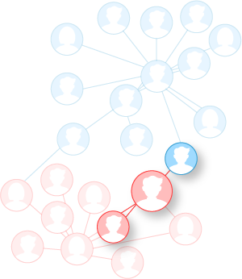
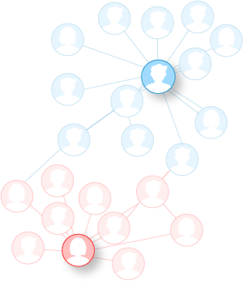


The Arango Data Platform & AI Suite are available as a pre-release. To get
exclusive early access, [get in touch](https://arangodb.com/contact/) with
the ArangoDB team.


ArangoDB provides a wide range of functionality that can be utilized for
data science applications. The core database system includes multi-model storage
of information with scalable graph and information retrieval capabilities that
you can directly use for your research and product development.

ArangoDB also offers dedicated AI Suite, using the database core
as the foundation for higher-level features. Whether you want to turbocharge
generative AI applications with a GraphRAG solution or apply analytics and
machine learning to graph data at scale, ArangoDB covers these needs.

<!--
ArangoDB's Graph Analytics and GraphML capabilities provide various solutions
in data science and data analytics. Multiple data science personas within the
engineering space can make use of ArangoDB's set of tools and technologies that
enable analytics and machine learning on graph data. 
-->

## From graph to AI

This section classifies the complexity of the queries you can answer with
ArangoDB and gives you an overview of the respective feature.

It starts with running a simple query that shows what is the path that goes from
one node to another, continues with more complex tasks like graph classification,
link prediction, and node classification, and ends with generative AI solutions
powered by graph relationships and vector embeddings.

### Graph Queries

When you run an AQL query on a graph, a traversal query can go from a node to
multiple edges, and then the edges indicate what the next connected nodes are.
Graph queries can also determine the shortest paths between nodes.

Graph queries can answer questions like _**Who can introduce me to person X**_?

See [Graphs in AQL](../arangodb/3.12/aql/graphs/_index.md) for the supported graph queries.

### Graph Analytics

Graph analytics or graph algorithms is what you run on a graph if you want to 
know aggregate information about your graph, while analyzing the entire graph.

Graph analytics can answer questions like _**Who are the most connected persons**_?

ArangoDB offers _Graph Analytics Engines_ to run algorithms such as
connected components, label propagation, and PageRank on your data. This feature
is available for the Arango Managed Platform (AMP). See
[Graph Analytics](graph-analytics.md) for details.

### GraphML

When applying machine learning on a graph, you can predict connections, get 
better product recommendations, and also classify nodes, edges, and graphs.

GraphML can answer questions like:
- _**Is there a connection between person X and person Y?**_
- _**Will a customer churn?**_ 
- _**Is this particular transaction Anomalous?**_

For ArangoDB's enterprise-ready, graph-powered machine learning offering,
see [Arango GraphML](graphml/_index.md).

### GraphRAG

GraphRAG is ArangoDB's turn-key solution to transform your organization's data into
a knowledge graph and let everyone utilize the knowledge by asking questions in
natural language.

The overall process of GraphRAG involves the following:
- **Creating a Knowledge Graph** from raw text data.
- **Identifying and extract entities and relationships** within the data.
- **Storing the structured information** in ArangoDB.
- **Clustering each closely connected set of entities into semantic contexts**
  via topology-based algorithms and summarization.
- **Using such semantically augmented structured representation** as the
  foundation for efficient and accurate information retrieval via lexical and
  semantic search.
- **Integrating retrieval methods with LLMs (privately or publicly hosted)**
  to augment responses using both structured and unstructured data, providing
  accurate responses with the desired format and degree of detail for each query.

To learn more, see the [GraphRAG](graphrag/_index.md) documentation.

## Knowledge Graphs

A knowledge graph can be thought of as a dynamic and interconnected network of
real-world entities and the intricate relationships that exist between them.

Key aspects of knowledge graphs:
- **Domain-specific knowledge**: You can tailor knowledge graphs to specific
  domains and industries.
- **Structured information**: Makes it easy to query, analyze, and extract
  meaningful insights from your data.
- **Accessibility**: You can build a Semantic Web knowledge graph or using
  custom data.

LLMs can help distill knowledge graphs from natural language by performing
the following tasks:
- Entity discovery
- Relation extraction
- Coreference resolution
- End-to-end knowledge graph construction
- (Text) Embeddings

## Sample datasets

If you want to try out ArangoDB's data science features, you may use the
[`arango-datasets` Python package](../arangodb/3.12/components/tools/arango-datasets.md)
to load sample datasets into a deployment.
