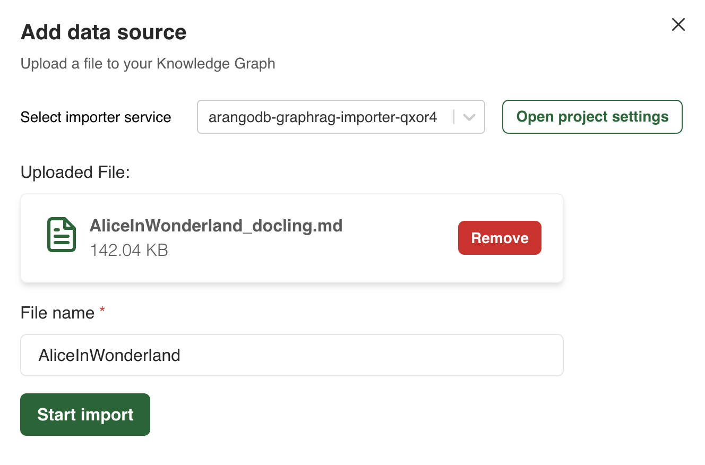
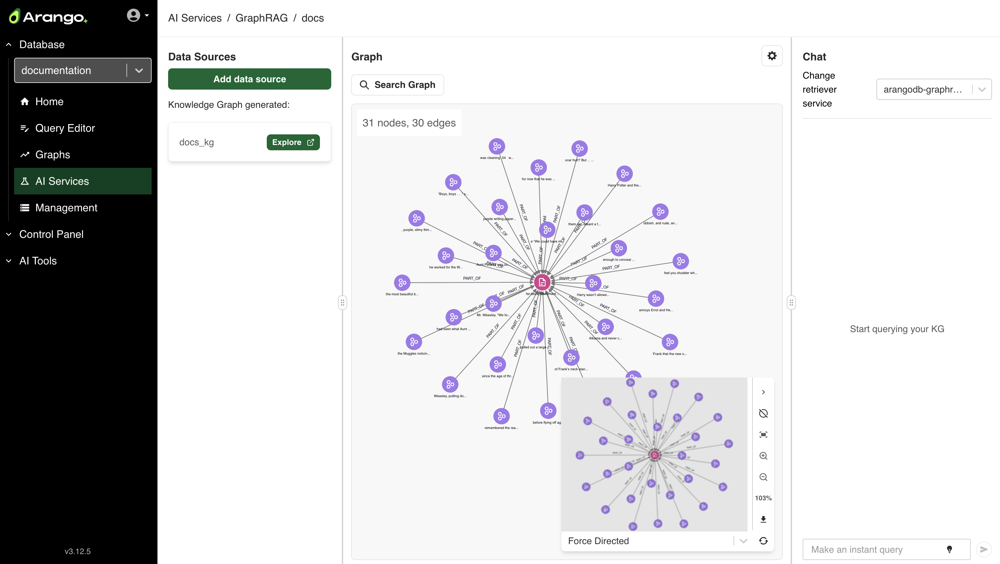


The Arango AI Data Platform is available as a pre-release. To get
exclusive early access, [get in touch](https://arango.ai/contact-us/) with
the Arango team.


## The GraphRAG workflow in the web interface

The entire process is organized into sequential steps within a **Project**:

1. Creating the importer service
2. Adding data sources
3. Exploring the generated Knowledge Graph
4. Creating the retriever service
5. Chatting with your Knowledge Graph

## Create a GraphRAG project

To create a new GraphRAG project using the Arango Data Platform web interface, follow these steps:

1. From the left-hand sidebar, select the database where you want to create the project.
2. In the left-hand sidebar, click **AI Suite** to open the GraphRAG project management
   interface, then click **Run GraphRAG**.
3. In the **GraphRAG projects** view, click **Add new project**.
4. The **Create GraphRAG project** modal opens. Enter a **Name** and optionally
   a description for your project.
5. Click the **Create project** button to finalize the creation.

## Project Settings

The **Project Settings** dialog allows you to configure and manage your
Importer and Retriever services.

You can open the **Project Settings** dialog in two ways:
- In the **Data Sources** section, click **Add data source** and then click on
  the **Open project settings** button.
- In the **Graph** section, click on the gear icon.

## Configure the Importer service

Configure a service to import, parse, and extract all the needed data from a
file. This service uses the LLM API provider and model of your choice.

After opening the **Project Settings**, you are taken to a dialog where you can
configure and start a new importer service job. Follow the steps below.




1. Select **OpenAI** from the **LLM API Provider** dropdown menu.
2. Select the model you want to use from the **Model** dropdown menu. By default,
   the service is using **O4 Mini**.
3. Enter your **OpenAI API Key**.
4. Click the **Start importer service** button.



1. Select **OpenRouter** from the **LLM API Provider** dropdown menu.
2. Select the model you want to use from the **Model** dropdown menu. By default,
   the service uses **Mistral AI - Mistral Nemo**.
3. Enter your **OpenAI API Key**.
4. Enter your **OpenRouter API Key**.
5. Click the **Start importer service** button.


When using OpenRouter, you need both API keys because the LLM responses are served
via OpenRouter while OpenAI is used for the embedding model.




1. Select **Triton** from the **LLM API Provider** dropdown menu.
2. Select the Triton model you want to use from the **Model** dropdown menu.
3. Click the **Start importer service** button.


Note that you must first register your model in MLflow. The [Triton LLM Host](../reference/triton-inference-server.md)
service automatically downloads and loads models from the MLflow registry.





See also the [Importer](../reference/importer.md) service documentation.

## Add data source

To add your first data source:

1. In the **Data Sources** section, click the **Add data source** button.
2. Upload a file by dragging and dropping it in the designated upload area.
   The importer service you previously configured will automatically parse the file
   and create the Knowledge Graph.
3. Enter a descriptive name for your file.
4. Click the **Start import** button.


Currently, you can import one file at a time in either Markdown (`.md`) or
plain text (`.txt`) format. Additional files can be added to update the Knowledge Graph.


## Explore the Knowledge Graph

After your file is processed, you can view and explore the generated Knowledge Graph
in the **Graph** section.

For a more detailed exploration, click the **Explore** button to open the Knowledge Graph in the dedicated Graph Visualizer.

For more information, see the [Graph Visualizer](../../data-platform/graph-visualizer.md) documentation.

## Update the Knowledge Graph

Once you have created your initial Knowledge Graph, you can update it by uploading 
additional files using the same process described in the [Add data source](#add-data-source) section. 
The importer service will automatically update the existing Knowledge Graph and 
underlying collections with the new data.

To update your Knowledge Graph:

1. In the **Data Sources** section, click the **Add data source** button again.
2. Upload a new file by dragging and dropping it in the designated upload area.
3. The importer service will process the new file and update the existing Knowledge Graph along with the underlying collections.

## Configure the Retriever service

The retriever service enables you to query and extract information from
the generated Knowledge Graph. To configure the retriever service, open the 
**Project Settings** and follow the steps below.




1. Select **OpenAI** from the **LLM API Provider** dropdown menu.
2. Select the model you want to use from the **Model** dropdown menu. By default,
   the service uses **O4 Mini**.
3. Enter your **OpenAI API Key**.
4. Click the **Start retriever service** button.



1. Select **OpenRouter** from the **LLM API Provider** dropdown menu.
2. Select the model you want to use from the **Model** dropdown menu. By default,
   the service uses **Mistral AI - Mistral Nemo**.
3. Enter your **OpenRouter API Key**.
4. Click the **Start retriever service** button.


When using OpenRouter, the LLM responses are served via OpenRouter while OpenAI
is used for the embedding model.




1. Select **Triton** from the **LLM API Provider** dropdown menu.
2. Select the Triton model you want to use from the **Model** dropdown menu.
3. Click the **Start retriever service** button.


Note that you must first register your model in MLflow. The [Triton LLM Host](../reference/triton-inference-server.md)
service automatically downloads and loads models from the MLflow registry.





See also the [Retriever](../reference/retriever.md) documentation.

## Chat with your Knowledge Graph

The chat interface provides two search methods:
- **Instant search**: Instant queries provide fast responses.
- **Deep search**: This option will take longer to return a response.

In addition to querying the Knowledge Graph, the chat service allows you to do the following:
- Switch the search method from **Instant search** to **Deep search** and vice-versa
  directly in the chat
- Change or create a new retriever service
- Clear the chat

## Integrate the Knowledge Graph chat service into your application

To integrate any service into your own applications,
go to **Project Settings** and use the copy button next to each service to
copy its integration endpoint. You cam make `POST` requests to the endpoints
with your queries, the services accept `JSON` payloads and return structured
responses for building custom interfaces.