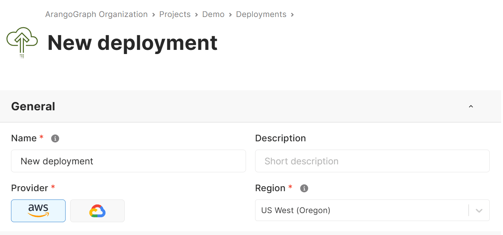
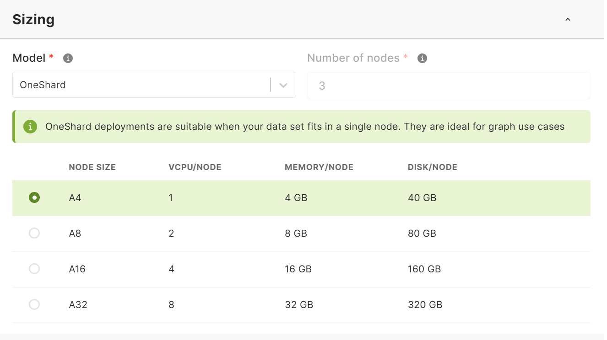
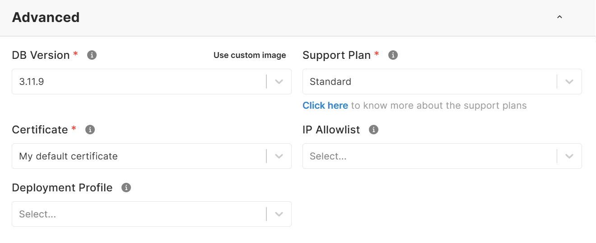
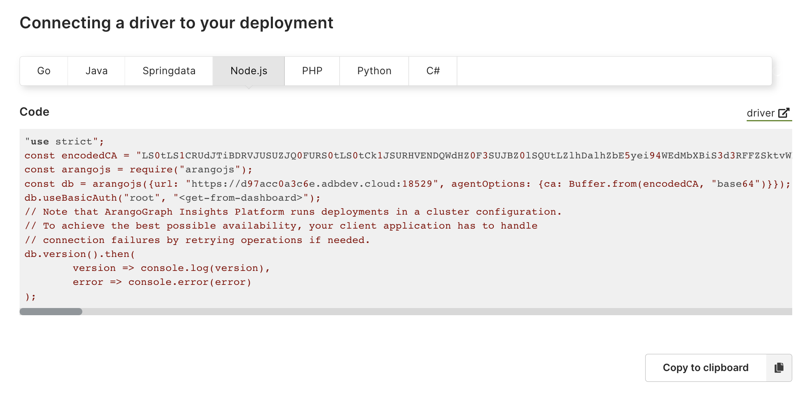

An ArangoGraph deployment is an ArangoDB cluster or single server, configured
as you choose.

Each deployment belongs to a project, which belongs to an organization in turn.
You can have any number of deployments under one project.

**Organizations → Projects → <u>Deployments</u>**

## How to create a new deployment

1. If you do not have a project yet,
   [create a project](../projects.md#how-to-create-a-new-project) first.
2. In the main navigation, click __Deployments__.
3. Click the __New deployment__ button.
4. Select the project you want to create the deployment for.
5. Set up your deployment. The configuration options are described below.


Deployments contain exactly **one policy**. Within that policy, you can define
role bindings to regulate access control on a deployment level.


### In the **General** section

- Enter the __Name__ and optionally a __Short description__ for the deployment.
- Select the __Provider__ and __Region__ of the provider.
  
  Once a deployment has been created, it is not possible to change the
  provider and region anymore.
  

### In the **Sizing** section

- Choose a __Model__ for the deployment:

  - __OneShard__ deployments are suitable when your data set fits in a single node.
    They are ideal for graph use cases. This model has a fixed number of 3 nodes.

  - __Sharded__ deployments are suitable when your data set is larger than a single
    node. The data will be sharded across multiple nodes. You can select the
    __Number of nodes__ for this deployment model. The more nodes you have, the
    higher the replication factor can be.

  - __Single Server__ deployments are suitable when you want to try out ArangoDB without
    the need for high availability or scalability. The deployment will contain a
    single server only. Your data will not be replicated and your deployment can
    be restarted at any time.

- Select a __NODE SIZE__ from the list of available options. Each option is a
  combination of vCPUs, memory, and disk space per node.

### In the **Advanced** section

- Select the __DB Version__.
  If you don't know which DB version to select, use the version selected by default.
- Select the desired __Support Plan__. Click the link below the field to get
  more information about the different support plans.
- In the __Certificate__ field:
    - The default certificate created for your project is selected automatically.
    - If you have no default certificate, or want to use a new certificate,
      create a new certificate by typing the desired name for it and hitting
      enter or clicking __Create "\<name\>"__ when done.
    - Or, if you already have multiple certificates, select the desired one.
- _Optional but strongly recommended:_ In the __IP allowlist__ field, select the
  desired one in case you want to limit access to your deployment to certain
  IP ranges. To create a allowlist, navigate to your project and select the
  __IP allowlists__ tab. See [How to manage IP allowlists](../projects.md#how-to-manage-ip-allowlists)
  for details.
  
  For any kind of production deployment it is strongly advise to use an IP allowlist.
  
- Select a __Deployment Profile__. Profile options are only available on request.

### In the **Summary** panel

1. Review the configuration, and if you're okay with the setup, press the
  __Create deployment__ button.
2. You are taken to the deployment overview page.
   **Note:** Your deployment is being bootstrapped at that point. This process
   takes a few minutes. Once the deployment is ready, you receive a confirmation
   email.

## How to access your deployment

1. In the main navigation, click the __Dashboard__ icon and then click __Projects__.
2. In the __Projects__ page, click the project for
   which you created a deployment earlier.
3. Alternatively, you can access your deployment by clicking __Deployments__ in the
   dashboard navigation. This page shows all deployments from all projects.
   Click the name of the deployment you want to view.
4. For each deployment in your project, you see the status. While your new
   deployment is being set up, it displays the __bootstrapping__ status.
5. Press the __View__ button to show the deployment page.
6. When a deployment displays a status of __OK__, you can access it.
7. Click the __Open database UI__ button or on the database UI link to open
   the dashboard of your new ArangoDB deployment.

At this point your ArangoDB deployment is available for you to use — **Have fun!**

If you have disabled the [auto-login option](#auto-login-to-database-ui) to the
database web interface, you need to follow the additional steps outlined below
to access your deployment:

1. Click the copy icon next to the root password. This copies the deployment
   root password to your clipboard. You can also click the view icon to unmask
   the root password to see it.
   
   Do not use the root username/password for everyday operations. It is recommended
   to use them only to create other user accounts with appropriate permissions.
   
2. Click the __Open database UI__ button or on the database UI link to open
   the dashboard of your new ArangoDB deployment.
3. In the __username__ field type `root`, and in the __password__ field paste the
   password that you copied earlier.
4. Press the __Login__ button.
5. Press the __Select DB: \_system__ button.


Each deployment is accessible on two ports:

- Port `8529` is the standard port recommended for use by web-browsers.
- Port `18529` is the alternate port that is recommended for use by automated services.

The difference between these ports is the certificate used. If you enable
__Use well-known certificate__, the certificates used on port `8529` is well-known
and automatically accepted by most web browsers. The certificate used on port
`18529` is a self-signed certificate. For securing automated services, the use of
a self-signed certificate is recommended. Read more on the
[Certificates](../security-and-access-control/x-509-certificates.md) page.


## Password settings

### How to enable the automatic root user password rotation

Password rotation refers to changing passwords regularly - a security best
practice to reduce the vulnerability to password-based attacks and exploits
by limiting for how long passwords are valid. The Arango Managed Platform (AMP)
can automatically change the `root` user password of an ArangoDB deployment
periodically to improve security.

1. Navigate to the __Deployment__ for which you want to enable an automatic
   password rotation for the root user.
2. In the __Deployment details__ section, click the button with the __gear__ icon next to the
   __ROOT PASSWORD__.
3. In the __Password Settings__ dialog, turn the automatic password rotation on
   and click the __Save__ button.

   
4. You can expand the __Root password__ panel to see when the password was
   rotated last. The rotation takes place every three months.

### Auto login to database UI

ArangoGraph provides the ability to automatically login to your database using
your existing ArangoGraph credentials. This not only provides a seamless
experience, preventing you from having to manage multiple sets of credentials
but also improves the overall security of your database. As your credentials
are shared between ArangoGraph and your database, you can benefit from
end-to-end audit traceability for a given user, as well as integration with
ArangoGraph SSO.

You can enable this feature in the **Deployment details** section by turning
the **USE AUTO LOGIN FOR DATABASE UI** toggle on. Please note
that it may take a few minutes to get activated.
Once enabled, you no longer have to fill in the `root` user and password of
your ArangoDB deployment.


If you use the auto login feature with AWS
[private endpoints](../deployments/private-endpoints.md), it is recommended
to switch off the `custom DNS` setting.


This feature can be disabled at any time. You may wish to consider explicitly
disabling this feature in the following situations:
- Your workflow requires you to access the database UI using different accounts
  with differing permission sets, as you cannot switch database users when
  automatic login is enabled.
- You need to give individuals access to a database's UI without giving them
  any access to ArangoGraph. Note, however, that it's possible to only give an
  ArangoGraph user database UI access, without other ArangoGraph permissions.


When the auto login feature is enabled, users cannot edit their permissions on
the ArangoDB database web interface as all permissions are managed by the
ArangoGraph platform.


Before getting started, make sure you are signed in to ArangoGraph as a user
with one of the following permissions in your project:
- `data.deployment.full-access`
- `data.deployment.read-only-access`

Organization owners have these permissions enabled by default.
The `deployment-full-access-user` and `deployment-read-only-user` roles which
contain these permissions can also be granted to other members of the
organization. See how to create a
[role binding](../security-and-access-control/_index.md#how-to-view-edit-or-remove-role-bindings-of-a-policy).


This feature is available on `443` port only.


## How to edit a deployment

You can modify a deployment's configuration, including the ArangoDB version
that is being used, change the memory size, or even switch from
a OneShard deployment to a Sharded one if your data set no longer fits in a
single node. 


To edit an existing deployment, you must have the necessary set of permissions
attached to your role. Read more about [roles and permissions](../security-and-access-control/_index.md#roles).


1. In the main navigation, click **Deployments** and select an existing
   deployment from the list, or click **Projects**, select a project, and then
   select a deployment.
2. In the **Quick start** section, click the **Edit** button. 
3. In the **General** section, you can do the following:
   - Change the deployment name
   - Change the deployment description
4. In the **Sizing** section, you can do the following:
   - Change **OneShard** deployments into **Sharded** deployments. To do so,
     select **Sharded** in the **Model** dropdown list. You can select the
     number of nodes for your deployment. This can also be modified later on.
     
     You cannot switch from **Sharded** back to **OneShard**.
     
   - Change **Single Server** deployments into **OneShard** or **Sharded** deployments.
     
     You cannot switch from **Sharded** or **OneShard** back to **Single Server**.
     
   - Scale up or down the node size.
     
     When scaling up or down the size in AWS deployments, the new value gets locked
     and cannot be changed again until the cloud provider rate limit is reset.
     
5. In the **Advanced** section, you can do the following:
   - Upgrade the ArangoDB version that is currently being used. See also
     [Upgrades and Versioning](upgrades-and-versioning.md)
   - Select a different certificate.
   - Add or remove an IP allowlist.
   - Select a deployment profile.
6. All changes are reflected in the **Summary** panel. Review the new
   configuration and click **Save changes**.

## How to connect a driver to your deployment

[ArangoDB drivers](../../arangodb/3.12/develop/drivers/_index.md) allow you to use your ArangoGraph
deployment as a database system for your applications. Drivers act as interfaces
between different programming languages and ArangoDB, which enable you to
connect to and manipulate ArangoDB deployments from within compiled programs
or using scripting languages.

To get started, open a deployment.
In the **Quick start** section, click on the **Connecting drivers** button and
select your programming language. The code snippets provide examples on how to
connect to your instance.


Note that Arango Managed Platform (AMP) runs deployments in a cluster
configuration. To achieve the best possible availability, your client
application has to handle connection failures by retrying operations if needed.


## How to pause a deployment

1. In the __Deployments__ page, click the deployment you wish to pause.
2. Click the __Delete/Lock__ entry in the navigation.
3. Click the __Pause deployment...__ button.
4. To resume the deployment, go to the __Overview__ tab and click __Resume deployment__. The
   deployment being paused displays the __Hibernated__ status until it has been
   successfully resumed.

## How to delete a deployment


Deleting a deployment deletes all its data and backups.
This operation is **irreversible**. Please proceed with caution.


1. In the __Deployments__ page, click the deployment you wish to delete.
2. Click the __Delete/Lock__ entry in the navigation.
3. Click the __Delete deployment...__ button.
4. In the modal dialog, confirm the deletion by entering `Delete!` into the
   designated text field.
5. Confirm the deletion by pressing the __Yes__ button.
6. You will be taken back to the __Deployments__ page of the project.
   The deployment being deleted will display the __Deleting__ status until it has
   been successfully removed.


Locked deployments cannot be deleted. Learn more about
[locked resources](../security-and-access-control/_index.md#locked-resources) in ArangoGraph.
