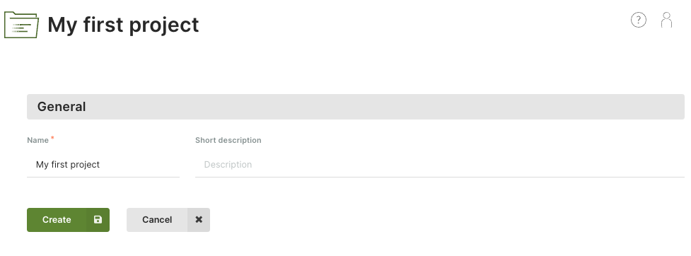

ArangoGraph projects can represent organizational units such as teams,
product groups, environments (e.g. staging vs. production). You can have any
number of projects under one organization.

**Organizations → <u>Projects</u> → Deployments**

Projects are a container for related deployments, certificates & IP allowlists.
Projects also come with their own policy for access control. You can have any
number of deployment under one project.

## How to create a new project

1. In the main navigation, click the __Dashboard__ icon.
2. Click __Projects__ in the __Dashboard__ section.
3. Click the __New project__ button.
4. Enter a name and optionally a description for your new project.
5. Click the __Create__ button.
6. You will be taken to the project page.
7. To change the name or description, click either at the top of the page.


Projects contain exactly **one policy**. Within that policy, you can define
role bindings to regulate access control on a project level.


## How to create a new deployment

See [Deployments: How to create a new deployment](deployments/_index.md#how-to-create-a-new-deployment)

## How to delete a project


Deleting a project will delete contained deployments, certificates & IP allowlists.
This operation is **irreversible**.


1. Click __Projects__ in the __Dashboard__ section of the main navigation.
2. Click the __recycle bin__ icon in the __Actions__ column of the project to be deleted.
3. Enter `Delete!` to confirm and click __Yes__.


If the project has a locked deployment, you need to [unlock](security-and-access-control/_index.md#locked-resources)
it first to be able to delete the project.


## How to manage IP allowlists

IP allowlists let you limit access to your deployment to certain IP ranges.
It is optional, but strongly recommended to do so.

You can create an allowlist as part of a project.

1. Click a project name in the __Projects__ section of the main navigation.
2. Click the __Security__ entry.
3. In the __IP allowlists__ section, click:
   - The __New IP allowlist__ button to create a new allowlist.
     When creating or editing a list, you can add comments
     in the __Allowed CIDR ranges (1 per line)__ section. 
     Everything after `//` or `#` is considered a comment until the end of the line.
   - A name or the __eye__ icon in the __Actions__ column to view the allowlist.
   - The __pencil__ icon to edit the allowlist.
     You can also view the allowlist and click the __Edit__ button.
   - The __recycle bin__ icon to delete the allowlist.

## How to manage role bindings

See:
- [Access Control: How to view, edit or remove role bindings of a policy](security-and-access-control/_index.md#how-to-view-edit-or-remove-role-bindings-of-a-policy)
- [Access Control: How to add a role binding to a policy](security-and-access-control/_index.md#how-to-add-a-role-binding-to-a-policy)
