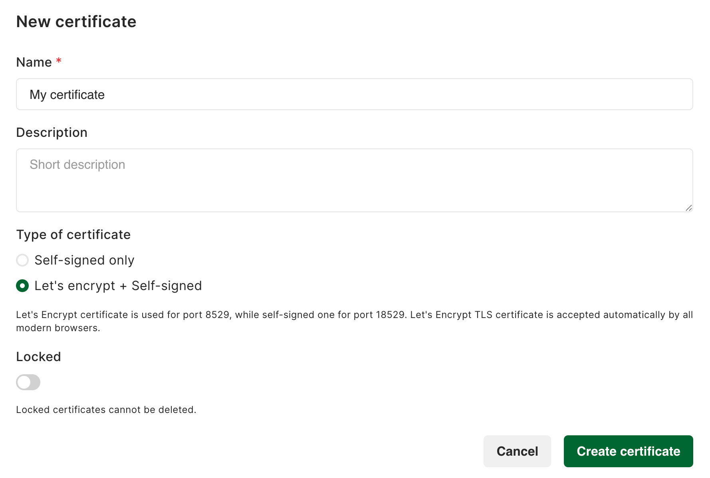
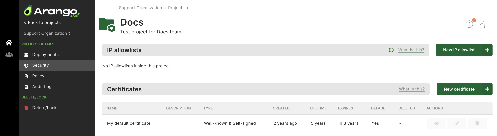
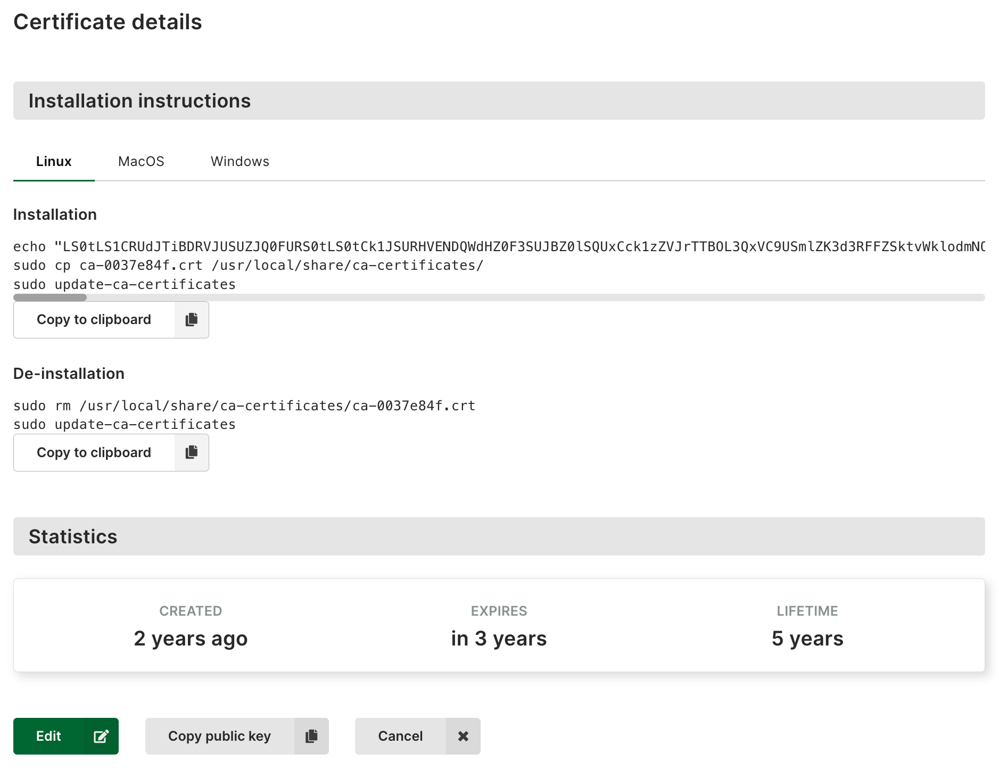
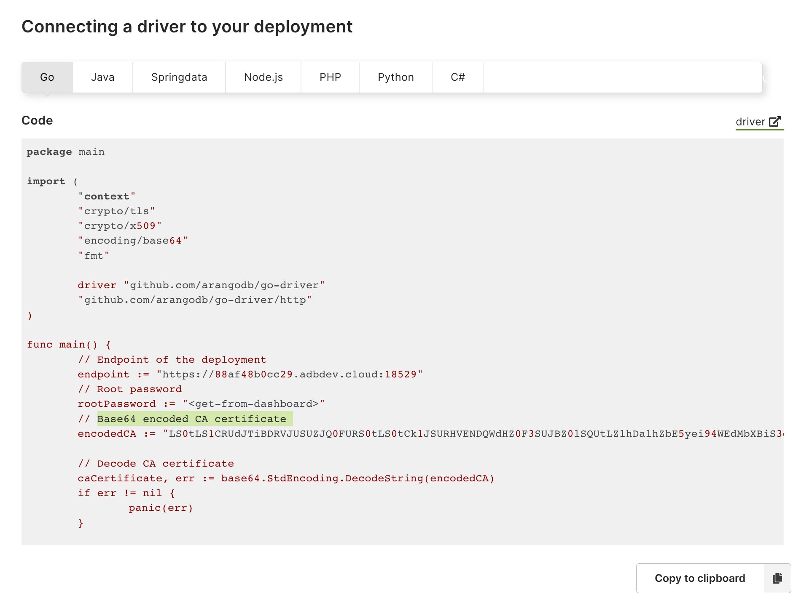

X.509 certificates are digital certificates that are used to verify the
authenticity of a website, user, or organization using a public key infrastructure
(PKI). They are used in various applications, including SSL/TLS encryption,
which is the basis for HTTPS - the primary protocol for securing communication
and data transfer over a network.

The X.509 certificate format is a standard defined by the
[International Telecommunication Union (ITU)](https://www.itu.int/en/Pages/default.aspx)
and contains information such as the name of the certificate holder, the public
key associated with the certificate, the certificate's issuer, and the
certificate's expiration date. An X.509 certificate can be signed by a
certificate authority (CA) or self-signed.

AMP is using:
- **well-known X.509 certificates** created by
[Let's Encrypt](https://letsencrypt.org/)
- **self-signed X.509 certificates** created by AMP

## Certificate chains

A certificate chain, also called the chain of trust, is a hierarchical structure
that links together a series of digital certificates. The trust in the chain is
established by verifying the identity of the issuer of each certificate in the
chain. The root of the chain is a trusted third-party, such as a certificate
authority (CA). The CA issues a certificate to an organization, which in turn
can issue certificates to servers and other entities. 

For example, when you visit a website with an SSL/TLS certificate, the browser
checks the chain of trust to verify the authenticity of the digital certificate.
The browser checks to see if the root certificate is trusted, and if it is, it
trusts the chain of certificates that lead to the end-entity certificate.
If any of the certificates in the chain are invalid, expired, or revoked, the
browser does not trust the digital certificate.

## X.509 certificates in AMP

Each AMP deployment is accessible on different port numbers:
- default port `8529`, `443`
- high port `18529`

Each AMP Notebook is accessible on different port numbers:
- default port `8840`, `443`
- high port `18840`

Metrics are accessible on different port numbers:
- default port `8829`, `443`
- high port `18829`

The distinction between these port numbers is in the certificate used for the
TLS connection.


The default ports (`8529` and `443`) always serve the well-known certificate.
The [auto login to database UI](../deployments/_index.md#auto-login-to-database-ui)
feature is only available on the `443` port and is enabled by default.


### Well-known X.509 certificates

**Well-known X.509 certificates** created by
[Let's Encrypt](https://letsencrypt.org/) are used on the
default ports, `8529` and `443`.

This type of certificate has a lifetime of 5 years and is rotated automatically.
It is recommended to use well-known certificates, as this eases access of a
deployment in your browser.


The well-known certificate is a wildcard certificate and cannot contain
Subject Alternative Names (SANs). To include a SAN field, please use the
self-signed certificate option.


### Self-signed X.509 certificates

**Self-signed X.509 certificates** are used on the high ports, i.e. `18529`.
This type of certificate has a lifetime of 1 year, and it is created by AMP.
It is also rotated automatically before the expiration
date.


Unless you switch off the **Use well-known certificate** option in the
certificate generation, both the default and high port serve the same
self-signed certificate.


### Subject Alternative Name (SAN)

The Subject Alternative Name (SAN) is an extension to the X.509 specification 
that allows you to specify additional host names for a single SSL certificate.

When using [private endpoints](../deployments/private-endpoints.md),
you can specify custom domain names. Note that these are added **only** to
the self-signed certificate as Subject Alternative Name (SAN).

## How to create a new certificate

1. Click a project name in the **Projects** section of the main navigation.
2. Click **Security**.
3. In the **Certificates** section, click:
   - The **New certificate** button to create a new certificate.
   - A name or the **eye** icon in the **Actions** column to view a certificate.
     The dialog that opens provides commands for installing and uninstalling
     the certificate through a console.
   - The **pencil** icon to edit a certificate.
     You can also view a certificate and click the **Edit** button.
   - The **tag** icon to make the certificate the new default.
   - The **recycle bin** icon to delete a certificate.



## How to install a certificate

Certificates that have the **Use well-known certificate** option enabled do
not need any installation and are supported by almost all web browsers
automatically.

When creating a self-signed certificate that has the **Use well-known certificate**
option disabled, the certificate needs to be installed on your local machine as
well. This operation varies between operating systems. To install a self-signed
certificate on your local machine, open the certificate and follow the
installation instructions.





You can also extract the information from all certificates in the chain using the
`openssl` tool.

- For **well-known certificates**, run the following command:
  ```
  openssl s_client -showcerts -servername <123456abcdef>.arangodb.cloud -connect <123456abcdef>.arangodb.cloud:8529 </dev/null
  ```

- For **self-signed certificates**, run the following command:
  ```
  openssl s_client -showcerts -servername <123456abcdef>.arangodb.cloud -connect <123456abcdef>.arangodb.cloud:18529 </dev/null
  ```

Note that `<123456abcdef>` is a placeholder that needs to be replaced with the
unique ID that is part of your AMP deployment endpoint URL.

## How to connect to your application

[ArangoDB drivers](../../ecosystem/drivers/_index.md), also called connectors, allow you to
easily connect AMP deployments to your application. 

1. Navigate to **Deployments** and click the **View** button to show the
   deployment page.
2. In the **Quick start** section, click the **Connecting drivers** button.
3. Select your programming language, i.e. Go, Java, Python, etc.
4. Follow the examples to connect a driver to your deployment. They include
   code examples on how to use certificates in your application.



## Certificate Rotation

Every certificate has a self-signed root certificate that is going to expire.
When certificates that are used in existing deployments are about to expire,
an automatic rotation of the certificates is triggered. This means that the
certificate is cloned (all existing settings are copied over to a new certificate)
and all affected deployments then start using the cloned certificate. 

Based on the type of certificate used, you may also need to install the new
certificate on your local machine. For example, self-signed certificates require
installation. To prevent any downtime, it is recommended to manually create a
new certificate and apply the required changes prior to the expiration date.
